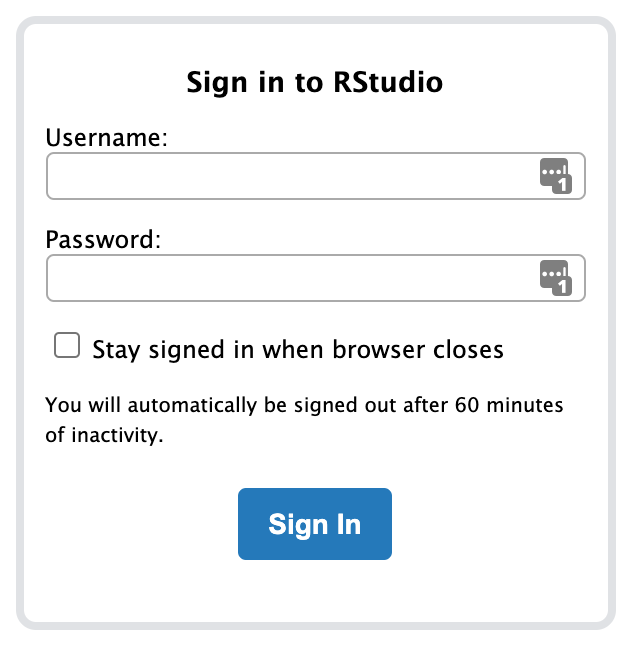

# Getting started in RStudio {.unnumbered #rstudio}

In Stat 216 we will use the statistical package `R` to analyze data through the IDE (integrated development environment) RStudio. 
Though it is possible to download `R` and RStudio on your own computer, we will use this program through the MSU RStudio server: [rstudio.math.montana.edu/](https://rstudio.math.montana.edu/). 

## Logging into the RStudio server

When you navigate to the [MSU RStudio server](https://rstudio.math.montana.edu/), you will see the following sign-in screen:

