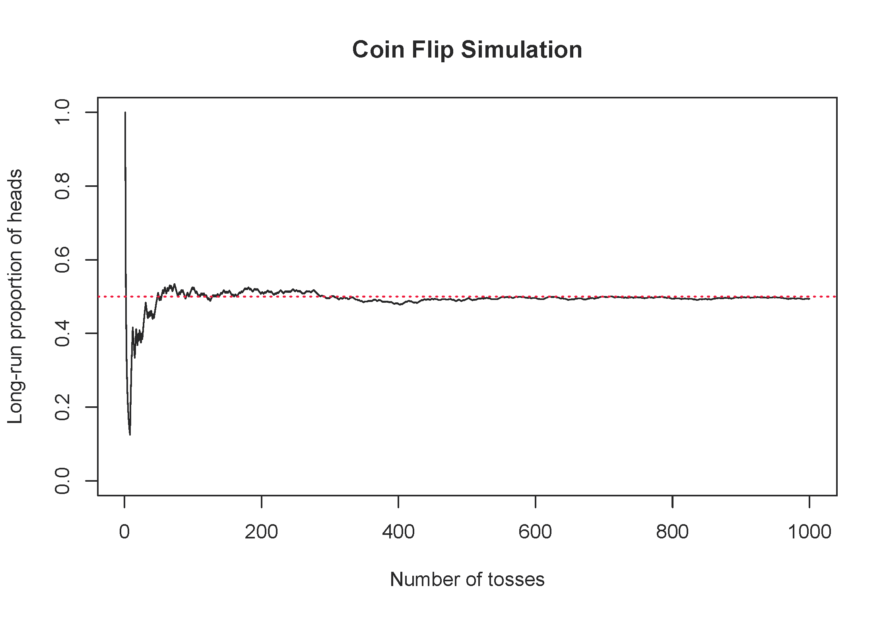

# Exploratory data analysis {#eda}

::: {.chapterintro}
This chapter focuses on the mechanics and construction of summary statistics and graphs.
We use statistical software for generating the summaries and graphs presented in this chapter and book.
However, since this might be your first exposure to these concepts, we take our time in this chapter to detail how to create them.
Mastery of the content presented in this chapter will be crucial for understanding the methods and techniques introduced in rest of the book.
:::

## Exploring categorical data {#categorical-data}

In this section, we will introduce tables and other basic tools for organizing and analyzing categorical data that are used throughout this book. Table \@ref(tab:emailDF) displays the first six rows of the `email` data set containing information on 3,921 emails sent to David Diez's Gmail account (one of the authors of the _OpenIntro_ textbooks). In this section we will examine whether the presence of numbers, small or large, in an email provides any useful value in classifying email as spam or not spam.
Descriptions of all five email variables are given in Table \@ref(tab:emailVariables).

::: {.data}
The `email` data can be found in the [openintro](http://openintrostat.github.io/openintro/reference/index.html) package.^[The `email` data set found in the `openintro` package defines the variable `spam` as 0 (not spam) or 1 (spam), and `format` as 0 (not HTML) or 1 (HTML). When variables are defined in this way---coded as the numbers 0 and 1 rather than the category names---they are called **indicator variables*** or **dummy variables**. In this section of the textbook, we have re-coded `spam` to be the variable `type`, which takes on values "not spam" or "spam", and we have re-coded the variable `format` to take on values "not HTML" or "HTML".]
:::

```{r emailDF}
data(email)
email <- email %>%
  mutate(type = factor(spam, levels=c(0,1), labels=c("not spam","spam")),
        format = factor(format, levels=c(0,1), labels=c("not HTML","HTML")))

email %>% 
  select("type", "num_char", "line_breaks", "format", "number") %>%
  slice_head(n = 6) %>%
  kable(caption = "Six rows from the `email` data set.",
        row.names = TRUE)
```

```{r emailVariables}
email_var_def <- tribble(
  ~variable,       ~description,
  "type", "Whether the email was spam or not spam.",
  "num_char", "The number of characters in the email, in thousands.",
  "line_breaks", "The number of line breaks in the email (does not count text wrapping).",
  "format", "Whether the email was written using HTML (e.g., may have included bolding or active links) or not.",
  "number", "Categorical variable saying whether there was no number, a small number (under 1 million), or a big number."
)

email_var_def %>%
  kable(caption = "Variables and their descriptions for the `email` data set.")
```
### Contingency tables and conditional proportions

A summary table for a single categorical variable that reports the number of observations (frequency) in each category is called a **frequency table**. Table
\@ref(tab:emailTableNumber) is a frequency table for the `number` variable.
If we replaced the counts with percentages or proportions (relative frequencies),
the table would be called a **relative frequency table**.


```{r emailTableNumber}
tab <- as.numeric(table(email[,c("number")]))
names(tab) <- c("none","small","big")
kable(data.frame(t(tab)), caption = "Frequency table of `Number` variable.")
```


Table \@ref(tab:emailTable) summarizes two variables:
`type` (spam or not spam) and `number`. A table that summarizes data for two categorical variables
in this way is called a **contingency table** or **two-way table**.
Each value in the table represents the number of times, or **frequency**
a particular combination of variable outcomes occurred.
For example, the value 149 corresponds to the number of emails
in the data set that are not spam _and_ had no number listed in the email.
Row and column totals are also included.
The **row totals** provide the total counts across each row
(e.g., there are $149 + 168 + 50 = 367$ emails classified as not spam), and **column totals** are total
counts down each column.

In this textbook, we generally take the convention of putting the categories of the explanatory variable as the columns and the categories of the response variable as the rows (if there exists and explanatory-response relationship between the two variables).

```{r include=FALSE}
terms_chp_2 <- c("contingency table", "two-way table",
                 "row totals", "column totals", "frequency",
                 "relative frequency")
```

```{r emailTable}
temptbl <- tribble(
 ~variable,    ~col1, ~col2, ~col3, ~col4, ~col5,
 "", "spam", "400", "2659", "495", "3554",
 "type", "not spam", "149", "168", "50", "367",
 "", "Total", "549", "2827", "545", "3921"
)

temptbl %>%
 kable(caption = "Contingency table of `number` (cols) and `type` (rows) variables.",
    col.names = c("", "", "none", "small", "big", "Total")) %>%
 add_header_above(c(" ", " ", "`number`" = 3, " ")) %>%
  kable_styling()  
```

We would like to examine whether the presence of numbers---none, small or large---in an email provides any useful value in classifying email as spam or not spam---that is, is there an **association** between the variables `number` and `type`? 

::: {.guidedpractice}
To determine if a relationship exists between whether an email is spam or not, and whether the email has no numbers, a small number, or a big number, why isn't it helpful to compare the _number_ of spam emails across the `number` categories?^[Since the sample sizes in the three `number` categories differ (549 emails with no numbers; 2827 emails with a small number; 545 emails with a big number), we need to compare the _proportion_ of spam emails across categories rather than the count.]
:::

The proportion of emails that were classified as spam in the data set is $3554/3921 = 0.906$, or about 91%. Let's compare this **unconditional proportion** to the **conditional proportions** of spam _within_ each `number` category: $400/549 \approx 73\%$ of emails with no numbers are spam; $2659/2827 \approx 94\%$ of emails with small numbers are spam; and $495/545 \approx 91\%$ of emails with big numbers are spam. Since these three conditional proportions differ, we say the variables `number` and `type` are _associated_ in this data set. Note that some differ from the overall, or unconditional, proportion of spam emails in the data set---91%.

::: {.onebox}
**Association between two categorical variables.**
  
An **unconditional** proportion is a proportion measured out of the total sample size. A **conditional** proportion is a proportion measured out of a subgroup in the sample.

If the conditional proportions of a particular outcome (e.g., spam email) within levels of a categorical variable (e.g., whether no number, a small number, or a big number appears in the email) differ across levels, we say those two variables are **associated**. We can also determine if two categorical variables are associated by checking if any of the conditional proportions of the outcome within categories differ from the overall, or **unconditional** proportion.
:::

#### Row and column proportions {-}

Conditional proportions that condition on a row category are called **row proportions**; conditional proportions that condition on a column category
are called **column proportions**. 

```{r include=FALSE}
terms_chp_2 <- c(terms_chp_2, "row proportions", "column proportions")
```

Table \@ref(tab:rowPropSpamNumber) shows the row proportions for Table \@ref(tab:emailTable). The row proportions are computed as the counts divided by their row totals. The frequnecy 149 at the intersection of `not spam` and `none` is replaced by $149/367=0.406$, i.e., 149 divided by its row total, 367. So what does 0.406 represent? It corresponds to the conditional proportion of non-spam emails in the sample that do not have any numbers.

```{r rowPropSpamNumber}
g <- table(email$spam, email$number)[1:2,]
g.prop <- round(g / rep(rowSums(g), 3), 3)
dimnames(g.prop)[[1]] <- c("spam", "not spam")

g.prop %>%
 kable(caption = "A contingency table with row proportions for the `type` and `number` variables.") %>%
  kable_styling()  
```

A contingency table of the column proportions is computed in a similar way, where each column proportion is computed as the count divided by the corresponding column total. Table \@ref(tab:colPropSpamNumber) shows such a table, and here the value 0.271 indicates that 27.1% of emails with no numbers were spam. This rate of spam is much higher than emails with only small numbers (5.9%) or big numbers (9.2%). Because these spam rates vary between the three levels of `number` (`none`, `small`, `big`), this provides evidence that the `spam` and `number` variables are associated in this data set.

```{r colPropSpamNumber}
g <- table(email$spam, email$number)[2:1,]
g.prop <- round(g / rep(colSums(g), rep(2,3)), 3)
dimnames(g.prop)[[1]] <- c("spam", "not spam")

g.prop %>%
 kable(caption = "A contingency table with column proportions for the `type` and `number` variables.") %>%
  kable_styling()  
```


::: {.guidedpractice}
What does 0.458 represent in Table \@ref(tab:rowPropSpamNumber)? What does 0.059 represent in Table \@ref(tab:colPropSpamNumber)?^[0.458 represents the proportion of spam emails that had a small number. 0.058 represents the fraction of emails with small numbers that are spam.]
:::

::: {.guidedpractice}
What does 0.139 at the intersection of `not~spam` and `big` represent in Table \@ref(tab:rowPropSpamNumber)? What does 0.908 represent in the Table \@ref(tab:colPropSpamNumber)?^[0.139 represents the fraction of non-spam email that had a big number. 0.908 represents the fraction of emails with big numbers that are non-spam emails.]
:::

::: {.workedexample}
Data scientists use statistics to filter spam from incoming email messages. By noting specific characteristics of an email, a data scientist may be able to classify some emails as spam or not spam with high accuracy.
One of those characteristics is whether the email contains no numbers, small numbers, or big numbers. Another characteristic is whether or not an email has any HTML content. A contingency table `type` and `format` variables from the `email` data set are shown in Table \@ref(tab:emailSpamHTMLTableTotals). Recall that an HTML email is an email with the capacity for special formatting, e.g., bold text. In Table~ \@ref(tab:emailSpamHTMLTableTotals), which would be more helpful to someone hoping to classify email as spam or regular email: row or column proportions?
  
---
  
Such a person would be interested in how the proportion of spam changes within each email format. This corresponds to column proportions: the proportion of spam in plain text emails and the proportion of spam in HTML emails.

If we generate the column proportions, we can see that a higher fraction of plain text emails are spam ($209/1195 = 17.5\%$) than compared to HTML emails ($158/2726 = 5.8\%$). This information on its own is insufficient to classify an email as spam or not spam, as over 80\% of plain text emails are not spam. Yet, when we carefully combine this information with many other characteristics, such as \var{number} and other variables, we stand a reasonable chance of being able to classify some email as spam or not spam. \GLMSection{This is a topic we will return to in Chapter~\ref{multipleRegressionAndANOVA}.}{}
:::

```{r emailSpamHTMLTableTotals}
g <- table(email$spam, email$format)[2:1,]
g <- rbind(g, colSums(g))
g <- cbind(g, rowSums(g))
dimnames(g)[[1]] <- c("spam", "not spam", "Total")
dimnames(g)[[2]] <- c("not HTML", "HTML", "Total")

g %>%
 kable(caption = "A contingency table for `type` and `format`.") %>%
  kable_styling()  
```

The previous Example points out that row and column proportions are not equivalent. Before settling on one form for a table, it is important to consider each to ensure that the most useful table is constructed.

::: {.guidedpractice}
Look back to Tables \@ref(rowPropSpamNumber) and \@ref(colPropSpamNumber). Which would be more useful to someone hoping to identify spam emails using the `number` variable?^[The column proportions in Table \@ref(colPropSpamNumber) will probably be most useful, which makes it easier to see that emails with small numbers are spam about 5.9% of the time (relatively rare). We would also see that about 27.1% of emails with no numbers are spam, and 9.2% of emails with big numbers are spam.]
:::


#### Sample proportions and population proportions {-}

In the field of statistics, summary measures that summarize a sample of data are called **statistics**\index{statistic}. Numbers that summarize an entire population are called **parameters**\index{parameter}. You can remember
this distinction by looking at the first letter of each term: 

> **_S_**tatistics summarize **_S_**amples.  
> **_P_**arameters summarize **_P_**opulations.

Proportions calculated from a sample of data are denoted by $\hat{p}$.
In our example, we were interested in the proportion of spam emails in our data set, so we could denote this by $\hat{p} = 0.91$. If there are different groups we want to summarize with a proportion, we can add subscripts: $\hat{p}_{none} = 0.73$, $\hat{p}_{small} = 0.94$, and $\hat{p}_{big} = 0.91$. Each of these values is a statistic since it is computed from a sample of data.

These 3921 emails were a sample from a larger group of emails---all emails that are sent to David Diez, either in the past or in the future. This larger group of emails is the population. There is some unknown value for the proportion of _all_ emails in the population that would be classified as spam, which we denote by $\pi$. Similarly, there are unknown values for the proportion of all emails with no numbers in the population that would be classified as spam, denoted by $\pi_{none}$. Each of these unknown values are called parameters. 

We typically use Roman letters to symbolize statistics (e.g., $\bar{x}$, $\hat{p}$), and Greek letters to symbolize parameters (e.g., $\mu$, $\pi$).
Since we rarely can measure the entire population, and thus rarely know
the actual parameter values, we like to say, "We don't know Greek,
and we don't know parameters!"


```{r include=FALSE}
terms_chp_2 <- c(terms_chp_2, "statistic", "parameter","point estimate")
```

### Bar plots and mosaic plots

A bar plot is a common way to display a single categorical variable. The left panel of Figure \@ref(fig:emailNumberBarPlot) shows a **bar plot** for the `number` variable. 
In the right panel, the counts are converted into proportions (e.g., $549/3921=0.140$ for `none`).

```{r emailNumberBarPlot, fig.cap="Two bar plots of `number`. The left panel shows the counts on the $y$-axis, and the right panel shows the proportions in each group on the $y$-axis.", fig.show="hold", out.width="50%"}
email %>% ggplot(aes(x = number)) +
  geom_bar(col="seagreen", fill="seagreen") + theme_light() +
  ylab("Frequency")
email %>% ggplot(aes(x = number)) +
  geom_bar(aes(y = ..prop.., group=1), col="seagreen", fill="seagreen") +
  theme_light() + ylab("Relative Frequency")
```

Bar plots are also used to display the relationship between two categorical variables.
When the bars are stacked such that each bar totals 100% and is segmented by
another categorical variable, it is called a **segmented bar plot**.

```{r include=FALSE}
terms_chp_2 <- c(terms_chp_2, "bar plot", "segmented bar plot")
```

A segmented bar plot is a graphical display of contingency table information. For example, segmented bar plots representing Table \@ref(tab:colPropSpamNumber) is shown in Figure \@ref(fig:emailSpamNumberSegBar), where we have first created a non-standardized segmented bar plot using the `number` variable and then separated each group by the levels of `type`. The standardized segmented bar plot using the column proportions of Table \@ref(tab:colPropSpamNumber) is a helpful visualization of the fraction of spam emails in each level of `number`.

::: {.importantbox}
In a segmented bar plot, the explanatory variable is plotted on the $x$-axis, while the response variable is displayed by different colors within each bar, defined by the legend.
:::

```{r emailSpamNumberSegBar, fig.cap="(a) Segmented bar plot for numbers found in emails, where the counts have been further broken down by `type`. (b) Segmented bar plot using column proportions of each type within each `number` category.", fig.show="hold", out.width="50%"}
email %>%
  ggplot(aes(x = number, fill = type)) +
  geom_bar() + xlab("(a)") + ylab("Count")
email %>%
  ggplot(aes(x = number, fill = type)) +
  geom_bar(stat = "count", position = "fill") +
  xlab("(b)") + ylab("Proportion")
```

::: {.guidedpractice}
In the segmented bar plots in Figure \@ref(fig:emailSpamNumberSegBar), which variable is the explanatory variable? the response variable?^[The numbers found in emails (`number`) is the explanatory variable; whether the email is spam or not spam is the response variable.]
:::

::: {.workedexample}
Examine both of the segmented bar plots in Figure \@ref(fig:emailSpamNumberSegBar). Which is more useful?
  
---

Plot (a) contains more information, but plot (b) presents the information more clearly. Plot (b) makes it clear that emails with no number have a relatively high rate of spam email---about 27%! On the other hand, less than 10% of email with small or big numbers are spam.
:::

Since the proportion of spam changes across the groups in Figure \@ref(fig:emailSpamNumberSegBar) (seen in plot (b)), we can conclude the variables are dependent, which is something we were also able to discern using the column proportions in Table \@ref(tab:colPropSpamNumber). Because both the `none` and `big` groups have relatively few observations compared to the `small` group, the association is more difficult to see in plot (a) of Figure \@ref(fig:emailSpamNumberSegBar).

In some other cases, a segmented bar plot that is not standardized will be more useful in communicating important information. Before settling on a particular segmented bar plot, create standardized and non-standardized forms and decide which is more effective at communicating features of the data.

#### Mosaic plots {-}

A **mosaic plot** is a graphical display of contingency table information that is similar to a bar plot for one variable or a segmented bar plot when using two variables. Figure \@ref(fig:emailNumberMosaic) plot (a) shows a mosaic plot for the `number` variable. Each column represents a level of `number`, and the column widths correspond to the proportion of emails of each number type. For instance, there are fewer emails with no numbers than emails with only small numbers, so the no number email column is slimmer. In general, mosaic plots use box *areas* to represent the number of observations.

```{r include=FALSE}
terms_chp_2 <- c(terms_chp_2, "mosaic plot")
```

```{r emailNumberMosaic, fig.cap="(a) Mosaic plot for numbers found in emails. (b) Mosaic plot where the `number` counts have been further broken down by `type`.", fig.show="hold", out.width="50%"}
mosaicplot(table(email$number), xlab="(a)", main="", cex.axis=1)
mosaicplot(number ~ factor(spam, levels=c(0,1), labels=c("not spam","spam")), data=email, xlab="(b)", ylab="", main="", cex.axis=1, color = c("palegreen2","tomato"))
```
This one-variable mosaic plot is further divided into pieces in Figure \@ref(fig:emailNumberMosaic) plot (b) using the `type` variable. Each column is split proportionally according to the fraction of emails that were spam in each number category. For example, the second column, representing emails with only small numbers, was divided into emails that were spam (lower) and not spam (upper). 
As another example, the bottom of the third column represents spam emails that had big numbers, and the upper part of the third column represents regular emails that had big numbers. We can again use this plot to see that the `type` and `number` variables are associated since some columns are divided in different vertical locations than others, which was the same technique used for checking an association in the standardized version of the segmented bar plot.

::: {.importantbox}
As in a segmented bar plot, the explanatory variable is plotted on the $x$-axis of a mosaic plot, i.e., the explanatory variable is represented by columns, while the response variable is displayed by different colors within each column, defined by the legend.
:::

### Why not pie charts?

```{r include=FALSE}
terms_chp_2 <- c(terms_chp_2, "pie chart")
```
While pie charts are well known, they are not typically as useful as other charts in a data analysis. A **pie chart** is shown in Figure \@ref(fig:emailNumberPieChart) alongside a bar plot. It is generally more difficult to compare group sizes in a pie chart (comparing angles) than in a bar plot (comparing heights), especially when categories have nearly identical counts or proportions. In the case of the `none` and `big` categories, the difference is so slight you may be unable to distinguish any difference in group sizes for either plot!

```{r emailNumberPieChart, fig.cap="A pie chart and bar plot of `number` for the `email` data set. This is the only pie chart you will see in this book!", fig.show="hold", out.width="50%"}
my.col <- brewer.pal(3, name = "Accent")
pie(table(email$number), col = my.col)
email %>% ggplot(aes(x = number)) +
  geom_bar(aes(y = ..prop.., group=1), col=my.col, fill=my.col) +
  theme_light() + ylab("Relative Frequency")
```

Pie charts are nearly useless when trying to compare two categorical variables, as is shown in Figure \@ref(fig:worst-pie-chart).

```{r worst-pie-chart, fig.cap="Try comparing the distributions of colors across pie charts A, B, and C---it's impossible!^[R code from User:Schutz for Wikipedia on 28 August 2007]", out.width="75%"}
a <- matrix(c(17, 18, 20, 22, 23,
                20, 20, 19, 21, 20,
                23, 22, 20, 18, 17), nrow=3, byrow=T)
  titles <- c("A", "B", "C")
  cols <- brewer.pal(5,"Accent")
  
  defaultmar <- par()$mar
  layout(matrix(c(1,3,5,
                  2,4,6), nrow=2, byrow=T), height=c(1,1))       
  par(cex=1)
  par(font=1)
  par(las=1)
  par(font.axis=1)
  par(mgp=c(1,1,0))
  
  for (i in 1:nrow(a)) {
    par(mar=c(0,0,2,0))
    pie(a[i,], init=90, clockwise=T, col=cols, radius=0.8)
    title(main=titles[i], line=0)
    par(mar=defaultmar+c(-2,-1.5,-4,-0.5))
    par(mgp=c(0,0.5,0))
    barplot(a[i,], horiz=F, xlim=c(0,10), ylim=c(0,25), col=cols, border=0,
            names.arg=1:5, space=0.8, axes=F)
    par(mgp=c(0,1,0))
  
    abline(h=5*1:5, col="white")
    axis(2)
  }
  par(mar=defaultmar)
```

If you're still not convinced that you shouldn't use pie charts, read ["The Issue with Pie Chart"](https://www.data-to-viz.com/caveat/pie.html) on the "from Data to Viz" blog, and ["The Worst Chart in the World"](https://www.businessinsider.com/pie-charts-are-the-worst-2013-6) article on Business Insider.

### Simpson's paradox {#simpson}

#### Race and capital punishment {-}

A 1991 study by Radelet and Pierce examined whether race was associated with whether the death penalty was invoked in homicide cases^[This example is adapted from @Agresti2007 (p. 49-52).]. Table \@ref(tab:DP) and Figure \@ref(fig:DPbarplot) summarize data on 674 defendants in indictments involving cases with multiple murders in Florida from 1976 through 1987.

```{r DP}
temptbl <- tribble(
 ~variable,    ~col1, ~col2, ~col3, ~col4,
 "","Death penalty", "53", "15", "68",
 "Sentence", "No death penalty", "430", "176", "606",
 "","Total", "483", "191", "674"
)

temptbl %>%
 kable(caption = "Contingency table of homicide cases in Florida from 1976 through 1987.",
    col.names = c("", "", "Caucasian", "African American", "Total")) %>%
 add_header_above(c(" ", "", "Defendant's race" = 2, " ")) %>%
  kable_styling()  
```

```{r DPbarplot, fig.cap="Segmented bar plot comparing the proportion of defendants who received the death penalty between Caucasians and African Americans."}
temptbl <- tribble(
 ~variable,    ~col1, ~col2 ,
 "Caucasian", 0.890, "No DP",
 "Caucasian", 0.110, "DP",
 "African American", 0.921, "No DP",
 "African American", 0.079, "DP"
)
temptbl %>% ggplot(aes(x = variable, y=col1, fill=factor(col2, levels=c("No DP", "DP")))) + geom_col() +
  xlab("Race") + ylab("Proportion") + 
  scale_fill_discrete(name="Sentence") 
```


::: {.guidedpractice}
Is the race of the defendant associated with the sentence of the trial?^[Yes. The conditional proportions of receiving the death penalty given race differ: 11% of Caucasian defendants received the death penalty, versus 8% of African American defendants received the death penalty.]
:::

Overall, a lower percentage of African American defendants received the death penalty than Caucasian defendants (8% compared to 11%). Given studies have shown racial bias in sentencing, this may be surprising. Let's look at the data more closely.

::: {.guidedpractice}
Since these are _observational data_, confounding variables are most likely present. Recall, a confounding variable is one that is associated with both the response variable (sentence) and the explanatory variable (race of the defendant). What confounding variables could be present?^[The confounding variable we will consider here is race of the victim. Other confounding variables may include socioeconomic status (since SES is related to race, and a higher SES may allow you to hire a better lawyer---though this explanation is opposite of the association we see in the data) or district (the racial makeup would differ across districts, and maybe districts with a larger proportion of Caucasians also tend to invoke the death penalty more often).]
:::

If we subset the data by the race of the victim, we see a different picture. Table \@ref(tab:DP2) and Figure \@ref(fig:DPbarplot2) summarize the same data, but separately for Caucasian and African American homicide victims.

```{r DP2}
temptbl <- tribble(
 ~variable,    ~col1, ~col2, ~col3, ~col4,
 "Caucasian","Caucasian", "53", "414", "11.3%",
 "", "African American", "11", "37", "22.9%",
  "African American","Caucasian", "0", "16", "0.0%",
 "", "African American", "4", "139", "2.8%",
 "", " ", " ", " ", " ",
 "Total","Caucasian", "53", "430", "11.0%",
  "", "African American", "15", "176", "7.9%"
)

temptbl %>%
 kable(caption = "Contingency table of homicide cases in Florida from 1976 through 1987; sentences classified by defendant's race and victim's race.",
    col.names = c("Victim's race", "Defendant's race", "Yes", "No", "Percent Yes")) %>%
 add_header_above(c(" ", "", "Death Penalty?" = 2, " ")) %>%
  kable_styling()  
```

```{r DPbarplot2, fig.cap="Segmented bar plots comparing the proportion of Caucasian and African American defendants who received the death penalty; separate plots for Caucasian victims and African American victims.", out.width="50%", fig.show="hold"}
temptbl1 <- tribble(
 ~variable,    ~col1, ~col2 ,
 "Caucasian", .887, "No DP",
 "Caucasian", .113, "DP",
 "African American", .771, "No DP",
 "African American", .229, "DP"
)
temptbl1 %>% ggplot(aes(x = variable, y=col1, 
                        fill=factor(col2, levels=c("No DP", "DP")))) + geom_col() +
  xlab("Defendant's Race") + ylab("Proportion") + 
  scale_fill_discrete(name="Sentence") +
  ggtitle("Caucasian Victims")

temptbl2 <- tribble(
 ~variable,    ~col1, ~col2 ,
 "Caucasian", 1, "No DP",
 "Caucasian", 0, "DP",
 "African American", .972, "No DP",
 "African American", .028, "DP"
)
temptbl2 %>% ggplot(aes(x = variable, y=col1, fill=factor(col2, levels=c("No DP", "DP")))) + geom_col() +
  xlab("Defendant's Race") + ylab("Proportion") + 
  scale_fill_discrete(name="Sentence") +
  ggtitle("African American Victims")
```

If we compare Figures \@ref(fig:DPbarplot) and \@ref(fig:DPbarplot2), we see that the direction of the association between the race of the defendant and the sentence is _reversed_ if we subgroup by the race of the victim. Overall, a larger proportion of Caucasians were sentenced to the death penalty than African Americans. However, when we only compare cases with the same victim's race, a larger proportion of African Americans were sentenced to the death penalty than Caucasians!

How did this happen? The answer has to do with the race of the victim being a confounding variable. Figure \@ref(fig:DPconfound) shows two segmented barplots examining the relationship between the race of the victim and the sentence (the response variable), and the relationship between the race of the victim and the race of the defendant (the explanatory variable). We see that the race of the victim is associated with both the response and the explanatory variables: defendants are more likely to involve a victim of the same race, and cases with African American victims are less likely to result in the death penalty.

```{r DPconfound, fig.cap="The race of the victim is associated both with the sentence (death penalty or no death penalty) and with the race of the defendant. Defendants are more likely to involve a victim of the same race, and cases with African American victims are less likely to result in the death penalty.", out.width="50%", fig.show="hold"}
temptbl1 <- tribble(
 ~variable,    ~col1, ~col2 ,
 "Caucasian", .907, "Caucasian",
 "Caucasian", .093, "African American",
 "African American", .101, "Caucasian",
 "African American", .899, "African American"
)
temptbl1 %>% ggplot(aes(x = variable, y=col1, 
                        fill=col2)) + geom_col() +
  xlab("Victim's Race") + ylab("Proportion") + 
  scale_fill_discrete(name="Defendant's Race") +
  ggtitle("Victim's Race vs Defendant's Race")

temptbl2 <- tribble(
 ~variable,    ~col1, ~col2 ,
 "Caucasian", .876, "No DP",
 "Caucasian", .124, "DP",
 "African American", .975, "No DP",
 "African American", .025, "DP"
)
temptbl2 %>% ggplot(aes(x = variable, y=col1, fill=factor(col2, levels=c("No DP", "DP")))) + geom_col() +
  xlab("Victim's Race") + ylab("Proportion") + 
  scale_fill_discrete(name="Sentence") +
  ggtitle("Victim's Race vs Sentence")
```

Thus, the extremely low chance of a homicide case resulting in the death penalty for African Americans combined with the fact that most cases with African American defendants also had an African American victim results in an overall lower rate of death penalty sentences for African American defendants than for Caucasian defendants. The overall results in Figure \@ref(fig:DPbarplot) and the results in each subgroup of Figure \@ref(fig:DPbarplot2) are both valid---they are not the result of any "bad statistics"---but they suggest opposite conclusions. Data such as these, where an observed effect _reverses_ itself when you examine the variables within subgroups, exhibit **Simpson's Paradox**.

::: {.onebox}
**Simpson's Paradox.**

When the association between an explanatory variable and a response variable reverses itself when we examine the association within different levels of a confounding variable, we say that these data exhibit **Simpson's Paradox**.
:::

```{r include=FALSE}
terms_chp_2 <- c(terms_chp_2, "Simpson's Paradox")
```


## Probability with tables

### Defining probability

A **random process** is  one in which the outcome is unpredictable. We encounter random processes every day: will it rain today? how many minutes will pass until receiving your next text message? will the Seahawks win the Super Bowl? Though the outcome of one particular random process is unpredictable, if we observe the process many many times, the pattern of outcomes, or its probability distribution, can often be modeled mathematically. Though there are several philosophical definitions of probability, we will use the "frequentist" definition of probability---a long-run relative frequency.

::: {.onebox}
**Probability.**

The **probability** of an event is the long-run proportion of times the event would occur if the random process were repeated indefinitely (under identical conditions).
:::

Consider the simple example of flipping a fair coin once. What is the probability the coin lands on heads. From its physical properties, we assume the probability of heads is 0.5, but let's use simulation to examine the probability. Figure \@ref(fig:coinflip) shows the long-run proportion of times a simulated coin flip lands on heads on the y-axis, and the number of tosses on the x-axis. Notice how the long-run proportion starts converging to 0.5 as the number of tosses increases.

```{r coinflip, fig.cap = "One simulation of flipping a fair coin, tracking the long-run proportion of times the coin lands on heads.", warning = FALSE,  out.width="75%"}

```


### Finding probabilities with tables

We can solve many real-life probability problems without using any equations by creating a **hypothetical two-way table** of the scenario. This tool is best demonstrated by an example.

::: {.workedexample}
As a student at Montana State University, suppose your first class on Mondays is in Wilson Hall at 8:00am and you commute to school. You have a Bobcat parking permit. From past experience, you know that there is a 20% chance of finding an open parking spot in Lot 6 by Animal Bioscience. Otherwise, you have to park in Lot 18 by graduate housing. If you find a spot in Lot 6, you only have a 5\% chance of being late to class. However, if you have to park in Lot 18, you have a 15\% chance of being late to class. What is the probability that you will be late to class this Monday?
  
---
  
There are two random variables in this scenario: whether you park in Lot 6 or Lot 18, and whether or not you are late to class. Since we know probability is a long-run relative frequency, let's imagine 1000 hypothetical Mondays, and fill in a contingency table with the frequencies we'd expect in each cell.

|        | Late to class | Not late to class |Total |
|--------|:--|:--|:--|
| Lot 6  | 10            | 190               | 200   |
| Lot 18 | 120           | 680               | 800   |
| Total  | 130           | 870               | 1000  |

Now we can find the probability of being late to class by reading it off the table: 130/1000 = 0.13.
:::

How did we create the table in the last Example? Let's work through it step-by-step.

1. Identify the _unconditional_ probabilities given in the problem: 20% chance of parking in Lot 6, which means an 80% chance of parking in Lot 18. Take 20% and 80% of 1000 to fill in the row totals:

|        | Late to class | Not late to class |Total |
|--------|:--|:--|:--|
| Lot 6  |             |                | 1000 $\times$ 0.20 = 200   |
| Lot 18 |            |                | 1000 $\times$ 0.80 = 800  |
| Total  |            |                | 1000  |

2. Identify the _conditional_ probabilities given in the problem: _if_ you park in Lot 6, the probability of being late to class is 5%; _if_ you park in Log 18, the probability of being late to class is 15%. Fill in the corresponding cells in the table by taking 5% of the times you parked in Lot 6, and 15% of the times you parked in Lot 18:

|        | Late to class | Not late to class |Total |
|--------|:--|:--|:--|
| Lot 6  | 200 $\times$ 0.05 = 10            |                | 200   |
| Lot 18 | 800 $\times$ 0.15 = 120           |                | 800   |
| Total  |            |                | 1000  |

3. Use subtraction to fill in the remaining cells for the column "Not late to class." Use addition to find the column totals.

::: {.guidedpractice}
Using the hypothetical two-way table given in the last Example, find the following probabilities:

1. What is the probability you are not late to class?
2. What is the probability that you park in Lot 6 and you are not late to class?
3. Given that you were late to class, what is the probability you parked in Lot 18?^[1. $870/1000 = 0.87$; 2. $190/1000 = 0.19$; 3. $120/130 = 0.923$]
:::


Carefully read how each of the probabilities is described in the Guided Practice---note the subtle difference between "the probability of being late to class, _given_ that you parked in Lot 18" ($120/800 = 0.15$) and "the probability of parking in Lot 18, given that you were late to class" ($120/130 = 0.923$). When we are given extra information, this is called a **conditional probability**, and the denominator in the probability calculation is a row total (e.g., 800) or column total (e.g., 130) rather than the overall total in the hypothetical two-way table.

::: {.guidedpractice}
In the previous Guided Practice, which of the probabilities are conditional probabilities? which are unconditional?^[Probabilities in (1) and (2) are unconditional; the probability asked for in (3) is conditional.]
:::

### Probability notation

For ease of translating probability problems into calculations, let's define some notation. We will denote "**events**" (e.g., being late to class) by upper case letters near the beginning of the alphabet, e.g., $A$, $B$, $C$. The **probability of an event** $A$ will be denoted by $P(A)$, so $P(A)$ is a number between 0 and 1. The event that $A$ does _not_ happen is called the _complement_ of $A$ and is denoted by $P(A^C)$. Sometimes we have additional information that we would like to condition on, and we denote the **conditional probability of $A$ _given_ $B$** by $P(A | B)$---the probability that $A$ happens given that $B$ has already happened.

::: {.workedexample}
In our coin flip example, we could let $A$ be the event that the coin lands on heads. Then we can denote the probability that the coin lands on heads by $P(A) = 0.5$. We could flip the coin twice and let $H_1$ be the event that the first flip lands on heads, and $H_2$ be the event that the second flip lands on heads. Since the coin does not remember its last flip, if the first flip lands on heads, the second flip still has a 50\% chance of landing on heads. That is, $P(H_2 | H_1) = 0.5$.
:::


### Diagnostic testing

Medical diagnostic tests for diseases spend years in development. Through clinical trials, developers of the diagnostic test are able to determine two important properties of the test:

* The **sensitivity** of a diagnostic test is the probability the test yields a positive result, given the individual has the disease. In other words, what proportion of the diseased population would test positive?
* The **specificity** of the diagnostic test is the probability the test yields a negative result, given the individual does not have the disease. That is, what proportion of the non-diseased population would test negative?

A good diagnostic test has very high (near 100\%) sensitivity and specificity. However, even for a near-perfect test, the probability that you have the disease given you test positive could still be quite low. To investigate this counter-intuitive result, we need another definition:

* We will call the proportion of the population that has the disease---the probability of contracting the disease---the **prevalence** (incidence) of a disease.

::: {.guidedpractice}
Let $D$ be the event that an individual has the disease and $T$ be the event that an individual tests positive. How would you express each of the following quantities using probability notation?
  
  1. sensitivity
  2. specificity
  3. prevalence^[1. sensitivity = $P(T | D)$; 2. specificity = $P(T^C | D^C)$; 3. prevalence = $P(D)$]
:::

Note that sensitivity and specificity are conditional probabilities, while prevalence is an unconditional probability. While the above probabilities are useful information, if you test positive on a diagnostic test, none of these quantities is the probability you really want to know: the conditional probability of having the disease, given you tested positive, $P(D | T)$.


#### The case of Baby Jeff {-}

The following case study was presented by @bayes2002. A poster in a hospital's newborn nursery announced that all male newborns would be screened for muscular dystrophy using a heel stick blood test for creatinine phosphokinase (CPK). The test characteristics of the screening tests were nearly perfect: a sensitivity of 100% and a specificity of 99.98%. The prevalence of muscular dystrophy in male newborns ranges from 1 in 3,500 to 1 in 15,000. Baby Jeff had an abnormal CPK test. The parents of the baby wanted to know, "What is the chance that our son has muscular dystrophy?" Doctors informed the parents that though not 100% likely, it was highly probable. First, take a minute and predict this probability -- what do you think? 80% chance? 99% chance? Let's investigate using a two-way table of a hypothetical population of 100,000 male newborns.

For our calculations, let's use a prevalence of 1 in 10,000. Then out of 100,000 hypothetical male newborns, we would expect 1 in 10,000 to have muscular dystrophy, or 10: $(1/10000)\times 100000 = 10$. The sensitivity of the test is perfect, so all 10 of the male newborns with muscular dystrophy will test positive. Of the $100000-10 = 99,990$ male newborns that do not have muscular dystrophy, 99.98\% will test negative: $(0.9998)\times 99990 = 99,970$ infants. That leaves $99990 - 99970 = 20$ male newborns that test positive even though they do not have muscular dystrophy. This allows us to fill in the counts in our hypothetical two-way table:

|                                  | Tests positive | Tests negative | Total   |
|----------------------------------|:--|:--|:--|
| Has muscular dystrophy           | 10             | 0              | 10      |
| Does not have muscular dystrophy | 20             | 99,970         | 99,990  |
| Total                            | 30             | 99,970         | 100,000 |

Now we can read off the desired probability from the table: of the 30 male newborns we'd expect to test positive, only 10 of them actually have muscular dystrophy. This means the chance Baby Jeff has muscular dystrophy is only about 33%! 

::: {.guidedpractice}
How would this probability change if the prevalence were 1/3500? 1/15000? Try it.^[If the prevalence were 1/3500, the probability of actually having muscular dystrophy given that the baby tests positive is 0.588 (slightly better than just flipping a coin for a test!). With  prevalence of 1/15000, this probability decreases to 0.250.]
:::

Why did this counter-intuitive result occur? With such high sensitivity and specificity, why does this test perform so poorly? The answer has to do with the prevalence of the disease. For a rare disease, the very small proportion that test positive out of the very large group of people without the disease will overwhelm the very large proportion that test positive out of the very small group of people with the disease. The number of false positives can be much higher than the number of true positives.


## Exploring quantitative data {#quantitative-data}

In this section we will explore techniques for summarizing quantitative variables.
For example, consider the `loan_amount` variable from the `loan50` data set, which represents the loan size for all 50 loans in the data set.
This variable is quantitative since we can sensibly discuss the numerical difference of the size of two loans.
On the other hand, area codes and zip codes are not quantitative, but rather they are categorical variables.

Throughout this section and the next, we will apply these methods using the `loan50`, `county`, and `email50` data sets, which were introduced in Section \@ref(data-basics).
If you'd like to review the variables from either data set, see Tables \@ref(tab:loan50Variables) and \@ref(tab:countyVariables).


::: {.data}
The `loan50` and `email50` data sets can be found in the [openintro](http://openintrostat.github.io/openintro) package.
The `county` data can be found in the [usdata](https://openintrostat.github.io/usdata/) package.
:::


### Scatterplots for paired data {#scatterplots}

\index{data!loan50|(}

A **scatterplot** provides a case-by-case view of data for two quantitative variables.
In Figure \@ref(fig:county-multi-unit-homeownership), a scatterplot was used to examine the homeownership rate against the fraction of housing units that were part of multi-unit properties (e.g. apartments) in the `county` data set.
Another scatterplot is shown in Figure \@ref(fig:loan50-amount-income), comparing the total income of a borrower `total_income` and the amount they borrowed `loan_amount` for the `loan50` data set.
In any scatterplot, each point represents a single case.
Since there are `r nrow(loan50)` cases in `loan50`, there are `r nrow(loan50)` points in Figure \@ref(fig:loan50-amount-income).

```{r include=FALSE}
terms_chp_2 <- c(terms_chp_2, "scatterplot")
```

When examining scatterplots, we describe four features:

1. **Form** - If you were to trace the trend of the points,
   would the trend be _linear_ or _nonlinear_?
2. **Direction** - As values on the _x_-axis increase, do the _y_-values
  tend to  increase (_positive direction_) or do they decrease (_negative direction_)?
3. **Strength** - How closely do the points follow a trend?
4. **Unusual observations** or **outliers**- Are there any unusual observations
   that do not seem to match the overall pattern of the scatterplot?

```{r include=FALSE}
terms_chp_2 <- c(terms_chp_2, "form", "direction", "strength",
                 "outliers")
```


```{r loan50-amount-income, fig.cap = "A scatterplot of `loan_amount` versus `total_income` for the `loan50` data set.", warning=FALSE}
ggplot(loan50, aes(x = total_income, y = loan_amount)) +
  geom_point(alpha = 0.6, color = COL["blue", "full"], 
             fill = COL["blue", "full"], shape = 21, size = 3) +
  labs(x = "Total income", y = "Loan amount") +
  scale_x_continuous(labels = dollar_format(scale = 0.001, suffix = "K")) +
  scale_y_continuous(labels = dollar_format(scale = 0.001, suffix = "K"))
```

Looking at Figure \@ref(fig:loan50-amount-income), we see that there are many 
borrowers with income below \$100,000 on the left side of the graph, while there 
are a handful of borrowers with income above \$250,000. The loan amounts vary from
below \$10,000 to around \$40,000. The data seem to have a _linear_ form, though
the relationship between the two variables is quite _weak_. The direction is
_positive_---as total income increases, the loan amount also tends to increase---and there may be a few unusual observations in the higher income range,
though since the relationship is weak, it is hard to tell.

```{r median-hh-income-poverty, fig.cap = "A scatterplot of the median household income against the poverty rate for the `county` data set. Data are from 2017. A statistical model has also been fit to the data and is shown as a dashed line.", warning=FALSE, message=FALSE}
ggplot(county, aes(x = poverty/100, y = median_hh_income)) +
  geom_point(alpha = 0.3, color = COL["blue", "full"], 
             fill = COL["black", "full"], shape = 21, size = 3) +
  geom_smooth(linetype = "dashed", color = "gray", se = FALSE) +
  labs(x = "Poverty rate",y = "Median household income") +
  scale_x_continuous(labels = percent_format(accuracy = 1)) +
  scale_y_continuous(labels = dollar_format(scale = 0.001, suffix = "K"))
```


::: {.workedexample}
Figure \@ref(fig:median-hh-income-poverty) shows a plot of median household income against the poverty rate for 3,142 counties.
What can be said about the relationship between these variables?

---

The relationship is evidently **nonlinear**, as highlighted by the dashed line. This is different from previous scatterplots we have seen, which show relationships that do not show much, if any, curvature in the trend.
The relationship is moderate to strong, the direction is negative,
and there does not appear to be any unusual observations.
:::


::: {.guidedpractice}
What do scatterplots reveal about the data, and how are they useful?^[Answers may vary. Scatterplots are helpful in quickly spotting associations relating variables, whether those associations come in the form of simple trends or whether those relationships are more complex.]
:::

::: {.guidedpractice}
Describe two variables that would have a horseshoe-shaped association in a scatterplot ($\cap$ or $\frown$)^[Consider the case where your vertical axis represents something "good" and your horizontal axis represents something that is only good in moderation. Health and water consumption fit this description: we require some water to survive, but consume too much and it become toxic and can kill a person.]
:::


### Dot plots and the mean {#dotplots}

Sometimes we are interested in the distribution of a single variable. 
In these cases, a dot plot provides the most basic of displays.
A **dot plot** is a one-variable scatterplot; an example using the interest rate of `r nrow(loan50)` loans is shown in Figure \@ref(fig:loan-int-rate-dotplot).

```{r include=FALSE}
terms_chp_2 <- c(terms_chp_2, "dot plot")
```

```{r loan-int-rate-dotplot, fig.cap="A dot plot of `interest_rate` for the `loan50` data set. The rates have been rounded to the nearest percent in this plot, and the distribution's mean is shown as a red triangle."}
mean_interest_rate <- mean(loan50$interest_rate) / 100

ggplot(loan50, aes(x = interest_rate/100)) +
  geom_dotplot(fill = COL["blue", "full"], color = COL["blue", "full"]) +
  labs(x = "Interest rate") +
  scale_x_continuous(labels = percent_format()) +
  theme(axis.title.y = element_blank(),
        axis.text.y  = element_blank(),
        axis.ticks.y = element_blank()) +
  geom_polygon(
    data = data.frame(x = c(mean_interest_rate - 0.01, mean_interest_rate + 0.01, mean_interest_rate), 
                      y = c(-0.1, -0.1, 0)),
    aes(x = x, y = y),
    fill = COL["red", "full"]
  )
```

The **distribution** of a variable is a description of the possible values
it takes and how frequently each value occurs. The **mean**, often called the **average**, is a common way to measure the center of a distribution of data. 
To compute the mean interest rate of the 50 loans above, we add up all the interest rates and divide by the number of observations.

```{r include=FALSE}
terms_chp_2 <- c(terms_chp_2, "mean", "average", "distribution")
```

```{r}
loan50_mean_intrest_rate <- mean(loan50$interest_rate)
```

The sample mean is often labeled $\bar{x}$.
The letter $x$ is being used as a generic placeholder for the variable and the bar over the $x$ communicates we're looking at the average of that variable. In our example $x$ would represent interest rate, and $\bar{x}$ = `r round(loan50_mean_intrest_rate, 2)`%.
It is useful to think of the mean as the balancing point of the distribution^[For
more practice with this concept of the mean as a balancing point, see this [Khan Academy article](https://www.khanacademy.org/math/ap-statistics/summarizing-quantitative-data-ap/mean-median-more/a/mean-as-the-balancing-point).], and it's shown as a triangle in Figure \@ref(fig:loan-int-rate-dotplot).

::: {.onebox}
**Mean.**
  
The sample mean can be calculated as the sum of the observed values divided by the number of observations:

\[ \bar{x} = \frac{x_1 + x_2 + \cdots + x_n}{n} \]
:::

::: {.guidedpractice}
Examine the equation for the mean. What does $x_1$ correspond to? And $x_2$ Can you infer a general meaning to what $x_i$ might represent?^[$x_1$ corresponds to the interest rate for the first loan in the sample, $x_2$ to the second loan's interest rate, and $x_i$ corresponds to the interest rate for the $i^{th}$ loan in the data set. For example, if $i = 4$, then we're examining $x_4$, which refers to the fourth observation in the data set.]
:::

::: {.guidedpractice}
What was $n$ in this sample of loans?^[The sample size was $n = 50$.]
:::

The `loan50` data set represents a sample from a larger population of loans made through Lending Club.
We could compute a mean for this population in the same way as the sample mean.
However, the population mean has a special label: $\mu$.
The symbol $\mu$ is the Greek letter *mu* and represents the average of all observations in the population.
Sometimes a subscript, such as $_x$, is used to represent which variable the population mean refers to, e.g., $\mu_x$.
Often times it is too expensive or time consuming to measure the population mean precisely, so we often estimate $\mu$ using the sample mean, $\bar{x}$.

::: {.pronunciation}
The Greek letter $\mu$ is pronounced *mu*, listen to the pronunciation [here](https://youtu.be/PStgY5AcEIw?t=47).
:::


::: {.workedexample}
The average interest rate across all loans in the population can be estimated using the sample data. Based on the sample of 50 loans, what would be a reasonable estimate of $\mu_x$, the mean interest rate for all loans in the full data set?

---
  
The sample mean, 11.57%, provides a rough estimate of $\mu_x$. While it is not perfect, this statistic our single best guess **point estimate**\index{point estimate} of the average interest rate of all the loans in the population under study, the parameter. In Chapter \@ref(inference-cat) and beyond, we will develop tools to characterize the accuracy of point estimates, like the sample mean. As you might have guessed, point estimates based on larger samples tend to be more accurate than those based on smaller samples.
:::

The mean is useful for making comparisons across different samples that may have different sample sizes because it allows us to rescale or standardize a metric into something more easily interpretable and comparable. 

Suppose we would like to understand if a new drug is more effective at treating asthma attacks than the standard drug. 
A trial of 1500 adults is set up, where 500 receive the new drug, and 1000 receive a standard drug in the control group:

```{r}
drug_asthma <- tribble(
  ~x,                     ~`New drug`, ~`Standard drug`,
  "Number of patients",   500,         1000,
  "Total asthma attacks", 200,         300
)
drug_asthma %>%
  kable(col.names = c("", "New drug", "Standard drug"),
        align = c("lcc"))
```

Comparing the raw counts of 200 to 300 asthma attacks would make it appear that the new drug is better, but this is an artifact of the imbalanced group sizes.
Instead, we should look at the average number of asthma attacks per patient in each group:

- New drug: $200 / 500 = 0.4$ asthma attacks per patient
- Standard drug: $300 / 1000 = 0.3$ asthma attacks per patient

The standard drug has a lower average number of asthma attacks per patient than the average in the treatment group.


::: {.workedexample}
Emilio opened a food truck last year where he sells burritos, and his business has stabilized over the last 4 months.
Over that 4 month period, he has made $11,000 while working 625 hours.
Emilio's competition, Francis, has made $13,000 over the last 4 months while working 800 hours. Francis brags to Emilio that her business is more profitable. Is Francis' claim warranted?
  
---

Emilio's average hourly earnings provide a useful statistic for evaluating how much his venture is, at least from a financial perspective, worth:

\[ \frac{\$11000}{625\text{ hours}} = \$17.60\text{ per hour} \]
  
By knowing his average hourly wage,
Emilio now has put his earnings into a standard unit that is easier to compare with many other jobs that he might consider.

In comparison, Francis' average hourly wage was

\[ \frac{\$13000}{800\text{ hours}} = \$16.25\text{ per hour} \]

Thus, while Francis' total earnings were larger than Emilio's, when standardizing by hour, Francis shouldn't brag.
:::


::: {.workedexample}
Suppose we want to compute the average income per person in the US. To do so, we might first think to take the mean of the per capita incomes across the 3,142 counties in the \data{county} data set. What would be a better approach?

---
  
The `county` data set is special in that each county actually represents many individual people.
If we were to simply average across the `income` variable, we would be treating counties with 5,000 and 5,000,000 residents equally in the calculations.
Instead, we should compute the total income for each county, add up all the counties' totals, and then divide by the number of people in all the counties.
If we completed these steps with the \data{county} data, we would find that the per capita income for the US is $30,861.
Had we computed the *simple* mean of per capita income across counties, the result would have been just $26,093!

This example used what is called a **weighted mean**.
For more information on this topic, check out the following online supplement regarding [weighted means](https://www.openintro.org/go/?id=stat_extra_weighted_mean).
:::


```{r include=FALSE}
terms_chp_2 <- c(terms_chp_2, "weighted mean")
```

### Histograms and shape {#histograms}

Dot plots show the exact value for each observation. This is useful for small data sets, but they can become hard to read with larger samples. Rather than showing the value of each observation, we prefer to think of the value as belonging to a *bin*. For example, in the `loan50` data set, we created a table of counts for the number of loans with interest rates between 5.0% and 7.5%, then the number of loans with rates between 7.5% and 10.0%, and so on. Observations that fall on the boundary of a bin (e.g., 10.00%) are allocated to the lower bin. This tabulation is shown in Table \@ref(tab:binnedIntRateAmountTable). These binned counts are plotted as bars in Figure \@ref(fig:loan50IntRateHist) into what is called a **histogram**, which resembles a more heavily binned version of the stacked dot plot shown in Figure \@ref(fig:loan-int-rate-dotplot).

```{r include=FALSE}
terms_chp_2 <- c(terms_chp_2, "histogram")
```

```{r binnedIntRateAmountTable}
loan50 %>%
  mutate(interest_rate_cat = cut(interest_rate, breaks = seq(5, 27.5, 2.5))) %>%
  count(interest_rate_cat) %>%
  separate(interest_rate_cat, into = c("lower", "upper"), sep = ",") %>%
  mutate(
    lower = str_remove(lower, "\\("),
    upper = str_remove(upper, "]"),
    lower = paste0(lower, "%"),
    upper = paste0(upper, "%")
  ) %>%
  unite("Interest rate", lower:upper, sep = " - ") %>%
  pivot_wider(names_from = "Interest rate", values_from = "n") %>%
  bind_cols(tibble("Interest rate" = "n"), .) %>%
  kable(align = "lccccccccc", caption = "Counts for the binned `interest_rate` data.")
```

```{r loan50IntRateHist, fig.cap = "A histogram of `interest_rate`. This distribution is strongly skewed to the right."}
ggplot(loan50, aes(x = interest_rate)) +
  geom_histogram(breaks = seq(5, 27.5, 2.5), fill = COL["blue", "full"]) +
  labs(x = "Interest rate", y = "Frequency") +
  scale_x_continuous(breaks = seq(5, 25, 5), labels = label_percent(scale = 1, accuracy = 1))
```

Histograms provide a view of the **data density**. Higher bars represent where the data are relatively more common, or 
"dense." For instance, there are many more loans with rates between 5% and 10% than loans with rates between 20% and 25% in the data set. The bars make it easy to see how the density of the data changes relative to the interest rate.


```{r include=FALSE}
terms_chp_2 <- c(terms_chp_2, "data density", "density plot")
```

Histograms are especially convenient for understanding the shape of the data distribution. Figure \@ref(fig:loan50IntRateHist) suggests that most loans have rates under 15%, while only a handful of loans have rates above 20%. When data trail off to the right in this way and has a longer right **tail**, the shape is said to be **right skewed**[^1]

[^1]: Other ways to describe data that are right skewed: skewed to the right, skewed to the high end, or skewed to the positive end.

Data sets with the reverse characteristic---a long, thinner tail to the left---are said to be **left skewed**. We also say that such a distribution has a long left tail. Data sets that show roughly equal trailing off in both directions are called **symmetric**.

```{r include=FALSE}
terms_chp_2 <- c(terms_chp_2, "tail", "right skewed", "left skewed", "symmetric")
```

::: {.onebox}
When data trail off in one direction, the distribution has a **long tail**.
If a distribution has a long left tail, it is **left skewed** or **negatively skewed**.
If a distribution has a long right tail, it is **right skewed** or **positively skewed**.
:::

::: {.guidedpractice}
Besides the mean (since it was labeled), what can you see in the dot plot in Figure \@ref(fig:loan-int-rate-dotplot) that you cannot see in the histogram in Figure \@ref(fig:loan50IntRateHist)?^[The interest rates for individual loans.]
:::

In addition to looking at whether a distribution is skewed or symmetric, histograms can be used to identify modes. A **mode** is represented by a prominent peak in the distribution. There is only one prominent peak in the histogram of `interest_rate`.

A definition of *mode* sometimes taught in math classes is the value with the most occurrences in the data set. However, for many real-world data sets, it is common to have *no* observations with the same value in a data set, making this definition impractical in data analysis.

Figure \@ref(fig:singleBiMultiModalPlots) shows histograms that have one, two, or three prominent peaks. Such distributions are called **unimodal**, **bimodal**, and **multimodal**, respectively. Any distribution with more than two prominent peaks is called multimodal. Notice that there was one prominent peak in the unimodal distribution with a second less prominent peak that was not counted since it only differs from its neighboring bins by a few observations.

```{r include=FALSE}
terms_chp_2 <- c(terms_chp_2, "unimodal", "bimodal", "multimodal")
```

```{r singleBiMultiModalPlots, fig.cap = "Counting only prominent peaks, the distributions are (left to right) unimodal, bimodal, and multimodal. Note that the left plot is unimodal because we are counting prominent peaks, not just any peak.", fig.asp=0.33, out.width = "90%", warning=FALSE}
df_modes <- tibble(
  uni   = rchisq(65, 6),
  bi    = c(rchisq(25, 5.8), rnorm(40, 20, 2)),
  multi =  c(rchisq(25, 3), rnorm(25, 15), rnorm(15, 25, 1.5))
)

p_uni   <- ggplot(df_modes, aes(x = uni)) + 
  geom_histogram(binwidth = 2, fill = COL["blue", "full"]) +
  labs(x = NULL, y = NULL) +
  ylim(0, 23) +
  xlim(0, 30)
p_bi    <- ggplot(df_modes, aes(x = bi)) + 
  geom_histogram(binwidth = 2, fill = COL["blue", "full"]) +
  labs(x = NULL, y = NULL) +
  ylim(0, 23) +
  xlim(0, 30)
p_multi <- ggplot(df_modes, aes(x = multi)) + 
  geom_histogram(binwidth = 2, fill = COL["blue", "full"]) +
  labs(x = NULL, y = NULL) +
  ylim(0, 23) +
  xlim(0, 30)

p_uni + p_bi + p_multi
```

::: {.guidedpractice}
Figure \@ref(fig:loan50IntRateHist) reveals only one prominent mode in the interest rate. Is the distribution unimodal, bimodal, or multimodal?^[Unimodal Remember that *uni* stands for 1 (think *uni*cycles). Similarly, *bi* stands for 2 (think *bi*cycles). We are hoping a *multi*cycle will be invented to complete this analogy.]
:::

::: {.guidedpractice}
Height measurements of young students and adult teachers at a K-3 elementary school were taken.
How many modes would you expect in this height data set?^[There might be two height groups visible in the data set: one of the students and one of the adults. That is, the data are probably bimodal.].
:::

Looking for modes isn't about finding a clear and correct answer about the number of modes in a distribution, which is why *prominent*\index{prominent} is not rigorously defined in this book. The most important part of this examination is to better understand your data.

Another type of plot that is helpful for exploring the shape of a distribution is a smoothed histogram, called a **density plot**. A density plot will scale the $y$-axis so that the total area under the density curve is equal to one. This allows us to get a sense of what _proportion_ of the data lie in a certain interval, rather than the _frequency_ of data in the interval. We can change the scale of a histogram to plot proportions rather than frequencies, then overlay a density curve on this rescaled histogram, as seen in Figure \@ref(fig:loan50IntRateDens).

```{r loan50IntRateDens, fig.cap = "A density plot of `interest_rate` overlayed on a histogram using density scale."}
ggplot(loan50, aes(x = interest_rate, after_stat(density))) +
  geom_histogram(breaks = seq(5, 27.5, 2.5), fill = COL["blue", "full"]) +
  labs(x = "Interest rate", y = "Density") +
  scale_x_continuous(breaks = seq(5, 25, 5), labels = label_percent(scale = 1, accuracy = 1)) +
  geom_density(alpha = .2, fill = "#FF6666")
```


### Variance and standard deviation {#variance-sd}

The mean was introduced as a method to describe the center of a data set, and **variability**\index{variability} in the data is also important. Here, we introduce two measures of variability: the variance and the standard deviation. Both of these are very useful in data analysis, even though their formulas are a bit tedious to calculate by hand. The standard deviation is the easier of the two to comprehend, and it roughly describes how far away the typical observation is from the mean.

```{r include=FALSE}
terms_chp_2 <- c(terms_chp_2, "variability")
```

We call the distance of an observation from its mean its **deviation**. Below are the deviations for the $1^{st}$, $2^{nd}$, $3^{rd}$, and $50^{th}$ observations in the `interest_rate` variable:

```{r include=FALSE}
terms_chp_2 <- c(terms_chp_2, "deviation")
```

```{r include=FALSE}
loan50_interest_rate_mean <- mean(loan50$interest_rate)
loan50_interest_rate_deviation <- round(loan50$interest_rate - loan50_interest_rate_mean, 2)
loan50_interest_rate_deviation_squared <- round(loan50_interest_rate_deviation^2, 2)
loan50_interest_rate_var <- var(loan50$interest_rate)
loan50_interest_rate_sd <- sd(loan50$interest_rate)
```

$$ x_1 - \bar{x} = `r round(loan50$interest_rate[1], 2)` - `r round(loan50_interest_rate_mean, 2)` = `r loan50_interest_rate_deviation[1]` $$ $$ x_2 - \bar{x} = `r round(loan50$interest_rate[2], 2)` - `r round(loan50_interest_rate_mean, 2)` = `r loan50_interest_rate_deviation[2]` $$ $$ x_3 - \bar{x} = `r round(loan50$interest_rate[3], 2)` - `r round(loan50_interest_rate_mean, 2)` = `r loan50_interest_rate_deviation[3]` $$ $$ \vdots $$ $$ x_{50} - \bar{x} = `r round(loan50$interest_rate[50], 2)` - `r round(loan50_interest_rate_mean, 2)` = `r loan50_interest_rate_deviation[50]` $$

If we square these deviations and then take an average, the result is equal to the sample **variance**, denoted by $s^2$:

```{r include=FALSE}
terms_chp_2 <- c(terms_chp_2, "variance")
```

\begin{align*}
s^2 &= \frac{(`r loan50_interest_rate_deviation[1]`)^2 + (`r loan50_interest_rate_deviation[2]`)^2 + (`r loan50_interest_rate_deviation[3]`)^2 + \cdots + (`r loan50_interest_rate_deviation[50]`)^2}{50 - 1} \\
&= \frac{`r loan50_interest_rate_deviation_squared[1]` + `r loan50_interest_rate_deviation_squared[2]` + \cdots + `r loan50_interest_rate_deviation_squared[50]`}{49} \\
&= `r round(loan50_interest_rate_var, 2)`
\end{align*}

We divide by $n - 1$, rather than dividing by $n$, when computing a sample's variance; there's some mathematical nuance here, but the end result is that doing this makes this statistic slightly more reliable and useful.

Notice that squaring the deviations does two things. First, it makes large values relatively much larger. Second, it gets rid of any negative signs.

The **standard deviation** is defined as the square root of the variance:

$$ s = \sqrt{`r round(loan50_interest_rate_var, 2)`} = `r round(loan50_interest_rate_sd, 2)` $$

While often omitted, a subscript of $_x$ may be added to the variance and standard deviation, i.e., $s_x^2$ and $s_x$, if it is useful as a reminder that these are the variance and standard deviation of the observations represented by $x_1$, $x_2$, ..., $x_n$.

```{r include=FALSE}
terms_chp_2 <- c(terms_chp_2, "standard deviation")
```

::: {.onebox}
**Variance and standard deviation.**
  
The sample variance is the (near) average squared distance from the mean:
\[
  s^2 = \frac{((x_1 - \bar{x})^2 + (x_2 - \bar{x})^2 + \cdots + (x_n - \bar{x})^2)}{n-1}
\]
The sample standard deviation is the square root of the variance: $s = \sqrt{s^2}$.

The standard deviation is useful when considering how far the data are distributed from the mean.
_The standard deviation represents the typical deviation of observations from the mean._
If the distribution is bell-shaped, about 70% of the data will be within one standard deviation of the mean and about 95% will be within two standard deviations.
However, these percentages do not necessarily hold for other shaped distributions!
:::

Like the mean, the population values for variance and standard deviation have special symbols: $\sigma^2$ for the variance and $\sigma$ for the standard deviation.

::: {.pronunciation}
The Greek letter $\sigma$ is pronounced *sigma*, listen to the pronunciation [here](https://youtu.be/PStgY5AcEIw?t=72).
:::

```{r sdRuleForIntRate, fig.cap = "For the `interest_rate` variable, 34 of the 50 loans (68%) had interest rates within 1 standard deviation of the mean, and 48 of the 50 loans (96%) had rates within 2 standard deviations. Usually about 70% of the data are within 1 standard deviation of the mean and 95% within 2 standard deviations, though this is far from a hard rule."}
box_sd1 <- data.frame(
  x = c(loan50_interest_rate_mean - loan50_interest_rate_sd,
        loan50_interest_rate_mean - loan50_interest_rate_sd,
        loan50_interest_rate_mean + loan50_interest_rate_sd,
        loan50_interest_rate_mean + loan50_interest_rate_sd),
  y = c(0, 17, 17, 0)
)
box_sd2 <- data.frame(
  x = c(loan50_interest_rate_mean - 2*loan50_interest_rate_sd,
        loan50_interest_rate_mean - 2*loan50_interest_rate_sd,
        loan50_interest_rate_mean + 2*loan50_interest_rate_sd,
        loan50_interest_rate_mean + 2*loan50_interest_rate_sd),
  y = c(0, 17, 17, 0)
)
box_sd3 <- data.frame(
  x = c(loan50_interest_rate_mean - 3*loan50_interest_rate_sd,
        loan50_interest_rate_mean - 3*loan50_interest_rate_sd,
        loan50_interest_rate_mean + 3*loan50_interest_rate_sd,
        loan50_interest_rate_mean + 3*loan50_interest_rate_sd),
  y = c(0, 17, 17, 0)
)
ggplot(loan50, aes(x = interest_rate)) +
  labs(x = "Interest rate", y = "Frequency") +
  geom_histogram(breaks = seq(5, 27.5, 2.5), fill = COL["blue", "full"]) +
  scale_x_continuous(breaks = seq(-5, 25, 5), labels = label_percent(scale = 1, accuracy = 1)) +
  geom_polygon(data = box_sd1, aes(x = x, y = y), fill = COL["gray", "full"], alpha = 0.3) +
  geom_polygon(data = box_sd2, aes(x = x, y = y), fill = COL["gray", "full"], alpha = 0.3) +
  geom_polygon(data = box_sd3, aes(x = x, y = y), fill = COL["gray", "full"], alpha = 0.3)
```

```{r severalDiffDistWithSdOf1, fig.cap = "Three very different population distributions with the same mean (0) and standard deviation (1)."}
x1 <- c(rep(-0.975, 1000), rep(0.975, 1000))
x1 <- (x1-mean(x1))/sd(x1)
x2 <- rnorm(2000)
x2 <- (x2-mean(x2))/sd(x2)
x3 <- qchisq(seq(0.26, 0.8, 0.0005), 4)
x3 <- (x3-mean(x3))/sd(x3)
dists_mean0_sd1 <- tibble(
  x = c(x1, x2, x3),
  group = c(rep("A", length(x1)), rep("B", length(x2)), rep("C", length(x3)))
)
ggplot(dists_mean0_sd1, aes(x = x)) +
  geom_histogram(binwidth = 1, fill = COL["blue", "full"]) +
  facet_grid(group ~ ., scales = "free_y") +
  theme(# remove y axis
        axis.title.y = element_blank(),
        axis.text.y  = element_blank(),
        axis.ticks.y = element_blank(),
        # strip facet labels
        strip.background = element_blank(),
        strip.text.y = element_blank()) +
  scale_x_continuous(breaks = seq(-3, 3, 1)) +
  labs(x = NULL) +
  geom_polygon(data = data.frame(x = c(-1, -1, 1, 1), y = c(0, 1000, 1000, 0)), 
               aes(x = x, y = y), fill = COL["gray", "full"], alpha = 0.3) +
  geom_polygon(data = data.frame(x = c(-2, -2, 2, 2), y = c(0, 1000, 1000, 0)), 
               aes(x = x, y = y), fill = COL["gray", "full"], alpha = 0.3) +
  geom_polygon(data = data.frame(x = c(-3, -3, 3, 3), y = c(0, 1000, 1000, 0)), 
               aes(x = x, y = y), fill = COL["gray", "full"], alpha = 0.3)
```

::: {.guidedpractice}
A good description of the shape of a distribution should include modality and whether the distribution is symmetric or skewed to one side.
Using Figure \@ref(fig:severalDiffDistWithSdOf1) as an example, explain why such a description is important.^[Figure \@ref(fig:severalDiffDistWithSdOf1) shows three distributions that look quite different, but all have the same mean, variance, and standard deviation. Using modality, we can distinguish between the first plot (bimodal) and the last two (unimodal). Using skewness, we can distinguish between the last plot (right skewed) and the first two. While a picture, like a histogram, tells a more complete story, we can use modality and shape (symmetry/skew) to characterize basic information about a distribution.]
:::

::: {.workedexample}
Describe the distribution of the `interest_rate` variable using the histogram in Figure \@ref(fig:loan50IntRateHist). 
The description should incorporate the center, variability, and shape of the distribution, and it should also be placed in context. 
Also note any especially unusual cases.

---
  
The distribution of interest rates is unimodal and skewed to the high end. Many of the rates fall near the mean at 11.57%, and most fall within one standard deviation (5.05%) of the mean. 
There are a few exceptionally large interest rates in the sample that are above 20%.
:::

In practice, the variance and standard deviation are sometimes used as a means to an end, where the "end" is being able to accurately estimate the uncertainty associated with a sample statistic. For example, in Chapter \@ref(inference-num) the standard deviation is used in calculations that help us understand how much a sample mean varies from one sample to the next.

### Box plots, quartiles, and the median

A **box plot**\index{box plot} (or box-and-whisker plot) summarizes a data set using five statistics while
also identifying unusual observations. The five statistics---minimum, first quartile, 
median, third quartile, maximum---together are called the **five number summary**\index{five number summary}. 
Figure \@ref(fig:loan-int-rate-boxplot-dotplot) provides a dot plot alongside a box plot of the `interest_rate` variable from the `loan50` data set.

```{r include=FALSE}
terms_chp_2 <- c(terms_chp_2, "box plot")
```

```{r loan-int-rate-boxplot-dotplot, fig.cap="Plot A shows a dot plot and Plot B shows a box plot of the distribution of interest rates from the `loan50` dataset."}
p_dotplot <- ggplot(loan50, aes(x = interest_rate)) + 
  geom_dotplot(binwidth = 1, dotsize = 0.7, fill = COL["blue", "full"], color = COL["blue", "full"]) +
  labs(x = NULL, y = NULL) +
  theme(axis.title.y = element_blank(),
        axis.text.y  = element_blank(),
        axis.ticks.y = element_blank()) +
  scale_x_continuous(labels = percent_format(scale = 1, accuracy = 1),
                     limits = c(0, 30))
p_boxplot <- ggplot(loan50, aes(x = interest_rate)) + 
  geom_boxplot(outlier.size = 2.5, outlier.color = COL["blue", "full"]) +
  theme(axis.title.y = element_blank(),
        axis.text.y  = element_blank(),
        axis.ticks.y = element_blank()) +
  labs(x = "Interest rate") +
  scale_x_continuous(labels = percent_format(scale = 1, accuracy = 1),
                     limits = c(0, 30))
p_dotplot / 
  p_boxplot +
  plot_annotation(tag_levels = "A") & 
  theme(plot.tag = element_text(size = 10))
```

The dark line inside the box represents the **median**, which splits the data in half: 
50% of the data fall below this value and 50% fall above it. 
Since in the `loan50` dataset there are `r nrow(loan50)` observations (an even number), the median is defined as the average of the two observations closest to the $50^{th}$ percentile. Table \@ref(tab:loan50_int_rate_sorted) shows all interest rates, arranged in ascending order. 
We can see that the $25^{th}$ and the $26^{th}$ values are both `r sort(loan50$interest_rate)[25]`, which corresponds to the dark line in the box plot in Figure \@ref(fig:loan-int-rate-boxplot-dotplot).

```{r loan50_int_rate_sorted, comment=""}
loan50_interest_rate_sorted <- sort(loan50$interest_rate)
matrix(
 c(loan50_interest_rate_sorted[1:10],
 loan50_interest_rate_sorted[11:20],
 loan50_interest_rate_sorted[21:30],
 loan50_interest_rate_sorted[31:40],
 loan50_interest_rate_sorted[41:50]),
 byrow = TRUE,
 ncol = 10
) %>%
  data.frame(row.names = c("1", "10", "20", "30", "40")) %>%
  kable(
    col.names = as.character(1:10),
    caption = "Interest rates from the `loan50` dataset, arranged in ascending order."
  )
```

When there are an odd number of observations, there will be exactly one observation that splits the data into two halves, and in such a case that observation is the median (no average needed).

```{r include=FALSE}
terms_chp_2 <- c(terms_chp_2, "median")
```

::: {.onebox}
**Median: the number in the middle.**  
  
If the data are ordered from smallest to largest, the **median** is the observation right in the middle.
If there are an even number of observations, there will be two values in the middle, and the median is taken as their average.

Mathematically, if we denote the sample size by $n$, then

* if $n$ is odd, the median is the $[(n+1)/2]^{th}$ smallest value in the data set, and
* if $n$ is even, the median is the average of the $(n/2)^{th}$ and $(n/2+1)^{th}$ smallest values in the data set.
:::

The second step in building a box plot is drawing a rectangle to represent the middle 50% of the data.
The length of the the box is called the **interquartile range**, or **IQR** for short.
It, like the standard deviation, is a measure of \index{variability}variability in data.
The more variable the data, the larger the standard deviation and IQR tend to be.
The two boundaries of the box are called the **first quartile** (the $25^{th}$ percentile, i.e., 25\% of the data fall below this value) and the **third quartile** (the $75^{th}$ percentile, i.e., 75\% of the data fall below this value) \index{quartile!first quartile} \index{quartile!third quartile}, and these are often labeled $Q_1$ and $Q_3$, respectively^[The first and third quartiles are called quartiles because, together with the median (the second quartile), these three values break the data into four groups of equal size--the lowest 25%, next lowest 25%, next lowest 25%, and highest 25%.]

```{r include=FALSE}
terms_chp_2 <- c(terms_chp_2, "interquartile range", "IQR", "first quartile", "third quartile")
```

::: {.onebox}
**Interquartile range (IQR).**
  
The IQR interquartile range is the length of the box in a box plot.
It is computed as
\[
  IQR = Q_3 - Q_1,
\]
where $Q_1$ and $Q_3$ are the $25^{th}$ and $75^{th}$ percentiles, respectively.
:::

::: {.guidedpractice}
What percent of the data fall between $Q_1$ and the median?
What percent is between the median and $Q_3$?^[Since $Q_1$ and $Q_3$ capture the middle 50% of the data and the median splits the data in the middle, 25% of the data fall between $Q_1$ and the median, and another 25% falls between the median and $Q_3$.]
:::

Extending out from the box, the **whiskers** attempt to capture the data outside of the box.
The whiskers of a box plot reach to the minimum and the maximum values in the data, unless there are points that are considered unusually high or unusually low, which are identified as potential **outliers** by the box plot. 
These are labeled with a dot on the box plot.
The purpose of labeling these points---instead of extending the whiskers to the minimum and maximum observed values---is to help identify any observations that appear to be unusually distant from the rest of the data. 
There are a variety of formulas for determining whether a particular data point is considered an outlier, and different statistical software use different formulas. 
A commonly used formula is that any value that is beyond $1.5\times IQR$[While the choice of exactly 1.5 is arbitrary, it is the most commonly used value for box plots.] away from the box is considered an outlier. 
In a sense, the box is like the body of the box plot and the whiskers are like its arms trying to reach the rest of the data, up to the outliers.

In Figure \@ref(fig:loan-int-rate-boxplot-dotplot), 
the upper whisker does not extend to the last two points, `r sort(loan50$interest_rate)[49]`% and `r max(loan50$interest_rate)`%, which are above
$Q_3 + 1.5\times IQR$, and so it extends only to the last point below this limit.
The lower whisker stops at the minimum value in the data set, `r min(loan50$interest_rate)`%, since there are no outliers on the lower end of the distribution. 

::: {.protip}
The whiskers extend to actual data points---not the limits for outliers. That is,
the values $Q_1 - 1.5\times IQR$ and $Q_3 + 1.5\times IQR$ should not be shown
on the plot.
:::


```{r include=FALSE}
terms_chp_2 <- c(terms_chp_2, "outlier", "whiskers")
```

::: {.onebox}
**Outliers are extreme.**
  
An **outlier** is an observation that appears extreme relative to the rest of the data. 
Examining data for outliers serves many useful purposes, including

- identifying strong skew \index{skew!strong} in the distribution,
- identifying possible data collection or data entry errors, and 
- providing insight into interesting properties of the data.
:::

::: {.guidedpractice}
Using the box plot in Figure \@ref(fig:loan-int-rate-boxplot-dotplot), estimate the values of the $Q_1$, $Q_3$, and IQR for `interest_rate` in the `loan50` data set.^[These visual estimates will vary a little from one person to the next: $Q_1 \approx$ 8%, $Q_3 \approx$ 14%, IQR $\approx$ 14 - 8 = 6%.]
:::

### Describing and comparing quantitative distributions

As a review, when describing a scatterplot---the association between
two quantitative variables, we look for the four features:

1. Form
2. Direction
3. Strength
4. Outliers

When asked to describe or compare univariate (single variable) quantitative distributions, we look for four features:

1. Center
2. Variability
3. Shape
4. Outliers

We can compare quantitative distributions by using side-by-side box plots,
or stacked histograms or dot plots. Recall that the `loan50` data set represents a sample from a larger loan data set called `loans`.
This larger data set contains information on 10,000 loans made through Lending Club. Figure \@ref(fig:homeownership-interest-boxplots) examines the relationship between `homeownership`, which for the `loans` data can take a value of `rent`, `mortgage` (owns but has a mortgage), or `own`, and `interest_rate`. Note that `homeownership`
is a categorical variable and `interest_rate` is a quantitative variable.

```{r homeownership-interest-boxplots, fig.cap="Side-by-side box plots of loan interest rates by homeownership category."}
plot1 <- ggplot(loans_full_schema, aes(x = homeownership, y = loan_amount, fill = homeownership)) + 
  geom_boxplot() +
  labs(x = "Homeownership", y = "Loan Amount ($)")

plot2 <- ggplot(loans_full_schema, aes(x = loan_amount, y = after_stat(density), color = homeownership, fill = homeownership)) +
  facet_grid(rows = vars(homeownership)) + 
  geom_histogram(binwidth = 2000) +
  geom_density(alpha = .2, fill = "#FF6666")+ 
  labs(x = "Loan Amount ($)", y = "Density") 
  
grid.arrange(plot1, plot2, nrow=1)
```

We see immediately that some features are easier to discern in box plots, while others in histograms. Shape is shown more clearly in histograms, while center (as measured by the median) is easy to compare across groups in the side-by-side box plots.

::: {.workedexample}
Using Figure \@ref(fig:homeownership-interest-boxplots) write a few sentences comparing the distributions of loan amount
across the different homeownership categories.
  
---
  
The median loan amount is higher for those with a mortgage (around $16,000) than for those who own or rent (around $12,000-$13,000). However, variability in loan amounts is similar across homeownership categories, with an IQR of around $15,000 and loans ranging from a few hundred dollars to $40,000. We see from the histograms that the distribution of loan amounts is skewed right for all three homeownership categories, which means the mean loan amount will be higher than the median loan amount. There are no apparent outliers in the mortgage category, but both the rent and own categories have outliers at $40,000.

Besides center, variability, shape, and outliers, another interesting feature in these distributions is the result of rounding. Loan amounts in the data set are often rounded to the nearest 100, so we see spikes on these values in the histogram---something that is not evident in the box plots.
:::

### Robust statistics

How are the **sample statistics** \index{sample statistic} of the `interest_rate` data set affected by the observation, 26.3%?
What would have happened if this loan had instead been only 15%?
What would happen to these summary statistics \index{summary statistic} if the observation at 26.3% had been even larger, say 35%? 
These scenarios are plotted alongside the original data in Figure \@ref(fig:loan-int-rate-robust-ex), and sample statistics are computed under each scenario in Table \@ref(tab:robustOrNotTable).

```{r loan-int-rate-robust-ex, fig.cap="Dot plots of the original interest rate data and two modified data sets.", fig.width = 8, fig.asp = 1.2}
loan50_original <- loan50 %>% 
  select(interest_rate) %>% 
  mutate(
    mark = if_else(interest_rate == 26.30, TRUE, FALSE)
    )
loan50_15 <- loan50 %>% 
  select(interest_rate) %>% 
  mutate(
    mark = if_else(interest_rate == 26.30, TRUE, FALSE),
    interest_rate = if_else(interest_rate == 26.30, 15, interest_rate)
    )
loan50_35 <- loan50 %>% 
  select(interest_rate) %>% 
  mutate(
    mark = if_else(interest_rate == 26.30, TRUE, FALSE),
    interest_rate = if_else(interest_rate == 26.30, 35, interest_rate)
    )     
p_original <- ggplot(loan50_original, aes(x = interest_rate)) +
  geom_dotplot(binwidth=1, dotsize = 0.7, fill = COL["blue", "full"], color = COL["blue", "full"]) +
  scale_x_continuous(
    labels = label_percent(scale = 1, accuracy = 1),
    limits = c(0, 35)
    ) +
  theme(axis.title.y = element_blank(),
        axis.text.y  = element_blank(),
        axis.ticks.y = element_blank()) +
  gghighlight(mark) +
  labs(
    x = NULL,
    title = "Original data"
    )
p_15 <- ggplot(loan50_15, aes(x = interest_rate)) +
  geom_dotplot(binwidth=1, dotsize = 0.7, fill = COL["blue", "full"], color = COL["blue", "full"]) +
  scale_x_continuous(
    labels = label_percent(scale = 1, accuracy = 1),
    limits = c(0, 35)
    ) +
  theme(axis.title.y = element_blank(),
        axis.text.y  = element_blank(),
        axis.ticks.y = element_blank()) +
  gghighlight(mark) +
  labs(
    x = NULL,
    title = "Move 26.3% to 15%"
    )
p_35 <- ggplot(loan50_35, aes(x = interest_rate)) +
  geom_dotplot(binwidth=1, dotsize = 0.7, fill = COL["blue", "full"], color = COL["blue", "full"]) +
  labs(x = "Interest rate") +
  scale_x_continuous(
    labels = label_percent(scale = 1, accuracy = 1),
    limits = c(0, 35)
    ) +
  theme(axis.title.y = element_blank(),
        axis.text.y  = element_blank(),
        axis.ticks.y = element_blank()) +
  gghighlight(mark) +
  labs(
    x = NULL,
    title = "Move 26.3% to 35%"
    )
p_original / 
  p_15 /
  p_35
```

```{r robustOrNotTable}
loan50_robust_check <- bind_rows(
  loan50_original %>% mutate(Scenario = "Original data"),
  loan50_15 %>% mutate(Scenario = "Move 26.3% to 15%"),
  loan50_35 %>% mutate(Scenario = "Move 26.3% to 35%")
) %>%
  mutate(Scenario = fct_relevel(Scenario, "Original data", "Move 26.3% to 15%", "Move 26.3% to 35%"))
loan50_robust_check %>%
  group_by(Scenario) %>%
  summarise(
    Median = median(interest_rate),
    IQR = IQR(interest_rate),
    Mean = mean(interest_rate), 
    SD = sd(interest_rate), 
    .groups = "drop"
    ) %>%
  kable(align = "lcccc", caption = "A comparison of how the median, IQR, mean, and standard deviation change as the value of an extereme observation from the original interest data changes.") %>%
  kable_styling("striped") %>%
  add_header_above(c(" " = 1, "Robust" = 2, "Not robust" = 2))
```

::: {.guidedpractice}
(a) Which is more affected by extreme observations, the mean or median?  
(b) Is the standard deviation or IQR more affected by extreme observations?^[(a) Mean is affected more. (b) Standard deviation is affected more.]
:::

The median and IQR are called **robust statistics** because extreme observations have little effect on their values---moving the most extreme value generally has little influence on these statistics.
On the other hand, the mean and standard deviation are more heavily influenced by changes in extreme observations, which can be important in some situations. Additionally, the mean tends to get pulled in the direction of a distribution's skewness, while the skewness has little affect on the median.

```{r include=FALSE}
terms_chp_2 <- c(terms_chp_2, "robust statistics")
```

::: {.workedexample}
The median and IQR did not change under the three scenarios in Table \@ref(tab:robustOrNotTable). 
Why might this be the case?
  
---
  
The median and IQR are only sensitive to numbers near $Q_1$, the median, and $Q_3$. 
Since values in these regions are stable in the three data sets, the median and IQR estimates are also stable.
:::

::: {.guidedpractice}
The distribution of loan amounts in the `loan50` data set is right skewed, with a few large loans lingering out into the right tail.
If you were wanting to understand the typical loan size, should you be more interested in the mean or median?^[If we are looking to simply understand what a typical individual loan looks like, the median is probably more useful. However, if the goal is to understand something that scales well, such as the total amount of money we might need to have on hand if we were to offer 1,000 loans, then the mean would be more useful.]
:::

### Transforming data (special topic)

When data are very strongly skewed, we sometimes transform them so they are easier to model. A **transformation** is a rescaling of the data using a function.

```{r county-pop-transform, fig.cap="Plot A: A histogram of the populations of all US counties. Plot B: A histogram of log$_{10}$-transformed county populations. For this plot, the x-value corresponds to the power of 10, e.g. 4 on the x-axis corresponds to $10^4 =$ 10,000. Data are from 2017.", warning = FALSE}
p_pop <- ggplot(county, aes(x = pop2017)) +
  geom_histogram(binwidth = 500000) +
  scale_x_continuous(labels = label_number(scale = 0.000001, suffix = "M", accuracy = 1)) +
  labs(
    x = "Population (M = millions)", 
    y = "Frequency"
    )
p_pop_log <- ggplot(county, aes(x = log(pop2017, base = 10))) +
  geom_histogram(binwidth = 0.5) +
  labs(
    x = expression(log[10]*"(Population)"), 
    y = "Frequency"
    )
p_pop + p_pop_log
```

::: {.workedexample}
Consider the histogram of county populations shown in the left of Figure \@ref(fig:county-pop-transform), which shows extreme skew\index{skew!extreme}. What is not so useful about this plot?
  
---
  
Nearly all of the data fall into the left-most bin, and the extreme skew obscures many of the potentially interesting details in the data.
:::

There are some standard transformations that may be useful for strongly right skewed data where much of the data is positive but clustered near zero.
For instance, a plot of the logarithm (base 10) of county populations results in the new histogram in Figure \@ref(fig:county-pop-transform).
This data is symmetric, and any potential outliers appear much less extreme than in the original data set.
By reigning in the outliers and extreme skew, transformations like this often make it easier to build statistical models against the data.

```{r include=FALSE}
terms_chp_2 <- c(terms_chp_2, "transformation")
```

Transformations can also be applied to one or both variables in a scatterplot.
A scatterplot of the population change from 2010 to 2017 against the population in 2010 is shown in Figure \@ref(fig:county-pop-change-transform).
In this first scatterplot, it's hard to decipher any interesting patterns because the population variable is so strongly skewed.
However, if we apply a log$_{10}$ transformation to the population variable, as shown in
Figure \@ref(fig:county-pop-change-transform), a positive association between the variables is revealed.
In fact, we may be interested in fitting a trend line to the data when we explore methods around fitting regression lines in Chapter \@ref(cor-reg).

```{r county-pop-change-transform, fig.cap="Plot A: Scatterplot of population change against the population before the change. Plot B: A~scatterplot of the same data but where the population size has been log-transformed.", warning = FALSE}
p_pop_change <- ggplot(county, aes(y = pop_change, x = pop2010)) +
  geom_point() +
  scale_x_continuous(labels = label_number(scale = 0.000001, suffix = "M", accuracy = 1)) +
  labs(
    x = "Population before change (M = millions)", 
    y = "Population change"
    )
p_pop_change_log <- ggplot(county, aes(y = pop_change, x = log(pop2010, base = 10))) +
  geom_point() +
  labs(
    x = expression(log[10]*"(Population before change)"), 
    y = "Population change"
    )
p_pop_change + p_pop_change_log
```

Transformations other than the logarithm can be useful, too.
For instance, the square root ($\sqrt{\text{original observation}}$) and inverse ($\frac{1}{\text{original observation}}$) are commonly used by data scientists.
Common goals in transforming data are to see the data structure differently, reduce skew, assist in modeling, or straighten a nonlinear relationship in a scatterplot.

### Mapping data (special topic)

\index{intensity map}

The `county` data set offers many numerical variables that we could plot using dot plots, scatterplots, or box plots, but these miss the true nature of the data.
Rather, when we encounter geographic data, we should create an **intensity map**, where colors are used to show higher and lower values of a variable.
Figures \@ref(fig:county-intensity-map-poverty-unemp) and \@ref(fig:county-intensity-map-homeownership-median-income) show intensity maps for poverty rate in percent (`poverty`), unemployment rate (`unemployment_rate`), homeownership rate in percent (`homeownership`), and median household income (`median_hh_income`).
The color key indicates which colors correspond to which values.
The intensity maps are not generally very helpful for getting precise values in any given county, but they are very helpful for seeing geographic trends and generating interesting research questions or hypotheses.

```{r include=FALSE}
terms_chp_2 <- c(terms_chp_2, "intensity map")
```

::: {.workedexample}
What interesting features are evident in the poverty and unemployment rate intensity maps?
  
---
  
Poverty rates are evidently higher in a few locations.
Notably, the deep south shows higher poverty rates, as does much of Arizona and New Mexico.
High poverty rates are evident in the Mississippi flood plains a little north of New Orleans and also in a large section of Kentucky.
The unemployment rate follows similar trends, and we can see correspondence between the two
variables. 
In fact, it makes sense for higher rates of unemployment to be closely related to poverty rates.
One observation that stands out when comparing the two maps: the poverty rate is much higher than the unemployment rate, meaning while many people may be working, they are not making enough to break out of poverty.
:::

::: {.guidedpractice}
What interesting features are evident in the median household income intensity map in Figure \@ref(fig:county-intensity-map-homeownership-median-income)?^[Note: answers will vary. There is some correspondence between high earning and metropolitan areas, where we can see darker spots (higher median household income), though there are several exceptions. You might look for large cities you are familiar with and try to spot them on the map as dark spots.]
:::

```{r county-map-prep}
dfips <- maps::county.fips %>%
  as_tibble() %>% 
  extract(polyname, c("region", "subregion"), "^([^,]+),([^,]+)$")
map_county <- map_data("county") %>%
  as_tibble() %>%
  left_join(dfips) %>%
  mutate(fips = case_when(
    subregion == "okaloosa"  & region == "florida"        ~ 12091L,
    subregion == "st martin" & region == "louisiana"      ~ 22099L,
    subregion == "currituck" & region == "north carolina" ~ 37053L,
    # Oglala Lakota Count, see https://en.wikipedia.org/wiki/Oglala_Lakota_County,_South_Dakota
    subregion == "shannon"   & region == "south dakota"   ~ 46113L, 
    subregion == "galveston" & region == "texas"          ~ 48167L,
    subregion == "accomack"  & region == "virginia"       ~ 51001L,
    subregion == "pierce"    & region == "washington"     ~ 53053L,
    subregion == "san juan"  & region == "washington"     ~ 53055L,
    TRUE ~ fips
  ))
county_for_map <- county_complete %>%
  select(fips, name, state, poverty_2017, unemployment_rate_2017, homeownership_2010, median_household_income_2017)
map_county <- map_county %>%
  left_join(county_for_map, by = "fips")
```

```{r county-intensity-map-poverty-unemp, fig.cap = "Plot A: Intensity map of poverty rate (percent). Plot B: Intensity map of the unemployment rate (percent).", fig.width = 10, fig.asp = 1}
map_poverty <- ggplot(map_county, aes(x = long, y = lat, group = group)) +
  geom_polygon(aes(fill = poverty_2017)) +
  scale_fill_viridis_c(option = "D", labels = label_percent(scale = 1)) +
  labs(x = NULL, y = NULL, fill = "Poverty") +
  theme(axis.title.x = element_blank(),
        axis.text.x  = element_blank(),
        axis.ticks.x = element_blank(),
        axis.title.y = element_blank(),
        axis.text.y  = element_blank(),
        axis.ticks.y = element_blank(),
        panel.grid.major = element_blank(),
        panel.grid.minor = element_blank())
map_unemp <- ggplot(map_county, aes(x = long, y = lat, group = group)) +
  geom_polygon(aes(fill = unemployment_rate_2017)) +
  scale_fill_viridis_c(option = "A", labels = label_percent(scale = 1, accuracy = 1)) +
  labs(x = NULL, y = NULL, fill = "Unemployment\nrate") +
  theme(axis.title.x = element_blank(),
        axis.text.x  = element_blank(),
        axis.ticks.x = element_blank(),
        axis.title.y = element_blank(),
        axis.text.y  = element_blank(),
        axis.ticks.y = element_blank(),
        panel.grid.major = element_blank(),
        panel.grid.minor = element_blank())
map_poverty / 
  map_unemp +
  plot_annotation(tag_levels = "A") & 
  theme(plot.tag = element_text(size = 10))
```

```{r county-intensity-map-homeownership-median-income, fig.cap = "Plot A: Intensity map of homeownership rate (percent). Plot B: Intensity map of median household income ($1000s).", fig.width = 10, fig.asp = 1}
map_howownership <- ggplot(map_county, aes(x = long, y = lat, group = group)) +
  geom_polygon(aes(fill = homeownership_2010)) +
  scale_fill_viridis_c(option = "B", labels = label_percent(scale = 1)) +
  labs(x = NULL, y = NULL, fill = "Homeownership\nrate") +
  theme(axis.title.x = element_blank(),
        axis.text.x  = element_blank(),
        axis.ticks.x = element_blank(),
        axis.title.y = element_blank(),
        axis.text.y  = element_blank(),
        axis.ticks.y = element_blank(),
        panel.grid.major = element_blank(),
        panel.grid.minor = element_blank()) 
map_median_income <- ggplot(map_county, aes(x = long, y = lat, group = group)) +
  geom_polygon(aes(fill = median_household_income_2017)) +
  scale_fill_viridis_c(option = "C", labels = label_dollar(scale = 0.001, suffix = "K")) +
  labs(x = NULL, y = NULL, fill = "Median\nhousehold\nincome") +
  theme(axis.title.x = element_blank(),
        axis.text.x  = element_blank(),
        axis.ticks.x = element_blank(),
        axis.title.y = element_blank(),
        axis.text.y  = element_blank(),
        axis.ticks.y = element_blank(),
        panel.grid.major = element_blank(),
        panel.grid.minor = element_blank())
map_howownership / 
  map_median_income +
  plot_annotation(tag_levels = "A") & 
  theme(plot.tag = element_text(size = 10))
```


## `R`: Exploratory data analysis

### Interactive R tutorials

Navigate the concepts you've learned in this chapter in R using the following self-paced tutorials. 
All you need is your browser to get started!

::: {.alltutorials}
[Tutorial 2: Summarizing and visualizing data](https://openintrostat.github.io/ims-tutorials/02-summarizing-and-visualizing-data/)
:::

::: {.singletutorial}
[Tutorial 2 - Lesson 1: Visualizing categorical data](https://openintro.shinyapps.io/ims-02-summarizing-and-visualizing-data-01/)
:::

::: {.singletutorial}
[Tutorial 2 - Lesson 2: Visualizing numerical data](https://openintro.shinyapps.io/ims-02-summarizing-and-visualizing-data-02/)
:::

::: {.singletutorial}
[Tutorial 2 - Lesson 3: Summarizing with statistics](https://openintro.shinyapps.io/ims-02-summarizing-and-visualizing-data-03/)
:::

::: {.singletutorial}
[Tutorial 2 - Lesson 4: Case study](https://openintro.shinyapps.io/ims-02-summarizing-and-visualizing-data-04/)
:::

You can also access the full list of tutorials supporting this book [here](https://openintrostat.github.io/ims-tutorials/).

### R labs

Further apply the concepts you've learned in this chapter in R with computational labs that walk you through a data analysis case study.

::: {.singlelab}
[Intro to data - Flight delays](http://openintrostat.github.io/oilabs-tidy/02_intro_to_data/intro_to_data.html)
:::

::: {.alllabs}
[Full list of labs supporting OpenIntro::Introduction to Modern Statistics](http://openintrostat.github.io/oilabs-tidy/)
:::

## Chapter 2 review {#chp2-review}

### Terms

We introduced the following terms in the chapter. 
If you're not sure what some of these terms mean, we recommend you go back in the text and review their definitions.
We are purposefully presenting them in alphabetical order, instead of in order of appearance, so they will be a little more challenging to locate. 
However you should be able to easily spot them as **bolded text**.

```{r}
make_terms_table(terms_chp_2)
```

### Data visualization summary

Figure \@ref(fig:decision-tree-plots) presents a decision tree for deciding which type of plot is most appropriate for a given number and types of variables. In the next chapter, we'll further explore how to model the association between two quantitative variables, called regression. In Chapter \@ref(mult-reg), we'll look at exploratory data analysis methods for more than two variables.

```{r decision-tree-plots, fig.cap="Decision tree for determining an appropriate plot  given a number of variables and their types.", fig.fullwidth=TRUE}
pal <- c("#000000",brewer.pal(8, 'Dark2'))

data <- data.frame(
  level1 = "Resp",
  level2 = c(rep("Quan0",7), rep("Cat0",5)),
  level3 = c(rep(c("None","Cat","Quant"),c(1,2,4)),
             rep(c("None2","Cat2","Quant2"),c(2,2,1))),
  level4 = paste0("plot_", letters[1:12])
)

# transform to edge list
edges_level1_2 = data %>% select(level1, level2) %>% unique %>% rename(from=level1, to=level2)
edges_level2_3 = data %>% select(level2, level3) %>% unique %>% rename(from=level2, to=level3)
edges_level3_4 = data %>% select(level3, level4) %>% unique %>% rename(from=level3, to=level4)
edge_list=rbind(edges_level1_2, edges_level2_3, edges_level3_4)

# decision tree
mygraph <- graph_from_data_frame( edge_list )
ggraph(mygraph, layout = 'dendrogram', circular = FALSE) + 
  geom_edge_diagonal(arrow = arrow(length = unit(3, 'mm')), 
                   end_cap = circle(2, 'mm')) +
  geom_node_point(color="#69b3a2", size=1) +
  geom_node_label(
    aes(   label=c("Response variable",
                   "Quantitative", "Categorical",
                  rep(c("Quantitative","Categorical","None"),2),
                  "Scatterplot",
                  "Stacked histogram", 
                  "Side-by-side boxplots", "Boxplot",
                  "Density plot", "Histogram",
                  "Dotplot", "Side-by-side boxplots",
                  "Smoothed scatterplot", "Segmented bar plot", 
                  "Mosaic plot", "Bar plot")),
    label.padding = unit(0.3, "lines"),
    color = pal[c(1:9,4,5,5,6,6,6,6,7,7,8,8,9)],
    size = c(4,rep(3.5,20)),
    fontface = c("bold",rep("plain",20)),
    nudge_x = c(rep(.5,9),rep(0,12)),
    nudge_y = c(rep(0,9),rep(.7,12))
                # c(.6,.8,.9,.47,.6,.55,.45,.9,.9,.9, .6,.5))
    ) +
  theme(plot.margin = margin(t=20, r=20, b=20, l=20, unit="pt")) +
  coord_flip() +
  scale_y_reverse(expand = c(.2,.2)) +
  scale_x_discrete() +
  annotate("text",  x = 6.1, y = 1, label = "Explanatory variable",
           fontface = "bold", size = 4)
```

<!-- geom_node_label( -->
<!--     aes(   label=c("Response variable", -->
<!--                    "Quantitative", "Categorical", -->
<!--                   rep(c("Quantitative","Categorical","None"),2), -->
<!--                   "Scatterplot", -->
<!--                   "Stacked histogram",  -->
<!--                   "Side-by-side boxplots", "Boxplot", -->
<!--                   "Density plot", "Histogram", -->
<!--                   "Dotplot", "Side-by-side boxplots", -->
<!--                   "Smoothed scatterplot", "Segmented bar plot",  -->
<!--                   "Mosaic plot", "Bar plot")), -->
<!--     label.padding = unit(0.5, "lines"), -->
<!--     color = pal[c(1:9,4,5,5,6,6,6,6,7,7,8,9,9)], -->
<!--     size = 4#, repel = TRUE -->
<!--     )  -->

### Summary measures

Though some of these summary measures will be covered in later chapters, Table \@ref(summary-measures) provides a comprehensive summary of these measures according to the type(s) of variable(s) which they summarize.


```{r summary-measures}
temptbl <- tribble(
 ~variable, ~col1, ~col2, ~col3,
 "2.1, 5.3", "Binary", "(None)", "One proportion",
 "2.1, 5.4", "Binary", "Binary", "Difference in proportions, relative risk",
 "2.3, 6.1", "Quantitative", "(None)", "One mean",
 "2.3, 6.2", "Quantitative", "Binary (Paired)", "Mean difference",
 "2.3, 6.3", "Quantitative", "Binary (Independent)", "Difference in means",
 "2.3, 7.1", "Quantitative", "Quantitative", "Correlation, R-squared, regression slope"
)

temptbl %>%
 kable(caption = "Summary measures for different types of variables covered in this textbook and Sections where they appear. A binary variable is a categorical variable with only two categories.",
  col.names = c("Sections", "Response Variable", "Explanatory Variable", "Summary Measure(s)")) %>%
 kable_styling() 
```


### Notation summary

In the field of statistics, summary measures that summarize a sample of data are called **statistics**\index{statistic}. Numbers that summarize an entire population are called **parameters**\index{parameter}. You can remember
this distinction by looking at the first letter of each term: 

> **_S_**tatistics summarize **_S_**amples.  
> **_P_**arameters summarize **_P_**opulations.

We typically use Roman letters to symbolize statistics (e.g., $\bar{x}$, $\hat{p}$), and Greek letters to symbolize parameters (e.g., $\mu$, $\pi$).


|Summary Measure |Statistic |Parameter |
|:---	|:---: |:---: |
|Sample size   |$n$|$-$|
|Proportion   |$\hat{p}$|$\pi$|
|Mean   |$\bar{x}$|$\mu$|
|Correlation   |$r$|$\rho$|
|Regression line slope   |$b_1$|$\beta_1$|
|Regression line $y$-intercept   |$b_0$|$\beta_0$|

### Key ideas

We've encountered a variety of univariate (one variable) and bivariate (two variable) summary statistics and data visualization methods in this chapter. In addition to the notation, summary statistics, and data visualization method summaries above, here are the key ideas from this chapter.

* Probabilities and sample proportions can be either **unconditional** or **conditional**. An unconditional probability or proportion is a proportion measured on the entire population; whereas a conditional probability or proportion is a proportion measured on a subgroup of the population. When computing probabilities using a contingency table, unconditional probabilities are computed by dividing a cell total by the overall total; conditional probabilities are computed by dividing a cell total by a row or column total.

* Two variables are **associated** when the behavior of one variable depends on the value of the other variable. For two categorical variables, this occurs when some or all of the conditional proportions in each category of one variable change across categories of the other variable. Two quantitative variables are associated when a trend is apparent on a scatterplot. Recall from Chapter \@ref(intro-to-data), *association does not imply causation*!

* When describing the **distribution** of a single quantitative variable on a histogram, dot plot, or box plot, we look for (1) center, (2) variability, (3) shape, and (4) outliers.

* When describing the relationship shown between two quantitative variables in a scatterplot, we look for (1) form, (2) direction, (3) strength, and (4) outliers.
