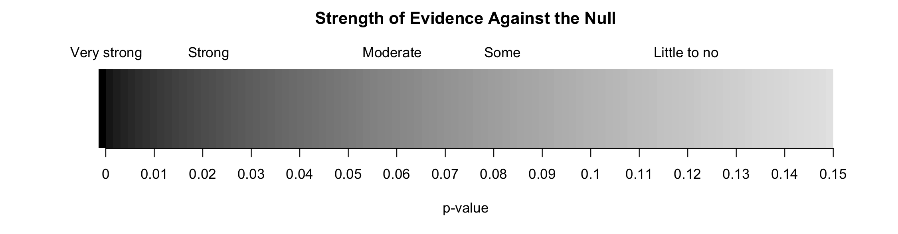
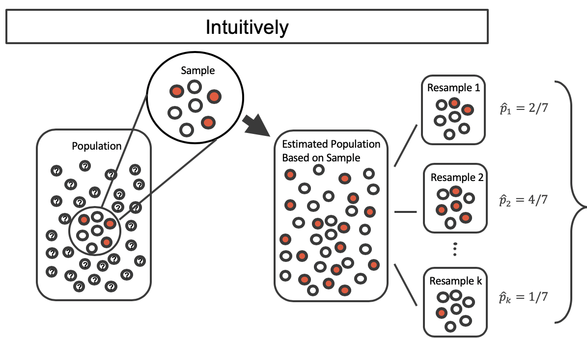
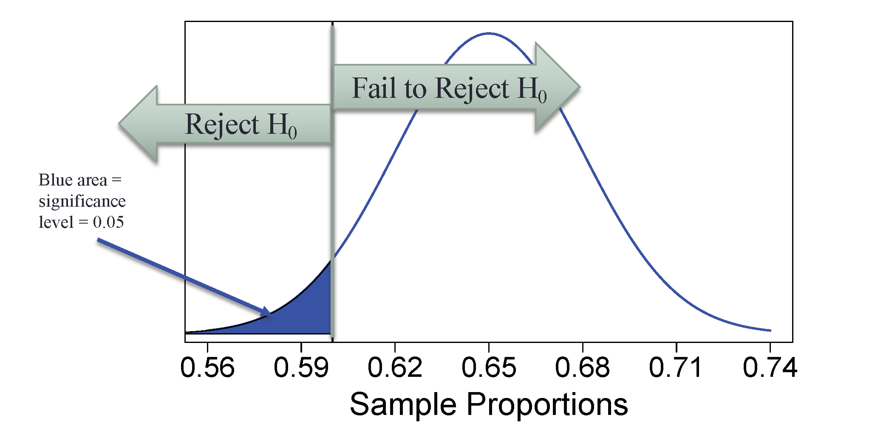

# Inference for categorical data {#inference-cat}

```{block2, chp2-intro, type="chapterintro", echo=TRUE}
Statistical inference is primarily concerned with understanding and quantifying the _uncertainty_ of parameter estimates---that is, how variable is a sample statistic
from sample to sample?
While the equations and details change depending on the setting, the foundations for inference are the same throughout all of statistics. We will begin this chapter with a discussion of the foundations of inference, and introduce the two primary vehicles of inference: the **hypothesis test** and **confidence interval**.

The rest of this chapter focuses on statistical inference for categorical data. The two data structures we detail are:

* one binary variable, summarized using a single proportion, and 
* two binary variables, summarized using a difference (or ratio) of two proportions.

We will also introduce a new important mathematical model, the **normal distribution** (as the foundation for the $z$-test).
```


Throughout the book so far, you have worked with data in a variety of contexts.
You have learned how to summarize and visualize the data as well as how to visualize multiple variables at the same time.
Sometimes the data set at hand represents the entire research question.
But more often than not, the data have been collected to answer a research question about a larger group of which the data are a (hopefully) representative subset.

You may agree that there is almost always variability in data (one data set will not be identical to a second data set even if they are both collected from the same population using the same methods).
However, quantifying the variability in the data is neither obvious nor easy to do (**how** different is one data set from another?). 


```{block2, type="example", echo=TRUE}
Suppose your professor splits the students in class into two groups: students on the left and students on the right. If $\hat{p}_{_L}$ and $\hat{p}_{_R}$ represent the proportion of students who own an Apple product on the left and right, respectively, would you be surprised if $\hat{p}_{_L}$ did not *exactly* equal $\hat{p}_{_R}$?

---

While the proportions would probably be close to each other, it would be unusual for them to be exactly the same. We would probably observe a small difference due to *chance*.
```


```{block2, type="guidedpractice", echo=TRUE}
If we don't think the side of the room a person sits on in class is related to whether the person owns an Apple product, what assumption are we making about the relationship between these two variables?
(Reminder: for these Guided Practice questions, you can check your answer in the footnote.)^[We would be assuming that these two variables are **independent**\index{independent}.]
```

Studying randomness of this form is a key focus of statistics. 
Throughout this chapter, and those that follow, we provide two different approaches for quantifying the variability inherent in data: simulation-based methods and theory-based methods (mathematical models).
Using the methods provided in this and future chapters, we will be able to draw conclusions beyond the data set at hand to research questions about larger populations.

## Foundations of inference {#inf-foundations}

Given results seen in a sample, the process of determining what we can _infer_ to the
population based on sample results is called **statistical inference**\index{statistical inference}. Statistical inferential methods enable us to understand and quantify the _uncertainty_ of our sample results. Statistical inference helps us answer two questions about the population:

1. How strong is the _evidence_ of an effect?
2. How _large_ is the effect?

The first question is answered through a **hypothesis test**\index{hypothesis test}, while the second is addressed with a **confidence interval**\index{confidence interval}.

Statistical inference is the practice of making decisions and conclusions from data in the context of uncertainty. 
Errors do occur, just like rare events, and the data set at hand might lead us to the wrong conclusion. 
While a given data set may not always lead us to a correct conclusion, statistical inference gives us tools to control and evaluate how often these errors occur. 

```{r include=FALSE}
terms_chp_5 <- c("statistical inference", "hypothesis test", "confidence interval")
```

### Motivating example: Martian alphabet {#Martian}

How well can humans distinguish one "Martian" letter from another? The Figure \@ref(fig:kiki-bumba)
displays two Martian letters---one is Kiki and the another is Bumba. Which do you think
is Kiki and which do you think is Bumba?^[If you are a STAT 216 student, you will recognize this from our first week's in-class activity.]

```{r kiki-bumba, out.width="75%", fig.cap="Two Martian letters: Bumba and Kiki. Do you think the letter Bumba is on the left or the right?^[Bumba is the Martian letter on the left!]"}
include_graphics("05/images/bumBa-KiKi.png")
```

This same image and question were presented to an introductory statistics class of
38 students. In that class, 34 students correctly identified Bumba as the Martian letter on the left. Assuming we can't read Martian, is this result surprising?

One of two possibilities occurred:

1. _We can't read Martian, and these results just occurred by chance._
2. _We can read Martian, and these results reflect this ability._

To decide between these two possibilities, we could calculate the probability
of observing such results in a randomly selected sample of 38 students, under
the assumption that students were just guessing. If this probability is _very low_,
we'd have reason to reject the first possibility in favor of the second.
We can calculate this probability using one of two methods:

* **Simulation-based method**: simulate lots of samples (Classes) of 38 students under the assumption that
students are just guessing, then calculate the proportion of these
simulated samples where we saw 34 or more students guessing correctly, or
* **Theory-based method**: develop a mathematical model for the sample proportion in this
scenario and use the model to calculate the probability.

```{block2, type="guidedpractice", echo=TRUE}
How could you use a coin or cards to simulate the guesses of one sample of 38 students who cannot read Martian?^[A fair coin has a 50% chance of landing on heads, which is the chance a student would guess Bumba correctly if they were just guessing. Thus, toss a coin 38 times with heads representing "guess correctly"; then calculate the proportion of tosses that landed on heads. Another option would be to 10 black cards and 10 red cards, letting red represent "guess correctly". Shuffle the cards and draw one card, record if it is red or black, then replace the card and shuffle again. Do this 38 times and calculate the proportion of red cards observed.]
```

For this situation---since "just guessing" means you have a 50% chance of guessing correctly---we could simulate a sample of 38 students' guesses by flipping a coin 38 times and counting the number of times it lands on heads. Using a computer to repeat this process 1,000 times, we create the dot plot in Figure \@ref(fig:MartianDotPlot).

```{r MartianDotPlot, fig.cap="A dot plot of 1,000 sample proportions; each calculated by flipping a coin 38 times and calculating the proportion of times the coin landed on heads. None of the 1,000 simulations had sample proportion of at least 89%, which was the proportion observed in the study.", warning=FALSE, fig.width=10}
samp.prop <- 34/38
set.seed(41)
props <- data.frame(x = rbinom(1000, 38, 0.5)/38)
ggplot(props, aes(x = x)) +
  geom_dotplot(fill = COL["blue", "full"], color = COL["blue", "full"], dotsize = 0.1) +
  labs(x = "Sample Proportion") +
  scale_x_continuous(labels = percent_format()) +
  theme(axis.title.y = element_blank(),
        axis.text.y  = element_blank(),
        axis.ticks.y = element_blank(),
        axis.text.x = element_text(size = 12)) +
  geom_polygon(
    data = data.frame(x = c(samp.prop - 0.02, samp.prop + 0.02, samp.prop), 
                      y = c(-0.1, -0.1, 0)),
    aes(x = x, y = y),
    fill = COL["red", "full"]
  )
```


None of our simulated samples produce 34 of 38 correct guesses! That is, if students were just guessing, it is nearly impossible to observe 34 or more correct guesses in a sample of 38 students. Given this low probability, the more plausible possibility is 2. _We can read Martian, and these results reflect this ability._ We've just completed our first hypothesis test!

Now, obviously no one can read Martian, so a more realistic possibility is that humans tend to choose Bumba on the left more often than the right---there is a greater than 50% chance of choosing Bumba as the letter on the left. Even though we may think we're guessing just by chance, we have a preference for Bumba on the left. It turns out that the explanation for this preference is called _synesthesia_, a tendency for humans to correlate sharp sounding noises (e.g., Kiki) with sharp looking images.^[To explore this further, watch this [TED Talk](https://www.ted.com/talks/vs_ramachandran_3_clues_to_understanding_your_brain) by neurologist Vilayanur Ramachandran (The synesthesia part begins at roughly 17:40 minutes).]

But wait---we're not done! We have evidence that humans tend to prefer Bumba on the left, but by how much? To answer this, we need a confidence interval---an interval of plausible values for the true probability humans will select Bumba as the left letter. The width of this interval is determined by how variable sample proportions are from sample to sample. It turns out, there is a mathematical model for this variability that we will explore later in this chapter. For now, let's take the standard deviation from our simulated sample proportions as an estimate for this variability: 0.08. Since the simulated distribution of proportions is bell-shaped, we know about 95% of sample proportions should fall within two standard deviations of the true proportion, so we can add and subtract this **margin of error**\index{margin of error} to our sample proportion to calculate an approximate 95% confidence interval^[If you carry out the calculations, you'll note that the upper bound is actually $0.89 + 0.16 = 1.05$, but since a sample proportion cannot be greater than 1, we truncated the interval to 1.]:
\[
\frac{34}{38} \pm 2\times 0.08 = 0.89 \pm 0.16 = (0.73, 1)
\]
Thus, based on this data, we are 95% confident that the probability a human guesses Bumba on the left is somewhere between 73% and 100%.

```{r include=FALSE}
terms_chp_5 <- c(terms_chp_5, "margin of error")
```

### Variability in a statistic {#var-stat}

There are two approaches to modeling how a statistic, such as a sample proportion, may vary from sample to sample.
In the [Martian alphabet example](#Martian), we used a **simulation-based approach** to model
this variability, using the standard deviation of the simulated distribution of sample proportions as a quantitative measure of this sampling variability. Simulation-based methods include the randomization tests and bootstrapping methods we will use in this textbook. We can also use a **theory-based approach**---one which makes use of
mathematical modeling---and involves the normal and $t$ probability distributions.

All of the theory-based methods discussed in this book work (under certain conditions) because of a very important theorem in Statistics called the **Central Limit Theorem**.

```{block2, type="onebox", echo=TRUE}
**Central Limit Theorem.**\index{Central Limit Theorem}

For large sample sizes, the **sampling distribution** of a sample proportion (or sample mean) will appear to follow a bell-shaped curve called the *normal distribution*.
```

```{r include=FALSE}
terms_chp_5 <- c(terms_chp_5, "Central Limit Theorem", "sampling distribution")
```

An example of a perfect normal distribution is shown in Figure \@ref(fig:simpleNormal). 
While the mean (center) and standard deviation (variability) may change for different scenarios, the general shape remains roughly intact.

```{r simpleNormal, fig.cap="A normal curve.", warning=FALSE, fig.width=10}
X <- seq(-5,5,0.01)
Y <- dnorm(X)
plot(X, Y, type='l', axes=F, xlim=c(-4,4), lwd=2, col=COL[5], ylab="", xlab="X")
#axis(1, at=-3:3)
abline(h=-0.002, col=COL[5])
```

Recall from Chapter \@ref(eda) that a _distribution_ of a variable is a description of the possible values it takes and how frequently each value occurs.  In a **sampling distribution**, our "variable" is a sample statistic, and the sampling distribution is a description of the possible values a sample statistic takes and how frequently each value occurs when looking across many many possible samples. It is quite amazing that something like a sample proportion, summarizing a categorical variable, will have a bell-shaped sampling distribution if we sample large enough samples!

Theory-based methods also give us mathematical expressions for the
standard deviation of a sampling distribution. For instance,
if the true population proportion is $\pi$, then the standard deviation
of the sampling distribution of sample proportions---how far away we would expect a sample proportion to be away from the population proportion---is^[The notation $SD(\hat{p})$ is function notation --- we are applying the standard deviation function ($SD$) to the statistic $\hat{p}$. This notation does _not_ mean to multiply $SD$ by $\hat{p}$.]
\[
SD(\hat{p}) = \sqrt{\frac{\pi(1-\pi)}{n}}.
\]
Typically, values of parameters such as $\pi$ are unknown, so we are unable to calculate these standard deviations. In this case, we substitute our "best guess" for $\pi$ in the formulas, either from a hypothesis or from a point estimate.

```{block2, type="onebox", echo=TRUE}
**Standard error.**  

The **standard deviation** of a sampling distribution for a statistic, denoted by $SD$(statistic), represents how far away we would expect the statistic to land from the parameter. 

Since the formulas for these standard deviations depend on unknown parameters, we substitute our "best guess" for $\pi$ in the formulas, either from a hypothesis or from a point estimate. The resulting _estimated_ standard deviation is called the **standard error** of the statistic, denoted by $SE$(statistic).
```

```{r include=FALSE}
terms_chp_5 <- c(terms_chp_5, "standard error")
```

### Hypothesis tests {#HypothesisTesting}

In the [Martian alphabet example](#Martian), we utilized a **hypothesis test**\index{hypothesis test}, which is a formal technique for evaluating two competing possibilities. 
Each hypothesis test involves a **null hypothesis**\index{null hypothesis}, which represents either a skeptical perspective or a perspective of no difference or no effect, and an **alternative hypothesis**\index{alternative hypothesis}, which represents a new perspective such as the possibility that there has been a change or that there is a treatment effect in an experiment.  The alternative hypothesis is usually the reason the scientists set out to do the research in the first place.


```{r include=FALSE}
terms_chp_5 <- c(terms_chp_5, "null hypothesis", "alternative hypothesis")
```

```{block2, type="onebox", echo=TRUE}
**Null and alternative hypotheses.**

When we observe an effect in a sample, we would like to determine
if this observed effect represents
an actual effect in the population, or whether it was simply due to
chance. 
We label these two competing claims, $H_0$ and $H_A$,
which are spoken as "H-naught" and "H_A".
  
The **null hypothesis ($H_0$)** often represents either a skeptical perspective or a claim to be tested. The **alternative hypothesis ($H_A$)** represents an alternative claim under consideration and is often represented by a range of possible values for the parameter of interest. 
```

```{block2, type="guidedpractice", echo=TRUE}
In the Martian alphabet example, which of the two competing possibilities was the null hypothesis? the alternative hypothesis?^[The first possibility (_We can't read Martian, and these results just occurred by chance._) was the null hypothesis; the second possibility (_We can read Martian, and these results reflect this ability._) was the alternative hypothesis.]
```

The hypothesis testing framework is a very general tool, and we often use it without a second thought. 
If a person makes a somewhat unbelievable claim, we are initially skeptical. 
However, if there is sufficient evidence that supports the claim, we set aside our skepticism. 
The hallmarks of hypothesis testing are also found in the US court system. 

#### The US court system {-}


```{block2, type="example", echo=TRUE}
A US court considers two possible claims about a defendant: they are either innocent or guilty. If we set these claims up in a hypothesis framework, which would be the null hypothesis and which the alternative?

---
 
The jury considers whether the evidence is so convincing (strong) that there is no reasonable doubt regarding the person's guilt. 
That is, the skeptical perspective (null hypothesis) is that the person is innocent until evidence is presented that convinces the jury that the person is guilty (alternative hypothesis). Analogously, in a hypothesis test, we assume the null hypothesis until evidence is presented that convinces us the alternative hypothesis is true.
```


Jurors examine the evidence to see whether it convincingly shows a defendant is guilty. 
Notice that if a jury finds a defendant *not guilty*, this does not necessarily mean the jury is confident in the person's innocence. 
They are simply not convinced of the alternative that the person is guilty.

This is also the case with hypothesis testing: *even if we fail to reject the null hypothesis, we typically do not accept the null hypothesis as truth*. 
Failing to find strong evidence for the alternative hypothesis is not equivalent to providing evidence that the null hypothesis is true.

#### p-value {-}

In the [Martian alphabet example](#Martian), we performed a simulation-based hypothesis test of the hypotheses:

* $H_0$: The chance a human chooses Bumba on the left is 50%.

* $H_A$: Humans have a preference for choosing Bumba on the left.

The research question---can humans read Martian?---was framed in the context of these hypotheses.

The null hypothesis ($H_0$) was a perspective of no effect (no ability to read Martian).
The student data provided a point estimate of 89.5% ($34/38 \times 100$%) for the true probability of choosing Bumba on the left.
We determined that observing such a sample proportion from chance alone (assuming $H_0$) would be rare---it would only happen in less than 1 out of 1000 samples. When results
like these are inconsistent with $H_0$, we reject $H_0$ in favor of $H_A$. 
Here, we concluded that humans have a preference for choosing Bumba on the left.

The less than 1-in-1000 chance is what we call a **p-value**, which is a probability quantifying the strength of the evidence against the null hypothesis and in favor of the alternative. 

```{block2, type="onebox", echo=TRUE}
**p-value.**

The **p-value**\index{hypothesis testing!p-value|textbf} is the probability of observing data at least as favorable to the alternative hypothesis as our current data set, if the null hypothesis were true. 
We typically use a summary statistic of the data, such as a proportion or difference in proportions, to help compute the p-value and evaluate the hypotheses. 
This summary value that is used to compute the p-value is often called the **test statistic**\index{test statistic}.
```

```{r include=FALSE}
terms_chp_5 <- c(terms_chp_5, "p-value", "test statistic")
```

```{block2, type="protip", echo=TRUE}
When interpreting a p-value, remember that the definition of a p-value has three components. It is a (1) probability. What it is the probability of? It is the probability of (2) our observed sample statistic or one more extreme. Assuming what? It is the probability of our observed sample statistic or one more extreme, (3) assuming the null hypothesis is true:
  
(1) probability
(2) data^[Technically, the observed sample statistic or one more extreme in the direction of our alternative. But it is helpful to just remember this as "the data".]
(3) null hypothesis
```

```{block2, type="example", echo=TRUE}
What was the test statistic in the [Martian alphabet example](#Martian)?
 
---
 
The test statistic in the the Martian alphabet example was the sample proportion, $\frac{34}{38} = 0.895$ (or 89.5%). This is also the **point estimate** of the true probability that humans would choose Bumba on the left.
```


Since the p-value is a probability, its value will always be between 0 and 1. The closer the p-value is to 0, the stronger the evidence we have _against the null hypothesis_. Why? A small p-value means that our data are _unlikely_ to occur, _if_ the null hypothesis is true. We take that to mean that the null hypothesis isn't a plausible assumption, and we reject it. This process mimics the scientific method---it is easier to disprove a theory than prove it. If scientists want to find evidence that a new drug reduces the risk of stroke, then they assume it _doesn't_ reduce the risk of stroke and then show that the observed data are so unlikely to occur that the more plausible explanation is that the drug works.


Think of p-values as a continuum of strength of evidence against the null, from 0 (extremely strong evidence) to 1 (no evidence). Beyond around 10%, the data provide no evidence against the null hypothesis. Be careful not to equate this with evidence for the null hypothesis, which is incorrect. <p style="color:red;">_The absence of evidence is not evidence of absence._</p>
```{r pval-continuum, out.width="100%", fig.cap="Strength of evidence against the null for a continuum of p-values. Once the p-value is beyond around 0.10, the data provide no evidence against the null hypothesis."}

```

<!-- You may use Table \@ref(tab:pvalue-continuum) as a general guide, but remember that there are no hard and fast cutoffs on this scale---the strength of evidence against the null with a p-value of 0.049 is the same as with a p-value of 0.051.  -->

<!-- ```{r pvalue-continuum} -->
<!-- pval_table <- tribble( -->
<!--   ~variable,    ~col1,  -->
<!-- "p-value < 0.01",  "very strong", -->

<!-- "0.01 < p-value < 0.05", "strong", -->

<!-- "0.05 < p-value < 0.10", "moderate", -->

<!-- "p-value > 0.10", "little to no evidence", -->
<!-- ) -->

<!-- pval_table %>% -->
<!--  kable(caption = "The p-value as a continuum of strength of evidence against the null--a general guide.",  -->
<!--     col.names = c("p-value range", "Strength of evidence against $H_0$")) %>% -->
<!--  kable_styling() -->
<!-- ``` -->

Regardless of the data structure or analysis method, the hypothesis testing framework always follows the same steps---only the details for how we model randomness in the data change.

```{block2, type="onebox", echo=TRUE}
**General steps of a hypothesis test.** Every hypothesis test follows these same general steps:

1. Frame the research question in terms of hypotheses.
2. Collect and summarize data using a test statistic.
3. Assume the null hypothesis is true, and simulate or mathematically model a null distribution for the test statistic.
4. Compare the observed test statistic to the null distribution to calculate a p-value.
5. Make a conclusion based on the p-value, and write a conclusion in context, in plain language, and in terms of the alternative hypothesis.
```


#### Decisions and statistical significance {-}

In some cases, a **decision** to the hypothesis test is needed, with the two possible decisions as follows:

* Reject the null hypothesis
* Fail to reject the null hypothesis

```{block2, type="guidedpractice", echo=TRUE}
For which values of the p-value should you "reject" a null hypothesis? "fail to reject" a null hypothesis?^[Since a smaller p-value gives you stronger evidence _against_ the null hypothesis, we reject $H_0$ when the p-value is very small, and fail to reject $H_0$ when the p-value is not small.]
```

In order to decide between these two options, we need a previously set threshold for our p-value:  when the p-value is less than a previously set threshold, we reject $H_0$; otherwise, we fail to reject $H_0$. This threshold is called the **significance level**\index{hypothesis testing!significance level}\index{significance level}, and when the p-value is less than the significance level, we say the results are **statistically significant**. This means the data provide such strong evidence against $H_0$ that we reject the null hypothesis in favor of the alternative hypothesis. 
The significance level, often represented by $\alpha$ (the Greek letter *alpha*), is typically set to $\alpha = 0.05$, but can vary depending on the field or the application and the real-life consequences of an incorrect decision. 
Using a significance level of $\alpha = 0.05$ in the Martian alphabet study, we can say that the data provided statistically significant evidence against the null hypothesis.

```{block2, type="onebox", echo=TRUE}
**Statistical significance.**

We say that the data provide **statistically significant**\index{hypothesis testing!statistically significant|textbf} evidence against the null hypothesis if the p-value is less than some reference value called the **significance level**\index{significance level}, denoted by $\alpha$.
```

```{block2, type="onebox", echo=TRUE}
**What's so special about 0.05?**

We often use a threshold of 0.05 to determine whether a result is statistically significant. 
But why 0.05? 
Maybe we should use a bigger number, or maybe a smaller number. 
If you're a little puzzled, that probably means you're reading with a critical eye---good job! 
The _OpenIntro_ authors have a video to help clarify *why 0.05*:
<center>
[https://www.openintro.org/book/stat/why05/](https://www.openintro.org/book/stat/why05/)
</center>
<br>
Sometimes it's also a good idea to deviate from the standard. 
We'll discuss when to choose a threshold different than 0.05 in Section \@ref(two-prop-errors).
```


Statistical significance has been a hot topic in the news, related to the "reproducibility crisis" in some scientific fields. We encourage you to read more about the debate on the use of p-values and statistical significance. A good place to start would be the _Nature_ article, "[Scientists rise up against statistical significance](https://www.nature.com/articles/d41586-019-00857-9)," from March 20, 2019.

### Confidence intervals {#ConfidenceIntervals}

A point estimate provides a single plausible value for a parameter. 
However, a point estimate is rarely perfect---usually there is some error in the estimate. 
In addition to supplying a point estimate of a parameter, a next logical step would be to provide a plausible *range of values* for the parameter.

A plausible range of values for the population parameter is called a **confidence interval**. 
Using only a single point estimate is like fishing in a murky lake with a spear, and using a confidence interval is like fishing with a net. 
We can throw a spear where we saw a fish, but we will probably miss. 
On the other hand, if we toss a net in that area, we have a good chance of catching the fish.

If we report a point estimate, we probably will not hit the exact population parameter. 
On the other hand, if we report a range of plausible values---a confidence interval---we have a good shot at capturing the parameter.

This reasoning also explains why we can never prove a null hypothesis. Sample statistics will vary from sample to sample. While we can quantify this uncertainty (e.g., we are 95% sure the statistic is within 0.15 of the parameter), we can never be certain that the parameter is an exact value. For example, suppose you want to test whether a coin is a fair coin, i.e., $H_0: \pi = 0.50$ versus $H_0: \pi \neq 0.50$, so you toss the coin 10 times to collect data. In those 10 tosses, 6 land on heads and 4 land on tails, resulting in a p-value of 0.754^[You will get more practice calculating p-values such as these in this Chapter.]. We don't have enough evidence to show that the coin is biased, but surely we wouldn't say we just proved the coin is fair!

```{block2, type="importantbox", echo=TRUE}
There are only _two_ possible decisions in a hypothesis test: (1) reject $H_0$, or (2) fail to reject $H_0$. Since one can never prove a null hypothesis---we can only disprove^[Since statistical methods are grounded in probability, technically we can only find strong evidence against a hypothesis, not disprove it.] it---we never have the ability to "accept the null." You may have seen this phrase in other textbooks or articles, but it is incorrect.
```

```{block2, type="guidedpractice", echo=TRUE}
If we want to be very certain we capture the population parameter, should we use a wider interval or a smaller interval?^[If we want to be more certain we will capture the fish, we might use a wider net. Likewise, we use a wider confidence interval if we want to be more certain that we capture the parameter.]
```

We will explore both simulation-based methods (bootstrapping) and theory-based methods for creating confidence intervals in this text. Though the details change with different scenarios, theory-based confidence intervals will always take the form:
\[
\mbox{statistic} \pm (\mbox{multiplier}) \times (\mbox{standard error of the statistic})
\]
The statistic is our best guess for the value of the parameter, so it makes sense to build the confidence interval around that value. The standard error, which is a measure of the uncertainty associated with the statistic, provides a guide for how large we should make the confidence interval. The multiplier is determined by how confident we'd like to be, and tells us how many standard errors we need to add and subtract from the statistic. The amount we add and subtract from the statistic is called the **margin of error**.

```{block2, type="onebox", echo=TRUE}
**General form of a confidence interval.**

The general form of a **theory-based confidence interval** for an unknown parameter is
\[
\mbox{statistic} \pm (\mbox{multiplier}) \times (\mbox{standard error of the statistic})
\]
The amount we add and subtract to the statistic to calculate the confidence interval is called the **margin of error**.
\[
\mbox{margin of error} = (\mbox{multiplier}) \times (\mbox{standard error of the statistic})
\]
```

In Section \@ref(theory-prop) we will discuss different percentages for the confidence interval (e.g., 90% confidence interval or 99% confidence interval).  Section \@ref(two-prop-boot-ci) provides a longer discussion on what "95% confidence" actually means.


## The normal distribution {#normal}

\index{normal distribution|(}

Among all the distributions we see in statistics, one is overwhelmingly the most common. 
The symmetric, unimodal, bell curve is ubiquitous throughout statistics. 
It is so common that people know it as a variety of names including the **normal curve**\index{normal curve}, **normal model**\index{normal model}, or **normal distribution**\index{normal distribution}.^[It is also introduced as the Gaussian distribution after Frederic Gauss, the first person to formalize its mathematical expression.] 
Under certain conditions, sample proportions, sample means, and sample differences can be modeled using the normal distribution---the basis for our theory-based inference methods. 
Additionally, some variables such as SAT scores and heights of US adult males closely follow the normal distribution.


```{r include=FALSE}
terms_chp_5 <- c(terms_chp_5, "normal curve", "normal model", "normal distribution")
```


```{block2, type="onebox", echo=TRUE}
**Normal distribution facts.**

Many summary statistics and variables are nearly normal, but none are exactly normal. 
Thus the normal distribution, while not perfect for any single problem, is very useful for a variety of problems. 
We will use it in data exploration and to solve important problems in statistics.
```

In this section, we will discuss the normal distribution in the context of data to become more familiar with normal distribution techniques. 

### Normal distribution model


The normal distribution always describes a symmetric, unimodal, bell-shaped curve. 
However, normal curves can look different depending on the details of the model. 
Specifically, the normal model can be adjusted using two parameters: mean and standard deviation. 
As you can probably guess, changing the mean shifts the bell curve to the left or right, while changing the standard deviation stretches or constricts the curve. 
Figure \@ref(fig:twoSampleNormals) shows the normal distribution with mean $0$ and standard deviation $1$  (which is commonly referred to as the **standard normal distribution**\index{standard normal distribution}) on top.
A normal distribution with mean $19$ and standard deviation $4$ is shown on the bottom. Figure \@ref(fig:twoSampleNormalsStacked) shows the same two normal distributions on the same axis.


```{r twoSampleNormals, fig.cap="Both curves represent the normal distribution, however, they differ in their center and spread. The normal distribution with mean 0 and standard deviation 1 is called the **standard normal distribution**.", warning=FALSE, fig.width=10}

x <- rnorm(100000)
hold <- hist(x, breaks=50, probability=TRUE, type="n", plot=FALSE)

# curve 1
X <- seq(-4,4,0.01)
Y <- dnorm(X)
plot(X, Y, type='l', axes=F, xlim=c(-3.4,3.4))
axis(1, at=-3:3)
for(i in 1:length(hold$counts)){
	rect(hold$breaks[i], 0, hold$breaks[i+1], hold$density[i],
		border=COL[5,4], col=COL[7,3])
}
lines(X, Y)
abline(h=0)

# curve 2
X <- seq(3,35,0.01)
Y <- dnorm(X, 19, 4)
plot(X, Y, type='l', axes=F, xlim=c(5.4,32.6))
axis(1, at=19+4*(-3:3))

for(i in 1:length(hold$counts)){
	rect(19+4*hold$breaks[i], 0, 19+4*hold$breaks[i+1], hold$density[i]/4,
		border=COL[5,4], col=COL[7,3])
}
lines(X, Y)
abline(h=0)
```


```{r include=FALSE}
terms_chp_5 <- c(terms_chp_5, "standard normal distribution")
```


```{r twoSampleNormalsStacked, fig.cap="The two normal models shown above and now plotted together on the same scale.", warning=FALSE, fig.width=10}

# curve 1
X <- seq(-4,4,0.01)
Y <- dnorm(X)
plot(X, Y, type='l', axes=F, xlim=c(-5,35))
axis(1, at=seq(-10, 40, 10))
lines(X, Y)
abline(h=0)

# curve 2
X <- seq(3,35,0.01)
Y <- dnorm(X, 19, 4)
lines(X, Y)
```

If a normal distribution has mean $\mu$ and standard deviation $\sigma$, we may write the distribution as $N(\mu, \sigma)$\marginpar[\raggedright\vspace{-5mm}

$N(\mu, \sigma)$\vspace{1mm}\\\footnotesize Normal dist.\\with mean $\mu$\\\& st. dev. $\sigma$]{\raggedright\vspace{-5mm}

$N(\mu, \sigma)$\vspace{1mm}\\\footnotesize Normal dist.\\with mean $\mu$\\\& st. dev. $\sigma$}. The two distributions in Figure \@ref(fig:twoSampleNormalsStacked) can be written as
\begin{align*}
N(\mu=0,\sigma=1)\quad\text{and}\quad N(\mu=19,\sigma=4)
\end{align*}
Because the mean and standard deviation describe a normal distribution exactly, they are called the distribution's **parameters**\index{parameter}.

```{r include=FALSE}
terms_chp_5 <- c(terms_chp_5, "parameter")
```

```{block2, type="guidedpractice", echo=TRUE}
Write down the short-hand for a normal distribution with (a) mean 5 and standard deviation 3, (b) mean -100 and standard deviation 10, and (c) mean 2 and standard deviation 9.^[(a) $N(\mu=5,\sigma=3)$. (b) $N(\mu=-100, \sigma=10)$. (c) $N(\mu=2, \sigma=9)$.]
```


### Standardizing with Z-scores

```{block2, type="guidedpractice", echo=TRUE}
Table \@ref(tab:satACTstats) shows the mean and standard deviation for total scores on the SAT and ACT. The distribution of SAT and ACT scores are both nearly normal. Suppose Ann scored 1800 on her SAT and Tom scored 24 on his ACT. Who performed better?^[We use the standard deviation as a guide. Ann is 1 standard deviation above average on the SAT: $1500 + 300=1800$. Tom is 0.6 standard deviations above the mean on the ACT: $21+0.6\times 5=24$. In Figure \@ref(fig:satActNormals), we can see that Ann tends to do better with respect to everyone else than Tom did, so her score was better.]
```


```{r satACTstats}
temptbl <- tribble(
 ~variable,  ~col1, ~col2, 
 "Mean", "1500", "21",
 "SD", "300", "5"
)

temptbl %>%
 kable(caption = "Mean and standard deviation for the SAT and ACT.",
  col.names = c("", "SAT", "ACT")) %>%
 kable_styling() 
```

```{r satActNormals, fig.cap="Ann's and Tom's scores shown with the distributions of SAT and ACT scores.", warning=FALSE, fig.width=10}

set.seed(1)
#===> plot <===#
par(mfrow=c(2,1), las=1, mar=c(2.5,0,0.5,0))

# curve 1
m <- 1500
s <- 300
X <- m+s*seq(-4,4,0.01)
Y <- dnorm(X, m, s)
plot(X, Y, type='l', axes=F, xlim=m+s*c(-2.7,2.7))
axis(1, at=m+s*(-3:3))
abline(h=0)
lines(c(m,m), dnorm(m, m, s)*c(0.01,0.99), lty=2, col='#EEEEEE')
lines(c(m,m)+s, dnorm(m+s, m, s)*c(0.01,1.25), lty=2, col=COL[1])
text(m+s, dnorm(m+s,m,s)*1.25, 'Ann', pos=3, col=COL[1])


# curve 2
par(mar=c(2,0,1,0))
m <- 21
s <- 5
X <- m+s*seq(-4,4,0.01)
Y <- dnorm(X, m, s)
plot(X, Y, type='l', axes=F, xlim=m+s*c(-2.7,2.7))
axis(1, at=m+s*(-3:3))
abline(h=0)
lines(c(m,m), dnorm(m, m, s)*c(0.01,0.99), lty=2, col='#EEEEEE')
lines(c(m,m)+3, dnorm(m+3, m, s)*c(0.01,1.2), lty=2, col=COL[1])
text(m+3, dnorm(m+3,m,s)*1.05, 'Tom', pos=4, col=COL[1])

```


The solution to the previous example relies on a standardization technique called a Z-score, a method most commonly employed for nearly normal observations (but that may be used with any distribution). The **Z-score**\index{Z-score}\marginpar[\raggedright\vspace{-3mm}


$Z$\vspace{1mm}\\\footnotesize Z-score, the\\standardized\\observation]{\raggedright\vspace{-3mm}

$Z$\vspace{1mm}\\\footnotesize Z-score, the\\standardized\\observation}\index{Z@$Z$} of an observation is defined as the number of standard deviations it falls above or below the mean. 
If the observation is one standard deviation above the mean, its Z-score is 1. If it is 1.5 standard deviations *below* the mean, then its Z-score is -1.5. 
If $x$ is an observation from a distribution $N(\mu, \sigma)$, we define the Z-score mathematically as

```{r include=FALSE}
terms_chp_5 <- c(terms_chp_5, "Z-score")
```

\begin{eqnarray*}
Z = \frac{x-\mu}{\sigma}
\end{eqnarray*}
Using $\mu_{SAT}=1500$, $\sigma_{SAT}=300$, and $x_{Ann}=1800$, we find Ann's Z-score:
\begin{eqnarray*}
Z_{Ann} = \frac{x_{Ann} - \mu_{SAT}}{\sigma_{SAT}} = \frac{1800-1500}{300} = 1
\end{eqnarray*}


```{block2, type="onebox", echo=TRUE}
**The Z-score.**

The Z-score of an observation is the number of standard deviations it falls above or below the mean. 
We compute the Z-score for an observation $x$ that follows a distribution with mean $\mu$ and standard deviation $\sigma$ by first subtracting its mean, then dividing by its standard deviation:
\begin{eqnarray*}
Z = \frac{x-\mu}{\sigma}
\end{eqnarray*}
```


```{block2, type="guidedpractice", echo=TRUE}
Use Tom's ACT score, 24, along with the ACT mean and standard deviation to compute his Z-score.^[$Z_{Tom} = \frac{x_{Tom} - \mu_{ACT}}{\sigma_{ACT}} = \frac{24 - 21}{5} = 0.6$]
```

Observations above the mean always have positive Z-scores while those below the mean have negative Z-scores. 
If an observation is equal to the mean (e.g., SAT score of 1500), then the Z-score is $0$.


```{block2, type="guidedpractice", echo=TRUE}
Let $X$ represent a random variable from $N(\mu=3, \sigma=2)$, and suppose we observe $x=5.19$. (a) Find the Z-score of $x$. (b) Use the Z-score to determine how many standard deviations above or below the mean $x$ falls.^[(a) Its Z-score is given by $Z = \frac{x-\mu}{\sigma} = \frac{5.19 - 3}{2} = 2.19/2 = 1.095$. (b) The observation $x$ is 1.095 standard deviations *above* the mean. We know it must be above the mean since $Z$ is positive.]
```


```{block2, type="guidedpractice", echo=TRUE}
Head lengths of brushtail possums follow a nearly normal distribution with mean 92.6 mm and standard deviation 3.6 mm. Compute the Z-scores for possums with head lengths of 95.4 mm and 85.8 mm.^[For $x_1=95.4$ mm: $Z_1 = \frac{x_1 - \mu}{\sigma} = \frac{95.4 - 92.6}{3.6} = 0.78$. For $x_2=85.8$ mm: $Z_2 = \frac{85.8 - 92.6}{3.6} = -1.89$.]
```

We can use Z-scores to roughly identify which observations are more unusual than others. 
One observation $x_1$ is said to be more unusual than another observation $x_2$ if the absolute value of its Z-score is larger than the absolute value of the other observation's Z-score: $|Z_1| > |Z_2|$. 
This technique is especially insightful when a distribution is symmetric.

```{block2, type="guidedpractice", echo=TRUE}
Which of the two brushtail possum observations in the previous guided practice is more *unusual*?^[Because the *absolute value* of Z-score for the second observation is larger than that of the first, the second observation has a more unusual head length.]
```


### Normal probability calculations in `R`

```{block2, type="example", echo=TRUE}
Ann from the SAT Guided Practice earned a score of 1800 on her SAT with a corresponding $Z=1$. She would like to know what percentile she falls in among all SAT test-takers.

---
 
Ann's **percentile**\index{percentile} is the percentage of people who earned a lower SAT score than Ann. We shade the area representing those individuals in Figure \@ref(fig:satBelow1800). The total area under the normal curve is always equal to 1, and the proportion of people who scored below Ann on the SAT is equal to the *area* shaded in Figure \@ref(fig:satBelow1800): 0.8413. In other words, Ann is in the $84^{th}$ percentile of SAT takers.
```

```{r include=FALSE}
terms_chp_5 <- c(terms_chp_5, "percentile")
```


```{r satBelow1800, fig.cap="The normal model for SAT scores, shading the area of those individuals who scored below Ann.", warning=FALSE, fig.width=10}

X <- seq(-4,4,0.01)
Y <- dnorm(X)
plot(X, Y, type='l', axes=F, xlim=c(-3.4,3.4))
axis(1, at=-3:3, label=(1500+300*(-3:3)), cex.axis=0.7)
these <- which(X <= 1)
polygon(c(X[these[1]], X[these],X[rev(these)[1]]), c(0,Y[these],0), col=COL[1])

#arrows(1.3,0.28, 0.43, 0.28, length=0.07)
#text(1.3, 0.28, 'X=1630\nZ=0.43', pos=4, cex=0.7)

lines(X, Y)
abline(h=0)
```


We can use the normal model to find percentiles or probabilities. In `R`, the function
to calculate normal probabilities is `pnorm()`. The `normTail()` function is available in the `openintro` R package and will draw the associated curve if it is helpful. In the code below, we find the percentile of $Z=0.43$ is 0.6664, or the $66.64^{th}$ percentile. 

```{r echo = TRUE}
pnorm(0.43, m = 0, s = 1)
openintro::normTail(0.43, m = 0, s = 1)
```

We can also find the Z-score associated with a percentile. 
For example, to identify Z for the $80^{th}$ percentile, we use `qnorm()` which identifies the **quantile** for a given percentage.  The quantile represents the cutoff value.^[To remember the function `qnorm()` as providing a cutoff, notice that both `qnorm()` and "cutoff" start with the sound "kuh".  To remember the `pnorm()` function as providing a probability from a given cutoff, notice that both `pnorm()` and probability start with the sound "puh".] 
We determine the Z-score for the $80^{th}$ percentile using `qnorm()`: 0.84.

```{r echo = TRUE}
qnorm(0.80, m = 0, s = 1)
openintro::normTail(0.80, m = 0, s = 1)
```

We can use these functions with other normal distributions than the standard normal distribution by specifying the mean as the argument for `m` and the standard deviation as the argument for `s`. Here we determine the proportion of ACT test takers who scored worse than Tom on the ACT: 0.73.

```{r echo = TRUE}
pnorm(24, m = 21, s = 5)
openintro::normTail(24, m = 21, s = 5)
```

```{block2, type="guidedpractice", echo=TRUE}
Determine the proportion of SAT test takers who scored better than Ann on the SAT.^[If 84% had lower scores than Ann, the number of people who had better scores must be 16%. (Generally ties are ignored when the normal model, or any other continuous distribution, is used.)]
```


### Normal probability examples

Cumulative SAT scores are approximated well by a normal model, $N(\mu=1500, \sigma=300)$.

```{block2, type="example", echo=TRUE}
Shannon is a randomly selected SAT taker, and nothing is known about Shannon's SAT aptitude. What is the probability that Shannon scores at least 1630 on her SATs?

---

First, always draw and label a picture of the normal distribution. (Drawings need not be exact to be useful.) We are interested in the chance she scores above 1630, so we shade the upper tail.  See the normal curve below.


The picture shows the mean and the values at 2 standard deviations above and below the mean. The simplest way to find the shaded area under the curve makes use of the Z-score of the cutoff value. With $\mu=1500$, $\sigma=300$, and the cutoff value $x=1630$, the Z-score is computed as
\begin{eqnarray*}
Z = \frac{x - \mu}{\sigma} = \frac{1630 - 1500}{300} = \frac{130}{300} = 0.43
\end{eqnarray*}
We use software to find the percentile of $Z=0.43$, which yields 0.6664. However, the percentile describes those who had a Z-score *lower* than 0.43. To find the area *above* $Z=0.43$, we compute one minus the area of the lower tail, as seen below.

The probability Shannon scores at least 1630 on the SAT is 0.3336.
```

```{r satAbove1630, fig.cap="", warning=FALSE, fig.width=10}

X <- seq(-4,4,0.01)
Y <- dnorm(X)
plot(X, Y, type='l', axes=F, xlim=c(-3.4,3.4))
axis(1, at=c(-2,0,2), label=(1500+c(-2,0,2)*300), cex.axis=0.8)
these <- which(X >= 0.43)
polygon(c(X[these[1]], X[these],4), c(0,Y[these],0), col=COL[1])
#arrows(-0.1, 0.4*dnorm(0),(1600-1500)/300, dnorm(0)*.4, length=0.065)
#text(0.1, .4*dnorm(0), '1630', pos=2, cex=0.8)

#arrows(1.3,0.28, 0.43, 0.28, length=0.07)
#text(1.3, 0.28, 'X=1630\nZ=0.43', pos=4, cex=0.7)

lines(X, Y)
abline(h=0)
```


```{r subtractingArea, fig.cap="", warning=FALSE, fig.width=10}

par(las=1, mar=c(0,0,0,0), mgp=c(3,-0.2,0), mfrow=c(1,1))
X <- seq(-3.2,3.2,0.01)
Y <- dnorm(X)

plot(X, Y, type='l', axes=F, xlim=c(-3.4,16+3.4), ylim=c(0, 0.652))
lines(X, rep(0,length(X)))
these <- which(X <= 8)
polygon(c(X[these[1]], X[these],X[rev(these)[1]]), c(0,Y[these],0), col=COL[1])
lines(X, Y)
#abline(h=0)
lines(c(0,0), dnorm(0)*c(0.01,0.99), col=COL[6], lty=3)

lines(c(3,8-3), c(0.2,0.2), lwd=3)
text(0, 0.58, format(c(1, 0.0001), scientific=FALSE)[1], cex=2)


lines(X+8, Y, type='l', xlim=c(-3.4,3.4))
lines(X+8, rep(0,length(X)))
these <- which(X <= 0.43)
polygon(c(X[these[1]], X[these],X[rev(these)[1]])+8, c(0,Y[these],0), col=COL[1])
lines(X+8, Y)
lines(c(0,0), dnorm(0)*c(0.01,0.99), col=COL[6], lty=3)

lines(8+c(3,8-3), c(0.23,0.23), lwd=3)
lines(8+c(3,8-3), c(0.17,0.17), lwd=3)
lines(c(3.72, 4.28), rep(0.58, 2), lwd=2)
text(8, 0.58, format(0.6664, scientific=FALSE)[1], cex=2)

lines(X+8+8, Y, type='l', xlim=c(-3.4,3.4))
lines(X+8+8, rep(0,length(X)))
these <- which(X > 0.43)
polygon(c(X[these[1]], X[these],X[rev(these)[1]])+8+8, c(0,Y[these],0), col=COL[1])
lines(X+8+8, Y)
lines(c(0,0), dnorm(0)*c(0.01,0.99), col=COL[6], lty=3)
text(12, 0.58, '=', cex=2)
text(16, 0.58, format(0.3336, scientific=FALSE)[1], cex=2)

```


```{block2, type="protip", echo=TRUE}
**Always draw a picture first, and find the Z-score second.**

For any normal probability situation, *always always always* draw and label the normal curve and shade the area of interest first. 
The picture will provide an estimate of the probability.

After drawing a figure to represent the situation, identify the Z-score for the observation of interest.
```


```{block2, type="guidedpractice", echo=TRUE}
If the probability of Shannon scoring at least 1630 is 0.3336, then what is the probability she scores less than 1630? Draw the normal curve representing this exercise, shading the lower region instead of the upper one.^[We found the probability to be 0.6664. A picture for this exercise is represented by the shaded area below "0.6664".]
```

```{block2, type="example", echo=TRUE}
Edward earned a 1400 on his SAT. What is his percentile?

---
 
First, a picture is needed. Edward's percentile is the proportion of people who do not get as high as a 1400. These are the scores to the left of 1400.

Identifying the mean $\mu=1500$, the standard deviation $\sigma=300$, and the cutoff for the tail area $x=1400$ makes it easy to compute the Z-score:
\begin{eqnarray*}
Z = \frac{x - \mu}{\sigma} = \frac{1400 - 1500}{300} = -0.3333
\end{eqnarray*}
Using the `pnorm()` function (either `pnorm(-1/3)` or `pnorm(1400, m=1500, s=300)` will give the desired result), the desired probability is $0.3694$. Edward is at the $37^{th}$ percentile.
```


```{r satBelow1400, fig.cap="", warning=FALSE, fig.width=10}

normTail(1500, 300, 1400, axes = FALSE, col = COL[1])
axis(1, at = c(900, 1500, 2100))
```


```{block2, type="guidedpractice", echo=TRUE}
Use the results of the previous example to compute the proportion of SAT takers who did better than Edward. Also draw a new picture.^[If Edward did better than 37% of SAT takers, then about 63% must have done better than him. 
\includegraphics[height=14mm]{02/figures/satBelow1400/satAbove1400}]
```


```{block2, type="protip", echo=TRUE}
**Areas to the right.**

The `pnorm()` function (and the normal probability table in most books) gives the area to the left. If you would like the area to the right, first find the area to the left and then subtract this amount from one. In `R`, you can also do this by setting the `lower.tail` argument to `FALSE`.
```

```{block2, type="guidedpractice", echo=TRUE}
Stuart earned an SAT score of 2100. Draw a picture for each part. (a) What is his percentile? (b) What percent of SAT takers did better than Stuart?^[Numerical answers: (a) 0.9772. (b) 0.0228.]
```

Based on a sample of 100 men,^[This sample was taken from the USDA Food Commodity Intake Database.] the heights of male adults between the ages 20 and 62 in the US is nearly normal with mean 70.0'' and standard deviation 3.3''.

```{block2, type="guidedpractice", echo=TRUE}
Mike is 5'7'' and Jim is 6'4''. (a) What is Mike's height percentile? (b) What is Jim's height percentile? Also draw one picture for each part.^[First put the heights into inches: 67 and 76 inches. Figures are shown below. (a) $Z_{Mike} = \frac{67 - 70}{3.3} = -0.91\ \to\ 0.1814$. (b) $Z_{Jim} = \frac{76 - 70}{3.3} = 1.82\ \to\ 0.9656$. \\\includegraphics[height=14mm]{02/figures/mikeAndJimPercentiles/mikeAndJimPercentiles}]
```

The last several problems have focused on finding the probability or percentile for a particular observation. 
What if you would like to know the observation corresponding to a particular percentile?


```{block2, type="example", echo=TRUE}
Erik's height is at the $40^{th}$ percentile. How tall is he?

---

As always, first draw the picture (see below).

In this case, the lower tail probability is known (0.40), which can be shaded on the diagram. We want to find the observation that corresponds to this value. As a first step in this direction, we determine the Z-score associated with the $40^{th}$ percentile.

Because the percentile is below 50%, we know $Z$ will be negative. Looking in the negative part of the normal probability table, we search for the probability *inside* the table closest to 0.4000. We find that 0.4000 falls in row $-0.2$ and between columns $0.05$ and $0.06$. Since it falls closer to $0.05$, we take this one: $Z=-0.25$.

Knowing $Z_{Erik}=-0.25$ and the population parameters $\mu=70$ and $\sigma=3.3$ inches, the Z-score formula can be set up to determine Erik's unknown height, labeled $x_{Erik}$:
\begin{eqnarray*}
-0.25 = Z_{Erik} = \frac{x_{Erik} - \mu}{\sigma} = \frac{x_{Erik} - 70}{3.3}
\end{eqnarray*}
Solving for $x_{Erik}$ yields the height 69.18 inches. That is, Erik is about 5'9'' (this is notation for 5-feet, 9-inches).
```

```{r echo = TRUE}
qnorm(0.4, m = 0, s = 1)
```

```{r height40Perc, fig.cap="", warning=FALSE, fig.width=10}
X <- seq(-4,4,0.01)
Y <- dnorm(X)
plot(X, Y, type='l', axes=F, xlim=c(-3.1,3.1))
axis(1, at=c(-2,0,2), label=round(70+3.3*c(-2,0,2),2), cex.axis=0.8)
these <- which(X <= -0.25)
polygon(c(X[these[1]], X[these],X[rev(these)[1]]), c(0,Y[these],0), col=COL[1])

#arrows(1.3,0.28, 0.43, 0.28, length=0.07)
text(-2, 0.24, '  40%\n(0.40)', cex=0.8, col=COL[1])

lines(X, Y)
abline(h=0)
```


```{block2, type="example", echo=TRUE}
What is the adult male height at the $82^{nd}$ percentile?
 
---
 
Again, we draw the figure first (see below).

Next, we want to find the Z-score at the $82^{nd}$ percentile, which will be a positive value. Using `qnorm()`, the $82^{nd}$ percentile corresponds to $Z=0.92$. Finally, the height $x$ is found using the Z-score formula with the known mean $\mu$, standard deviation $\sigma$, and Z-score $Z=0.92$:
\begin{eqnarray*}
0.92 = Z = \frac{x-\mu}{\sigma} = \frac{x - 70}{3.3}
\end{eqnarray*}
This yields 73.04 inches or about 6'1'' as the height at the $82^{nd}$ percentile.
```

```{r echo = TRUE}
qnorm(0.82, m = 0, s = 1)
```

```{r height82Perc, fig.cap="", warning=FALSE, fig.width=10}
X <- seq(-4,4,0.01)
Y <- dnorm(X)
plot(X, Y, type='l', axes=F, xlim=c(-3.4,3.4))
axis(1, at=c(-2,0,2), label=round(70+3.3*c(-2,0,2),2), cex.axis=0.8)
these <- which(X <= 0.92)
polygon(c(X[these[1]], X[these],X[rev(these)[1]]), c(0,Y[these],0), col=COL[1])

text(-2, 0.23, '  82%\n(0.82)', cex=0.8, col=COL[1])

arrows(2,0.22, 1.45, 0.07, length=0.07)
text(2.1, 0.2, '  18%\n(0.18)', cex=0.8, pos=3)

lines(X, Y)
abline(h=0)
```


```{block2, type="guidedpractice", echo=TRUE}
(a) What is the $95^{th}$ percentile for SAT scores?   
(b) What is the $97.5^{th}$ percentile of the male heights? As always with normal probability problems, first draw a picture.^[Remember: draw a picture first, then find the Z-score. (We leave the pictures to you.) The Z-score can be found by using the percentiles and the normal probability table. (a) We look for 0.95 in the probability portion (middle part) of the normal probability table, which leads us to row 1.6 and (about) column 0.05, i.e., $Z_{95}=1.65$. Knowing $Z_{95}=1.65$, $\mu = 1500$, and $\sigma = 300$, we setup the Z-score formula: $1.65 = \frac{x_{95} - 1500}{300}$. We solve for $x_{95}$: $x_{95} = 1995$. (b) Similarly, we find $Z_{97.5} = 1.96$, again setup the Z-score formula for the heights, and calculate $x_{97.5} = 76.5$.]
```

```{block2, type="guidedpractice", echo=TRUE}
(a) What is the probability that a randomly selected male adult is at least 6'2'' (74 inches)?  
(b) What is the probability that a male adult is shorter than 5'9'' (69 inches)?^[Numerical answers: (a) 0.1131. (b) 0.3821.]
```

```{block2, type="example", echo=TRUE}
What is the probability that a random adult male is between 5'9'' and 6'2''?
 
---
 
These heights correspond to 69 inches and 74 inches. First, draw the figure. The area of interest is no longer an upper or lower tail.  


The total area under the curve is 1. If we find the area of the two tails that are not shaded (from the previous Guided Practice, these areas are $0.3821$ and $0.1131$), then we can find the middle area:
  
That is, the probability of being between 5'9'' and 6'2'' is 0.5048.
```


```{r}
par(las=1, mar=c(1.5,0,0.5,0), mgp=c(3,0.45,0))
X <- seq(-4,4,0.01)
Y <- dnorm(X)
plot(X, Y, type='l', axes=F, xlim=c(-3.4,3.4))
axis(1, at=c(-2,0,2), label=round(70+3.3*c(-2,0,2),2), cex.axis=0.8)
these <- which(X >= -.3 & X < 1.21)
polygon(c(X[these[1]], X[these],X[rev(these)[1]]), c(0,Y[these],0), col=COL[1])

lines(X, Y)
abline(h=0)

```


```{r}
X <- seq(-3.2,3.2,0.01)
Y <- dnorm(X)

plot(X, Y, type='l', axes=F, xlim=c(-3.4,24+3.4), ylim=c(0,0.6))
lines(X, rep(0,length(X)))
these <- which(X <= 8)
polygon(c(X[these[1]], X[these],X[rev(these)[1]]), c(0,Y[these],0), col=COL[1])
lines(X, Y)
#abline(h=0)
#lines(c(0,0), dnorm(0)*c(0.01,0.99), col='#CCCCCC', lty=3)

lines(c(3,8-3), c(0.2,0.2), lwd=3)

lines(X+8, Y, type='l')
lines(X+8, rep(0,length(X)))
these <- which(X < -0.303)
polygon(c(X[these[1]], X[these],X[rev(these)[1]])+8, c(0,Y[these],0), col=COL[1])
lines(X+8, Y)
#lines(c(0,0), dnorm(0)*c(0.01,0.99), col='#CCCCCC', lty=3)

lines(8+c(3,8-3), c(0.2,0.2), lwd=3)

lines(X+16, Y, type='l')
lines(X+16, rep(0,length(X)))
these <- which(X > 1.212)
polygon(c(X[these[1]], X[these],X[rev(these)[1]])+16, c(0,Y[these],0), col=COL[1])
lines(X+16, Y)
#lines(c(0,0), dnorm(0)*c(0.01,0.99), col='#CCCCCC', lty=3)

lines(16+c(3,8-3), c(0.23,0.23), lwd=3)
lines(16+c(3,8-3), c(0.17,0.17), lwd=3)

lines(X+24, Y, type='l', xlim=c(-3.4,3.4))
lines(X+24, rep(0,length(X)))
these <- which(X > -0.303 & X < 1.212)
polygon(c(X[these[1]], X[these],X[rev(these)[1]])+24, c(0,Y[these],0), col=COL[1])
lines(X+24, Y)
#lines(c(0,0), dnorm(0)*c(0.01,0.99), col='#CCCCCC', lty=3)

text(0,0.53, "1.0000")
text(8,0.53, "0.3821")
text(16,0.53, "0.1131")
text(24,0.53, "0.5048")
```


```{block2, type="guidedpractice", echo=TRUE}
What percent of SAT takers get between 1500 and 2000?^[This is an abbreviated solution. (Be sure to draw a figure!) First find the percent who get below 1500 and the percent that get above 2000: $Z_{1500} = 0.00 \to 0.5000$ (area below), $Z_{2000} = 1.67 \to 0.0475$ (area above). Final answer: $1.0000-0.5000 - 0.0475 = 0.4525$.]
```

```{block2, type="guidedpractice", echo=TRUE}
What percent of adult males are between 5'5'' and 5'7''?^[5'5'' is 65 inches. 5'7'' is 67 inches. Numerical solution: $1.000 - 0.0649 - 0.8183 = 0.1168$, i.e., 11.68%.]
```

### 68-95-99.7 rule

Here, we present a useful general rule for the probability of falling within 1, 2, and 3 standard deviations of the mean in the normal distribution. The rule will be useful in a wide range of practical settings, especially when trying to make a quick estimate without a calculator or Z table.


```{r er6895997, fig.cap="Probabilities for falling within 1, 2, and 3 standard deviations of the mean in a normal distribution.", warning=FALSE, fig.width=10}

X <- seq(-4,4,0.01)
Y <- dnorm(X)
plot(X, Y, type='n', axes=F, ylim=c(0,0.4), xlim=c(-3.2,3.2))
abline(h=0, col=COL[6])
axis(1, at=-3:3, label=expression(mu-3*sigma,mu-2*sigma,mu-sigma,mu,
	mu+sigma,mu+2*sigma,mu+3*sigma))
ii <- c(1,2,3)
jj <- c(1,1,1)
for(i in 3:1){
	these <- (X>=i-1 & X <= i)
	polygon(c(i-1,X[these],i),c(0,Y[these],0), col=COL[ii[i],jj[i]], border=COL[ii[i],jj[i]])
	these <- (X>=-i & X <= -i+1)
	polygon(c(-i,X[these],-i+1),c(0,Y[these],0), col=COL[ii[i],jj[i]], border=COL[ii[i],jj[i]])
}
#lines(c(0,0),c(0,dnorm(0)), col='#888888')

#===> label 99.7 <===#
arrows(-3,0.03, 3,0.03, code=3, col='#444444', length=0.15)
#lines(c(-3,-3), c(0,0.03), lty=3, col='#888888')
#lines(c(3,3), c(0,0.03), lty=3, col='#888888')
text(0, 0.02, '99.7%', pos=3)

#===> label 95 <===#
arrows(-2,0.13, 2,0.13, code=3, col='#444444', length=0.15)
#lines(c(-2,-2), c(0,0.13), lty=3, col='#888888')
#lines(c(2,2), c(0,0.13), lty=3, col='#888888')
text(0, 0.12, '95%', pos=3)

#===> label 68 <===#
arrows(-1,0.23, 1,0.23, code=3, col='#444444', length=0.15)
#lines(c(-1,-1), c(0,0.23), lty=3, col='#888888')
#lines(c(1,1), c(0,0.23), lty=3, col='#888888')
text(0, 0.22, '68%', pos=3)

lines(X, Y, col='#888888')
abline(h=0, col='#AAAAAA')

```


```{block2, type="guidedpractice", echo=TRUE}
Use `pnorm()` to confirm that about 68%, 95%, and 99.7% of observations fall within 1, 2, and 3, standard deviations of the mean in the normal distribution, respectively. For instance, first find the area that falls between $Z=-1$ and $Z=1$, which should have an area of about 0.68. Similarly there should be an area of about 0.95 between $Z=-2$ and $Z=2$.^[First draw the pictures. To find the area between $Z=-1$ and $Z=1$, use `pnorm()` to determine the areas below $Z=-1$ and above $Z=1$. Next verify the area between $Z=-1$ and $Z=1$ is about 0.68. Repeat this for $Z=-2$ to $Z=2$ and also for $Z=-3$ to $Z=3$.]
```

It is possible for a normal random variable to fall 4, 5, or even more standard deviations from the mean. However, these occurrences are very rare if the data are nearly normal. The probability of being further than 4 standard deviations from the mean is about 1-in-30,000. For 5 and 6 standard deviations, it is about 1-in-3.5 million and 1-in-1 billion, respectively.

```{block2, type="guidedpractice", echo=TRUE}
SAT scores closely follow the normal model with mean $\mu = 1500$ and standard deviation $\sigma = 300$.   
(a) About what percent of test takers score 900 to 2100?  
(b) What percent score between 1500 and 2100?^[(a) 900 and 2100 represent two standard deviations above and below the mean, which means about 95% of test takers will score between 900 and 2100. (b) Since the normal model is symmetric, then half of the test takers from part (a) ($\frac{95\%}{2} = 47.5\%$ of all test takers) will score 900 to 1500 while 47.5% score between 1500 and 2100.]
```


## One proportion {#single-prop}

```{block2, type="onebox", echo=TRUE}
**Notation**.

* $n$ = sample size (number of observational units in the data set)
* $\hat{p}$ = sample proportion (number of "successes" divided by the sample size)
* $\pi$ = population proportion^[When you see $\pi$ in this textbook, it will always symbolize a (typically unknown) population proportion, not the value 3.14....]
```

A single proportion is used to summarize data when we measured a single categorical variable on each observational unit---the single variable is measured as either a success or failure (e.g., "surgical complication" vs. "no surgical complication")^[The terms "success" and "failure" may not actually represent outcomes we view as successful or not, but it is the typical generic way to referring to the possible outcomes of a binary variable. The "success" is whatever we count when calculating our sample proportion.]. 


### Simulation-based test for $H_0: \pi = \pi_0$ {#one-prop-null-boot}

\index{data!medical consultant|(}
In Section \@ref(HypothesisTesting), we introduced the general steps of a hypothesis test:

```{block2, type="onebox", echo=TRUE}
**General steps of a hypothesis test.** Every hypothesis test follows these same general steps:

1. Frame the research question in terms of hypotheses.
2. Collect and summarize data using a test statistic.
3. Assume the null hypothesis is true, and simulate or mathematically model a null distribution for the test statistic.
4. Compare the observed test statistic to the null distribution to calculate a p-value.
5. Make a conclusion based on the p-value, and write a conclusion in context, in plain language, and in terms of the alternative hypothesis.
```


```{block2, type="example", echo=TRUE}
People providing an organ for donation sometimes seek the help of a special medical consultant. 
These consultants assist the patient in all aspects of the surgery, with the goal of reducing the possibility of complications during the medical procedure and recovery. 
Patients might choose a consultant based in part on the historical complication rate of the consultant's clients.

One consultant tried to attract patients by noting the average complication rate for liver donor surgeries in the US is about 10%, but her clients have had only 3 complications in the 62 liver donor surgeries she has facilitated. 
She claims this is strong evidence that her work meaningfully contributes to reducing complications (and therefore she should be hired!).

Using these data, is it possible to assess the consultant's claim that her work meaningfully contributes to reducing complications?

---

No. The claim is that there is a causal connection, but the data are observational, so we must be on the lookout for confounding variables. 
For example, maybe patients who can afford a medical consultant can afford better medical care, which can also lead to a lower complication rate.

While it is not possible to assess the causal claim, it is still possible to understand the consultant's true rate of complications.
```


#### Steps 1 and 2: Hypotheses and test statistic {-}

Regardless of if we use simulation-based methods or theory-based methods, the first two steps of a hypothesis test start out the same: setting up hypotheses and summarizing data with a test statistic.
We will let $\pi$ represent the true complication rate for liver donors working with this consultant. This "true" complication probability is called the **parameter** of interest^[Parameters were first introduced in Section \@ref(dotplots)].)
The sample proportion for the complication rate is 3 complications divided by the 62 surgeries the consultant has worked on: $\hat{p} = 3/62 = 0.048$. Since this value is estimated from sample data, it is called a **statistic**. The statistic $\hat{p}$ is also our point estimate, or "best guess," for $\pi$, and we will use is as our **test statistic**.

```{block2, type="onebox", echo=TRUE}
**Parameters and statistics.**\index{parameter}

A **parameter** is the "true" value of interest. 
We typically estimate the parameter using a **statistic** from a sample of data. When a statistic is used as an estimate of a parameter, it is called a **point estimate**.

For example, we estimate the probability $\pi$ of a complication for a client of the medical consultant by examining the past complications rates of her clients:

 
$$\hat{p} = 3 / 62 = 0.048\qquad\text{is used to estimate}\qquad \pi$$
```

```{r include=FALSE}
terms_chp_5 <- c(terms_chp_5, "statistic")
```

```{block2, type="protip", echo=TRUE}
Summary measures that summarize a sample of data, such as $\hat{p}$, are called **statistics**\index{statistic}. Numbers that summarize an entire population, such as $\pi$, are called **parameters**\index{parameter}. You can remember
this distinction by looking at the first letter of each term: 

> **_S_**tatistics summarize **_S_**amples.  
> **_P_**arameters summarize **_P_**opulations.

We typically use Roman letters to symbolize statistics (e.g., $\bar{x}$, $\hat{p}$), and Greek letters to symbolize parameters (e.g., $\mu$, $\pi$).
Since we rarely can measure the entire population, and thus rarely know
the actual parameter values, we like to say, "We don't know Greek,
and we don't know parameters!"
```

```{block2, type="example", echo=TRUE}
Write out hypotheses in both plain and statistical language to test for the association between the consultant's work and the true complication rate, $\pi$, for the consultant's clients.

---
  
In words:

> $H_0$: There is no association between the consultant's contributions and the clients' complication rate.  
> $H_A$: Patients who work with the consultant tend to have a complication rate lower than 10%.

In statistical language:

> $H_0: \pi=0.10$  
> $H_A: \pi<0.10$
```

#### Steps 3 and 4: Null distribution and p-value {-}

To assess these hypotheses, we need to evaluate the possibility of getting a sample proportion as far below the null value, $0.10$, as what was observed ($0.048$), _if the null hypothesis were true_. 

```{block2, type="onebox", echo=TRUE}
**Null value of a hypothesis test.**

The **null value** is the reference value for the parameter in $H_0$, and it is sometimes represented with the parameter's label with a subscript 0 (or "null"), e.g., $\pi_0$ (just like $H_0$).
```

```{r include=FALSE}
terms_chp_5 <- c(terms_chp_5, "null value")
```

The deviation of the sample statistic from the null hypothesized parameter is usually quantified with a p-value^[Now would be a good time to review the definition of a p-value in Section \@ref(HypothesisTesting)!]. The p-value is computed based on the null distribution, which is the distribution of the test statistic if the null hypothesis is true. Supposing the null hypothesis is true, we can compute the p-value by identifying the chance of observing a test statistic that favors the alternative hypothesis at least as strongly as the observed test statistic. 

```{block2, type="onebox", echo=TRUE}
**Null distribution.**
  
The **null distribution** of a test statistic is the sampling distribution of that statistic _under the assumption of the null hypothesis_. It describes how that statistic would vary from sample to sample, if the null hypothesis were true. 

The null distribution can be estimated through simulation (simulation-based methods), as in this section,
or can be modeled by a mathematical function (theory-based methods),
as in Section \@ref(theory-prop).
```

```{r include=FALSE}
terms_chp_5 <- c(terms_chp_5, "null distribution")
```

We want to identify the sampling distribution of the test statistic ($\hat{p}$) if the null hypothesis was true. In other words, we want to see how the sample proportion changes due to chance alone. Then we plan to use this information to decide whether there is enough evidence to reject the null hypothesis.

Under the null hypothesis, 10% of liver donors have complications during or after surgery. Suppose this rate was really no different for the consultant's clients (for *all* the consultant's clients, not just the 62 previously measured). If this was the case, we could *simulate* 62 clients to get a sample proportion for the complication rate from the null distribution.  

This is a similar scenario to the one we encountered in Section \@ref(Martian), with one important difference---the null value is 0.10, not 0.50. Thus, a flipping a coin to simulate whether a client had complications would not be simulating under the correct null hypothesis.

```{block2, type="guidedpractice", echo=TRUE}
What physical object could you use to simulate a random sample of 62 clients who had a 10% chance of complications? How would you use this object?^[One option would be to use a spinner with 10% shaded red, and the rest shaded green. Each spin of the spinner would represent one client. Spin the spinner 62 times and count the number of times the spinner lands on red. The proportion of times the spinner lands on red represents a simulated $\hat{p}$ under the assumption that $\pi = 0.10$. Other objects include: a bag of marbles with 10% red marbles and 90% white marbles, or 10 cards where 1 is red and 9 are white. Sampling 62 times with replacement from these collections would simulate one sample of clients.]
```

Assuming the true complication rate for the consultant's clients is 10%, each client can be simulated using a bag of marbles with 10% red marbles and 90% white marbles.
Sampling a marble from the bag (with 10% red marbles) is one way of simulating whether a patient has a complication *if the true complication rate is 10%* for the data. If we select 62 marbles and then compute the proportion of patients with complications in the simulation, $\hat{p}_{sim}$, then the resulting sample proportion is calculated exactly from a sample from the null distribution.

An undergraduate student was paid $2 to complete this simulation. There were 5 simulated cases with a complication and 57 simulated cases without a complication, i.e., $\hat{p}_{sim} = 5/62 = 0.081$.

```{block2, type = "example", echo = TRUE}
Is this one simulation enough to determine whether or not we should reject the null hypothesis?

---
  
No. To assess the hypotheses, we need to see a distribution of many $\hat{p}_{sim}$, not just a *single* draw from this sampling distribution.
```


One simulation isn't enough to get a sense of the null distribution; many simulation studies are needed. Roughly 10,000 seems sufficient. However, paying someone to simulate 10,000 studies by hand is a waste of time and money. Instead, simulations are typically programmed into a computer, which is much more efficient.

Figure \@ref(fig:nullDistForPHatIfLiverTransplantConsultantIsNotHelpful) shows the results of 10,000 simulated studies. The proportions that are equal to or less than $\hat{p}=0.048$ are shaded. The shaded areas represent sample proportions under the null distribution that provide at least as much evidence as $\hat{p}$ favoring the alternative hypothesis. There were 1222 simulated sample proportions with $\hat{p}_{sim} \leq 0.048$. We use these to construct the null distribution's left-tail area and find the p-value:
\begin{align}
\text{left tail area }\label{estOfPValueBasedOnSimulatedNullForSingleProportion}
	&= \frac{\text{Number of observed simulations with }\hat{p}_{sim}\leq\text{ 0.048}}{10000}
\end{align}
Of the 10,000 simulated $\hat{p}_{sim}$, 1222 were equal to or smaller than $\hat{p}$. Since the hypothesis test is one-sided, the estimated p-value is equal to this tail area: 0.1222.


```{r nullDistForPHatIfLiverTransplantConsultantIsNotHelpful, fig.cap="The null distribution for $\\hat{p}$, created from 10,000 simulated studies. The left tail, representing the p-value for the hypothesis test, contains 12.22% of the simulations.", warning=FALSE, fig.width=10}

pHat <- rbinom(10^4, 62, 0.1) / 62
M    <- max(pHat) * 62
histPlot(pHat,
         breaks = (-1:(2 * M) + 0.75) / 2 / 62,
         xlab = expression(hat(p)[sim]*"    "),
         col = COL[7, 3],
         ylab = "")
histPlot(pHat[pHat < 0.05],
         breaks = (-1:(2 * M) + 0.75) / 2 / 62,
         col = COL[1],
         add = TRUE)
par(las = 0)
mtext("Number of simulations", 2, 3.3)
```

#### Step 5: Conclusion {-}

```{block2, type = "guidedpractice", echo = TRUE}
Because the estimated p-value is 0.1222, which is not small, we have little to no evidence against the null hypothesis. Explain what this means in plain language in the context of the problem.^[There isn't sufficiently strong evidence to support the claim that fewer than 10% of the consultant's clients experience complications. That is, there isn't sufficiently strong evidence to support an association between the consultant's work and fewer surgery complications.]
```

\index{data!medical consultant|)}

```{block2, type = "guidedpractice", echo = TRUE}
Does the conclusion in the previous Guided Practice imply there is no real association between the surgical consultant's work and the risk of complications? Explain.^[No. It might be that the consultant's work is associated with a reduction but that there isn't enough data to convincingly show this connection.]
```


<!--
Add this to an Appendix someday!

#### Generating the exact null distribution and p-value  {-} {#exactNullDistributionUsingBinomialModel}

The number of successes in $n$ independent cases can be described using the binomial model, which was introduced in Section \ref{binomialModel}. Recall that the probability of observing exactly $k$ successes is given by
\begin{align} \label{binomialEquationShownForFindingNullDistributionInSmallSamplePropTest}
P(k\text{ successes}) = {n\choose k} p^{k}(1-p)^{n-k} = \frac{n!}{k!(n-k)!} p^{k}(1-p)^{n-k}
\end{align}
where $p$ is the true probability of success. The expression ${n\choose k}$ is read as \emph{$n$ choose $k$}, and the exclamation points represent factorials. For instance, $3!$ is equal to $3\times 2\times 1=6$, $4!$ is equal to $4\times 3\times 2\times 1 = 24$, and so on (see Section \ref{binomialModel}).

The tail area of the null distribution is computed by adding up the probability in Equation \eqref{binomialEquationShownForFindingNullDistributionInSmallSamplePropTest} for each $k$ that provides at least as strong of evidence favoring the alternative hypothesis as the data. If the hypothesis test is one-sided, then the p-value is represented by a single tail area. If the test is two-sided, compute the single tail area and double it to get the p-value, just as we have done in the past.

\begin{example}{Compute the exact p-value to check the consultant's claim that her clients' complication rate is below 105.}
Exactly $k=3$ complications were observed in the $n=62$ cases cited by the consultant. Since we are testing against the 10% national average, our null hypothesis is $p=0.10$. We can compute the p-value by adding up the cases where there are 3 or fewer complications:
\begin{align*}
\text{p-value}
	&= \sum_{j=0}^{3} {n\choose j} p^{j}(1-p)^{n-j} \\
	&= \sum_{j=0}^{3} {62\choose j} 0.1^{j}(1-0.1)^{62-j} \\
	&= {62\choose 0} 0.1^{0}(1-0.1)^{62-0} +
		{62\choose 1} 0.1^{1}(1-0.1)^{62-1} \\
	& \qquad + {62\choose 2} 0.1^{2}(1-0.1)^{62-2} +
		{62\choose 3} 0.1^{3}(1-0.1)^{62-3} \\
	&= 0.0015 + 0.0100 + 0.0340 + 0.0755 \\
	&= 0.1210
\end{align*}
This exact p-value is very close to the p-value based on the simulations (0.1222), and we come to the same conclusion. We do not reject the null hypothesis, and there is not statistically significant evidence to support the association.

If it were plotted, the exact null distribution would look almost identical to the simulated null distribution shown in Figure \ref{nullDistForPHatIfLiverTransplantConsultantIsNotHelpful} on page \pageref{nullDistForPHatIfLiverTransplantConsultantIsNotHelpful}.
\end{example}

-->

### Bootstrap confidence interval for $\pi$ {#boot-ci-prop}

A confidence interval provides a range of
plausible values for the parameter $\pi$.
If the goal is to produce a range of possible values for a population value, then in an ideal world, we would sample data from the population again and recompute the sample proportion. 
Then we could do it again. 
And again. 
And so on until we have a good sense of the variability of our original estimate. 
The ideal world where sampling data is free or extremely cheap is almost never the case, and taking repeated samples from a population is usually impossible. 
So, instead of using a "resample from the population" approach, bootstrapping uses a "resample from the sample" approach.

\index{data!medical consultant|(}

```{block2, type="example", echo = TRUE}
Let's revisit our medical consultant example from Section \@ref(one-prop-null-boot). This consultant tried to attract patients by noting the average complication rate for liver donor surgeries in the US is about 10%, but her clients have had only 3 complications in the 62 liver donor surgeries she has facilitated. This data, however, did not provide sufficient evidence that the consultant's complication rate was less than 10%, since the p-value was approximately 0.122. Does this mean we can conclude that the consultant's complication rate was equal to 10%?

---

No! Though our decision was to fail to reject the null hypothesis, this does not mean we have evidence _for_ the null hypothesis---we cannot "accept" the null. The sample proportion was $\hat{p} = 3/62 = 0.048$, which is our point estimate---or "best guess"---of $\pi$. It wouldn't make sense that a sample complication rate of 4.8% gives us evidence that the true complication rate was exactly 10%. It`s plausible that the true complication rate is 10%, but there are a range of plausible values for $\pi$. In this section, we will use a simulation-based method called **bootstrapping** to generate this range of plausible values for $\pi$ using the observed data.
```

In the medical consultant case study, the parameter is $\pi$, the true probability of a complication for a client of the medical consultant.
There is no reason to believe that $\pi$ is exactly $\hat{p} = 3/62$, but there is also no reason to believe that $\pi$ is particularly far from $\hat{p} = 3/62$.
By sampling with replacement from the data set (a process called **bootstrapping**\index{bootstrapping}),^[If you're curious where the term "bootstrapping" comes from, it comes from the phrase "lift yourself up by your own bootstraps." Lifting yourself up by your own bootstraps is analogous to creating more samples from the single original sample.] the variability of the possible $\hat{p}$ values can be approximated, which will allow us to generate a range of plausible values for $\pi$, i.e., a confidence interval. 

```{r include=FALSE}
terms_chp_5 <- c(terms_chp_5, "bootstrapping")
```

Most of the inferential procedures covered in this text are grounded in quantifying how one data set would differ from another when they are both taken from the same population.
It doesn't make sense to take repeated samples from the same population because if you have the means to take more samples, a larger sample size will benefit you more than the exact same sample twice.
Instead, we measure how the samples behave under an estimate of the population.  Figure \@ref(fig:boot1) shows how an unknown original population of red and white marbles can be estimated by using multiple copies of a sample of seven marbles.

```{r boot1, fig.cap = "An unknown population of red and white marbles. The estimated population on the right is many copies of the observed sample.", warning = FALSE,  out.width="75%"}
include_graphics("05/figures/boot1prop1.png")
```

By taking repeated samples from the estimated population, the variability from sample to sample can be observed.  In Figure \@ref(fig:boot2) the repeated bootstrap samples are obviously different both from each other, from the original sample, and from the original population.
Recall that the bootstrap samples were taken from the same (estimated) population, and so the differences are due entirely to natural variability in the sampling procedure.

```{r boot2, fig.cap = "Selecting $k$ random samples from the estimated population created from copies of the observed sample.", warning = FALSE,  out.width="75%"}
include_graphics("05/figures/boot1prop2.png")
```

By summarizing each of the bootstrap samples (here, using the sample proportion), we see, directly, the variability of the sample proportion of red marbles, $\hat{p}$, from sample to sample.
The distribution of bootstrapped $\hat{p}$'s for the example scenario is shown in Figure \@ref(fig:boot3), and the bootstrap distribution for the medical consultant data is shown in Figure \@ref(fig:MedConsBSSim).

```{r boot3, fig.cap = "Calculate the sample proportion of red marbles in each bootstrap resample, then plot these simulated sample proportions in a dot plot. The dot plot of sample proportion provides us a sense of how sample proportions would vary from sample to sample if we could take many samples from our original population.", warning = FALSE,  fig.show="hold", out.width="50%"}


marbles <- c(rep('red', 3), rep('white', 4))

set.seed(40)
sim <- NULL
nsim = 100
n   = length(marbles)

for(i in 1:nsim){
	sim[i] = sum(sample(marbles, n, replace = TRUE) == 'red')/n
}

X <- c()
Y <- c()
for(i in 1:length(sim)){
	x  <- sim[i]
	rec <- sum(sim == x)
	X  <- append(X, rep(x, rec))
	Y  <- append(Y, 1:rec)
}
par(mar = c(5, .1, 5, .1))
plot(X, Y, xlim=0:1+c(-1,1)*sd(sim)/4, xlab = "Bootstrapped sample proportion of red marbles", ylab = "", axes = FALSE, ylim=c(0,max(Y)), col=COL[1], cex=0.8, pch=1, lwd=1.5)
axis(1, at = seq(0,1,0.1), labels = c(0,"",0.2,"",0.4,"",0.6,"",0.8,"",1))
abline(h=0)
#points(X[X > 0.25], Y[X > 0.25], lwd=3, col = COL[4], cex=0.4)
```


It turns out that in practice, it is very difficult for computers to work with an infinite population (with the same proportional breakdown as in the sample).
However, there is a physical and computational model which produces an equivalent bootstrap distribution of the sample proportion in a computationally efficient manner.
Consider the observed data to be a bag of marbles 3 of which are red and 4 of which are white.  By drawing the marbles out of the bag _with replacement_, we depict the same sampling **process** as was done with the infinitely large estimated population.
Note that when sampling the original observations with replacement, a particular marble may end up in the new sample one time, multiple times, or not at all.  

```{block2, type="onebox", echo=TRUE}
**Bootstrapping from one sample**.

1. Take a random sample of size $n$ from the original sample, _with replacement_. This is called a **bootstrapped resample**.
2. Record the sample proportion (or statistic of interest) from the boostrapped resample. This is called a **bootstrapped statistic**.
3. Repeat steps (1) and (2) 1000s of times to create a distribution of bootstrapped statistics.
```

If we apply the bootstrap sampling process to the medical consultant example, we consider each client to be one of the marbles in the bag.
There will be 59 white marbles (no complication) and 3 red marbles (complication).
If we 62 choose marbles out of the bag (one at a time), replacing each chosen marble after its color is recorded, and compute the proportion of simulated patients with complications, $\hat{p}_{bs}$, then this "bootstrap" proportion represents a single simulated proportion from the "resample from the sample" approach.

```{block2, type="guidedpractice", echo=TRUE}
In a simulation of 62 patients conduced by sampling with replacement from the original sample, about how many would we expect to have had a complication?^[Since in the original sample, 3 out of 62, or about 5% had complications, we could expect about 5% of the patients (6.2 on average) in the simulation will have a complication, though we will see a little variation from one simulation to the next.]
```

One simulated bootstrap resample isn't enough to get a sense of the variability from one bootstrap proportion to another bootstrap proportion, so we repeated the simulation 10,000 times using a computer.
Figure \@ref(fig:MedConsBSSim) shows the distribution from the 10,000 bootstrap simulations. 
The bootstrapped proportions vary from about zero to 0.15. By taking the range of the middle 95% of this distribution, we can construct a **95% bootstrapped confidence interval** for $\pi$. The 2.5^th^ percentile is 0, and the 97.5^th^ percentile is 0.113, so the middle 95% of the distribution is the range (0, 0.113).
The variability in the bootstrapped proportions leads us to believe that the true risk of complication (the parameter, $\pi$) is somewhere between 0 and 11.3%.


```{r MedConsBSSim, fig.cap="The original medical consultant data is bootstrapped 10,000 times. Each simulation creates a sample from the original data where the probability of a complication is $\\hat{p} = 3/62$. The bootstrap 2.5 percentile proportion is 0 and the 97.5 percentile is 0.113. The result is: we are confident that, in the population, the true probability of a complication is between 0% and 11.3%.", warning=FALSE, fig.width=10}
bsprops <- rbinom(10000, size=62, prob=(3/62))/62
bsq <- quantile(bsprops, probs = c(0.01, 0.025, 0.05, 0.1, 0.9, 0.95, 0.975, 0.99))
bsprops_up <- bsprops[bsprops >= bsq[7]]
bsprops_low <- bsprops[bsprops <= bsq[2]]
uprops <- sort(unique(bsprops))
bin.width <- diff(uprops)[1]
breaks <- c(uprops - bin.width / 4, uprops + bin.width / 4)
histPlot(bsprops, breaks = breaks, axes = FALSE, col = rgb(1,1,1),
     xlab = "", ylab="")
histPlot(bsprops_up, breaks = breaks, col = COL[1], add = TRUE)
histPlot(bsprops_low, breaks = breaks, col = COL[1], add = TRUE)
axis(1)
#axis(2, at = seq(0, 100, 50), labels = format(seq(0, 50, 25) / nsim))
lines(c(bsq[7], bsq[7]), c(0, 600), lty = 3, lwd = 3)
lines(c(bsq[2], bsq[2]), c(0, 600), lty = 3, lwd = 3)
text(bsq[7], 600, "97.5 percentile", pos = 3)
text(bsq[2], 600, "2.5 percentile", pos = 3)
par(las = 0)
mtext("Bootstrapped values of the proportion of surgical complications", 1, 2.5)
```

```{block2, type="onebox", echo=TRUE}
**95% Bootstrap confidence interval for a population proportion $\pi$.**

The 95% bootstrap confidence interval for the parameter $\pi$ can be obtained directly using the ordered values $\hat{p}_{boot}$ values --- the bootstrapped sample proportions. Consider the sorted $\hat{p}_{boot}$ values, and let $\hat{p}_{boot, 0.025}$ be the 2.5^th^ percentile value and $\hat{p}_{boot, 0.025}$ be the 97.5^th^ percentile. The 95% confidence interval is given by:
<center>
($\hat{p}_{boot, 0.025}$, $\hat{p}_{boot, 0.975}$)
</center>
```


You can find confidence intervals of difference confidence levels by changing the percent of the distribution you take, e.g., locate the middle 90% of the bootstrapped statistics for a 90% confidence interval.


```{block2, type = "guidedpractice", echo = TRUE}
To find the middle 90% of a distribution, which two percentiles would form its boundaries?^[The the middle 95% of a distribution would range from the 5^th^ percentile (the value with 5% of the distribution below) to the 95^th^ percentile (the value with 5% of the distribution above).]
```

```{block2, type="example", echo=TRUE}
The original claim was that the consultant's true rate of complication was under the national rate of 10%. Does the interval estimate of 0 to 11.3% for the true probability of complication indicate that the surgical consultant has a lower rate of complications than the national average?
Explain.

---

No. Because the interval overlaps 10%, it might be that the consultant's work is associated with a lower risk of complciations, or it might be that the consulant's work is associated with a higher risk (i.e., greater than 10%) of complications! Additionally, as previously mentioned, because this is an observational study, even if an association can be measured, there is no evidence that the consultant's work is the cause of the complication rate (being higher or lower). 
```

<!--
%However, we currently don't have enough data to say whether the corresponding complication rate is any different than 0.10.
-->
\index{data!medical consultant|)}


### Theory-based methods for $\pi$ {#theory-prop}

In Section \@ref(var-stat), we introduced the normal distribution and showed how it can be used as a mathematical model to describe the variability of a sample mean or sample proportion as a result of the Central Limit Theorem. We explored the normal distribution
further in Section \@ref(normal). Theory-based hypothesis tests and confidence intervals for proportions use the normal distribution to calculate the p-value and to determine the width of the confidence interval.

```{block2, type = "important", echo = TRUE}
**Central Limit Theorem for the sample proportion.**
  
  When we collect a sufficiently large sample of
  $n$ independent observations of a categorical variable from a population with
  $\pi$ proportion of successes,
  the sampling distribution of $\hat{p}$ will be nearly
  normal with
  \begin{align*}
  &\text{Mean}=\pi
  &&\text{Standard Deviation }(SD) = \frac{\pi(1-\pi)}{n}
  \end{align*}
```

#### Evaluating the two conditions required for modeling $\hat{p}$ using theory-based methods {-}

There are two conditions required to apply the
Central Limit Theorem\index{Central Limit Theorem}
for a sample proportion $\hat{p}$.
When the sample observations
are independent and the sample size is sufficiently
large, the normal model will describe the variability in sample proportions quite well; when the observations violate the conditions, the normal model can be inaccurate.

```{block2, type = "onebox", echo = TRUE}
**Conditions for the sampling distribution of
    $\hat{p}$ to be approximately normal.**  

  The sampling distribution for $\hat{p}$ based on
  a sample of size $n$ from a population with a true
  proportion $\pi$ can be modeled
  using a normal distribution  when:

1. **Independence.** The sample observations are independent, i.e., the outcome of one observation does not influence the outcome of another. This condition is met if data come from a simple random sample of the target population.

2. **Success-failure condition.** We expected to see at least 10 successes and
      10 failures in the sample, i.e., $n\pi\geq10$ and
      $n(1-\pi)\geq10$. This condition is met if we have at least 10 successes and 10 failures in the observed data.

  When these conditions are satisfied, then the sampling
  distribution of $\hat{p}$ is approximately normal with mean
  $\pi$ and standard deviation $\sqrt{\frac{\ \pi(1-\pi)\ }{n}}$.
```

\index{success-failure condition}
\index{standard error (SE)!single proportion}
  
```{block2, type="protip", echo=TRUE}
The success-failure condition listed above is only necessary for the sampling distribution of $\hat{p}$ to be approximately normal. The mean of the sampling distribution of $\hat{p}$ is $\pi$, and the standard deviation is $\sqrt{\frac{\ \pi(1-\pi)\ }{n}}$, regardless of the sample size.
```
  
```{r include=FALSE}
terms_chp_5 <- c(terms_chp_5, "success-failure condition", "standard error of single proportion")
```

Typically we don't know the true proportion $\pi$,
so we substitute some value to check the success-failure condition
and to estimate the standard deviation of the sampling distribution of $\hat{p}$.
The independence condition is a more nuanced requirement.
When it isn't met, it is important to understand how and why
it isn't met.
For example, _there exist no statistical methods available to truly correct the inherent biases of data from a convenience sample._
On the other hand, if we took a cluster random sample
(see Section \@ref(samp-methods)), the observations wouldn't be independent, but suitable statistical methods are available for analyzing the data (but they are beyond the scope of even most second or third courses
in statistics)^[While this book is scoped to well-constrained statistical
problems, do remember that this is just the first
book in what is a large library of statistical methods that
are suitable for a very wide range of data and contexts.].

```{block2, type="example", echo=TRUE}
In the examples based on large sample theory, we modeled $\hat{p}$ using the normal distribution. Why is this not appropriate for the study on the medical consultant?
  
---
  
The independence assumption may be reasonable if each of the surgeries is from a different surgical team. However, the success-failure condition is not satisfied. Under the null hypothesis, we would anticipate seeing $62\times 0.10=6.2$ complications, not the 10 required for the normal approximation.
```

Since theory-based methods cannot be used on the medical consultant example, we'll turn to another example to demonstrate these methods, where conditions for approximating the distribution of $\hat{p}$ by a normal distribution are met.

#### Hypothesis test for $H_0: \pi = \pi_0$ {-}

One possible regulation for payday lenders is that they
would be required to do a credit check and evaluate debt
payments against the borrower's finances.
We would like to know: would borrowers support this form
of regulation?


```{block2, type = "example", echo = TRUE}
Set up hypotheses to evaluate whether borrowers
have a majority support for this
type of regulation. We take "majority" to mean
greater than 50% of the population.

---

In words,

* $H_0$: there is not majority support for the regulation
* $H_A$: the majority of borrowers support the regulation

In statistical notation,

* $H_0$: $\pi = 0.50$
* $H_A$: $\pi > 0.50$,

where $\pi$ represents the proportion of _all_ payday loan borrowers that would support the regulation.
```

```{block2, type="tipbox", echo=TRUE}
Note that the null hypothesis above was stated as $H_0: \pi = 0.50$, even though saying there is "not majority support" would imply $\pi \leq 0.50$. Indeed, some textbooks would
write $H_0: \pi \leq 0.50$ in this case, and it is not an incorrect statement. However,
when calculating the p-value, we need to assume a particular value for $\pi$ under
the null hypothesis, so in this textbook, our null hypothesis will always be of the form:
  
\[
H_0: \mbox{ parameter } = \mbox{ null value}
\]
```

To apply the normal distribution to model the null distribution, the independence
and success-failure conditions must be satisfied.
In a hypothesis test, the success-failure condition is
checked using the null proportion:
we verify $n\pi_0$ and $n(1-\pi_0)$ are at least 10,
where $\pi_0$ is the null value.


```{block2, type = "guidedpractice", echo = TRUE}
Do payday loan borrowers support a regulation
that would
require lenders to pull their credit report
and evaluate their debt payments?
From a random sample of 826 borrowers,
51% said they would support such
a regulation.
Is it reasonable use a normal distribution to model $\hat{p}$
for a hypothesis test here?^[Independence holds since the poll
    is based on a random sample.
    The success-failure condition also holds,
    which is checked
    using the null value ($p_0 = 0.5$) from $H_0$:
    $np_0 = 826 \times 0.5 = 413$,
    $n(1 - p_0) = 826 \times 0.5 = 413$.  Recall that here, the best guess for $\pi$ is $p_0$ which comes from the null hypothesis (because we assume the null hypothesis is true when performing the testing procedure steps).  $H_0$: there is not support for the regulation; $H_0$: $\pi \leq 0.50$. $H_A$: the majority of borrowers support the regulation; $H_A$: $\pi > 0.50$.]
```

    
```{block2, type = "example", echo = TRUE}
Continuing the previous Example,
    evaluate whether the poll on lending regulations provides convincing evidence
    that a majority of payday loan borrowers support
    a new regulation that would
    require lenders to pull credit reports
    and evaluate debt payments.
    
---
      
  With hypotheses already set up and conditions checked,
  we can move onto calculations.
  The **null standard error** in the context of a one proportion
  hypothesis test is computed using the null value, $\pi_0$:
  \begin{align*}
  SE_0(\hat{p}) = \sqrt{\frac{\pi_0 (1 - \pi_0)}{n}}
      = \sqrt{\frac{0.5 (1 - 0.5)}{826}}
      = 0.017
  \end{align*}
  A picture of the normal model for the null distribution of sample proportions
    in this scenario is shown below in Figure \@ref(fig:paydayCC-norm-pvalue),
  with the p-value represented by the shaded region.
  Note that this null distribution is centered at 0.50, the null value,
  and has standard deviation 0.017.
  
  Under $H_0$, the probability of observing $\hat{p} = 0.51$ or higher
  is 0.278, the area above
  0.51 on the null distribution.

  With a p-value of 0.278, the poll does not provide convincing evidence that
  a majority of payday loan borrowers support regulations around credit checks and     evaluation of
  debt payments.
  
  You'll note that this conclusion is somewhat unsatisfactory
  because there is no conclusion, as is the case with larger p-values.
  That is, there is no resolution one way or the other about public opinion.
  We cannot claim that exactly 50% of people support the regulation, but we cannot claim   a majority support it either.
```

  
```{r paydayCC-norm-pvalue, fig.cap="Approximate sampling distribution of $\\hat{p}$ across all possible samples assuming $\\pi = 0.50$. The shaded area represents the p-value corresponding to an observed sample proportion of 0.51.", warning=FALSE, fig.width=10}
normTail(0.5, 0.017, U = 0.51, col = COL[1], xlab = 
           "Sample proportion supporting the regulation under the null hypothesis")  
```

Often, with theory-based methods, we use a **standardized statistic** rather than
the original statistic as our test statistic. A standardized statistic is computed by subtracting the mean of the null distribution from the original statistic, then dividing by the standard error:
\[
\mbox{standardized statistic} = \frac{\mbox{observed statistic} - \mbox{null value}}{\mbox{null standard error}}
\]
The **null standard error** ($SE_0(\text{statistic})$) of the observed statistic is its estimated standard deviation assuming the null hypothesis is true. We can interpret the standardized statistic as _the number of standard errors our observed statistic is above (if positive) or below (if negative) the null value_. When we are modeling the null distribution with a normal
distribution, this standardized statistic is called $Z$, since it is the Z-score of the sample proportion.

```{block2, type = "onebox", echo = TRUE}
**Standardized sample proportion.**
  
The **standardized statistic** for theory-based methods for one proportion is
\[
Z = \frac{\hat{p} - \pi_0}{\sqrt{\frac{\pi_0(1-\pi_0)}{n}}} = \frac{\hat{p} - \pi_0}{SE_0(\hat{p})}
\]
where $\pi_0$ is the null value. The denominator, $SE_0(\hat{p}) = \sqrt{\frac{\pi_0(1-\pi_0)}{n}}$, is called the **null standard error** of the sample proportion.
```

With the standardized statistic as our test statistic, we can find
the p-value as the area under a standard normal distribution at or more extreme
than our observed $Z$ value.

```{block2, type = "example", echo=TRUE}
Do payday loan borrowers support a regulation that would require lenders to pull their credit report and evaluate their debt payments? From a random sample of 826 borrowers, 51% said they would support such a regulation. We set up hypotheses and checked conditions previously. Now calculate and interpret the standardized statistic, then use the standard normal distribution to calculate the approximate p-value.

---
  
Our sample proportion is $\hat{p} = 0.51$. Since our null value is $\pi_0 = 0.50$,  
the null standard error is
  \begin{align*}
  SE_0(\hat{p}) = \sqrt{\frac{\pi_0 (1 - \pi_0)}{n}}
      = \sqrt{\frac{0.5 (1 - 0.5)}{826}}
      = 0.017
  \end{align*}
  
The standardized statistic is
\begin{align*}
Z = \frac{0.51 - 0.50}{0.017} = 0.57
\end{align*}

Interpreting this value, we can say that our sample proportion of 0.51 was only 0.57 standard errors above the null value of 0.50. 

Shown in Figure \@ref(fig:paydayCC-stdnorm-pvalue), the p-value is the area above $Z = 0.57$ on a standard normal distribution---0.278---the same p-value we would obtain by finding the area above $\hat{p} = 0.51$ on a normal distribution with mean 0.50 and standard deviation 0.017, as in Figure \@ref(fig:paydayCC-norm-pvalue).
```


```{r paydayCC-stdnorm-pvalue, fig.cap="(ref:figname-cap)", warning=FALSE, fig.width=10}
normTail(0, 1, U = 0.57, col = COL[1], xlab = 
           "Standardized statistic under the null hypothesis")  
```


(ref:figname-cap) Approximate sampling distribution of $Z$ across all possible samples assuming $\pi = 0.50$. The shaded area represents the p-value corresponding to an observed standardized statistic of 0.57. Compare to Figure \@ref(fig:paydayCC-norm-pvalue).


```{block2, type = "onebox", echo = TRUE}
**Theory-based hypothesis test for a proportion: one-sample $Z$-test.**
  
1. Frame the research question in terms of hypotheses.
2. Using the null value, $\pi_0$, verify the conditions for using the normal distribution to approximate the null distribution.
3. Calculate the test statistic:
    \[
    Z = \frac{\hat{p} - \pi_0}{\sqrt{\frac{\pi_0(1-\pi_0)}{n}}} = \frac{\hat{p} - \pi_0}{SE_0(\hat{p})}
    \]
4. Use the test statistic and the standard normal distribution to calculate the p-value.
5. Make a conclusion based on the p-value, and write a conclusion in context, in plain language, and in terms of the alternative hypothesis.
```


<!-- Move this paragraph to the right place: -->
Regardless of the statistical method chosen, the p-value is always derived by analyzing the null distribution of the test statistic. The normal model poorly approximates the null distribution for $\hat{p}$ when the success-failure condition is not satisfied. As a substitute, we can generate the null distribution using simulated sample proportions and use this distribution to compute the tail area, i.e., the p-value.
Neither the p-value approximated by the normal distribution nor the simulated p-value are exact, because the normal distribution and simulated null distribution themselves are not exact, only a close approximation.
An exact p-value can be generated using the binomial distribution, but that method will not be covered in this text.


\index{data!Payday regulation poll|)}


#### Confidence interval for $\pi$  {-}

\index{point estimate!single proportion}

A confidence interval provides a range of
plausible values for the parameter $\pi$.
A point estimate is our best guess for the value of the parameter, so it makes sense to build the confidence interval around that value. The standard error, which is a measure of the uncertainty associated with the point estimate, provides a guide for how large we should make the confidence interval. When $\hat{p}$ can be modeled using a
normal distribution, the 68-95-99.7 rule tells us that, in general, 95% of observations are within 2 standard errors of the mean.  Here, we use the value 1.96 to be slightly more precise. The confidence interval
for $\pi$ then takes the form
\begin{align*}
\hat{p} \pm z^{\star} \times SE(\hat{p}).
\end{align*}

We have seen $\hat{p}$ to be the sample proportion.  The value $z^{\star}$ comes from a standard normal distribution and is determined by the chosen confidence level.  The value of the standard error of $\hat{p}$, $SE(\hat{p})$, approximates how far we would expect the sample proportion to fall from $\pi$, and depends heavily on the sample size.

```{block2, type = "onebox", echo = TRUE}
**Standard error of one proportion, $\hat{p}$.**
  
When the conditions are met so that the distribution for $\hat{p}$ is nearly normal, the **variability** of a single proportion, $\hat{p}$ is well described by its standard deviation:
  
$$SD(\hat{p}) = \sqrt{\frac{\pi(1-\pi)}{n}}$$
  
Note that we almost never know the true value of $\pi$, but we can substitute our best guess of $\pi$ to obtain an approximate standard deviation, called the **standard error** of $\hat{p}$:
  
$$SD(\hat{p}) \approx \hspace{3mm} SE(\hat{p}) = \sqrt{\frac{(\mbox{best guess of }\pi)(1 - \mbox{best guess of }\pi)}{n}}$$
  
For hypothesis testing, we often use $\pi_0$ as the best guess of $\pi$, as seen in Section \@ref(theory-prop).  For confidence intervals, we typically use $\hat{p}$ as the best guess of $\pi$.
```

\index{data!Payday regulation poll|(}

<!--
\newcommand{\paydayN}{826}
\newcommand{\paydayNHalf}{413}
\newcommand{\paydayRegPerc}{70\%}
\newcommand{\paydayRegProp}{0.70}
\newcommand{\paydayRegSE}{0.016}
\newcommand{\paydayRegSEPerc}{1.6\%}
\newcommand{\paydayRegLower}{0.669}
\newcommand{\paydayRegUpper}{0.731}
\newcommand{\paydayRegLowerPerc}{66.9\%}
\newcommand{\paydayRegUpperPerc}{73.1\%}
% https://www.pewtrusts.org/-/media/assets/2017/04/payday-loan-customers-want-more-protections-methodology.pdf

did search and replace for each term above.  for example 826 for 826

-->

```{block2, type = "guidedpractice", echo = TRUE}
Consider taking many polls of registered voters (i.e., random samples) of size 300 and asking them if they support legalized marijuana.
It is suspected that about 2/3 of all voters support legalized marijuana.
To understand how the sample proportion ($\hat{p}$) would vary across the samples, calculate the standard error of $\hat{p}$.^[Because the $\pi$ is unknown but expected to be around 2/3, we will use 2/3 in place of $\pi$ in the formula for the standard deviation of $\hat{p}$ and calculate  
$SE(\hat{p}) = \sqrt{\frac{2/3 (1 - 2/3)}
        {300}} = 0.027$.]

```


```{block2, type = "example", echo = TRUE}

A simple random sample of 826
    payday loan borrowers was surveyed to better
    understand their interests around regulation and costs.
    51% of the responses supported new
    regulations on payday lenders.

  1. Is it reasonable to model the variability of $\hat{p}$ from sample to sample
    using a normal distribution?
    
  2. Calculate the standard error of $\hat{p}$.

  3. Construct a 95% confidence interval for $\pi$,
    the proportion of _all_ payday borrowers who support increased
    regulation for payday lenders.  
    
---
      
1.  The data are a random sample, so the observations are
  independent and representative of the population of
  interest.

    We also must check the success-failure condition,
    which we do using $\hat{p}$ in place
    of $\pi$ when computing a confidence interval:
    \begin{align*}
    \text{Support: }
      n \hat{p} &
          = 826 \times 0.51
      \approx 421
    &\text{Not: }
      n (1 - \hat{p}) &
        = 826 \times (1 - 0.51)
      \approx 405
    \end{align*}
    Since both values are at least 10, we can use the normal
    distribution to model the sampling distribution of $\hat{p}$.
  
2. Because $\pi$ is unknown and the standard error is for
a confidence interval, use $\hat{p}$ as our best guess of $\pi$
in the formula.

    $SE(\hat{p}) = \sqrt{\frac{0.51 (1 - 0.51)}
        {826}} = 0.017$.

3.       
  Using
  the point estimate $0.51$,
  $z^{\star} = 1.96$ for a 95% confidence interval,
  and
  the standard error $SE = 0.017$ from the previous
  Guided Practice,
  the confidence interval is
  \begin{eqnarray*}
  \text{point estimate} \ \pm\ z^{\star} \times SE
      \quad\to\quad
      0.51 \ \pm\ 1.96 \times 0.017
      \quad\to\quad
      (0.477, 0.543)
  \end{eqnarray*}
  We are 95% confident that the true proportion of
  payday borrowers who supported regulation at the time
  of the poll was between 0.477 and
  0.543.
```


```{block2, type = "onebox", echo = TRUE}
**Constructing a confidence interval for a single proportion.**

There are four steps to constructing a confidence
  interval for $p$.

1. Check independence and the success-failure condition
      using $\hat{p}$.
      If the conditions are met, the sampling distribution
      of $\hat{p}$ may be well-approximated by the normal model.
2. Construct the standard error:
  \[
    SE(\hat{p}) = \sqrt{\frac{\hat{p}(1-\hat{p})}{n}}
  \]
3. Use statistical software to find the multiplier $z^{\star}$ corresponding to the confidence level.
4. Apply the general confidence interval formula $\mbox{statistic} \pm (\mbox{multiplier}) \times SE$:
  \[
    \hat{p} \pm z^{\star}\times \sqrt{\frac{\hat{p}(1-\hat{p})}{n}}
  \]
```


#### $z^{\star}$ and the confidence level {-}

\index{confidence interval!confidence level|(}

Suppose we want to consider confidence intervals where the confidence level is somewhat higher than 95%: perhaps we would like a confidence level of 99%. Think back to the analogy about trying to catch a fish: if we want to be more sure that we will catch the fish, we should use a wider net. To create a 99% confidence level, we must also widen our 95% interval. On the other hand, if we want an interval with lower confidence, such as 90%, we could make our original 95% interval slightly slimmer.

The 95% confidence interval structure provides guidance in how to make intervals with new confidence levels. Below is a general 95% confidence interval for a parameter whose point estimate has a nearly normal distribution:
\begin{eqnarray}
\text{point estimate}\ \pm\ 1.96\times SE
\end{eqnarray}
There are three components to this interval: the point estimate, "1.96", and the standard error. The choice of $1.96\times SE$ was based on capturing 95% of the sampling distribution of statistics since the point estimate is within 1.96 standard errors of the true parameter about 95% of the time. The choice of 1.96 corresponds to a 95% **confidence level**. 

```{r include=FALSE}
terms_chp_5 <- c(terms_chp_5, "confidence level")
```

```{block2, type="guidedpractice", echo=TRUE}
If $X$ is a normally distributed random variable, how often will $X$ be within 2.58 standard deviations of the mean?^[This is equivalent to asking how often the $Z$ score will be larger than -2.58 but less than 2.58. (For a picture, see Figure \@ref(fig:choosingZForCI).) To determine this probability, look up -2.58 and 2.58 in the normal probability table (0.0049 and 0.9951). Thus, there is a $0.9951-0.0049 \approx 0.99$ probability that the unobserved random variable $X$ will be within 2.58 standard deviations of the mean.]
```


```{r choosingZForCI, fig.cap="The area between -$z^{\\star}$ and $z^{\\star}$ increases as $|z^{\\star}|$ becomes larger. If the confidence level is 99%, we choose $z^{\\star}$ such that 99% of the normal curve is between -$z^{\\star}$ and $z^{\\star}$, which corresponds to 0.5% in the lower tail and 0.5% in the upper tail: $z^{\\star}=2.58$.", warning=FALSE, fig.width=10}

par(mar=c(3.3,1,.5,1), mgp=c(2.1,0.6,0))
X <- rev(seq(-4, 4, 0.025))
Y <- dt(X, 10) # makes better visual
plot(X, Y, type='l', xlab='standard deviations from the mean', ylab='', axes=FALSE, xlim=3.3*c(-1,1), ylim=c(0, 0.59), col=COL[6])
axis(1, at=-3:3) #at=c(-4, -2, 0, 2, 4))
abline(h=0) #, col='#00000088')
yMax <- 0.41
X <- seq(-4, 4, 0.025)
Y <- dt(X, 10) # makes better visual
lines(X, Y, col=COL[6])

these <- (X < 2.58 & X > -2.58)
x <- c(-2.58, X[these], 2.58)
y <- c(0, dt(X[these], 10), 0)
polygon(x, y, col=COL[1,3], border='#00000000')
these <- (X < 1.96 & X > -1.96)
x <- c(-1.96, X[these], 1.96)
y <- c(0, dt(X[these], 10), 0)
polygon(x, y, col=COL[1], border='#00000000')

#x <- 1.96*c(-1,1,1,-1)
#y <- c(1,1,1.38,1.38)*yMax/3 
#polygon(x, y, border='#FFFFFF55', col='#FFFFFF77', lwd=7)
lines(1.96*c(-1,1), rep(yMax,2), lwd=2)
lines(rep(-1.96,2), c(0,yMax), lty=2, col=COL[6])
lines(rep( 1.96,2), c(0,yMax), lty=2, col=COL[6])
text(0, yMax, '95%, extends -1.96 to 1.96', pos=3)

yMax <- 0.53
#x <- 2.58*c(-1,1,1,-1)
#y <- c(1,1,1.19,1.19)*2*yMax/3 
#polygon(x, y, border='#FFFFFF55', col='#FFFFFF77', lwd=7)
lines(2.58*c(-1,1), rep(yMax,2), lwd=2)
lines(rep(-2.58,2), c(0,yMax), lty=2, col='#00000055')
lines(rep( 2.58,2), c(0,yMax), lty=2, col='#00000055')
text(0, yMax, '99%, extends -2.58 to 2.58', pos=3)

```

\index{confidence interval!confidence level|)}


To create a 99% confidence interval, change 1.96 in the 95% confidence interval formula to be 2.58. The previous Guided Practice highlights that 99% of the time a normal random variable will be within 2.58 standard deviations of its mean. This approach---using the Z-scores in the normal model to compute confidence levels---is appropriate when the point estimate is associated with a normal distribution and we can properly compute the standard error. Thus, the formula for a 99% confidence interval is:

\begin{eqnarray*}
\text{point estimate}\ \pm\ 2.58\times SE
\end{eqnarray*}

<!--
label for previous equation?
\label{99PercCIForMean}
\label{99PercCIForNormalPointEstimate}

%\Comment{I don't know where the equation number above gets referenced. Might drop the equation number.}
-->

The normal approximation is crucial to the precision of the $z^\star$ confidence intervals. When the normal model is not a good fit, we will use alternative distributions that better characterize the sampling distribution or we will use bootstrapping procedures.


```{block2, type="guidedpractice", echo=TRUE}
Create a 99% confidence interval for the impact of the stent on the risk of stroke using the data from Section \@ref(basic-stents-strokes). The point estimate is 0.090, and the standard error is $SE = 0.028$. It has been verified for you that the point estimate can reasonably be modeled by a normal distribution.^[Since the necessary conditions for applying the normal model have already been checked for us, we can go straight to the construction of the confidence interval: $\text{point estimate}\ \pm\ 2.58 \times SE \rightarrow (0.018, 0.162)$. We are 99% confident that implanting a stent in the brain of a patient who is at risk of stroke increases the risk of stroke within 30 days by a rate of 0.018 to 0.162 (assuming the patients are representative of the population).]
```


```{block2, type="onebox", echo=TRUE}
**Theory-based $(1-\alpha)\times 100$% confidence interval.**

If the statistic follows the normal model with standard error $SE$, then a confidence interval for the population parameter is
\begin{eqnarray*}
\text{statistic}\ \pm\ z^{\star} \times SE
\end{eqnarray*}
where $z^{\star}$ corresponds to the confidence level selected: the middle $(1-\alpha)\times 100$% of a standard normal distribution lies between $-z^{\star}$ and $z^{\star}$.
```

#### Using `R` to find $z^{\star}$ {-}

Figure \@ref(fig:choosingZForCI) provides a picture of how to identify $z^{\star}$ based on a confidence level. We select $z^{\star}$ so that the area between -$z^{\star}$ and $z^{\star}$ in the normal model corresponds to the confidence level. In `R`, you can find $z^{\star}$ using the `qnorm()` function:

```{r, echo = FALSE}
options(digits = 4)
```

```{r, echo = TRUE}
# z* for 90% --> alpha = 0.15 --> need 5% on each size:
qnorm(.90 + .05)

# z* for 95% --> alpha = 0.05 --> need 2.5% on each size:
qnorm(.95 + .025)

# z* for 99% --> alpha = 0.01 --> need .5% on each size:
qnorm(.99 + .005)
```

```{r, echo = FALSE}
options(digits = 7)
```

```{block2, type="guidedpractice", echo=TRUE}
Previously, we found that implanting a stent in the brain of a patient at risk for a stroke *increased* the risk of a stroke. The study estimated a 9% increase in the number of patients who had a stroke, and the standard error of this estimate was about $SE = 2.8%$. Compute a 90% confidence interval for the effect.^[We must find $z^{\star}$ such that 90% of the distribution falls between -$z^{\star}$ and $z^{\star}$ in the standard normal model, $N(\mu=0, \sigma=1)$. We can find -$z^{\star}$ from a standard normal distribution by looking for a lower tail of 5% (the other 5% is in the upper tail), thus $z^{\star}=1.645$. The 90% confidence interval can then be computed as $\text{point estimate}\ \pm\ 1.65\times SE \to (4.4\%, 13.6\%)$. (Note: The conditions for normality had earlier been confirmed for us.) That is, we are 90% confident that implanting a stent in a stroke patient's brain increased the risk of stroke within 30 days by 4.4% to 13.6%.]
```


<!--
#### Choosing a sample size when estimating a proportion {-}

```{block2, type="onebox", echo=TRUE}
**Margin of error.**

In a confidence interval, $z^{\star}\times SE$ is called the **margin of error**\index{margin of error}.
```


\index{margin of error|(}

When collecting data, we choose a sample size suitable
for the purpose of the study. 
You might agree that the following interval estimate would not be particularly useful: a 95% confidence interval for the proportion of liver transplants with complications is between 0 and 1.
Often times "suitable for the study" means choosing a sample size large
enough that the **margin of error**\index{margin of error} --
which is the part we add and subtract from the point
estimate in a confidence interval --
is sufficiently small that the result is useful.
For example, our task might be to find a sample size
$n$ so that the sample proportion is within $\pm 0.04$
of the actual proportion in a 95% confidence interval.

<!--
% For example, the margin of error for a point estimate using 95% confidence can be written as $1.96\times SE$. We set up a general equation to represent the problem:
%\begin{align*}
%ME = z^{\star} \times SE \leq m
%\end{align*}
%where $ME$ represented the actual margin of error and $z^{\star}$ was chosen to correspond to the confidence level. The standard error formula is specified to correspond to the particular setting. For instance, in the case of means, the standard error was given as $\sigma / \sqrt{n}$. In the case of a single proportion, we use $\sqrt{p(1-p) / n\ }$ for the standard error.


\index{data!Student football stadium|(}

```{block2, type = "example", echo = TRUE}
A university newspaper is conducting
    a survey to determine what fraction of students
    support a $200 per year increase in fees to pay
    for a new football stadium.
    How big of a sample is required to ensure the
    margin of error is smaller than 0.04 using a
    95% confidence level?

---
      
  The margin of error for a sample proportion is
  \begin{align*}
  z^{\star} \sqrt{\frac{p (1 - p)}{n}}
  \end{align*}
  Our goal is to find the smallest sample size $n$
  so that this margin of error is smaller than $0.04$.
  For a 95% confidence level, the value $z^{\star}$
  corresponds to 1.96:
  \begin{align*}
  1.96\times \sqrt{\frac{p(1-p)}{n}} \ < \ 0.04
  \end{align*}
  There are two unknowns in the equation: $p$ and $n$.
  If we have an estimate of $p$, perhaps from a prior
  survey, we could enter in that value and solve for $n$.
  If we have no such estimate, we must use some other
  value for $p$.
  It turns out that the margin of error is largest
  when $p$ is 0.5, so we typically use this
  \emph{worst case value} if no estimate of the
  proportion is available:
  \begin{align*}
	1.96\times \sqrt{\frac{0.5(1-0.5)}{n}} &\ < \ 0.04 \\
	1.96^2\times \frac{0.5(1-0.5)}{n} &\ < \ 0.04^2 \\
	1.96^2\times \frac{0.5(1-0.5)}{0.04^2} &\ < \ n \\
	600.25 &\ < \  n
  \end{align*}
  We would need over 600.25 participants, which means
  we need 601 participants or more, to ensure the
  sample proportion is within 0.04 of the true proportion
  with 95% confidence.
```

\index{data!Student football stadium|)}

When an estimate of the proportion is available, we use it in place of the worst case proportion value, 0.5.


\index{data!Tire failure rate|(}

```{block2, type = "todo", echo = TRUE}
not sure why the footnote didn't go into the footnote
```


```{block2, type = "guidedpractice", echo = TRUE}
A manager is about to oversee the mass
production of a new tire model in her factory,
and she would like to estimate what proportion of
these tires will be rejected through quality control.
The quality control team has monitored the last three
tire models produced by the factory,
failing 1.7% of tires in the first model,
6.2% of the second model,
and 1.3% of the third model.
The manager would like to examine enough tires
to estimate the failure rate of the new tire model
to within about 1% with a 90% confidence level.
There are three different failure rates to choose from.
Perform the sample size computation for each separately,
and identify three sample sizes to consider.^[For a 90% confidence interval, $z^{\star} = 1.65$,
  and since an estimate of the proportion 0.017 is available,
  we'll use it in the margin of error formula:
  \begin{align*}
  1.65\times \sqrt{\frac{0.017(1-0.017)}{n}} &\ < \ 0.01
    \qquad\to\qquad
      \frac{0.017(1-0.017)}{n} \ < \ 
          \left(\frac{0.01}{1.65}\right)^2
    \qquad\to\qquad
      454.96 \ < \ n
  \end{align*}
  For sample size calculations, we always round up,
  so the first tire model suggests 455 tires would
  be sufficient.

  A similar computation can be accomplished using 0.062
  and 0.013 for $p$, and you should verify that using these
  proportions results in minimum sample sizes of 1584
  and 350 tires, respectively.]
```

```{block2, type = "example", echo = TRUE}
The sample sizes vary widely in the previous
    Guided Practice.
    Which of the three would you suggest using?
    What would influence your choice?

---
      
  We could examine which of the old models is most
  like the new model, then choose the corresponding sample
  size.
  Or if two of the previous estimates are based on small
  samples while the other is based on a larger sample,
  we might consider the value corresponding to the larger
  sample.
  There are also other reasonable approaches.

  Also observe that the success-failure
  condition would need to be checked in the final sample.
  For instance, if we sampled $n = 1584$ tires and found
  a failure rate of 0.5%, the normal approximation would
  not be reasonable, and we would require more advanced
  statistical methods for creating the confidence interval.
```

\index{data!Tire failure rate|)}
\index{data!Payday regulation poll|(}

```{block2, type = "guidedpractice", echo = TRUE}
Suppose we want to continually track the support
of payday borrowers for regulation on lenders,
where we would conduct a new poll every month.
Running such frequent polls is expensive, so we decide
a wider margin of error of 5% for each individual survey
would be acceptable.
Based on a previous sample of borrowers where
70% supported some form of regulation,
how big should our monthly sample be for a margin
of error of 0.04 with 95% confidence?^[We complete the same computations as before,
   except now we use $0.70$ instead of $0.5$
   for $p$:
   \begin{align*}
   1.96\times \sqrt{\frac{p(1-p)}{n}}
       \approx 1.96\times
           \sqrt{\frac{0.70(1-0.70)}
               {n}}
       &\leq 0.05
     \qquad\to\qquad
       n \geq 322.7
  \end{align*}
  A sample size of 323 or more would be reasonable.
  (Reminder: always round up for sample size calculations!)
  Given that we plan to track this poll over time,
  we also may want to periodically repeat these calculations
  to ensure that we're being thoughtful in our sample
  size recommendations in case the baseline rate fluctuates.]
```

\index{data!Payday regulation poll|)}
\index{margin of error|)}

{\input{ch_inference_for_props/TeX/inference_for_a_single_proportion.tex}}
-->

#### Violating conditions {-}

We've spent a lot of time discussing conditions for when
$\hat{p}$ can be reasonably modeled by a normal distribution.
What happens when the success-failure condition fails?
What about when the independence condition fails?
In either case, the general ideas of confidence intervals
and hypothesis tests remain the same, but the strategy
or technique used to generate the interval or p-value
change.

When the success-failure condition isn't met
for a hypothesis test, we can simulate the null distribution 
of $\hat{p}$ using the null value, $\pi_0$, as seen in Section \@ref(one-prop-null-boot).  Unfortunately, methods for dealing with observations which are
not independent are outside the scope of this book.

<!-- ```{block2, type = "todo", echo=TRUE} -->
<!-- Add tappers and listeners case study example from old Ch. 5 here. -->
<!-- ``` -->

## Difference of two proportions {#diff-two-prop}

```{block2, type="onebox", echo=TRUE}
**Notation.**

* $n_1$, $n_2$ = sample sizes of two independent samples
* $\hat{p}_1$, $\hat{p}_2$ = sample proportions of two independent samples
* $\pi_1$, $\pi_2$ = population proportions of two independent samples
```


We now extend the methods from Section \@ref(single-prop) to apply confidence intervals and hypothesis tests to differences in population proportions that come from two groups: $\pi_1 - \pi_2$.

In our investigations, we'll identify a reasonable
point estimate of $\pi_1 - \pi_2$ based on the sample,
and you may have already guessed its form:
$\hat{p}_1 - \hat{p}_2$.
\index{point estimate!difference of proportions}
We'll look at statistical inference for a difference in proportions
in two ways: simulation-based methods through a randomization test
and bootstrap confidence interval, and theory-based methods through
a two sample $z$-test and $z$-interval.

```{r include=FALSE}
terms_chp_5 <- c(terms_chp_5, "point estimate")
```

### Randomization test for $H_0: \pi_1 - \pi_2 = 0$ {#two-prop-errors}

As you learned in Chapter \@ref(intro-to-data), a **randomized experiment** is done to assess whether or not one variable (the **explanatory** variable) causes changes in a second variable (the **response** variable). 
Every data set has some variability in it, so to decide whether the variability in the data is due to (1) the causal mechanism (the randomized explanatory variable in the experiment) or instead (2) natural variability inherent to the data, we set up a sham randomized experiment as a comparison. 
That is, we assume that each observational unit would have gotten the exact same response value regardless of the treatment level. 
By reassigning the treatments many many times, we can compare the actual experiment to the sham experiment. If the actual experiment has more extreme results than any of the sham experiments, we are led to believe that it is the explanatory variable which is causing the result and not inherent data variability. 
Using a few different studies, let's look more carefully at this idea of a **randomization test**\index{randomization}.

```{r include=FALSE}
terms_chp_5 <- c(terms_chp_5, "randomization")
```

#### Case study: Gender discrimination {#caseStudyGenderDiscrimination}


\index{data!discrimination|(}

We consider a study investigating gender discrimination in the 1970s, which is set in the context of personnel decisions within a bank.^[Rosen B and Jerdee T. 1974. "Influence of sex role stereotypes on personnel decisions." Journal of Applied Psychology 59(1):9-14.] The research question we hope to answer is, "Are females discriminated against in promotion decisions made by male managers?"

#### Observed data {-}

The participants in this study were 48 male bank supervisors attending a management institute at the University of North Carolina in 1972. 
They were asked to assume the role of the personnel director of a bank and were given a personnel file to judge whether the person should be promoted to a branch manager position. 
The files given to the participants were identical, except that half of them indicated the candidate was male and the other half indicated the candidate was female. 
These files were randomly assigned to the subjects.

```{block2, type="guidedpractice", echo=TRUE}
Is this an observational study or an experiment? How does the type of study impact what can be inferred from the results?^[The study is an experiment, as subjects were randomly assigned a "male" file or a "female" file (remember, all the files were actually identical in content). Since this is an experiment, the results can be used to evaluate a causal relationship between gender of a candidate and the promotion decision.]
```

For each supervisor we recorded the gender associated with the assigned file and the promotion decision. 
Using the results of the study summarized in Table \@ref(tab:discriminationResults), we would like to evaluate if females are unfairly discriminated against in promotion decisions. 
In this study, a smaller proportion of females are promoted than males (0.583 versus 0.875), but it is unclear whether the difference provides *convincing evidence* that females are unfairly discriminated against.


```{r discriminationResults}
temptbl <- tribble(
 ~variable,    ~col1, ~col2, ~col3, ~col4, 
 "", "promoted", "21", "14", "35",
 "`decision`", "not promoted", "3", "10","13",
 "", "Total", "24", "24", "48"
)

temptbl %>%
 kable(caption = "Summary results for the gender discrimination study.",
    col.names = c("", "", "male", "female", "Total")) %>%
 add_header_above(c(" ", " ", "`gender`" = 2, " ")) %>%
  kable_styling()  
```

The data are visualized in Figure \@ref(fig:genderrand1).  Note that the promoted decision is colored in red (promoted) and white(not promoted).  Additionally, the observations are broken up into the male and female groups.


```{r genderrand1, out.width="50%", fig.cap="The gender descrimination study can be thought of as 48 red and black cards."}
include_graphics("05/figures/genderrand1b.png")
```

```{block2, type="example", echo=TRUE}
Statisticians are sometimes called upon to evaluate the strength of evidence. 
When looking at the rates of promotion for males and females in this study, why might we be tempted to immediately conclude that females are being discriminated against?
 
---
 
The large difference in promotion rates (58.3% for females versus 87.5% for males) suggest there might be discrimination against women in promotion decisions. 
However, we cannot yet be sure if the observed difference represents discrimination or is just from random chance. 
Generally there is a little bit of fluctuation in sample data, and we wouldn't expect the sample proportions to be *exactly* equal, even if the truth was that the promotion decisions were independent of gender.

Additionally, the researchers used a **convenience sample**---48 male bank supervisors attending a management institute---so we will need to think carefully about to which population we can generalize these results.
```

The previous example is a reminder that the observed outcomes in the sample may not perfectly reflect the true relationships between variables in the underlying population.
Table \@ref(tab:discriminationResults) shows there were 7 fewer promotions in the female group than in the male group, a difference in promotion rates of 29.2%:
\[
\hat{p}_M - \hat{p}_F = \frac{21}{24} - \frac{14}{24} = 0.292. 
\]
This point estimate of the true difference is large, but the sample size for the study is small, making it unclear if this observed difference represents discrimination or whether it is simply due to chance. 
These two competing claims are our null and alternative hypotheses:

* $H_0$: **Null hypothesis**\index{null hypothesis}. The variables `gender` and `decision` are independent. They have no relationship, and the observed difference between the proportion of males and females who were promoted, 29.2%, was due to chance.

* $H_A$: **Alternative hypothesis**\index{alternative hypothesis}. The variables `gender` and `decision` are *not* independent. The difference in promotion rates of 29.2% was not due to chance, and equally qualified females are less likely to be promoted than males.

In statistical notation:

* $H_0: \pi_M - \pi_F = 0$

* $H_A: \pi_M - \pi_F > 0$

What would it mean if the null hypothesis, which says the variables `gender` and `decision` are unrelated, is true? 
It would mean each banker would decide whether to promote the candidate without regard to the gender indicated on the file. 
That is, the difference in the promotion percentages would be due to the way the files were randomly divided to the bankers, and the randomization just happened to give rise to a relatively large difference of 29.2%.

Consider the alternative hypothesis: bankers were influenced by which gender was listed on the personnel file. 
If this was true, and especially if this influence was substantial, we would expect to see some difference in the promotion rates of male and female candidates. 
If this gender bias was against females, we would expect a smaller fraction of promotion recommendations for female personnel files relative to the male files.

We will choose between these two competing claims by assessing if the data conflict so much with $H_0$ that the null hypothesis cannot be deemed reasonable. 
If this is the case, and the data support $H_A$, then we will reject the notion of independence and conclude that these data provide strong evidence of discrimination.

#### Variability of the statistic {-}

Table \@ref(tab:discriminationResults) shows that 35 bank supervisors recommended promotion and 13 did not. 
Now, suppose the bankers' decisions were independent of gender. 
Then, if we conducted the experiment again with a different random assignment of gender to the files, differences in promotion rates would be based only on random fluctuation. 
We can actually perform this **randomization**, which simulates what would have happened if the bankers' decisions had been independent of gender but we had distributed the file genders differently.^[The test procedure we employ in this section is sometimes referred to as a **permutation test**\index{permutation test}.]

```{r include=FALSE}
terms_chp_5 <- c(terms_chp_5, "permutation test")
```

In this **simulation**\index{simulation}, we thoroughly shuffle 48 personnel files, 35 labeled `promoted` and 13 labeled `not promoted`, and we deal these files into two stacks. 
Note that by keeping 35 promoted and 13 not promoted, we are assuming that 35 of the bank managers would have promoted the individual whose content is contained in the file (**independent** of gender).
We will deal 24 files into the first stack, which will represent the 24 "female" files.
The second stack will also have 24 files, and it will represent the 24 "male" files.
Figure \@ref(fig:genderrand3) highlights both the shuffle and the reallocation to the sham gender groups.


```{r genderrand3, out.width="80%", fig.cap="The gender descrimination data is shuffled and reallocated to the gender groups."}
include_graphics("05/figures/genderrand3b.png")
```


Then, as we did with the original data, we tabulate the results and determine the fraction of `male` and `female` who were promoted.

```{r include=FALSE}
terms_chp_5 <- c(terms_chp_5, "simulation")
```

Since the randomization of files in this simulation is independent of the promotion decisions, any difference in the two promotion rates is entirely due to chance. 
Table \@ref(tab:discriminationRand1) show the results of one such simulation.


```{r discriminationRand1}
temptbl <- tribble(
 ~variable,    ~col1, ~col2, ~col3, ~col4, 
 "", "promoted", "18", "17", "35",
 "`decision`", "not promoted", "6", "7","13",
 "", "Total", "24", "24", "48"
)

temptbl %>%
 kable(caption = "Simulation results, where the difference in promotion rates between `male` and `female` is purely due to chance.",
    col.names = c("", "", "male", "female", "Total")) %>%
 kable_styling() %>%
 add_header_above(c(" ", " ", "`gender`" = 2, " "))
```


```{block2, type="guidedpractice", echo=TRUE}
What is the difference in promotion rates between the two simulated groups in Table \@ref(tab:discriminationRand1) ? 
How does this compare to the observed difference 29.2% from the actual study?^[$18/24 - 17/24=0.042$ or about 4.2% in favor of the men. 
This difference due to chance is much smaller than the difference observed in the actual groups.]
```


Figure \@ref(fig:genderrand4) shows that the difference in promotion rates is much larger in the original data than it is in the simulated groups (0.292 >>>  0.042).
The quantity of interest throughout this case study has been the difference in promotion rates.
This summary value is the **statistic** of interest (or often the **test statistic**).

```{r genderrand4, out.width="100%", fig.cap="We summarize the randomized data to produce one estimate of the difference in proportions given no gender discrimination."}
include_graphics("05/figures/genderrand4c.png")
```


#### Observed statistic vs. null statistics {-}

We computed one possible sample difference in proportions under the null hypothesis in the Guided Practice above, which represents one difference due to chance. 
While in this first simulation, we physically dealt out files, it is much more efficient to perform this simulation using a computer. 
Repeating the simulation on a computer, we get another difference due to chance: -0.042. 
And another: 0.208. 
And so on until we repeat the simulation enough times that we have a good idea of what represents the *distribution of differences in sample proportions from chance alone*. 
Figure \@ref(fig:discRandDotPlot) shows a plot of the differences found from 100 simulations, where each dot represents a simulated difference between the proportions of male and female files recommended for promotion.


```{r discRandDotPlot, fig.cap="A dot plot of differences from 100 simulations produced under the null hypothesis, $H_0$, where `gender_simulated` and `decision` are independent. Two of the 100 simulations had a difference of at least 29.2%, the difference observed in the study, and are shown as solid red dots.", warning=FALSE, fig.width=10}

gender <- c(rep('male', 24), rep('female', 24))
outcome <- c(rep(c('promoted', 'not promoted'), c(21, 3)), rep(c('promoted', 'not promoted'), c(14, 10)))

set.seed(40)
nsim = 100
n   = length(gender)
group = gender
var1 = outcome
success = "promoted"
sim  = matrix(NA, nrow = n, ncol = nsim)
n1  = n2 = 24

statistic <- function(var1, group){	
	t1 <- var1 == success & group == levels(as.factor(group))[1]
	t2 <- var1 == success & group == levels(as.factor(group))[2]
	sum(t1)/n1 - sum(t2)/n2 
}

for(i in 1:nsim){
	sim[,i] = sample(group, n, replace = FALSE)
}

sim_dist = apply(sim, 2, statistic, var1 = outcome)
diffs  = sim_dist
pval   = sum(diffs >= 0.29) / nsim
values <- table(sim_dist)


X <- c()
Y <- c()
for(i in 1:length(diffs)){
	x  <- diffs[i]
	rec <- sum(sim_dist == x)
	X  <- append(X, rep(x, rec))
	Y  <- append(Y, 1:rec)
}


plot(X, Y, xlim=range(diffs)+c(-1,1)*sd(diffs)/4, xlab = "Difference in promotion rates", ylab = "", axes = FALSE, ylim=c(0,max(Y)), col=COL[1], cex=0.8, pch=1, lwd=1.5)
axis(1, at = seq(-0.4,0.4,0.1), labels = c(-0.4,"",-0.2,"",0,"",0.2,"",0.4))
abline(h=0)
theta <- seq(0, 2*pi, length.out = 500)
x   <- 0.335 + 0.08 * cos(theta)
y   <- 1 + 1 * sin(theta)
points(X[X > 0.25], Y[X > 0.25], lwd=3, col = COL[4], cex=0.4)
```

Note that the distribution of these simulated differences in proportions is centered around 0. 
Because we simulated differences in a way that made no distinction between men and women, this makes sense: we should expect differences from chance alone to fall around zero with some random fluctuation for each simulation.

```{block2, type="example", echo=TRUE}
How often would you observe a difference of at least 29.2% (0.292) according to Figure \@ref(fig:discRandDotPlot)? 
Often, sometimes, rarely, or never?
 
---
 
It appears that a difference of at least 29.2% due to chance alone would only happen about 2% of the time according to Figure \@ref(fig:discRandDotPlot). 
Such a low probability indicates that observing such a large difference from chance is rare.
```

The difference of 29.2% is a rare event if there really is no impact from listing gender in the candidates' files, which provides us with two possible interpretations of the study results:


* $H_0$: **Null hypothesis**. Gender has no effect on promotion decision, and we observed a difference that is so large that it would only happen rarely.

* $H_A$: **Alternative hypothesis**. Gender has an effect on promotion decision, and what we observed was actually due to equally qualified women being discriminated against in promotion decisions, which explains the large difference of 29.2%.

When we conduct formal studies, we reject a null position (the idea that the data are a result of chance only) if the data strongly conflict with that null position.^[This reasoning does not generally extend to anecdotal observations. 
Each of us observes incredibly rare events every day, events we could not possibly hope to predict. 
However, in the non-rigorous setting of anecdotal evidence, almost anything may appear to be a rare event, so the idea of looking for rare events in day-to-day activities is treacherous. 
For example, we might look at the lottery: there was only a 1 in 176 million chance that the Mega Millions numbers for the largest jackpot in history (March 30, 2012) would be (2, 4, 23, 38, 46) with a Mega ball of (23), but nonetheless those numbers came up! 
However, no matter what numbers had turned up, they would have had the same incredibly rare odds. 
That is, *any set of numbers we could have observed would ultimately be incredibly rare*. 
This type of situation is typical of our daily lives: each possible event in itself seems incredibly rare, but if we consider every alternative, those outcomes are also incredibly rare. 
We should be cautious not to misinterpret such anecdotal evidence.]
In our analysis, we determined that there was only a $\approx$ 2% probability of obtaining a sample where $\geq$ 29.2% more males than females get promoted by chance alone, so we conclude that the data provide strong evidence of gender discrimination against women by the supervisors. 

```{block2, type="guidedpractice", echo=TRUE}
What statistical term is given to the 2% probability of obtaining a sample where $\geq$ 29.2% more males than females get promoted by chance alone?^[This probability of the results we see in our study, under the assumption of no discrimination, is the **p-value**.]
```

#### Scope of inference {-}

Since the study was a randomized experiment, we can conclude that the effect was due to gender discrimination---the gender of the application _caused_ the lower rate of promotion. However, since this study was a convenience sample, we can only generalize this result to individuals similar to those in the study. Thus, we have evidence of gender discrimination, but only among male bank supervisors attending a management institute at the University of North Carolina in 1972 that are similar to those in the study.

\index{data!discrimination|)}


#### Case study: Opportunity cost {#caseStudyOpportunityCost}

How rational and consistent is the behavior of the typical American college student? 
In this section, we'll explore whether college student consumers always consider the following: money not spent now can be spent later.

In particular, we are interested in whether reminding students about this well-known fact about money causes them to be a little thriftier. 
A skeptic might think that such a reminder would have no impact. 
We can summarize the two different perspectives using the null and alternative hypothesis framework.

* $H_0$: **Null hypothesis**. Reminding students that they can save money for later purchases will not have any impact on students' spending decisions.

* $H_A$: **Alternative hypothesis**. Reminding students that they can save money for later purchases will reduce the chance they will continue with a purchase.

```{block2, type="guidedpractice", echo=TRUE}
How could you design a randomized experiment to test these two hypotheses?^[With a sample of students, randomly assign half of them to the control condition, and the other half to the treatment condition. For those in the control condition, present them with a situation where an item is on sale and ask if they would like to buy the item. For those in the treatment condition, present them with the same situation, but also remind them that they can save money for later purchases, then ask if they would like to buy the item. Compute and compare the proportions who refrained from purchasing the item in each group.]
```

In statistical notation, we can define parameters $\pi_{ctrl}$ = the probability a student under a control condition (not reminding them that they can save money for later purchases) refrains from making a purchase, and $\pi_{trmt}$ = the probability a student under a treatment condition (reminding them that they can save money for later purchases) refrains from makes a purchase. Our hypotheses are then

* $H_0: \pi_{trmt} - \pi_{ctrl} = 0$

* $H_A: \pi_{trmt} - \pi_{ctrl} > 0$

In this section, we'll explore an experiment conducted by researchers that investigates this very question for students at a university in the southwestern United States.^[Frederick S, Novemsky N, Wang J, Dhar R, Nowlis S. 2009. Opportunity Cost Neglect. Journal of Consumer Research 36: 553-561.]

#### Observed data {-}

<!--Shane Frederick of Yale School of Management and his collaborators conducted an experiment exploring the rational behavior of consumers. 

% Suppose when a person is about to spend money, we simply reminded them that they could spend the money on something else. Would it have any impact on the likelihood that they would continue with the purchase?
%What would you do in this situation? Please circle one of the options below.

-->

One-hundred and fifty students were recruited for the study, and each was given the following statement:

> Imagine that you have been saving some extra money on the side to make some purchases, and on your most recent visit to the video store you come across a special sale on a new video. This video is one with your favorite actor or actress, and your favorite type of movie (such as a comedy, drama, thriller, etc.). This particular video that you are considering is one you have been thinking about buying for a long time. It is available for a special sale price of $14.99.

> What would you do in this situation? Please circle one of the options below.

Half of the 150 students were randomized into a control group and were given the following two options:

> (A) Buy this entertaining video.

> (B) Not buy this entertaining video.


The remaining 75 students were placed in the treatment group, and they saw a slightly modified option (B):

> (A) Buy this entertaining video.

> (B) Not buy this entertaining video. Keep the $14.99 for other purchases.

Would the extra statement reminding students of an obvious fact impact the purchasing decision? 
Table \@ref(tab:OpportunityCostTable) summarizes the study results.


```{r OpportunityCostTable}
temptbl <- tribble(
 ~variable,    ~col1, ~col2, ~col3, 
 "buy DVD", "56", "41", "97",
 "not buy DVD", "19", "34","53",
 "Total", "75", "75", "150"
)

temptbl %>%
 kable(caption = "Summary of student choices in the opportunity cost study.",
    col.names = c("", "control group", "treatment group", "Total")) %>%
 kable_styling() #%>%
 #add_header_above(c(" ", "`decision`" = 2, " "))
```

<!--
%150 participants were asked whether they would buy a DVD under a particular circumstance. Participants in the control group were given two options, and participants in the treatment group were given the same options, except in the *not buy* option they were reminded that not spending the money meant the money could be used for a later purchase. This table summarizes the results from the study.}
-->

It might be a little easier to review the results using row proportions, specifically considering the proportion of participants in each group who said they would buy or not buy the DVD. 
These summaries are given in Table \@ref(tab:OpportunityCostTableRowProp), and a segmented bar plot is provided in Figure \@ref(fig:OpportunityCostBarplot).


```{r OpportunityCostTableRowProp}
temptbl <- tribble(
 ~variable,    ~col1, ~col2, ~col3, 
 "buy DVD", "0.747", "0.547", "0.647",
 "not buy DVD", "0.253", "0.453","0.353",
 "Total", "1.00", "1.00", "1.00"
)

temptbl %>%
 kable(caption = "The data above are now summarized using row proportions. Row proportions are particularly useful here since we can view the proportion of *buy* and *not buy* decisions in each group.",
    col.names = c("", "control group", "treatment group", "Total")) %>%
 kable_styling() #%>%
 #add_header_above(c( " ", "`decision`" = 2, " "))
```


```{r OpportunityCostBarplot, fig.cap="Segmented bar plot comparing the proportion who bought and did not buy the DVD between the control and treatment groups."}
temptbl <- tribble(
 ~variable,    ~col1, ~col2 ,
 "control", 0.747, "buy",
 "control", 0.253, "not buy",
 "treatment", 0.547, "buy",
 "treatment", 0.453, "not buy"
)
temptbl %>% ggplot(aes(x = variable, y=col1, fill=col2)) + geom_col() +
  xlab("Group") + ylab("Proportion") + 
  scale_fill_discrete(name="Decision")
```

We will define a **success**\index{success} in this study as a student who chooses not to buy the DVD.^[Success is often defined in a study as the outcome of interest, and a "success" may or may not actually be a positive outcome. For example, researchers working on a study on HIV prevalence might define a "success" in the statistical sense as a patient who is HIV+. A more complete discussion of the term **success** will be given in Chapter \@ref(inference-cat).] 
Then, the value of interest is the change in DVD purchase rates that results by reminding students that not spending money now means they can spend the money later.


```{r include=FALSE}
terms_chp_5 <- c(terms_chp_5, "success")
```

<!--
%A first look at the data suggests that reminding students that not spending money means they can spend the money later has an impact. 
-->

We can construct a point estimate for this difference as
\begin{align*}
\hat{p}_{trmt} - \hat{p}_{ctrl}
 = \frac{34}{75} - \frac{19}{75}
 = 0.453 - 0.253
 = 0.200
\end{align*}
The proportion of students who chose not to buy the DVD was 20% higher in the treatment group than the control group.
However, is this result **statistically significant**\index{statistically significant}? In other words, is a 20% difference between the two groups so prominent that it is unlikely to have occurred from chance alone?

```{r include=FALSE}
terms_chp_5 <- c(terms_chp_5, "statistically significant")
```

#### Variability of the statistic {-}

The primary goal in this data analysis is to understand what sort of differences we might see if the null hypothesis were true, i.e., the treatment had no effect on students. 
For this, we'll use the same procedure we applied in Section \@ref(caseStudyGenderDiscrimination): randomization.

Let's think about the data in the context of the hypotheses. 
If the null hypothesis ($H_0$) was true and the treatment had no impact on student decisions, then the observed difference between the two groups of 20% could be attributed entirely to chance. 
If, on the other hand, the alternative hypothesis ($H_A$) is true, then the difference indicates that reminding students about saving for later purchases actually impacts their buying decisions.

#### Observed statistic vs. null statistics {-}

Just like with the gender discrimination study, we can perform a statistical analysis. 
Using the same randomization technique from the last section, let's see what happens when we simulate the experiment under the scenario where there is no effect from the treatment.

While we would in reality do this simulation on a computer, it might be useful to think about how we would go about carrying out the simulation without a computer. 
We start with 150 index cards and label each card to indicate the distribution of our response variable: `decision`. 
That is, 53 cards will be labeled "not buy DVD" to represent the 53 students who opted not to buy, and 97 will be labeled "buy DVD" for the other 97 students. 
Then we shuffle these cards thoroughly and divide them into two stacks of size 75, representing the simulated treatment and control groups. 
Any observed difference between the proportions of "not buy DVD" cards (what we earlier defined as *success*) can be attributed entirely to chance.

```{block2, type="example", echo=TRUE}
If we are randomly assigning the cards into the simulated treatment and control groups, how many "not buy DVD" cards would we expect to end up with in each simulated group? 
What would be the expected difference between the proportions of "not buy DVD" cards in each group?

---

Since the simulated groups are of equal size, we would expect $53 / 2 = 26.5$, i.e., 26 or 27, "not buy DVD" cards in each simulated group, yielding a simulated point estimate of 0% . However, due to random fluctuations, we might actually observe a number a little above or below 26 and 27.
```

<!--
%We'll take the students and randomize them into two new groups, simulated-control and simulated-treatment groups, and then we'll look at the difference in the two groups. 
-->

The results of a single randomization from chance alone is shown in Table \@ref(tab:OpportunityCostTableSimulated). 
From this table, we can compute a difference that occurred from chance alone:
\begin{align*}
\hat{p}_{trmt, simulated} - \hat{p}_{ctrl, simulated}
 = \frac{24}{75} - \frac{29}{75}
 = 0.32 - 0.387
 = - 0.067
\end{align*}
<!--
%This difference of -6.7% is entirely due to chance.
-->


```{r OpportunityCostTableSimulated}
temptbl <- tribble(
 ~variable,    ~col1, ~col2, ~col3, 
 "buy DVD", "46", "51", "97",
 "not buy DVD", "29", "24","53",
 "Total", "75", "75", "150"
)

temptbl %>%
 kable(caption = "Summary of student choices against their simulated groups. The group assignment had no connection to the student decisions, so any difference between the two groups is due to chance.",
    col.names = c( "", "control group", "treatment group", "Total")) %>%
 kable_styling() #%>%
 #add_header_above(c( " ", "`decision`" = 2, " "))
```


Just one simulation will not be enough to get a sense of what sorts of differences would happen from chance alone. 
We'll simulate another set of simulated groups and compute the new difference: 0.013. 
And again: 0.067. 
And again: -0.173. 
We'll do this 1,000 times. The results are summarized in a dot plot in Figure \@ref(fig:OpportunityCostDiffsDotPlot), where each point represents a simulation. 
Since there are so many points, it is more convenient to summarize the results in a histogram such as the one in Figure \@ref(fig:OpportunityCostDiffs), where the height of each histogram bar represents the fraction of observations in that group.


```{r OpportunityCostDiffsDotPlot, fig.cap="A stacked dot plot of 1,000 chance differences produced under the null hypothesis, $H_0$. Six of the 1,000 simulations had a difference of at least 20% , which was the difference observed in the study.", warning=FALSE, fig.width=10}

set.seed(41)
DotPlotRegularized <- function(x,
                         width = 5,
                               col = "#569BBD",
                               cex = 1, ...) {
  x    <- sort(x)
  xu   <- unique(x)
  xlim <- range(x)
  X    <- table(x)
  height <- max(X) / width
  plot(0, 0, xlim = xlim, ylim = c(0, height),
       type = "n", axes = FALSE, ...)
  axis(1)
  
  spread <- min(diff(xu)) / width / 2
  for (i in seq_along(X)) {
    val     <- xu[i]
    num     <- X[i]
    num.rep <- round(num / width) + 1
    pos     <- rep(1:width, num.rep)
    rel.pos <- (pos[1:num] - width / 2) * spread
    ver.pos <- rep(1:num.rep, rep(width, num.rep))
    ver.pos <- ver.pos[1:num]
    points(val + rel.pos, ver.pos, pch = ".",
           col = col, cex = cex)
  }
  abline(h = 0)
}

group   <- c(rep('control', 75), rep('treatment', 75))
outcome <- c(rep(c('buy DVD', 'do not buy DVD'), c(56, 19)),
             rep(c('buy DVD', 'do not buy DVD'), c(41, 34)))

nsim  = 1000
n     = length(group)
group = group
var1  = outcome
success = "do not buy DVD"
sim   = matrix(NA, nrow = n, ncol = nsim)
n1    = n2 = 75

Statistic <- function(var1, group){	
  t1 <- var1 == success & group == levels(as.factor(group))[1]
  t2 <- var1 == success & group == levels(as.factor(group))[2]
  sum(t1)/n1 - sum(t2)/n2 
}

for(i in 1:nsim){
  sim[,i] = sample(group, n, replace = FALSE)
}

sim_dist = apply(sim, 2, Statistic, var1 = outcome)
diffs    = sim_dist
pval     = sum(diffs >= 0.2) / nsim
values  <- table(sim_dist)

xlab <- paste0("Simulated difference in proportions ",
               "of students who do not buy the DVD")

DotPlotRegularized(diffs, xlab = xlab, ylab = "", cex = 2)
text(0.2, 5, "observed\ndifference", pos = 3)
lines(rep(0.2, 2), c(0, 5), lty = 2, col = COL[6])
```


```{r OpportunityCostDiffs, fig.cap="A histogram of 1,000 chance differences produced under the null hypothesis, $H_0$. Histograms like this one are a more convenient representation of data or results when there are a large number of observations.", warning=FALSE, fig.width=10}

X <- c()
Y <- c()
udiffs <- sort(unique(diffs))
for(i in 1:length(udiffs)){
 x  <- udiffs[i]
 rec <- sum(sim_dist == x)
 X  <- append(X, rep(x, rec))
 Y  <- append(Y, 1:rec)
}

bin.width <- diff(udiffs)[1]
breaks <- c(udiffs - bin.width / 4, udiffs + bin.width / 4)

histPlot(diffs, breaks = breaks, axes = FALSE, col = rgb(1,1,1),
     xlab = "", ylab = "Proportion of simulated scenarios        ")
diffs.tmp <- diffs[diffs > 0.19]
histPlot(diffs.tmp, breaks = breaks, col = COL[1], add = TRUE)
axis(1)
axis(2, at = seq(0, 100, 50), labels = format(seq(0, 50, 25) / nsim))
lines(c(0.2, 0.2), c(0, 30), lty = 3, lwd = 3)
text(0.2, 30, "observed\ndifference", pos = 3)
par(las = 0)
mtext(xlab, 1, 2.5)

```


If there was no treatment effect, then we'd only observe a difference of at least +20% about 0.6% of the time, or about 1-in-150 times. 
That is really rare! 
Instead, we will conclude the data provide strong evidence there is a treatment effect: reminding students before a purchase that they could instead spend the money later on something else lowers the chance that they will continue with the purchase. 
Notice that we are able to make a causal statement for this study since the study is an experiment.

#### Scope of inference {-}

Since the study was a randomized experiment, we can conclude that the effect was due to the reminder about saving money for other purchases---the reminder _caused_ the lower rate of purchase. However, since this study used a volunteer sample (students were "recruited"), we can only generalize this result to individuals similar to those in the study. Thus, we have evidence that reminding students that they can save money for later purchases will reduce the chance they will continue with a purchase, but only among students are similar to those in the study.


#### Case study: Malaria vaccine {#caseStudyMalaria}

#### Observed data {-}

We consider a study on a new malaria vaccine
called PfSPZ.
In this study, volunteer patients were randomized
into one of two experiment groups:
14 patients received an experimental vaccine
and 6 patients received a placebo vaccine.
Nineteen weeks later, all 20 patients were exposed
to a drug-sensitive malaria virus strain;
the motivation of using a drug-sensitive strain
of virus here is for ethical considerations,
allowing any infections to be treated effectively.
The results are summarized in
Table \@ref(tab:malaria-vaccine-20-exp-summary),
where 9 of the 14 treatment patients remained free
of signs of infection while all of the 6 patients
in the control group patients showed some baseline
signs of infection.

```{r malaria-vaccine-20-exp-summary}
temptbl <- tribble(
 ~variable,    ~col1, ~col2, ~col3, ~col4, 
 "", "infection", "5", "6", "11",
 "`no infection`", "placebo", "9", "0","9",
 "", "Total", "14", "6", "20"
)

temptbl %>%
 kable(caption = "Summary results for the malaria vaccine experiment.",
    col.names = c("", "", "vaccine", "placebo", "Total")) %>%
 kable_styling() %>%
 add_header_above(c(" ", " ", "`treatment`" = 2, " "))
```

```{block2, type = "guidedpractice", echo = TRUE}
Is this an observational study or an experiment?
What implications does the study type have on what can
be inferred from the results?^[The
  study is an experiment, as patients were randomly
  assigned an experiment group.
  Since this is an experiment, the results can be used
  to evaluate a causal relationship between the malaria
  vaccine and whether patients showed signs
  of an infection.]
```

In this study, a smaller proportion of patients
who received the vaccine showed signs of an infection
(35.7% versus 100%).
However, the sample is very small,
and it is unclear whether the difference provides
*convincing evidence* that the vaccine is
effective. To determine this, we need to perform
statistical inference.

Instead of using the _difference in proportion_ infected as our summary measure,
let's use the _relative risk_ of infection for this case study. Thus,
the parameter of interest is $\pi_{Vac} / \pi_{Pla}$, and our point estimate
of this parameter is

$$
\frac{\hat{p}_{Vac}}{\hat{p}_{Pla}} = \frac{5/14}{6/6} = 0.357.
$$

Converting this to a percent decrease^[$(0.357 - 1)\times 100$% = -64.3%], we
see that the patients in the vaccine group had a 64.3% reduced risk of infection
compared to the placebo group.^[With small sample sizes, researchers often
add 0.5 to each of the four cells prior to calculating the sample relative risk
in order to avoid dividing by zero. With this adjustment, the sample relative
risk is: $\frac{5.5/15}{6.5/7} = 0.395$. We will use this adjustment
when simulating relative risks as well.]

In terms of relative risk, our null and alternative hypotheses are

**Independence model** $H_0: \dfrac{\pi_{Vac}}{\pi_{Pla}} = 1$
<br>

**Alternative model** $H_A: \dfrac{\pi_{Vac}}{\pi_{Pla}} < 1$

```{block2, type = "tipbox", echo = TRUE}
Whether we write our hypotheses in terms of a difference in proportions or
a ratio of proportions (relative risk), the hypotheses still have the same interpretation.
For example, the three null hypotheses $H_0: \pi_{Vac} = \pi_{Pla}$, $H_0: \pi_{Vac} - \pi_{Pla} = 0$, and $H_0: \pi_{Vac}/\pi_{Pla} = 1$, are all algebraicly equivalent.
```

What would it mean if the independence model,
which says the vaccine had no influence on the
rate of infection, is true?
It would mean 11 patients were going to
develop an infection _no matter which group
they were randomized into_,
and 9 patients would not develop an infection
_no matter which group they were randomized
into_.
That is, if the vaccine did not affect the rate
of infection, the difference in the infection rates
was due to chance alone in how the patients were
randomized.

Now consider the alternative model:
infection rates were influenced by whether a patient
received the vaccine or not.
If this was true, and especially if this influence
was substantial, we would expect to see some difference
in the infection rates of patients in the groups.

We choose between these two competing claims
by assessing if the data conflict so much with
$H_0$ that the independence model cannot be deemed
reasonable.
If this is the case, and the data support $H_A$,
then we will reject the notion of independence
and conclude the vaccine is effective.


#### Variability of the statistic {-}

We're going to implement simulation,
where we will pretend we know that the malaria
vaccine being tested does \emph{not} work.
Ultimately, we want to understand if the large
difference we observed is common in these
simulations.
If it is common, then maybe the difference
we observed was purely due to chance.
If it is very uncommon, then the possibility
that the vaccine was helpful seems more plausible.

We can again randomize the responses (`infection` or `no infection`) to the treatment conditions under the null hypothesis of independence, but this time, we'll compute sample relative risks with each simulated sample. 

```{block2, type="guidedpractice", echo=TRUE}
How could you use cards to re-randomize one sample into groups? Remember, in this hypothetical world, we believe each patient that got an infection was going to get it regardless of which group they were in, and we would like to see what happens if we randomly assign these patients to the treatment
and control groups again.^[1. Take 20 notecards to represent the 20 patients, where we write down "infection" on 11 cards and "no infection" on 9 cards.
2. Thoroughly shuffle the notecards and deal 14 into
a "vaccine" pile and 6 into a "placebo" pile. 3. Compute the proportion of "infection" cards in the "vaccine" pile and divide it by the proportion of "infection" cards in the "placebo" pile to get the simulated sample relative risk.]
```

Figure \@ref(fig:malaria-rand-dot-plot) shows a histogram
of the relative risks found from 1,000 randomization simulations,
where each dot represents a simulated relative risk of infection (treatment rate divided by control rate).

```{r malaria-rand-dot-plot, fig.cap="A histogram of relative risks of infection from 1,000 simulations produced under the independence model $H_0$, where in these simulations infections are unaffected by the vaccine. Seventeen of the 1,000 simulations (shaded in red) had a relative risk of at most 0.357, the relative risk observed in the study.", warning=FALSE, fig.width=10}

set.seed(48)

exp_gp  <- rep(c("vaccine", "placebo"), c(14, 6))
outcome <- c(rep(c('infection', 'no infection'), c(5, 9)),
             rep(c('infection', 'no infection'), c(6, 0)))

nsim    <- 1000
n       <- length(exp_gp)
success <- "infection"

SimulateTable <- function(exp_gp, outcome, ...) {
  table(sample(exp_gp), outcome)
}
# SimulateTable(exp_gp, outcome)

sim_tables <-
    lapply(1:nsim, SimulateTable,
        exp_gp = exp_gp,
        outcome = outcome)
result <- sim_tables %>%
    lapply(function(x) {
    	  ((x[2, 1]+0.5) / sum(x[2, ],1))/((x[1, 1]+0.5) / sum(x[1, ],1))
    	}) %>%
    	unlist()


pval <- sum(result <= (5.5/15)/(6.5/7)) / nsim
values <- table(result)
diffs <- unique(result)

X <- c()
Y <- c()
for (i in 1:length(diffs)) {
  x   <- diffs[i]
  rec <- sum(result == x)
  X   <- append(X, rep(x, rec))
  Y   <- append(Y, 1:rec)
}

plot(X, Y,
     xlim = range(diffs) + c(-1, 1) * sd(diffs) / 4,
     xlab = "Relative risk of infection (vaccine/placebo)",
     ylab = "",
     axes = FALSE,
     ylim = c(0, max(Y)),
     col = COL[1],
     pch = 20)
# at <- seq(-0.4, 0.4, 0.1)
# labels <- c(-0.4, "", -0.2, "", 0, "", 0.2, "", 0.4)
axis(1) #, at, labels)
points(X[X <= (5.5/15)/(6.5/7)], Y[X<= (5.5/15)/(6.5/7)], lwd=3, col = COL[4], cex=0.4)
```


#### Observed statistic vs null statistics {-}

Note that the distribution of these simulated differences
is centered around 1.
We simulated the relative risks assuming that the independence
model was true, and under this condition,
we expect the difference to be near one with some random
fluctuation, where *near* is pretty generous in this
case since the sample sizes are so small in this study.


```{block2, type = "example", echo = TRUE}
How often would you observe a sample relative risk
    of at most 0.357 (at least a 64.3% reduction in risk on vaccine)
    according to Figure \@ref(fig:malaria-rand-dot-plot)?
    Often, sometimes, rarely, or never?
      
---
      
  It appears that a 64.3% reduction in risk due to chance alone would only
  happen about 2% of the time according to
  Figure \@ref(fig:malaria-rand-dot-plot).
  Such a low probability indicates a rare event.
```


Based on the simulations, we have two options:   

1. We conclude that the study results do not provide
strong evidence against the independence model.
That is, we do not have sufficiently strong evidence
to conclude the vaccine had an effect in this
clinical setting.  

2. We conclude the evidence is sufficiently strong
to reject $H_0$ and assert that the vaccine was useful.
When we conduct formal studies, usually we reject the
notion that we just happened to observe a rare
event.^[This reasoning does not generally extend
    to anecdotal observations.
    Each of us observes incredibly rare events every day,
    events we could not possibly hope to predict.
    However, in the non-rigorous setting of anecdotal
    evidence, almost anything may appear to be a rare event,
    so the idea of looking for rare events in day-to-day
    activities is treacherous.
    For example, we might look at the lottery:
    there was only a 1 in 292 million chance that the
    Powerball numbers for the largest jackpot in history
    (January 13th, 2016) would be (04, 08, 19, 27, 34)
    with a Powerball of (10),
    but nonetheless those numbers came up!
    However, no matter what numbers had turned up,
    they would have had the same incredibly rare odds.
    That is, *any set of numbers we could have
    observed would ultimately be incredibly rare*.
    This type of situation is typical of our daily lives:
    each possible event in itself seems incredibly rare,
    but if we consider every alternative, those outcomes
    are also incredibly rare.
    We should be cautious not to misinterpret such
    anecdotal evidence.]
    
In this case, we reject the independence model in favor
of the alternative. 
That is, we are concluding the data provide strong evidence
that the vaccine provides some protection against malaria
in this clinical setting.

\index{data!malaria vaccine|)}

Statistical inference is built
on evaluating whether such differences are due to chance.
In statistical inference, data scientists evaluate which
model is most reasonable given the data.
Errors do occur, just like rare events, and we might choose
the wrong model.
While we do not always choose correctly, statistical
inference gives us tools to control and evaluate how
often these errors occur.

### Two-sided hypotheses {#two-sided-tests}

<!--
%_________________
%\section[Case study: CPR and blood thinner (randomization)]{Case study: blood thinner and CPR\\(randomization)}
-->
\index{hypothesis testing!two tails|(}

In in the [gender discrimination](caseStudyGenderDiscrimination) and [opportunity cost](caseStudyOpportunityCost) studies, we explored whether women were discriminated against and whether a simple trick could make students a little thriftier. 
In these two case studies, we've actually ignored some possibilities:

* What if *men* are actually discriminated against?
* What if the money trick actually makes students *spend more*?

The original hypotheses we've seen are called **one-sided hypothesis tests**\index{one-sided hypothesis test} because they only explored one direction of possibilities. 
Such hypotheses are appropriate when we are exclusively interested in the single direction, but usually we want to consider all possibilities. 
To do so, let's learn about **two-sided hypothesis tests**\index{two-sided hypothesis test} in the context of a new study that examines the impact of using blood thinners on patients who have undergone CPR.


```{r include=FALSE}
terms_chp_5 <- c(terms_chp_5, "confirmation bias", "one-sided hypothesis test", "two-sided hypothesis test")
```


#### Case study: CPR and blood thinner {#cpr} {-} 
\index{data!CPR and blood thinner|(}

Cardiopulmonary resuscitation (CPR) is a procedure used on individuals suffering a heart attack when other emergency resources are unavailable. 
This procedure is helpful in providing some blood circulation to keep a person alive, but CPR chest compressions can also cause internal injuries. Internal bleeding and other injuries that can result from CPR complicate additional treatment efforts. 
For instance, blood thinners may be used to help release a clot that is causing the heart attack once a patient arrives in the hospital. However, blood thinners negatively affect internal injuries.

Here we consider an experiment with patients who underwent CPR for a heart attack and were subsequently admitted to a hospital.^[B$\ddot{\text{o}}$ttiger et al. "Efficacy and safety of thrombolytic therapy after initially unsuccessful cardiopulmonary resuscitation: a prospective clinical trial." The Lancet, 2001.] 
Each patient was randomly assigned to either receive a blood thinner (treatment group) or not receive a blood thinner (control group). 
The outcome variable of interest was whether the patient survived for at least 24 hours.


```{block2, type="example", echo=TRUE}
Form hypotheses for this study in plain and statistical language. 
Let $\pi_c$ represent the true survival rate of people who do not receive a blood thinner (corresponding to the control group) and $\pi_t$ represent the true survival rate for people receiving a blood thinner (corresponding to the treatment group).

---
 
We want to understand whether blood thinners are helpful or harmful. 
We'll consider both of these possibilities using a two-sided hypothesis test.

* $H_0$: Blood thinners do not have an overall survival effect, i.e., $\pi_t - \pi_c = 0$.

* $H_A$: Blood thinners have an impact on survival, either positive or negative, but not zero, i.e., $\pi_t - \pi_c \neq 0$.

Note that if we had done a one-sided hypothesis test, the resulting hypotheses would have been:

* $H_0$: Blood thinners do not have a positive overall survival effect, i.e., $\pi_t - \pi_c = 0$.

* $H_A$: Blood thinners have a positive impact on survival, i.e., $\pi_t - \pi_c > 0$.

```

There were 50 patients in the experiment who did not receive a blood thinner and 40 patients who did. 
The study results are shown in Table \@ref(tab:resultsForCPRStudyInSmallSampleSection).

```{r resultsForCPRStudyInSmallSampleSection}
temptbl <- tribble(
 ~variable,    ~col1, ~col2, ~col3, 
 "Survived", "14", "11", "25",
 "Died", "26", "39","65",
 "Total", "40", "50", "90"
)

temptbl %>%
 kable(caption = "Results for the CPR study. Patients in the treatment group were given a blood thinner, and patients in the control group were not.",
    col.names = c("", "Treatment", "Control", "Total")) %>%
 kable_styling() 
```

```{block2, type="guidedpractice", echo=TRUE}
What is the observed survival rate in the control group? 
And in the treatment group? 
Also, provide a point estimate of the difference in survival proportions of the two groups ($\hat{p}_t - \hat{p}_c$) and the relative "risk" of survival ($\hat{p}_t/\hat{p}_c$).^[Observed control survival rate: $\hat{p}_c = \frac{11}{50} = 0.22$. 
Treatment survival rate: $\hat{p}_t = \frac{14}{40} = 0.35$. 
Observed difference: $\hat{p}_t - \hat{p}_c = 0.35 - 0.22 = 0.13$.
Relative risk: $\hat{p}_t/\hat{p}_c = 0.35/0.22 = 1.59$]
```

According to the point estimate, for patients who have undergone CPR outside of the hospital, an additional 13% of these patients survive when they are treated with blood thinners. Interpreting the relative risk, patients in this sample who had undergone CPR outside of the hospital had a 59% higher survival rate when they were treated with blood thinners.
However, we wonder if this difference could be easily explainable by chance.

As we did in our past studies this chapter, we will simulate what type of differences we might see from chance alone under the null hypothesis. 
By randomly assigning "simulated treatment" and "simulated control" stickers to the patients' files, we get a new grouping. 
If we repeat this simulation 10,000 times, we can build a **null distribution**\index{null distribution} of the differences in sample proportions shown in Figure \@ref(fig:CPR-study-right-tail).


```{r CPR-study-right-tail, fig.cap="Null distribution of the point estimate for the difference in proportions, $\\hat{p}_t - \\hat{p}_c$. The shaded right tail shows observations that are at least as large as the observed difference, 0.13.", warning=FALSE, fig.width=10}

tr <- rep(1:2, c(50, 40))
su <- c(rep(c("s", "d"), c(11, 39)), rep(c("s", "d"), c(14, 26)))

N <- 10^5
d <- rep(NA, N)
for(i in 1:N){
	trf  <- sample(tr)
	p1   <- sum(su[trf == 1] == "s") / 50
	p2   <- sum(su[trf == 2] == "s") / 40
	d[i] <- p2 - p1
}
#sum((d) > 0.1299) / N

udiffs    <- sort(unique(d))
bin.width <- diff(udiffs)[1]
breaks    <- c(udiffs - bin.width / 4, udiffs + bin.width / 4)

hist(d, breaks = breaks, col=COL[7,3], main="", xlab="Differences under the null hypothesis", ylab="", axes=FALSE)
axis(1)
axis(2, at=(0:3)*N/20, labels=c(0, NA, NA, 3)/20)
hist(d[d > 0.1299], breaks = breaks, col=COL[1], add=TRUE)
abline(h=0)
lines(rep(0.13, 2), c(0, 3)*N/25, lty=3, lwd=1.7)
text(0.13, 3*N/25, "0.13", pos=3, cex=0.7)

```

The right tail area is 0.131.^[Note: it is only a coincidence that we also have $\hat{p}_t - \hat{p}_c=0.13$!] 
However, contrary to how we calculated the p-value in previous studies, the p-value of this test is not 0.131!

The p-value is defined as the chance we observe a result _at least as favorable to the alternative hypothesis as the result_ (i.e., the difference) we observe. 
In this case, any differences less than or equal to $-$0.13 would also provide equally strong evidence favoring the alternative hypothesis as a difference of $+$0.13 did. 
A difference of $-$0.13 would correspond to the survival rate in the _control group_ being 0.13 higher than the treatment group.^[Note that the relative risk in the opposite direction is not a _decrease_ of 59%! When comparing control to treatment, the relative risk would be $0.22/0.35 = 0.63$, or a decrease of 37%. These values differ because the quantity we're comparing to (the "100%" quantity) differs.] 
In Figure \@ref(fig:CPR-study-p-value) we've also shaded these differences in the left tail of the distribution. 
These two shaded tails provide a visual representation of the p-value for a two-sided test.

<!--
%There is something different in this study than in the past studies: in this study, we are particularly interested in whether blood thinners increase *or* decrease the risk of death in patients who undergo CPR before arriving at the hospital.\footnote{Realistically, we probably are interested in either direction in the past studies as well, and so we should have used the approach we now discuss in this section. However, for simplicity and the sake of not introducing too many concepts at once, we skipped over these details in earlier sections.} For example, there are chance differences of $\hat{p}_t - \hat{p}_c = -0.14$, that would have been stronger evidence against the null hypothesis as our observed difference of +0.13. Likewise, anything less than or equal -0.13 would provide as much evidence against the null hypothesis as +0.13, and for this reason, we must count both tails towards the p-value, as shown in Figure \ref{CPR-study-p-value}.
-->


```{r CPR-study-p-value, fig.cap="Null distribution of the point estimate for the difference in proportions, $\\hat{p}_t - \\hat{p}_c$. All values that are at least as extreme as +0.13 but in either direction away from 0 are shaded.", warning=FALSE, fig.width=10}

hist(d, breaks = breaks, col=COL[7,3], main="", xlab="Differences under the null hypothesis", ylab="", axes=FALSE)
axis(1)
axis(2, at=(0:3)*N/20, labels=c(0, NA, NA, 3)/20)
hist(d[d > 0.1299], breaks = breaks, col=COL[1], add=TRUE)
abline(h=0)
hist(d[d < -0.1299], breaks = breaks, col=COL[1], add=TRUE)
abline(h=0)
lines(rep(0.13, 2), c(0, 3)*N/25, lty=3, lwd=1.7)
text(0.13, 3*N/25, "0.13", pos=3, cex=0.7)
```


For a two-sided test, since the null distribution is symmetric, take the single tail (in this case, 0.131) and double it to get the p-value: 0.262. 
With this large p-value, we do not find statistically significant evidence that the blood thinner has any influence on survival of patients who undergo CPR prior to arriving at the hospital. 

<!--%Once again, we can discuss the causal conclusion since this is an experiment.
-->

\index{data!CPR and blood thinner|)}

```{block2, type="onebox", echo=TRUE}
**Default to a two-sided test.**

We want to be rigorous and keep an open mind when we analyze data and evidence. 
Use a one-sided hypothesis test only if you truly have interest in only one direction.
```

```{block2, type="onebox", echo=TRUE}
**Computing a p-value for a two-sided test.**

If your null distribution is symmetric, first compute the p-value for one tail of the distribution, then double that value to get the two-sided p-value. 
That's it!^[If the null distribution is not symmetric, then the computer will have to count the proportions in each tail separately, since the two tail proportions may differ.]
```

```{block2, type="example", echo=TRUE}
Consider the situation of the [medical consultant](one-prop-null-boot). 
Now that you know about one-sided and two-sided tests, which type of test do you think is more appropriate?

---

The setting has been framed in the context of the consultant being helpful (which is what led us to a one-sided test originally), but what if the consultant actually performed *worse* than the average? 
Would we care? 
More than ever! 
Since it turns out that we care about a finding in either direction, we should run a two-sided test. 
The p-value for the two-sided test is double that of the one-sided test, here the simulated p-value would be 0.2444.
```


Generally, to find a two-sided p-value we double the single tail area, which remains a reasonable approach even when the sampling distribution is asymmetric.
However, the approach can result in p-values larger than 1 when the point estimate is very near the mean in the null distribution; in such cases, we write that the p-value is 1. 
Also, very large p-values computed in this way (e.g., 0.85), may also be slightly inflated. 
Typically, we do not worry too much about the precision of very large p-values because they lead to the same analysis conclusion, even if the value is slightly off.


### Bootstrap confidence interval for $\pi_1 - \pi_2$ {#two-prop-boot-ci}

In Section \@ref(two-prop-errors), we worked with the randomization distribution to understand the distribution of $\hat{p}_1 - \hat{p}_2$ when the null hypothesis $H_0: \pi_1 - \pi_2 = 0$ is true.
Now, through bootstrapping, we study the variability of $\hat{p}_1 - \hat{p}_2$ without the null assumption.

#### Observed data {-}

Reconsider the CPR data from Section \@ref(two-prop-errors) which is provided in Table \@ref(tab:resultsForCPRStudyInSmallSampleSection).   The experiment consisted of two treatments on patients who underwent CPR for a heart attack and were subsequently admitted to a hospital.  Each patient was randomly assigned to either receive a blood thinner (treatment group) or not receive a blood thinner (control group). 
The outcome variable of interest was whether the patient survived for at least 24 hours.

Again, we use the difference in sample proportions as the observed statistic of interest.  Here, the value of the statistic is: $\hat{p}_t - \hat{p}_c = 0.35 - 0.22 = 0.13$.

#### Variability of the statistic {-}

The bootstrap method applied to two samples is an extension of the method described in Section \@ref(boot-ci-prop).  Now, we have two samples, so each sample estimates the population from which they came.  In the CPR setting, the `treatment` sample estimates the population of all individuals who have gotten (or will get) the treatment; the `control` sample estimate the population of all individuals who do not get the treatment and are controls.  Figure \@ref(fig:boot2proppops) extends Figure \@ref(fig:boot1) to show the bootstrapping process from two samples simultaneously.

```{r boot2proppops, fig.cap = "Creating two estimated populations from two different samples from different populations.", warning = FALSE, out.width = "100%"}
include_graphics("05/figures/boot2proppops.png")
```


As before, once the population is estimated, we can randomly resample observations to create bootstrap samples, as seen in Figure \@ref(fig:boot2propresamps). Computationally, each bootstrap resample
is created by randomly sampling with replacement from the original sample.

```{r boot2propresamps, fig.cap = "Bootstrapped resamples from two separate estimated populations.", warning = FALSE, out.width = "100%"}
include_graphics("05/figures/boot2propresamps.png")
```


The variability of the statistic (the difference in sample proportions) can be calculated by taking one treatment bootstrap sample and one control bootstrap sample and calculating the difference of the bootstrap survival proportions.  Figure @\ref(boot2samp2) displays one bootstrap resample from each of the estimated populations, with the difference in sample proportions calculated between the treatment bootstrap sample and the control bootstrap sample.  


```{r boot2samp2, fig.cap = "The bootstrap resample on the left is from the first estimated population; the one on the right from the second. In this case, the value of the simulated bootstrap statistic would be $\\hat{p}_1 - \\hat{p}_2 = \\frac{2}{7}-\\frac{1}{7}$.", warning = FALSE, out.width="75%"}
include_graphics("05/figures/boot2prop3.png")
```


As always, the variability of the difference in proportions can only be estimated by repeated simulations, in this case, repeated bootstrap samples.  Figure \@ref(fig:boot2samp3) shows multiple bootstrap differences calculated for each of the repeated bootstrap samples.

```{r boot2samp3, fig.cap = "in this graph, some kind of connection between each of the two sides", warning = FALSE,  out.width="75%"}
include_graphics("05/figures/boot2prop2.png")
```

Repeated bootstrap simulations lead to a bootstrap sampling distribution of the statistic of interest, here the difference in sample proportions.
Figure \@ref(fig:boot2samp1) visualizes the process in the toy example, and Figure \@ref(fig:bootCPR1000) shows 1000 bootstrap differences in proportions for the CPR data.

```{r boot2samp1, fig.cap = "The process of repeatedly resampling from the estimated population (sampling with replacement from the original sample), computing a difference in sample proportions from each pair of samples, then plotting this distribution.", warning = FALSE,  out.width="100%"}
include_graphics("05/figures/boot2prop1.png")
```

```{r bootCPR1000, fig.cap="A histogram of differences in proportions (treatment $-$ control) from 1000 bootstrap simulations using the CPR data.", warning=FALSE, fig.width=10}

set.seed(47)
exp_gp  <- rep(c("blood_thinner", "control"), c(40, 50))
outcome <- c(rep(c('survived', 'died'), c(11, 39)),
             rep(c('survived', 'died'), c(14, 26)))

nsim    <- 1000
n       <- length(exp_gp)
success <- "survived"

SimulateTable <- function(exp_gp, outcome, ...) {
  bsobs <- sample(1:n, replace = TRUE)
  table(exp_gp[bsobs], outcome[bsobs])
}


sim_tables <-
    lapply(1:nsim, SimulateTable,
        exp_gp = exp_gp,
        outcome = outcome)
result <- sim_tables %>%
    lapply(function(x) {
    	  x[1, 1] / sum(x[1, ]) - x[2, 1] / sum(x[2, ])
    	}) %>%
    	unlist()

values <- table(result)
diffs <- unique(result)

X <- c()
Y <- c()
for (i in 1:length(diffs)) {
  x   <- diffs[i]
  rec <- sum(result == x)
  X   <- append(X, rep(x, rec))
  Y   <- append(Y, 1:rec)
}

breaks <- seq(min(result)-.05, max(result)+ .05, by = (max(result) - min(result) )/ 20)

histPlot(X, Y, breaks = breaks,
     xlim = c(-.3,.3),
     xlab = "Difference in Survival Rates",
     ylab = "",
     axes = FALSE,
     #ylim = c(0, max(Y)),
     col = COL[1],
     pch = 20)
 at <- seq(-0.3, 0.3, 0.1)
 labels <- c(-0.3, "", -0.1, 0, 0.1, "", 0.3)
axis(1, at, labels)
abline(h = 0)
#points(X[X > 0.64], Y[X > 0.64], lwd=3, col = COL[4], cex=0.4)
```


#### Percentile vs. SE bootstrap confidence intervals {-}

Figure \@ref(fig:bootCPR1000) provides an estimate for the variability of the difference in survival proportions from sample to sample,  The values in the histogram can be used in two different ways to create a confidence interval for the parameter of interest:  $\pi_1 - \pi_2$.

##### Percentile bootstrap interval {-}

As in Section \@ref(boot-ci-prop), the bootstrap confidence interval can be calculated directly from the bootstrapped differences in Figure \@ref(fig:bootCPR1000).  The interval created from the percentiles of the distribution is called the **percentile interval**.
Note that here we calculate the 90% confidence interval by finding the 5^th^ and 95^th^ percentile values from the bootstrapped differences.
The bootstrap 5 percentile proportion is -0.155 and the 95 percentile is 0.167.
The result is: we are 90% confident that, in the population, the true difference in probability of survival (treatment $-$ control) is between -0.155 and 0.167. 
More clearly, we are 90% confident that the probability of survival for heart attack patients who underwent CPR on blood thinners is between 0.155 less to 0.167 more than that for patients who were not given blood thinners. The interval shows that we do not have much definitive evidence of the affect of blood thinners, one way or another.

```{r include=FALSE}
terms_chp_5 <- c(terms_chp_5, "percentile interval")
```

```{r bootCPR1000CI, fig.cap="The CPR data is bootstrapped 1000 times. Each simulation creates a sample from the original data where the probability of survival in the treatment group is $\\hat{p}_{t}  = 14/40$ and the probability of survival in the control group is $\\hat{p}_{c} = 11/50$. ", warning=FALSE, fig.width=10}

#result from previous R chunk
bsq <- quantile(result, probs = c(0.01, 0.025, 0.05, 0.1, 0.9, 0.95, 0.975, 0.99))

bsprops_up <- result[result >= bsq[6]]
bsprops_low <- result[result <= bsq[3]]

#uprops <- sort(unique(result))
#bin.width <- diff(uprops)[1]*100
#breaks <- c(uprops - bin.width / 4, uprops + bin.width / 4)

breaks <- seq(min(result)-.05, max(result)+ .05, by = (max(result) - min(result) )/ 20)

histPlot(result, breaks = breaks, 
         axes = FALSE, col = rgb(1,1,1),
     xlab = "", ylab="")
histPlot(bsprops_up, breaks = breaks,
         col = COL[1], add = TRUE)
histPlot(bsprops_low, breaks = breaks, 
         col = COL[1], add = TRUE)
axis(1)
#axis(2, at = seq(0, 100, 50), labels = format(seq(0, 50, 25) / nsim))
lines(c(bsq[6], bsq[6]), c(0, 80), lty = 3, lwd = 3)
lines(c(bsq[3], bsq[3]), c(0, 80), lty = 3, lwd = 3)
text(bsq[6], 80, "95 percentile", pos = 3)
text(bsq[3], 80, "5 percentile", pos = 3)
par(las = 0)
mtext("Bootstrapped values of the proportion of surgical complications", 1, 2.5)

```


##### SE bootstrap interval {-}

Alternatively, we can use the variability in the bootstrapped differences to calculate a standard error of the difference.
The resulting interval is called the **SE interval**.
Section \@ref(math-2prop) details the mathematical model for the standard error of the difference in sample proportions, but the bootstrap distribution typically does an excellent job of estimating the variability.

```{r include=FALSE}
terms_chp_5 <- c(terms_chp_5, "SE interval")
```

$$SE(\hat{p}_t - \hat{p}_c) \approx SD(\hat{p}_{bs,t} - \hat{p}_{bs,c}) = 0.0975$$

The variability of the bootstrapped difference in proportions was calculated in `R` using the `sd()` function, but any statistical software will calculate the standard deviation of the differences, here, the exact quantity we hope to approximate.

Note that we do not know know the true distribution of $\hat{p}_t - \hat{p}_c$, so we will use a rough approximation to find a confidence interval for $\pi_t - \pi_c$.  As seen in the bootstrap histograms, the shape of the distribution is roughly symmetric and bell-shaped.  So for a rough approximation, we will apply the 68-95-99.7 rule which tells us that 95% of observed differences should be roughly no farther than 2 SE from the true parameter difference.  An approximate 95% confidence interval for $\pi_t - \pi_c$ is given by:

\begin{align*}
\hat{p}_t - \hat{p}_c \pm 2 \cdot SE \ \ \ \rightarrow \ \ \ 14/40 - 11/50 \pm 2 \cdot 0.0975 \ \ \  \rightarrow \ \ \  (-0.065, 0.325)
\end{align*}

We are 95% confident that the true value of $\pi_t - \pi_c$ is between -0.065 and 0.325.  Again, the wide confidence interval that overlaps zero indicates that the study provides very little evidence about the effectiveness of blood thinners.

```{block2, type="important", echo=TRUE}
Since the multiplier "2" in the SE bootstrap interval comes from the 68-95-99.7 rule for normal distributions, these intervals are only valid when the bootstrap sampling distribution is approximately normal.
```

#### What does 95% mean? {-}

Recall that the goal of a confidence interval is to find a plausible range of values for a *parameter* of interest.
The estimated statistic is not the value of interest, but it is typically the best guess for the unknown parameter.
The confidence level (often 95%) is a number that takes a while to get used to.  Surprisingly, the percentage doesn't describe the data set at hand, it describes many possible data sets.
One way to understand a confidence interval is to think about all the confidence intervals that you have ever made or that you will ever make as a scientist, the confidence level describes **those** intervals.

Figure \@ref(fig:ci25ints) demonstrates a hypothetical situation in which 25 different studies are performed on the exact same population (with the same goal of estimating the true parameter value of $\pi_1 - \pi_2 = 0.47$).
The study at hand represents one point estimate (a dot) and a corresponding interval.
It is not possible to know whether the interval at hand is to the right of the unknown true parameter value (the black line) or to the left of that line.
It is also impossible to know whether the interval captures the true parameter (is blue) or doesn't (is red).
If we are making 95% intervals, then 5% of the intervals we create over our lifetime will *not* capture the parameter of interest (e.g., will be red as in Figure \@ref(fig:ci25ints) ).
What we know is that over our lifetimes as scientists, 95% of the intervals created and reported on will capture the parameter value of interest:  thus the language "95% confident."


```{r ci25ints, fig.cap = "One hypothetical population, parameter value of: $\\pi_1 - \\pi_2 = 0.47$.  Twenty-five different studies all which led to a different point estimate, SE, and confidence interval.  The study at hand is one of the horizontal lines (hopefully a blue line!).", warning = FALSE, fig.width = 10}
data(run09)
set.seed(52)
m <- 103.4594
s <- 19.31445
n <- 100
k <- 25
SE <- s/sqrt(n)

set.seed(47)
means <- c()
SE    <- c()
for(i in 1:k){
  temp <- sample(nrow(run09), n)
  d    <- run09$time[temp]
  means[i] <- mean(d, na.rm = TRUE)
  SE[i]    <- sd(d)/sqrt(n)
}
xR <- m + 4 * c(-1, 1) * s / sqrt(n)
yR <- c(0.7, 25.3)
plot(xR, yR,
     type = 'n',
     xlab = '',
     ylab = '',
     axes = FALSE)
abline(v = m, lty = 2, col = COL[5,2])
axis(1, at = m, expression(paste(pi[1]," - ",pi[2]," = 0.47")))
for(i in 1:k){
  ci <- means[i] + 2 * c(-1, 1) * SE[i]
  if(abs(means[i] - m) > 1.96 * SE[i]){
    col <- COL[4]
    points(means[i], i, cex = 1.4, col = col)
    lines(ci, rep(i, 2), col = col, lwd = 4)
  } else {
    col <- COL[1]
  }
  points(means[i], i, pch = 20, cex = 1.2, col = col)
  lines(ci, rep(i, 2), col = col)
}


```

The choice of 95% or 90% or even 99% as a confidence level is admittedly somewhat arbitrary; however, it is related to the logic we used when deciding that a p-value should be declared as significant if it is lower than 0.05 (or 0.10 or 0.01, respectively).
Indeed, one can show mathematically, that a 95% confidence interval and a two-sided hypothesis test at a cutoff of 0.05 will provide the same conclusion when the same data and mathematical tools are applied for the analysis.
A full derivation of the explicit connection between confidence intervals and hypothesis tests is beyond the scope of this text.


### Theory-based methods for $\pi_1 - \pi_2$ {#math-2prop}

Like with $\hat{p}$, the difference of two sample
proportions $\hat{p}_1 - \hat{p}_2$ can be modeled
using a normal distribution when certain conditions
are met.

#### Evaluating the two conditions required for modeling $\pi_1 - \pi_2$ using theory-based methods {-}

First, we require a broader independence condition,
and secondly,
the success-failure condition must be met by both groups.

```{block2, type = "onebox", echo = TRUE}
**Conditions for the sampling distribution of $\hat{p}_1 -\hat{p}_2$ to be normal.**
  
The difference $\hat{p}_1 - \hat{p}_2$ can be modeled
  using a normal distribution when

1. **Independence** (extended).  The data are independent within and between
    the two groups. Generally this is satisfied if the data come from two independent random samples or if the data come from a randomized experiment.
2. **Success-failure condition.**
    The success-failure condition holds for both
    groups, where we check successes and failures
    in each group separately. This condition is met if we have at least 10 successes and 10 failures in each sample. If data are displayed in a two-way table, this is equivalent to checking that all cells in the table have at least 10 observations.

    
  When these conditions are satisfied,
  then the sampling distribution of $\hat{p}_1 - \hat{p}_2$ is
  approximately normal with mean $\pi_1 - \pi_2$ and standard deviation

  \begin{eqnarray*}
  SD(\hat{p}_1 - \hat{p}_2) = \sqrt{\frac{\pi_1(1-\pi_1)}{n_1} + \frac{\pi_2(1-\pi_2)}{n_2}}
  \end{eqnarray*}
  where $\pi_1$ and $\pi_2$ represent the population proportions,
  and $n_1$ and $n_2$ represent the sample sizes.
```

\index{standard error (SE)!difference in proportions}

<!--
SE reference above?
    \label{seForDiffOfProp}
-->
```{block2, type="tipbox", echo=TRUE}
The success-failure condition listed above is only necessary for the sampling distribution of $\hat{p}_1 - \hat{p}_2$ to be approximately normal. The mean of the sampling distribution of $\hat{p}_1 - \hat{p}_2$ is $\pi_1 - \pi_2$, and the standard deviation is $\sqrt{\frac{\pi_1(1-\pi_1)}{n_1}+\frac{\pi_2(1-\pi_2)}{n_2}}$, regardless of the two sample sizes.
```


```{r include=FALSE}
terms_chp_5 <- c(terms_chp_5, "standard error for difference in proportions")
```

As in the case of one proportion, we typically don't know the true proportions $\pi_1$ and $\pi_2$,
so we will substitute some value to check the success-failure condition
and to estimate the standard deviation of the sampling distribution of $\hat{p}_1 - \hat{p}_2$.


#### Confidence interval for $\pi_1 - \pi_2$ {-}

\index{data!CPR and blood thinner|(}

```{block2, type = "onebox", echo = TRUE}
**Standard error of the difference in two proportions, $\hat{p}_1 -\hat{p}_2$: confidence intervals.**
  
When computing a theory-based confidence interval for $\pi_1 - \pi_2$, we substitute $\hat{p}_1$ for $\pi_1$ and $\hat{p}_2$ for $\pi_2$ in the expression for the standard deviation of the statistic, resulting in its standard error:

\begin{eqnarray*}
  SE(\hat{p}_1 -\hat{p}_2) = \sqrt{\frac{\hat{p}_1(1-\hat{p}_1)}{n_1} + \frac{\hat{p}_2(1-\hat{p}_2)}{n_2}}
  \end{eqnarray*}

This is the standard error formula we will use when computing confidence intervals for the difference in two proportions.
```

If the conditions for the sampling distribution of $\hat{p}_1 - \hat{p}_2$ to be normal are met, we can apply the generic confidence interval formula
for a difference of two proportions,
where we use $\hat{p}_1 - \hat{p}_2$ as the point
estimate and substitute the $SE$ formula above:
\begin{align*}
&\text{point estimate} \ \pm\  z^{\star} \times SE
&&\to
&&\hat{p}_1 - \hat{p}_2 \ \pm\ 
    z^{\star} \times
   \sqrt{\frac{\hat{p}_1(1-\hat{p}_1)}{n_1} + \frac{\hat{p}_2(1-\hat{p}_2)}{n_2}}
\end{align*}

<!--
We can also follow the same
Prepare, Check, Calculate, Conclude steps for
computing a confidence interval
or completing a hypothesis test.
The details change a little,
but the general approach remain the same.
Think about these steps when you apply statistical methods.
-->


<!--
```{block2, type = "onebox", echo = TRUE}
**Confidence interval for a difference of two proportions**
  Once you've determined a confidence interval for the
  difference of two proportions would be helpful for an
  application, there are four steps to constructing the interval:

* **Prepare.**
      Identify the sample proportions and sample sizes
      for each of the two groups,
      determine what confidence level you wish to use.
* **Check.**
      Verify the conditions to ensure each sample
      proportion is nearly normal.
      The success-failure condition should be checked
      for each group.
* **Calculate.**
      If the conditions hold, compute $SE$,
      find $z^{\star}$, and construct the interval.
* **Conclude.**
      Interpret the confidence interval in the context
      of the problem.
```
-->


```{block2, type = "example", echo = TRUE}
We reconsider the experiment for patients
    who underwent cardiopulmonary resuscitation (CPR)
    for a heart attack and were
    subsequently admitted to a
    hospital.
    These patients were randomly divided into a treatment
    group where they received a blood thinner or the control
    group where they did not receive a blood thinner.
    The outcome variable of interest was whether the
    patients survived for at least 24 hours.
    The results are shown in
    Table \@ref(tab:resultsForCPRStudyInSmallSampleSection).
    Check whether we can model the difference in
    sample proportions using the normal distribution.

---
      
  We first check for independence:
  since this is a randomized experiment,
  this condition is satisfied.
  
  Next, we check the success-failure condition for
  each group.
  We have at least 10 successes and 10 failures in
  each experiment arm (11, 14, 39, 26),
  so this condition is also satisfied.

  With both conditions satisfied,
  the difference in sample proportions can be
  reasonably modeled using a normal distribution
  for these data.
```

<!--
```{r resultsForCPRStudyInSmallSampleSectionDup}
temptbl <- tribble(
 ~variable,    ~col1, ~col2, ~col3,
 "Control", "11", "39", "50",
 "Treatment", "14", "26", "40",
 "Total", "25", "65", "90"
)

temptbl %>%
 kable(caption = "Results for the CPR study.
    Patients in the treatment group were given
    a blood thinner, and patients in the control
    group were not.", 
    col.names = c("", "Survived", "Died", "Total")) %>%
 kable_styling()
```
-->

```{block2, type = "example", echo = TRUE}
Create and interpret a 90% confidence interval of the
    difference for the survival rates in the CPR study.

---
      
We'll use $\pi_t$ for the true survival
  rate in the treatment group and $\pi_c$ for the control
  group. Our point estimate of $\pi_t - \pi_c$ is:
  \begin{align*}
  \hat{p}_{t} - \hat{p}_{c}
    = \frac{14}{40} - \frac{11}{50}
    = 0.35 - 0.22
    = 0.13
  \end{align*}
  We use the standard error formula previously provided.
  As with the one-sample proportion case,
  we use the sample estimates of each proportion
  in the formula in the confidence interval context:
  \begin{align*}
  SE \approx \sqrt{\frac{0.35 (1 - 0.35)}{40} +
      \frac{0.22 (1 - 0.22)}{50}}
    = 0.095
  \end{align*}
  For a 90% confidence interval, we use $z^{\star} = 1.65$:
  \begin{align*}
  \text{point estimate} \ \pm\ z^{\star} \times SE
    \quad \to \quad 0.13 \ \pm\ 1.65 \times  0.095
    \quad \to \quad (-0.027, 0.287)
  \end{align*}
  We are 90% confident that the survival probability for those
  patients given blood thinners is between 0.027 lower to 0.287 higher
  than that of patients not given blood thinners, among patients like
  those in the study.
  Because 0% is contained in the interval,
  we do not have enough information to say
  whether blood thinners help or harm
  heart attack patients who have been admitted after
  they have undergone CPR.
  
  Note, the problem was set up as 90% to indicate that there was not a need for a high level of confidence (such a 95% or 99%).  A lower degree of confidence increases potential for error, but it also produces a more narrow interval. 
```

\index{data!CPR and blood thinner|)}

```{block2, type = "guidedpractice", echo = TRUE}
A 5-year experiment
was conducted to evaluate the effectiveness
of fish oils on reducing cardiovascular events,
where each subject was randomized into one of two
treatment groups.
We will consider heart attack outcomes in the patients listed in Table \@ref(tab:fish-oil-data).

Create a 95% confidence interval for the effect of fish oils
on heart attacks for patients who are well-represented by
those in the study.
Also interpret the interval in the context of the
study.^[Because the patients were randomized, the subjects are independent, both within and between the two groups.
The success-failure condition is also met for both groups as all counts are at least 10.
This satisfies the conditions necessary to model the difference in proportions using a normal distribution.
Compute the sample proportions ($\hat{p}_{\text{fish oil}} = 0.0112$, $\hat{p}_{\text{placebo}} = 0.0155$), point estimate of the difference ($0.0112 - 0.0155 = -0.0043$), and standard error $SE = \sqrt{\frac{0.0112 \times 0.9888}{12933} + \frac{0.0155 \times 0.9845}{12938}} = 0.00145$. 
Next, plug the values into the general formula for a confidence interval, where $z^{\star} = 1.96$ for a 95% confidence level: $-0.0043 \pm 1.96 \times 0.00145
\rightarrow (-0.0071, -0.0015)$.
We are 95% confident that fish oils decreases
  heart attacks by
  0.15 to 0.71 percentage points
  (off of a baseline of about 1.55%)
  over a 5-year period for subjects who are similar
  to those in the study.
  Because the interval is entirely below 0, and the treatment was randomly assigned,
  the data provide strong evidence
  that fish oil supplements reduce heart attacks
  in patients like those in the study.]
```

```{r fish-oil-data}
temptbl <- fish_oil_18[[3]] %>% 
  data.frame() %>%
  mutate(group = c("fish oil", "placebo")) %>%
  mutate(total = myocardioal_infarction + no_event) %>%
  column_to_rownames(var = "group") %>% t()
row.names(temptbl) <- c("heart attack","no event","Total")
kable(temptbl, caption = "Results for the study on n-3 fatty acid supplement and related health benefits.", 
    col.names = c( "fish oil", "placebo"),
    row.names = TRUE) %>%
 kable_styling()
```

#### Hypothesis test for $H_0: \pi_1 - \pi_2 = 0$ {-}

\index{data!mammography|(}
\index{data!breast cancer|(}

A mammogram is an X-ray procedure used to check for
breast cancer.
Whether mammograms should be used is part of a
controversial discussion, and it's the topic of our
next example where we learn about two proportion
hypothesis tests when $H_0$ is $\pi_1 - \pi_2 = 0$
(or equivalently, $\pi_1 = \pi_2$).

A 30-year study was conducted with nearly 90,000 female participants. During a 5-year screening period, each woman was randomized to one of two groups: in the first group, women received regular mammograms to screen for breast cancer, and in the second group, women received regular non-mammogram breast cancer exams. No intervention was made during the following 25 years of the study, and we'll consider death resulting from breast cancer over the full 30-year period. Results from the study are summarized in Figure \@ref(tab:mammogramStudySummaryTable).

If mammograms are much more effective than non-mammogram breast cancer exams, then we would expect to see additional deaths from breast cancer in the control group. On the other hand, if mammograms are not as effective as regular breast cancer exams, we would expect to see an increase in breast cancer deaths in the mammogram group.


```{r mammogramStudySummaryTable}
temptbl <- tribble(
 ~variable,    ~col1, ~col2, ~col3,
 "Death from breast cancer?", "Yes", "500", "505",
 "", "No", "44,425", "44,405"
)

temptbl %>%
 kable(caption = "Summary results for breast cancer study.", 
    col.names = c( "", "", "Mammogram", "Control"))  %>%
 kable_styling()
```


```{block2, type = "guidedpractice", echo = TRUE}
Is this study an experiment or an observational study?^[This is an experiment. Patients were randomized
    to receive mammograms or a standard breast cancer exam.
    We will be able to make causal conclusions based on this study.]
```


```{block2, type = "guidedpractice", echo = TRUE}
Set up hypotheses to test whether there was a difference
in breast cancer deaths in the mammogram and control groups.^[$H_0$: the breast cancer death rate for patients
    screened using mammograms is the same as the breast cancer
    death rate for patients in the control,
    $\pi_{mgm} - \pi_{ctrl} = 0$.  
    $H_A$: the breast cancer death rate for patients screened
    using mammograms is different than the breast cancer death
    rate for patients in the control,
    $\pi_{mgm} - \pi_{ctrl} \neq 0$.]
```

The research question describing mammograms is set up to address specific hypotheses (in contrast to a confidence interval for a parameter).  In order to fully take advantage of the hypothesis testing structure, we assess the randomness under the condition that the null hypothesis is true (as we always do for hypothesis testing).
Using the data from Table \@ref(tab:mammogramStudySummaryTable),
we will check the conditions for using a normal distribution to
analyze the results of the study using a hypothesis test.
The details for checking conditions are very similar to that of confidence intervals.
However, when the null hypothesis is that $\pi_1 - \pi_2 = 0$,
we use a special proportion called the
**pooled proportion**\index{pooled proportion} to check the success-failure condition and when computing the standard error:
\begin{align*}
\hat{p}_{\textit{pool}}
    &= \frac
        {\text{# of patients who died from breast cancer in the entire study}}
        {\text{# of patients in the entire study}} \\
        &\\
	&= \frac{500 + 505}{500 + \text{44,425} + 505 + \text{44,405}} \\
	&\\
	&= 0.0112
\end{align*}
This proportion is an estimate of the breast cancer death rate
across the entire study, and it's our best estimate of the
death rates $\pi_{mgm}$ and $\pi_{ctrl}$
*if the null hypothesis is true that $\pi_{mgm} = \pi_{ctrl}$*.


```{r include=FALSE}
terms_chp_5 <- c(terms_chp_5, "pooled proportion")
```

```{block2, type = "onebox", echo = TRUE}
**Use the pooled proportion when $H_0$ is $\pi_1 - \pi_2 = 0$.**
  
  When the null hypothesis is that the proportions are equal,
  use the pooled proportion ($\hat{p}_{\textit{pool}}$)
  to verify the
  success-failure condition and estimate the standard error:
  \begin{eqnarray*}
  \hat{p}_{\textit{pool}}
    = \frac{\text{number of "successes"}}
      {\text{number of cases}}
    = \frac{\hat{p}_1 n_1 + \hat{p}_2 n_2}{n_1 + n_2}
  \end{eqnarray*}
  Here $\hat{p}_1 n_1$ represents the number of successes in
  sample 1 since
  \begin{eqnarray*}
  \hat{p}_1
    = \frac{\text{number of successes in sample 1}}{n_1}
  \end{eqnarray*}
  Similarly, $\hat{p}_2 n_2$ represents the number
  of successes in sample 2.
```


```{block2, type = "example", echo = TRUE}
Is it reasonable to model the difference
    in proportions using a normal distribution in this
    study?
  
---
      
  Because the patients are randomized, they can be treated
  as independent, both within and between groups.
  We also must check the success-failure condition for each group.
  Under the null hypothesis, the proportions $\pi_{mgm}$
  and $\pi_{ctrl}$ are equal, so we check the success-failure
  condition with our best estimate of these values under $H_0$,
  the pooled proportion from the two samples,
  $\hat{p}_{\textit{pool}} = 0.0112$:
  \begin{align*}
  \hat{p}_{\textit{pool}} \times n_{mgm}
      &= 0.0112 \times \text{44,925} = 503 \\
   (1 - \hat{p}_{\textit{pool}}) \times n_{mgm}
      &= 0.9888 \times \text{44,925} = \text{44,422} \\
  & \\
  \hat{p}_{\textit{pool}} \times n_{ctrl}
      &= 0.0112 \times \text{44,910} = 503 \\
   (1 - \hat{p}_{\textit{pool}}) \times n_{ctrl}
      &= 0.9888 \times \text{44,910} = \text{44,407}
  \end{align*}
  The success-failure condition is satisfied since
  all values are at least 10.
  With both conditions satisfied, we can safely model
  the difference in proportions using a normal
  distribution.
```


We used the pooled proportion to check the success-failure
condition^[For an example of a two proportion
  hypothesis test that does not require the
  success-failure condition to be met, see
  Section \@ref(two-prop-errors).].  We next use it again in the standard error calculation.

```{block2, type = "onebox", echo = TRUE}
**Standard error of the difference in two proportions, $\hat{p}_1 -\hat{p}_2$: hypothesis tests.**
  
Since we assume $\pi_1 = \pi_2$ when we conduct a theory-based hypothesis test for $H_0: \pi_1 - \pi_2 = 0$, we substitute the **pooled sample proportion**, $\hat{p}_{pool}$ in for both $\pi_1$ and $\pi_2$ in the expression for the standard deviation of the statistic, resulting in its **null standard error**:

\begin{eqnarray*}
  SE_0(\hat{p}_1 -\hat{p}_2) = \sqrt{\frac{\hat{p}_{pool}(1-\hat{p}_{pool})}{n_1} + \frac{\hat{p}_{pool}(1-\hat{p}_{pool})}{n_2}} = \sqrt{\hat{p}_{pool}(1-\hat{p}_{pool})\left(\frac{1}{n_1} + \frac{1}{n_2}\right)}
  \end{eqnarray*}

This is the standard error formula we will use when computing the test statistic for a hypothesis test of $H_0: \pi_1 - \pi_2 = 0$.
```


```{block2, type = "example", echo = TRUE}
Compute the point estimate of the difference
    in breast cancer death rates in the two groups,
    and use the pooled proportion
    $\hat{p}_{\textit{pool}} = 0.0112$ to calculate
    the standard error.
    
---
      
  The point estimate of the difference in breast cancer death
  rates is
  \begin{align*}
  \hat{p}_{mgm} - \hat{p}_{ctrl}
    &= \frac{500}{500 + 44,425} - \frac{505}{505 + 44,405} \\
  & \\
    &= 0.01113 - 0.01125 \\
  & \\
    &= -0.00012
  \end{align*}
  The breast cancer death rate in the mammogram group
  was 0.00012 less than in the control group.
  
  Next, the standard error of $\hat{p}_{mgm} - \hat{p}_{ctrl}$ is calculated
  _using the pooled proportion_, $\hat{p}_{\textit{pool}}$:
\begin{align*}
SE_0 = \sqrt{
      \frac{\hat{p}_{\textit{pool}}(1-\hat{p}_{\textit{pool}})}
          {n_{mgm}}
      + \frac{\hat{p}_{\textit{pool}}(1-\hat{p}_{\textit{pool}})}
          {n_{ctrl}}
    }
	= 0.00070
\end{align*}
```


```{block2, type = "example", echo = TRUE}
Using the point estimate $\hat{p}_{mgm} - \hat{p}_{ctrl} = -0.00012$ and standard error $SE = 0.00070$, calculate a p-value for the hypothesis test and write a conclusion.

---
  
Just like in past tests, we first compute a test statistic and draw a picture:
\begin{align*}
Z = \frac{\text{point estimate} - \text{null value}}{\mbox{Null }SE}
	= \frac{-0.00012 - 0}{0.00070}
	= -0.17
\end{align*}

The lower tail area below -0.17 on a standard normal distribution is 0.4325, which we double to get the p-value: 0.8650 (see Figure \@ref(fig:mamm-norm)). With this very large p-value, the difference in breast cancer death rates is reasonably explained by chance, and we have no significant evidence that mammograms either decrease or increase the risk of death by breast cancer compared to regular breast exams, among women similar to those in the study.
```

```{r mamm-norm, fig.cap="Standard normal distribution with the p-value shaded. The shaded area represents the probability of observing a difference in sample proportions of -0.17 or further away from zero, if the true proportions were equal."}
normTail(L = -0.17, U = 0.17,
        col = COL[1],
        axes = FALSE,
        xlim = c(-3.2, 3.2),
        xlab = "Z")
at <- c(-10, -2, 0, 2, 10)
labels <- c(0, -0.0014, 0, 0.0014, 0)
axis(1, at, labels, cex.axis = 0.9)
```

Can we conclude that mammograms have no benefits or harm?
Here are a few considerations to keep in mind when reviewing
the mammogram study as well as any other medical study:


* We do not accept the null hypothesis. We can only say
    we don't have sufficient evidence to conclude that
    mammograms reduce breast cancer deaths, and 
    we don't have sufficient evidence to conclude that
    mammograms increase breast cancer deaths.
* If mammograms are helpful or harmful, the data
    suggest the effect isn't very large.
* Are mammograms more or less expensive than
    a non-mammogram breast exam?
    If one option is much more expensive than the
    other and doesn't offer clear benefits,
    then we should lean towards the less expensive
    option.
* The study's authors also found that mammograms
    led to over-diagnosis of breast cancer,
    which means some breast cancers were found
    (or thought to be found) but that these cancers
    would not cause symptoms during patients' lifetimes.
    That is, something else would kill the patient
    before breast cancer symptoms appeared.
    This means some patients may have been treated
    for breast cancer unnecessarily, and this
    treatment is another cost to consider.
    It is also important to recognize that
    over-diagnosis can cause unnecessary physical
    or emotional harm to patients.

These considerations highlight the complexity around medical care and treatment recommendations. Experts and medical boards who study medical treatments use considerations like those above to provide their best recommendation based on the current evidence.

\index{data!breast cancer|)}
\index{data!mammography|)}

<!--
```{block2, type = "onebox", echo=TRUE}
**Hypothesis testing when ${H_0}$ is $\pi_1 - \pi_2 = 0$.**
  
  Once you've determined a hypothesis test for the difference
  of two proportions is the correct procedure, there are four
  steps to completing the test:

* **Prepare.**
      Identify the parameter of interest,
      list out hypotheses,
      identify the significance level,
      and compute summary statistics for each group.
* **Check.**
      Verify the conditions to ensure
      $\hat{p}_1 - \hat{p}_2$ is nearly normal under $H_0$.
      When the null hypothesis is that the difference is 0,
      use a pooled proportion to check the success-failure
      condition for each group.
* **Calculate.**
      If the conditions hold, compute the standard
      error, again using the pooled proportion,
      compute the Z-score, and identify the p-value.
* **Conclude.**
      Evaluate the hypothesis test by comparing the p-value
      to $\alpha$, and provide a conclusion in the context
      of the problem.
```
-->

## Errors, Power, and Practical Importance {#power}

<!-- ```{block2, type="todo", echo=TRUE} -->
<!-- - power -->
<!-- - what affects power -->
<!-- - what affects width of CIs -->
<!-- - statistical significance vs practical importance -->
<!-- - effect size? -->
<!-- ``` -->


### Decision errors {#types-of-errors}

\index{hypothesis testing!decision errors|(}

Hypothesis tests are not flawless. Just think of the court system: innocent people are sometimes wrongly convicted and the guilty sometimes walk free. 
Similarly, data can point to the wrong conclusion. 
However, what distinguishes statistical hypothesis tests from a court system is that our framework allows us to quantify and control how often the data lead us to the incorrect conclusion.

In a hypothesis test, there are two competing hypotheses: the null and the alternative. 
We make a statement about which one might be true, but we might choose incorrectly. There are four possible scenarios in a hypothesis test, which are summarized in Table \@ref(tab:fourHTScenarios).


```{r fourHTScenarios}
temptbl <- tribble(
  ~variable,    ~col1, ~col2, ~col3,
 "", "", "Fail to reject $H_0$", "Reject $H_0$",
 "", "$H_0$ true", "good decision", "Type 1 Error",
 "**Truth**", "$H_A$ true", "Type 2 Error", "good decision"
)

temptbl %>%
 kable(caption = "Four different scenarios for hypothesis tests.", 
    col.names = c("", "", "", "")) %>%
 add_header_above( c("", "", "**Test conclusion**" = 2)) %>%
 kable_styling()
```


A **Type 1 Error**\index{Type 1 Error} is rejecting the null hypothesis when $H_0$ is actually true. 
Since we rejected the null hypothesis in the [gender discrimination](caseStudyGenderDiscrimination), [opportunity cost](caseStudyOpportunityCost), and [malaria](caseStudyMalaria) studies, it is possible that we made a Type 1 Error in one, two, or all three of those studies. 

A **Type 2 Error**\index{Type 2 Error} is failing to reject the null hypothesis when the alternative is actually true. Since we failed to reject the null hypothesis in the [medical consultant](one-prop-null-boot) study, it is possible that we made a Type 2 Error in that study.

```{r include=FALSE}
terms_chp_5 <- c(terms_chp_5, "Type 1 Error", "Type 2 Error")
```


```{block2, type="example", echo=TRUE}
In a US court, the defendant is either innocent ($H_0$) or guilty ($H_A$). 
What does a Type 1 Error represent in this context? 
What does a Type 2 Error represent? 
Table \@ref(tab:fourHTScenarios) may be useful.

---
 
If the court makes a Type 1 Error, this means the defendant is innocent ($H_0$ true) but wrongly convicted. 
A Type 2 Error means the court failed to reject $H_0$ (i.e., failed to convict the person) when they were in fact guilty ($H_A$ true).
```


```{block2, type="guidedpractice", echo=TRUE}
Consider the opportunity cost study where we concluded students were less likely to make a DVD purchase if they were reminded that money not spent now could be spent later. What would a Type 1 Error represent in this context?^[Making a Type 1 Error in this context would mean that reminding students that money not spent now can be spent later does not affect their buying habits, despite the strong evidence (the data suggesting otherwise) found in the experiment. Notice that this does *not* necessarily mean something was wrong with the data or that we made a computational mistake. Sometimes data simply point us to the wrong conclusion, which is why scientific studies are often repeated to check initial findings.]
```


```{block2, type="example", echo=TRUE}
How could we reduce the Type 1 Error rate in US courts? 
What influence would this have on the Type 2 Error rate?

---
 
To lower the Type 1 Error rate, we might raise our standard for conviction from "beyond a reasonable doubt" to "beyond a conceivable doubt" so fewer people would be wrongly convicted. However, this would also make it more difficult to convict the people who are actually guilty, so we would make more Type 2 Errors.
```


```{block2, type="guidedpractice", echo=TRUE}
How could we reduce the Type 2 Error rate in US courts? 
What influence would this have on the Type 1 Error rate?^[To lower the Type 2 Error rate, we want to convict more guilty people. We could lower the standards for conviction from "beyond a reasonable doubt" to "beyond a little doubt". Lowering the bar for guilt will also result in more wrongful convictions, raising the Type 1 Error rate.]
```


\index{hypothesis testing!decision errors|)}

The example and guided practice above provide an important lesson: if we reduce how often we make one type of error, we generally make more of the other type.

<!--
%Hypothesis testing is built around rejecting or failing to reject the null hypothesis. That is, we do not reject $H_0$ unless the data provide strong evidence against it. But what precisely does *strong evidence* mean? As a general rule of thumb, for those cases where the null hypothesis is actually true, we do not want to incorrectly reject $H_0$ more than 5% of the time. This corresponds to our default significance level of $\alpha = 0.05$, which we use as a comparison with the p-value. In the next section, we discuss the appropriateness of different significance levels.
-->

### Controlling the Type I error rate

\index{hypothesis testing!significance level|(}
\index{significance level|(}

Choosing a significance level for a test is important in many contexts, and the traditional level is 0.05. 
However, it is sometimes helpful to adjust the significance level based on the application. 
We may select a level that is smaller or larger than 0.05 depending on the consequences of any conclusions reached from the test.

```{block2, type="onebox", echo=TRUE}
**Significance level = probability of making a Type 1 error.**

We reject a null hypothesis if the p-value is less than a chosen significance level, $\alpha$. Therefore, if the null hypothesis is true, but we end up with really unusual data just by chance -- a p-value less than $\alpha$ -- then we mistakenly reject the null hypothesis, making a Type 1 error.
```

If making a Type 1 Error is dangerous or especially costly, we should choose a small significance level (e.g., 0.01 or 0.001). 
If we want to be very cautious about rejecting the null hypothesis, we demand very strong evidence favoring the alternative $H_A$ before we would reject $H_0$.

If a Type 2 Error is relatively more dangerous or much more costly than a Type 1 Error, then we should choose a higher significance level (e.g., 0.10). 
Here we want to be cautious about failing to reject $H_0$ when the null is actually false.


```{block2, type="important", echo=TRUE}
**Significance levels should reflect consequences of errors.**

The significance level selected for a test should reflect the real-world consequences associated with making a Type 1 or Type 2 error.
```


Because of the result of increased error rates, it is never okay to change two-sided tests to one-sided tests after observing the data. There are two dangers if we ignore possibilities that disagree with our data or that conflict with our world view:

1. Framing an alternative hypothesis simply to match the direction that the data point will generally inflate the Type 1 Error rate. After all the work we've done (and will continue to do) to rigorously control the error rates in hypothesis tests, careless construction of the alternative hypotheses can disrupt that hard work. 

2. If we only use alternative hypotheses that agree with our worldview, then we're going to be subjecting ourselves to **confirmation bias**\index{confirmation bias}, which means we are looking for data that supports our ideas. That's not very scientific, and we can do better!

We explore the consequences of ignoring this advice in the next example.

```{block2, type="example", echo=TRUE}
Using $\alpha=0.05$, we show that freely switching from two-sided tests to one-sided tests will lead us to make twice as many Type 1 Errors as intended.

---
 
Suppose we are interested in finding any difference from 0. 
We've created a smooth-looking **null distribution** representing differences due to chance in Figure \@ref(fig:type1ErrorDoublingExampleFigure).

Suppose the sample difference was larger than 0. 
Then if we can flip to a one-sided test, we would use $H_A$: difference $> 0$. 
Now if we obtain any observation in the upper 5% of the distribution, we would reject $H_0$ since the p-value would just be a the single tail. 
Thus, if the null hypothesis is true, we incorrectly reject the null hypothesis about 5% of the time when the sample mean is above the null value, as shown in Figure \@ref(fig:type1ErrorDoublingExampleFigure).

Suppose the sample difference was smaller than 0. 
Then if we change to a one-sided test, we would use $H_A$: difference $< 0$. 
If the observed difference falls in the lower 5% of the figure, we would reject $H_0$. 
That is, if the null hypothesis is true, then we would observe this situation about 5% of the time.

By examining these two scenarios, we can determine that we will make a Type 1 Error $5\%+5\%=10\%$ of the time if we are allowed to swap to the "best" one-sided test for the data. 
This is twice the error rate we prescribed with our significance level: $\alpha=0.05$ (!).
```


```{r type1ErrorDoublingExampleFigure, fig.cap="The shaded regions represent areas where we would reject $H_0$ under the bad practices considered in when $\\alpha = 0.05$.", warning=FALSE, fig.width=10}
par(las=1, mar=c(2,0,0.5,0), mgp=c(3,0.9,0))
X <- seq(-4,4,0.01)
Y <- dnorm(X)
plot(X, Y, type='l', axes=F, xlim=c(-3.4,3.4))
axis(1, at=c(-5, 0, 5), label=expression(0, 0, 0), cex.axis=1.2)
these <- which(X >= 1.65)
polygon(c(X[these[1]], X[these],X[rev(these)[1]]), c(0,Y[these],0), col=COL[1])
these <- which(X <= -1.65)
polygon(c(X[these[1]], X[these],X[rev(these)[1]]), c(0,Y[these],0), col=COL[1])

arrows(-2,0.17, -1.9, 0.08, length=0.07, col=COL[1], lwd=1.5)
text(-1.92, 0.21, '5%', cex=1.2, col=COL[1])
arrows(2,0.17, 1.9, 0.08, length=0.07, col=COL[1], lwd=1.5)
text(2.08, 0.21, '5%', cex=1.2, col=COL[1])

lines(X, Y, lwd=1.5)
abline(h=0)
```

```{block2, type = "importantbox", echo = TRUE}
**Hypothesis tests should be set up *before* seeing the data.**

After observing data, it is tempting to turn a two-sided test into a one-sided test. 
Avoid this temptation. 
Hypotheses should be set up *before* observing the data.
```

<!--
%\Comment{Should we scrap this subsection and example and just leave the caution box? Downside: weakens item 1 near the start of Section \@ref(IntroducingTwoSidedHypotheses).}
-->

### Power

When the null hypothesis is true, the probability of a Type 1 error is our chosen significance level, $\alpha$, which means the probability of a correct decision is $1 - \alpha$.

If an alternative hypothesis is true, the probability of a Type 2 error, which we denote by $\beta$, depends on several components:

* significance level
* sample size
* whether the alternative hypothesis is one-sided or two-sided
* standard deviation of the statistic
* how far the alternative parameter value is from the null value

Only the first three of these components are within the control of the researcher. 

The probability of a correct decision when the alternative hypothesis is true, $1 - \beta$, is called the **power** of the test. Higher **power** means we are more likely to detect an effect that actually exists.


```{block2, type="onebox", echo=TRUE}
**Power.**

The **power** of a test is the probability of rejecting a false null hypothesis.
```

```{block2, type="example", echo=TRUE}
Suppose we would like to test whether less than 65% of a large population approves of a new law: $H_0: \pi = 0.65$ versus $H_A: \pi < 0.65$. We collect a random sample of $n = 200$ individuals from this population. For what values of the sample proportion, $\hat{p}$, would we reject $H_0$ using a significance level of $\alpha = 0.05$?

---
  
Under the assumption of the null hypothesis, the standard deviation of $\hat{p}$ is $\sqrt{0.65(1-0.65)/200} = 0.0337$. Thus, by the Central Limit Theorem, sample proportions vary according to an approximate normal distribution with mean 0.65 and standard deviation 0.0337. We will reject the null hypothesis that the true proportion is 0.65 if the sample proportion is so low that its probability is less than 0.05, shown in Figure \@ref(fig:power-example).

To be precise, we will reject $H_0$ if $\hat{p}$ is less than the 5th percentile of the null distribution: `qnorm(0.05, 0.65, 0.0337)` = 0.59.

```

```{r power-example, out.width = "80%", fig.cap = "Shaded area on a null distribution where we would reject the null hypothesis. This area is equal to the significance level."}

```

To calculate power, we need to know the true value of the parameter. In the previous example, the alternative was $H_0: \pi < 0.65$, so if we just say the alternative hypothesis is true, we still do not know the value of $\pi$. Thus, power calculations are done for a specific value of the parameter, and the power changes if the value of the parameter changes.

```{block2, type="example", echo=TRUE}
Consider again the test of whether less than 65% of a large population approves of a new law: $H_0: \pi = 0.65$ versus $H_A: \pi < 0.65$. Suppose the population approval rate is actually $\pi = 0.58$. What is the probability that we will detect this effect?

---
  
This example asks us to calculate the power -- the probability our test will provide evidence that $\pi < 0.65$ when the true value of $\pi$ is 0.58. Recall from the previous example that we will reject the null if $\hat{p} < 0.59$. Thus, the power is the probability that $\hat{p}$ will be less than 0.59 when the true proportion is 0.58: `pnorm(0.59, 0.58, 0.0337)` = 0.62. There is only a 62% chance that the data we collect will provide strong enough evidence to conclude $\pi < 0.65$. This probability is represented by the red area in Figure \@ref(fig:power-example-2).

```

```{r power-example-2, out.width = "80%", fig.cap = "The blue distribution is the distribution of sample proportions if the null hypothesis is true, $\\pi = 0.65$ -- the blue shaded area represents the probability we reject a true null hypothesis. The red distribution is the distribution of sample proportions under a particular alternative hypothesis, that $\\pi = 0.58$ -- the red shaded area represents the power."}
include_graphics("05/figures/PowerExample2.png")
```

```{block2, type="important", echo=TRUE}
**Increasing power.**

The **power** of a test will _increase_ when:
  
* the significance level _increases_
* the sample size _increases_
* we change from a two-sided to a one-sided test
* the standard deviation of the statistic _decreases_
* how far the alternative parameter value is from the null value _increases_

```


```{r, out.width="40%"}
include_graphics("05/images/Whalberg.png")
```


### Statistical Significance versus Practical Importance

```{block2, type="example", echo=TRUE}
An Austrian study of heights of 507,125 military recruits reported that men born in spring were statistically significantly taller than men born in the fall (p-value < 0.0001). A confidence interval for the true difference in mean height between men born in spring and men born in fall was (0.598, 0.602) cm. Is this result practically important?

---

No, these results don't mean much in this context -- a difference in average height of around 0.6 cm would not even be noticeable by the human eye! Just because a result is statistically significant does not mean that it is necessarily practically important -- meaningful in the context of the problem.

```

```{r include=FALSE}
terms_chp_5 <- c(terms_chp_5, "practical importance", "statistical significance")
```

In the previous example, we saw two groups of men that differed in average height, and that difference was **statistically significant** -- that is, the observed difference in sample means of 0.6 cm is very unlikely to occur _if the true difference in average height was zero_. But, a difference of 0.6 cm in height is not meaningful -- not **practically important**.

Why did this happen? Recall that the variability in sample statistics decreases as the sample size increases. For example, unknown to you, suppose a slight majority of a population, say 50.5%, support a new ballot measure. You want to test $H_0: \pi = 0.50$ versus $H_0: \pi > 0.50$ for this population. Since the true proportion is not exactly 0.50, you can make your p-value smaller than any given significance level as long as you choose a large enough sample size! 

Figure \@ref(fig:stat-signif) displays this scenario. The distribution of possible sample proportions who support the new ballot measure in samples of size $n = 100,000$ when 50.5% of the population supports the measure is represented by the black normal curve. The dotted red normal curve is the null distribution of sample proportions for $H_0: \pi = 0.5$. There is very little overlap between the two distributions due to the very large sample size. The shaded blue area represents the power of the test of $H_0: \pi = 0.5$ versus $H_A: \pi > 0.5$ when $\alpha = 0.05$ -- 0.885! That is, we have an 88.5% chance that our p-value will be less than 0.05, even though the true proportion is only 0.05 above 0.5!

```{r stat-signif, out.width="100%", fig.cap = "Black curve: sampling distribution of sample proportions from samples of size 100,000 when the true proportion is 0.505. Red curve: null distribution of sample proportions for a null value of 0.50." }
n <- 100000
m <- 0.505
s <- sqrt(m*(1-m)/n)
drawnormal(m = m, s = s, 
           xlabel = "Sample proportion",
           shade = TRUE, six.sigma = FALSE, 
           cex.axis=1.2,cex.lab=1.3, from = 0.49, to = 0.52,
           x = qnorm(.975, 0.5, s), dir = "upper")
curve(dnorm(x, 0.5, s), add=TRUE, lty=2, col = "red")

text(x = 0.515, y = 100, paste("power = ", round(pnorm(qnorm(.975, 0.5, s), 0.505, s,lower.tail=FALSE),3)), col = "blue", cex = 1.2)
```

<!-- Someday - annotate these plots better -->


```{block2, type="guidedpractice", echo=TRUE}
If p-values can be made arbitrarily small with large sample sizes, what might tend to happen with small sample sizes? Would small sample sizes be more likely to give practically important results that are not statistically significant? or statistically significant results that are not practically important?^[Since hypothesis tests with small sample sizes typically have low power, small sample sizes can result in practically important results that are not statistically significant.]
```

Consider the opposite scenario -- small sample sizes with a meaningful difference. Suppose again that you would like to determine if a majority of a population support a new ballot measure. However, you only have the time and money to survey 20 people in the community. Unknown to you, 65% of the population support the measure.

Examine Figure \@ref(fig:prac-signif). The distribution of possible sample proportions who support the new ballot measure in samples of size $n = 20$ when 65% of the population supports the measure is represented by the black normal curve. The dotted red normal curve is the null distribution of sample proportions for $H_0: \pi = 0.5$. Even though 0.65 is quite a bit higher than 0.50, there is still a lot of overlap between the two distributions due to the small sample size. The shaded blue area represents the power of the test of $H_0: \pi = 0.5$ versus $H_A: \pi > 0.5$ when $\alpha = 0.05$ -- only 0.29! That is, even though 65% of the population supports the measure (much higher than 50%), we only have a 29% chance of detecting that difference with our small sample size.

```{r prac-signif, out.width="100%", fig.cap = "Black curve: approximate sampling distribution of sample proportions from samples of size 20 when the true proportion is 0.65. Red curve: approximate null distribution of sample proportions for a null value of 0.50." }
n <- 20
m <- 0.65
s <- sqrt(m*(1-m)/n)
drawnormal(m = m, s = s, 
           xlabel = "Sample proportion",
           shade = TRUE, six.sigma = FALSE, 
           cex.axis=1.2,cex.lab=1.3, from = 0, to = 1,
           x = qnorm(.975, 0.5, s), dir = "upper")
curve(dnorm(x, 0.5, s), add=TRUE, lty=2, col = "red")

text(x = 0.2, y = 3, paste("power = ", round(pnorm(qnorm(.975, 0.5, s), 0.65, s,lower.tail=FALSE),3)), col = "blue", cex = 1.2)
```


```{block2, type="onebox", echo=TRUE}
**Statistical significance versus practical importance.**

_For large sample sizes, results may be statistically significant, but not practically important._ Since sample statistics vary very little among samples with large sample sizes, it is easy for a hypothesis test to result in a very small p-value, even if the observed effect is practically meaningless.

_For small sample sizes, results may be practically important, but not statistically significant._ Since studies with small sample sizes tend to have very low power, it is difficult for a hypothesis test to result in a very small p-value, even if the observed effect is quite large.
```


## Summary of Z-procedures

So far in this chapter, we have seen the normal distribution applied as the appropriate mathematical model in two distinct settings.  Although the two data structures are different, their similarities and differences are worth pointing out.  We provide Table \@ref(tab:zcompare) partly as a mechanism for understanding $z$-procedures and partly to highlight the extremely common usage of the normal distribution in practice.
You will often hear the following two $z$-procedures referred to as a **one sample $z$-test** ($z$-interval) and **two sample $z$-test** ($z$-interval).

```{r include=FALSE}
terms_chp_5 <- c(terms_chp_5, "one sample $z$-test", "two sample $z$-test")
```


```{r zcompare}
zsim_table <- tribble(
  ~variable,    ~col1, ~col2,
"response variable",  "binary", "binary",

"explanatory variable", "none", "binary",

"parameter of interest", "proportion: $\\pi$", "diff in props:$\\pi_1 - \\pi_2$",


"statistic of interest", "proportion: $\\hat{p}$", "diff in props: $\\hat{p}_1 - \\hat{p}_2$",

"null standard error of the statistic ($SE_0(\text{statistic})$)", "$\\sqrt{\\frac{\\pi_0(1-\\pi_0)}{n}}$", "$\\sqrt{\\hat{p}_{pool}(1-\\hat{p}_{pool})\\left(\\frac{1}{n_1} + \\frac{1}{n_2}\\right)}$",

"standard error of the statistic ($SE(\text{statistic})$)", "$\\sqrt{\\frac{\\hat{p}(1-\\hat{p})}{n}}$", "$\\sqrt{\\frac{\\hat{p}_1(1-\\hat{p}_1)}{n_1} + \\frac{\\hat{p}_2(1-\\hat{p}_2)}{n_2}}$",

"conditions", "1. independence, 2. large samples (at least 10 successes and 10 failures)", "1. independence, 2. large samples (at least 10 successes and 10 failures in each sample)"
)

zsim_table %>%
 kable(caption = "Similarities of $z$-methods across one sample and two independent samples analysis of a categorical response variable.", 
    col.names = c("", " one sample ", "two indep. samples")) %>%
 kable_styling()
```


**Hypothesis tests.** When applying the normal distribution for a hypothesis test, we proceed as follows:

1. Write appropriate hypotheses.  
2. Verify conditions for using the normal distribution.  
   - One-sample: the observations must be independent, and you must have at least 10 successes and 10 failures.  
   - For a difference of proportions: each sample must separately satisfy the one-sample conditions for the normal distribution, and the data in the groups must also be independent.  

3. Compute the statistic of interest, the null standard error, and the degrees of freedom. For $df$, use $n-1$ for one sample, and for two samples use either statistical software or the smaller of $n_1 - 1$ and $n_2 - 1$.  
4. Compute the Z-score using the general formula:
    \[
    Z = \frac{\mbox{statistic} - \mbox{null value}}{\mbox{null standard error}} = \frac{\mbox{statistic} - \mbox{null value}}{SE_0}
    \]
5. Use the statistical software to find the p-value using the standard normal distribution:
    - Sign in $H_A$ is $<$: p-value = area below Z-score
    - Sign in $H_A$ is $>$: p-value = area above Z-score
    - Sign in $H_A$ is $\neq$: p-value = 2 $\times$ area below $-|\mbox{Z-score}|$
6. Make a conclusion based on the p-value, and write a conclusion in context, in plain language, and in terms of the alternative hypothesis.

**Confidence intervals.** Similarly, the following is how we generally compute a confidence interval using a normal distribution:

1. Verify conditions for using the normal distribution. (See above.)  
2. Compute the statistic of interest, the standard error, and $z^{\star}$.  
3. Calculate the confidence interval using the general formula:
    \[
    \mbox{statistic} \pm\ z^{\star} SE.
    \]
4. Put the conclusions in context and in plain language so even non-data scientists can understand the results.


## `R`: Inference for categorical data

### Inference using `R` and `catstats`

#### Making tables from raw data {-}

If you are collecting your own data, then your analysis starts with the raw data frame, with one observational unit per row and one variable per column. In this case, you first need to find counts (frequencies) of observations in each category prior to inference.  We can use the `table()` function in `R` on the raw data to create a contingency table of the counts for each categorical variable.

In the one-proportion case, suppose we have a data frame called `loans` with a variable `regulate` that contains the Yes/No response of the 826 payday loan borrowers from Section \@ref(theory-prop) regarding their support for a regulation to require lenders to pull their credit report and evaluate their debt payments.  We can obtain counts of borrowers for each response using the `table()` function in R:

```{r buildLoanData, echo = FALSE}
loans <- data.frame(regulate = sample(c(rep("Yes",422), rep("No",404))))
```

```{r showLoanData, echo = TRUE, collapse = FALSE}
table(loans$regulate)
```

In the `R` code above, `loans` is the name of the data set in `R`, and `regulate` is the name of the variable. The `$` tells `R` to select the `regulate` variable from the `loans` data set. We could have also used the pipe command to generate the table:

```{r showLoanData-pipe, echo = TRUE, collapse = FALSE}
loans %>% select(regulate) %>% table()
```

We can also use `table()` to compute the proportions in each group:
```{r tableProportions, echo = TRUE, collapse = FALSE}
#If we know the number of observations:
table(loans$regulate)/826

#If we don't know the number of observations:
table(loans$regulate)/length(loans$regulate)
```


```{r buildCPRData, echo = FALSE}
survival <- factor(c(rep("Survived", 25), rep("Died", 65)))
group <- factor(rep.int(c("control", "treatment", "control", "treatment"), times = c(11, 14, 39, 26)))

cpr <- data.frame(survival, group)
```

For comparisons of two proportions, we get a two-way table.  Consider the case study of the effect of blood thinners on survival after receiving CPR from Section \@ref(two-sided-tests). Data from this study are stored in a data frame called `cpr`, with variables `survival` -- giving each patient's outcome decision -- and `group` -- indicating whether they were in the treatment (blood thinner) or control (no blood thinner) group. The `glimpse()` and `summary()` functions can help us see what variables are in our dataset and the values they take on:
```{r showCPRData, echo = TRUE, collapse = FALSE}
glimpse(cpr)
summary(cpr)
```

To obtain the two-way table of the choices by group, we again use the `table()` function in `R`.  The key thing to remember here is to put the response variable (outcome) as the first argument and the explanatory variable (grouping) as the second. In our example, `survival` is the response variable, and `group` is the explanatory variable.

```{r crosstabCPR, echo = TRUE, collapse = FALSE}
table(cpr$survival, cpr$group)
```

This will set up the table to be useful for making segmented bar plots and using column percentages to compute test statistics.  In order to do either of these things, we need to store the table in an `R` object so we can manipulate it further:

```{r storeCrosstab, echo = TRUE}
data_tbl <- table(cpr$survival, cpr$group)
```

To get column percentages, we use the `prop.table()` function:
```{r columnPctsCrosstab, echo = TRUE, collapse = FALSE}
prop.table(data_tbl,  #Feed in your two-way table
           margin = 2)  #Tell it to compute percentages for columns
```

<!-- #### Making tables from counts {-} -->

<!-- If you don't have access to the raw data, and only have access to the two-way table itself, you can create this table in `R` with the `as.table` function. -->

#### Simulation-based inference for one proportion {-}

For simulation-based inference, we will use functions included in the `catstats` package, created for MSU Statistics courses. See the [Statistical computing](#stat-computing) section at the beginning of this textbook for instructions on how to install `catstats` if you haven't already.  If the package is installed, you can load it into an `R` session to make the functions available using the `library()` function:

```{r loadCatstats, echo = TRUE}
library(catstats)
```

Once you have loaded the package, you will be able to use the functions for simulation-based inference. For one-proportion inference, this is the `one_proportion_test()` function and `one_proportion_bootstrap_CI()` function.  Returning to the payday loan regulation example, we can obtain a simulation distribution and p-value using the following function call:

```{r, echo = FALSE}
set.seed(10)
```

```{r onePropSimInf, echo = TRUE}
one_proportion_test(
  probability_success = 0.5, #null hypothesis probability of success
  sample_size = 826,  #number of observations
  number_repetitions = 1000,  #number of simulations to create
  as_extreme_as = 0.51,  #observed statistic
  direction = "greater",  #alternative hypothesis direction
  report_value = "proportion"  #Report number or proportion of successes?
)
```

```{block2, type="important", echo=TRUE}
Note that the observed statistic (`as_extreme_as`) and the `report_value` input need to match; since we put in the observed statistic as a proportion, we need to tell the function to report the proportion of successes.  If they don't match, you will almost certainly get a p-value of 0 or 1 -- this can happen when there is very strong evidence against the null, but it is always good to check your function inputs when you get an extreme outcome to make sure that is what you should be seeing.
```

In the resulting graph, we see the null distribution of simulated proportions, with those greater than the observed value of 0.51 highlighted in blue.  In the figure caption, we see that 308 of our 1000 simulations resulted in a proportion of successes at least as large as the observed value, yielding an approximate p-value of 0.308.

To find a confidence interval for the true proportion of payday loan borrowers who support the regulation, we use the `one_proportion_bootstrap_CI()` function:

```{r, echo = FALSE}
set.seed(17)
```

```{r onePropBootCI, echo = TRUE}
one_proportion_bootstrap_CI(
  sample_size = 826,  #Number of observations
  number_successes = 422,  #Number of observed successes 
  number_repetitions = 1000,  #Number of bootstrap draws
  confidence_level = 0.95  #Confidence level, as a proportion
)
```

This produces a plot of the bootstrapped proportions with the upper and lower bounds of the confidence interval marked, and gives the interval itself in the figure caption: in this case, we are 95% confident that the true proportion of payday loan borrowers who support the proposed regulation is between 0.479 and 0.546.


#### Simulation-based inference for two proportions {-}

For inference about the difference between two proportions, we use the `two_proportion_test()` and `two_proportion_bootstrap_CI()` functions.  These functions assume you have a data frame with the group and outcome included as variables. Using the CPR and blood thinner study, a call to `two_proportion_test()` would look like this:

```{r, echo = FALSE}
set.seed(97)
```

```{r twoPropSimInf, echo = TRUE}
two_proportion_test(
  formula = survival ~ group,  #Always do response ~ explanatory
  data = cpr,   #Name of the data set
  first_in_subtraction = "treatment", #Value of the explanatory variable that is first in order of subtraction
  response_value_numerator = "Survived",  #Value of response that is a "success"
  number_repetitions = 1000,
  as_extreme_as = 0.13,  #Observed statistic
  direction = "two-sided"  #Direction of the alternative hypothesis
)
```

The results give a segmented bar plot of the data --- you can check that your formula is correct by making sure the explanatory variable is on the $x$-axis and the response variable is on the $y$-axis. Look to the top right of the bar plot to check that you have the correct order of subtraction. Next to the bar plot, we have the null distribution of simulated differences in proportions, with the observed statistic marked with a vertical line and all values as or more extreme than the observed statistic colored red.  The figure caption gives the approximate p-value: in this case 181/1000 = 0.181.

```{block2, type="important", echo=TRUE}
There are a couple of things to note when using the `two_proportion_test` function:

* You need to identify which variable is your outcome and which your group using the `formula` argument.
* Specify order of subtraction using `first_in_subtraction` by putting in EXACTLY the category of the explanatory variable that you want to be first, in quotes --- must match capitalization, spaces, etc. for text values!
* Specify what is a success using `response_value_numerator` but putting in EXACTLY the category of the response that you consider a success, in quotes. Again, capitalization, spaces, etc. matter here!
```

To produce a confidence interval for the true difference in the proportion of patients that survive after receiving CPR, we use `two_proportion_bootstrap_CI()`, which uses most of the same arguments as the `two_proportion_test()` function:
```{r, echo = FALSE}
set.seed(532)
```

```{r twoPropBootCI, echo = TRUE}
two_proportion_bootstrap_CI(
  formula = survival ~ group,  #Always do response ~ explanatory
  data = cpr,   #Name of the data set
  first_in_subtraction = "treatment", #Value of the explanatory variable that is first in order of subtraction
  response_value_numerator = "Survived",  #Value of response that is a "success"
  number_repetitions = 1000, #Number of bootstrap samples
  confidence_level = 0.99  #Confidence level, as a proportion
)
```

This produces the distribution of bootstrapped statistics with the bounds of the confidence interval marked, and the value included in the caption.  Here, we are 99% confident that the true proportion of patients who survive after receiving CPR is between 0.1 lower and 0.35 higher when patients are given blood thinners compared to when they are not.

#### Theory-based inference for one proportion {-} 

For theory-based inference, we can use the built-in `R` function `prop.test()`.^[By "built-in", we mean that it is in the `R` "base" library, so no packages need to be loaded.]  For a one-proportion test, we need to tell it the number of successes, the number of trials (sample size), and the null value.  Using the payday loan regulation example, a call would look like this:
```{r onePropTheoryCall, echo = TRUE, collapse = FALSE}
prop.test(x = 422,  #Number of successes
          n = 826, #Number of trials
          p = .5, #Null hypothesis value
          alternative = "greater", #Direction of alternative,
          conf.level = 0.95) #Confidence level as a proportion
```

In this output, we can get our observed statistic $\hat{p} = 0.51$ in the last line of the output (under `sample estimates: p`), and the p-value of 0.2656 from the second line of the output. You should always check that the null value and the alternative hypothesis in the output matches the problem.

```{block2, type="important", echo = TRUE}
You might have noticed that the test statistic reported in the output is `X-squared` rather than our Z-statistic. This test statistic is equal to our Z-statistic squared, and the p-value is found from what is called a $\chi^2$ distribution (pronounced "kai squared"). To get the Z-statistic from the `X-squared` statistic, take the positive square root if $\hat{p} > \pi_0$, and the negative square root if $\hat{p} < \pi_0$.
```

```{block2, type = "guidedpractice", echo = TRUE}
Use the `R` output to find the value of the Z-statistic.^[Since our sample proportion $\hat{p} = 0.511$ is larger than the null value $\pi_0 = 0.5$, we know our Z-statistic will be positive. Thus, $Z = +\sqrt{0.34988} = 0.592$. Check these values using the formula for the Z-statistic presented in Section \@ref(theory-prop).]
```

The `prop.test()` function will also produce the theory-based confidence interval, but to get the correct confidence interval, **we need to run the function with a two-sided alternative**:^[If you run `prop.test` with a one-sided alternative (`"greater"` or `"less"`), then `R` will report what is called a "one-sided confidence interval", where one of the endpoints is either 0 (for a "less" alternative) or 1 (for a "greater" alternative). This is equivalent to only producing an upper bound or a lower bound, respectively, for the parameter of interest.]
```{r onePropTheoryInf, echo = TRUE, collapse = FALSE}
prop.test(x = 422,  #Number of successes
          n = 826, #Number of trials
          p = .5, #Null hypothesis value
          alternative = "two.sided", #Direction of alternative,
          conf.level = 0.95, #Confidence level as a proportion
          correct = FALSE) #We will not use  a continuity correction
```

From this output, we obtain a 95% confidence interval for the true proportion of payday loan borrowers who support the new regulation of (0.477, 0.545).

#### Theory-based inference for a difference in two proportions {-} 

When comparing two proportions, we use the same function, `prop.test`, but the inputs are now "vectors" rather than "scalars". As an example, we will again use the CPR and blood thinner study from Section \@ref(two-sided-tests).  

First, use the `table()` function to determine the number of successes and the sample size in each category of the explanatory variable:

```{r, echo = TRUE, collapse = FALSE}
table(cpr$survival, cpr$group)
```

From these results (and the example in Section \@ref(two-sided-tests)), we see that the Treatment group (call this group 1) had 14 survive (successes) out of 40 patients (sample size); the Control group (call this group 2) had 11 survive out of 50 patients. These counts are input into the `prop.test` function as follows:

* `x` = vector of number of successes = `c(num successes in group 1, num successes in group 2)`
* `n` = vector of sample sizes = ` c(sample size for group 1, sample size for group 2)`

`R` creates a vector using the `c()` (or "combine") function. `R` will take the order of subtraction to be group 1 $-$ group 2.

```{r twoPropTheoryInf, echo = TRUE, collapse = FALSE}
prop.test(x = c(14, 11), #Number successes in group 1 and group 2
          n = c(40, 50), #Sample size of group 1 and group 2
          alternative = "two.sided", #Match sign of alternative
                                     #for order of subtraction 
                                     #group 1 - group 2
          conf.level = 0.99, #Confidence level as a proportion
          correct = FALSE)  #No continuity correction
```

The observed proportions in each group are given under `sample estimates: prop 1 prop 2`. `R` will always take (prop 1 - prop 2) as the order of subtraction. If the observed proportions don't match your calculations of the proportion of successes or are in the wrong order of subtraction, go back and check your inputs to the `x` and `n` arguments.

Here, we obtain a p-value of 0.1712 --- little to no evidence against the null hypothesis of no difference between the two groups. 

Since we used a two-sided alternative in `prop.test`c, this call also produces the correct confidence interval. Our 99% confidence interval for the true difference in the proportion of patients who survive is $(-0.116, 0.376)$. We are 99% confident that the true proportion of patients who survive under the treatment is between 0.116 lower and 0.376 higher than the true proportion of patients who survive under the control condition. The fact that this confidence interval contains zero also shows us that we have little to no evidence of a difference in probability of survival between the two groups.


The function `prop.test` will also take a table created by the `table` function. First, we need to create our table of counts from the raw data, which then becomes our primary input to `prop.test()`. There is one important step to take before creating our table: `R` will always put the categories of a categorical variable in alphabetical order when building tables, unless told otherwise.
```{r showTableOrder, echo = TRUE, collapse = FALSE}
data_tbl <- table(cpr$survival, cpr$group)
data_tbl
```

However, `prop.test()` will assume that the top row is a "success" and the order of subtraction is (column 1 - column 2).  Without re-arranging our table, we would get the wrong order of subtraction and/or the wrong proportion of successes in each group.  To fix this, we need to `relevel()` our inputs to tell `R` to put them in the order we want:

```{r relevelTwoProp, echo = TRUE, collapse = FALSE}
#Switch order of subtraction:
cpr$group <- relevel(cpr$group, ref = "treatment")
table(cpr$survival, cpr$group)

#Switch "success":
cpr$survival <- relevel(cpr$survival, ref = "Survived")
table(cpr$survival, cpr$group)
```

After re-arranging our table, we can use this `data_tbl` as the first argument in the `prop.test()` function:

```{r twoPropTheoryCall, echo = TRUE, eval = TRUE, collapse = FALSE}
data_tbl <- table(cpr$survival, cpr$group)

stats::prop.test(x = data_tbl,
          alternative = "two.sided",
          conf.level = 0.99, #Confidence level as a proportion
          correct = FALSE)  #No continuity correction
```


### `catstats` function summary

In the previous section, you were introduced to four new `R` functions in the `catstats` library. Here we provide a summary of these functions. You can also access the help files for these functions using the `?` command. For example, type `?one_proportion_test` into your `R` console to bring up the help file for the `one_proportion_test` function.
<br>
    
1. `one_proportion_test`: Simulation-based hypothesis test for a single proportion.  

    * `probability_success` = null value
    * `sample_size` = sample size ($n$)
    * `number_repetitions` = number of simulated samples to generate (should be at least 1000!)
    * `as_extreme_as` = value of observed statistic
    * `direction` = one of `"greater"`, `"less"`, or `"two-sided"` (quotations are important here!) to match the sign in $H_A$
    * `report_value` = one of `"number"` or `"proportion"` (quotations are important here!) to simulate either sample counts or sample proportions (needs to match the form of the observed statistic)  
<br>
    
2. `one_proportion_bootstrap_CI`: Bootstrap confidence interval for one proportion.  

    * `sample_size` = sample size ($n$)
    * `number_successes` = number of successes (note that $\hat{p}$ = `number_successes`/`sample_size`)
    * `number_repetitions` = number of simulated samples to generate (should be at least 1000!)
    * `confidence_level` = confidence level as a decimal (e.g., 0.90, 0.95, etc)
<br>
    
3. `two_proportion_test`: Simulation-based hypothesis test for a single proportion.  

    * `formula` = `y ~ x` where `y` is the name of the response variable in the data set and `x` is the name of the explanatory variable
    * `data` = name of data set
    * `first_in_subtraction` = category of the explanatory variable which should be first in subtraction, written in quotations
    * `response_value_numerator` = category of the response variable which we are counting as a "success", written in quotations
    * `number_repetitions` = number of simulated samples to generate (should be at least 1000!)
    * `as_extreme_as` = value of observed difference in proportions
    * `direction` = one of `"greater"`, `"less"`, or `"two-sided"` (quotations are important here!) to match the sign in $H_A$
<br>
       
4. `two_proportion_bootstrap_CI`: Bootstrap confidence interval for one proportion.  

   * `formula` = `y ~ x` where `y` is the name of the response variable in the data set and `x` is the name of the explanatory variable
    * `data` = name of data set
    * `first_in_subtraction` = category of the explanatory variable which should be first in subtraction, written in quotations
    * `response_value_numerator` = category of the response variable which we are counting as a "success", written in quotations
    * `number_repetitions` = number of simulated samples to generate (should be at least 1000!)
    * `confidence_level` = confidence level as a decimal (e.g., 0.90, 0.95, etc)

<!-- to make pretty someday.... -->
<!-- ```{r catstats-sum-prop} -->
<!-- catstats_prop_table <- tribble( -->
<!--   ~name,    ~description, ~arguments, -->
<!-- "one_proportion_test",  "Simulation-based hypothesis test for a single proportion", "probability_success = null value", -->

<!-- "",  "", "sample_size = sample size ($n$)", -->

<!-- "",  "", "number_repetitions = number of simulated samples to generate", -->

<!-- "",  "", "as_extreme_as = observed statistic", -->

<!-- "",  "", "direction = one of: `greater`, `less`, or `two-sided` to match sign in $H_A$", -->

<!-- "",  "", "number_repetitions = number of simulated samples to generate", -->
<!-- ) -->

<!-- catstats_prop_table %>% -->
<!--  kable(caption = "Summary of `catstats` functions for simulation-based inference for proportions.",  -->
<!--     col.names = c("Function Name", "Description", "Inputs")) %>% -->
<!--  kable_styling() -->
<!-- ``` -->

### Interactive R tutorials

Navigate the concepts you've learned in this chapter in R using the following self-paced tutorials. 
All you need is your browser to get started!

::: {.alltutorials}
[Tutorial 5: Introduction to statistical inference](https://openintrostat.github.io/ims-tutorials/05-introduction-to-statistical-inference/)
:::

::: {.singletutorial}
[Tutorial 5 - Lesson 1: Sampling variability](https://openintro.shinyapps.io/ims-05-introduction-to-statistical-inference-01/)
:::

::: {.singletutorial}
[Tutorial 5 - Lesson 2: Randomization test](https://openintro.shinyapps.io/ims-05-introduction-to-statistical-inference-02/)
:::

::: {.singletutorial}
[Tutorial 5 - Lesson 3: Errors in hypothesis testing](https://openintro.shinyapps.io/ims-05-introduction-to-statistical-inference-03/)
:::

::: {.singletutorial}
[Tutorial 5 - Lesson 4: Parameters and confidence intervals](https://openintro.shinyapps.io/ims-05-introduction-to-statistical-inference-04/)
:::


::: {.alltutorials}
[Tutorial 6: Inference for categorical responses](https://openintrostat.github.io/ims-tutorials/06-inference-for-categorical-responses/)
:::

::: {.singletutorial}
[Tutorial 6 - Lesson 1: Inference for a single proportion](https://openintro.shinyapps.io/ims-06-inference-for-categorical-responses-01/)
:::

::: {.singletutorial}
[Tutorial 6 - Lesson 2: Hypothesis tests to compare proportions](https://openintro.shinyapps.io/ims-06-inference-for-categorical-responses-02/)
:::

You can also access the full list of tutorials supporting this book [here](https://openintrostat.github.io/ims-tutorials/).

### R labs

Further apply the concepts you've learned in this chapter in R with computational labs that walk you through a data analysis case study.

::: {.singlelab}
[Sampling distributions - Does science benefit you? ](https://openintro.shinyapps.io/sampling_distributions/)
:::

::: {.singlelab}
[Confidence intervals - Climate change ](https://openintro.shinyapps.io/confidence_intervals/)
:::

::: {.singlelab}
[Inference for categorical responses - Texting while driving ](https://openintro.shinyapps.io/inf_for_categorical_data/)
:::

::: {.alllabs}
[Full list of labs supporting OpenIntro::Introduction to Modern Statistics](http://openintrostat.github.io/oilabs-tidy/)
:::


## Chapter 5 review {#chp5-review}

### Terms

We introduced the following terms in the chapter. 
If you're not sure what some of these terms mean, we recommend you go back in the text and review their definitions.
We are purposefully presenting them in alphabetical order, instead of in order of appearance, so they will be a little more challenging to locate. 
However you should be able to easily spot them as **bolded text**.

```{r}
make_terms_table(terms_chp_5)
```

