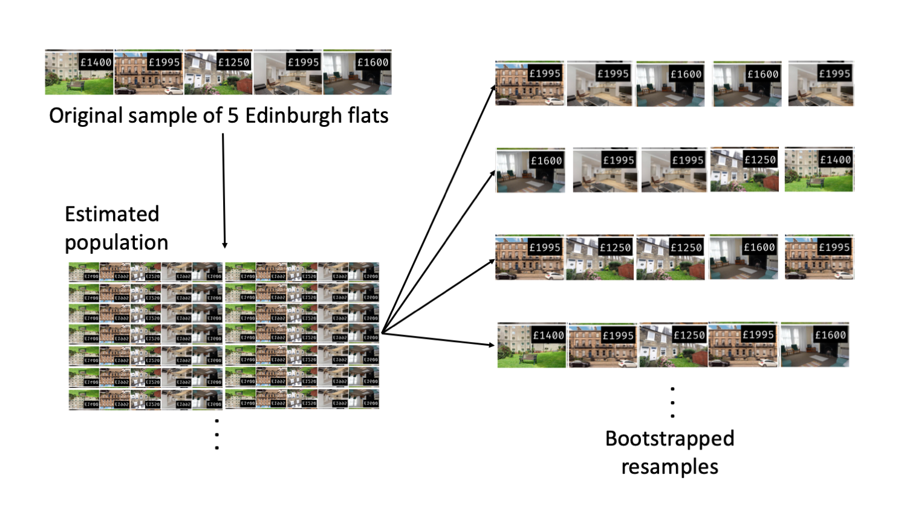

# Inference for quantitative data {#inference-num}

```{block2, chp2-intro, type="chapterintro", echo=TRUE}
Focusing now on statistical inference for quantitative data, again, we will revisit and expand upon the foundational aspects of hypothesis testing from Section \@ref(inf-foundations).

The important data structure for this chapter is a quantitative response variable (that is, the outcome is numerical).
The three data structures we detail are: 
  
* one quantitative response variable, summarized by a single mean,
* one quantitative response variable which is a difference across a pair of observations, summarized by a paired mean difference, and 
* a quantitative response variable broken down by a binary explanatory variable, summarized by a difference in means.

When appropriate, each of the data structures will be analyzed using the two methods introduced in Section \@ref(inf-foundations): simulation-based and theory-based.

As we build on the inferential ideas, we will visit new foundational concepts in statistical inference.  One key new idea rests in estimating how the sample mean (as opposed to the sample proportion) varies from sample to sample; the resulting value is referred to as the **standard error of the mean**.  We will also introduce a new important mathematical model, the $t$-distribution (as the foundation for the $t$-test).  
```


To summarize a quantitative response variable, we focus on the sample mean (instead of, for example, the sample median or the range of the observations) because of the well-studied mathematical model which describes the behavior of the sample mean.
The sample mean will be calculated in one group, two paired groups, and two independent groups. We will not cover mathematical models which describe other statistics, but the bootstrap and randomization techniques described below are immediately extendable to any function of the observed data. 
The techniques described for each setting will vary slightly, but you will be well served to find the structural similarities across the different settings.


## One mean {#one-mean}

```{block2, type="onebox", echo=TRUE}
**Notation**.

* $n$ = sample size
* $\hat{x}$ = sample mean
* $s$ = sample standard deviation
* $\mu$ = population mean
* $\sigma$ = population standard deviation
```

In this section, we explore the situation where we focus on a single mean of a quantitative variable, and we introduce a new simulation method, **bootstrapping**\index{bootstrap}. 
Bootstrapping is best suited for modeling studies where the data have been generated through random sampling from a population.

If the goal is to produce a range of possible values for a population value, then in an ideal world, we would sample data from the population again and recompute the sample mean.  
Then we could do it again. 
And again. 
And so on until we have a good sense of the variability of our original estimate. 
The ideal world where sampling data is free or extremely cheap is almost never the case, and taking repeated samples from a population is usually impossible. 
So, instead of using a "resample from the population" approach, bootstrapping uses a "resample from the sample" approach.

Sometime the mathematical theory for how an estimate varies is well-known; this is the case for the sample proportion as seen in Section \@ref(inf-math) and the sample mean seen later in this Chapter. 
However, some statistics don't have simple theory for how they vary, and bootstrapping provides a computational approach for providing interval estimates for almost any population parameter. 

```{r include=FALSE}
terms_chp_6 <- c("bootstrapping")
```


### Bootstrap confidence interval for $\mu$

As an employer who subsidizes housing for your employees, you need to know the average month rental price for a three bedroom flat in Edinburgh.
In order to walk through the example more clearly, let's say that you are only able to randomly sample five Edinburgh flats (if this were a real example, you would surely be able to take a much larger sample size, possibly even being able to measure the entire population!).

Figure \@ref(fig:5flats) presents the details of the random sample of observations where the monthly rent of five flats has been recorded.

```{r 5flats, fig.cap = "5 flats", warning = FALSE,  out.width="75%"}
include_graphics("06/figures/5flats.png")
```

```{r}
edin_3br <- data.frame(price = c(1400, 1995, 1250, 1995, 1600))
```

The sample average monthly rent of £ `r mean(edin_3br$price)` is a first guess at the price of three bedroom flats.  However, as a student of statistics, you understand that one sample mean based on a sample of five observations will not necessarily equal the true population average rent for all three bedroom flats in Edinburgh.
Indeed, you can see that the observed rent prices vary with a standard deviation of £ `r sd(edin_3br$price)`, and surely the average monthly rent would be different if a different sample of size five had been taken from the population.
Fortunately, we can use bootstrapping to approximate the variability of the sample mean from sample to sample.


#### Variability of the statistic {-}

As with the inferential ideas covered in Chapter \@ref(inference-cat), the inferential analysis methods in this chapter are grounded in quantifying how one data set differs from another when they are both taken from the same population.
It doesn't make sense to take repeated samples from the same population because if you have the means to take more samples, a larger sample size will benefit you more than the exact same sample twice. Instead, with bootstrapping, we measure how the samples behave under an estimate of the population---the sample.
By taking repeated samples from the estimated population, the variability from sample to sample can be observed.


Figure \@ref(fig:bootstrapping) shows how the unknown original population can be estimated by using many duplicates of the sample. This estimated population---consisting of infinitely many copies of the original sample---can then be used to generate bootstrapped resamples.

```{r bootstrapping, fig.cap = "Using the original sample of five Edinburgh flats to generate an estimated population, which is then used to generate bootstrapped resamples. This process of generating a bootstrapped sample is equivalent to sampling five flats from the original sample, with replacement.", warning = FALSE,  out.width="75%"}

```

It turns out that in practice, it is very difficult for computers to work with an infinite population (with the same proportional breakdown as in the sample).
However, there is a physical and computational model which produces an equivalent bootstrap distribution of the sample mean in a computationally efficient manner.
Consider the observed data to be a bag of five marbles. Each marble corresponds to one flat, and is labeled by the rent price.  By drawing the marbles out of the bag _with replacement_ (after we draw one, we put it back before drawing another), we depict the same sampling **process** as was done with the infinitely large estimated population.
Note in Figure \@ref(fig:bootstrapping) that when sampling the original observations, a particular data point may end up in the new sample one time, several times, or not at all.  


In Figure \@ref(fig:bootstrapping), the repeated bootstrap resamples are obviously different both from each other and from the original sample.
Since the bootstrap resamples are taken from the same (estimated) population, these differences are due entirely to natural variability in the sampling procedure.
By summarizing each of the bootstrap resamples (here, using the sample mean), we see, directly, the variability of the sample mean, $\bar{x}$, from sample to sample.
The distribution of $\hat{x}_{boot}$ for the Edinburgh flats is shown in Figure \@ref(fig:flatsbsmean).

```{r flatsbsmean, fig.cap = "Distribution of bootstrapped means from 1,000 simulated bootstrapped samples generated by sampling with replacement from our original sample of five Edinburgh flats. The histogram provides a sense for the variability of the average rent values from sample to sample for samples of size 5.", warning = FALSE,  fig.width=10}
set.seed(47)
bsflats <- edin_3br %>%
  rep_sample_n(size = 5, reps = 1000, replace = TRUE) 

bsflats_mean <- bsflats %>%
  group_by(replicate) %>% 
  summarize( flat_bsmean = mean(price)) %>%
  pull()

bsq1 <- quantile(bsflats_mean, probs = c(0.005, 0.025, 0.05, 0.1, 0.9, 0.95, 0.975, 0.995))

bsmeans_up <- bsflats_mean[bsflats_mean >= bsq1[7]]
bsmeans_low <- bsflats_mean[bsflats_mean <= bsq1[2]]

umeans <- sort(unique(bsflats_mean))
bin.width <- (umeans[length(umeans)] - umeans[1])/15
#breaks <- c(uprops - bin.width / 4, uprops + bin.width / 4)
breaks <- seq(umeans[1] - 1, umeans[length(umeans)] + bin.width, by = bin.width)
  

histPlot(bsflats_mean, breaks = breaks, axes = FALSE, col = rgb(1,1,1),
     xlab = "", ylab="")
#histPlot(bsmeans_up, breaks = breaks, col = COL[1], add = TRUE)
#histPlot(bsmeans_low, breaks = breaks, col = COL[1], add = TRUE)
axis(1)
#axis(2, at = seq(0, 100, 50), labels = format(seq(0, 50, 25) / nsim))
lines(c(bsq1[6], bsq1[6]), c(0, 95), lty = 3, lwd = 3)
lines(c(bsq1[3], bsq1[3]), c(0, 95), lty = 3, lwd = 3)
lines(c(bsq1[7], bsq1[7]), c(0, 65), lty = 3, lwd = 3)
lines(c(bsq1[2], bsq1[2]), c(0, 65), lty = 3, lwd = 3)
lines(c(bsq1[8], bsq1[8]), c(0, 45), lty = 3, lwd = 3)
lines(c(bsq1[1], bsq1[1]), c(0, 45), lty = 3, lwd = 3)
text(bsq1[6], 110, "95th percentile", pos = 3)
text(bsq1[3], 110, "5th percentile", pos = 3)
text(bsq1[7], 80, "97.5th percentile", pos = 3)
text(bsq1[2], 80, "2.5th percentile", pos = 3)
text(bsq1[8], 60, "99.5th percentile", pos = 3)
text(bsq1[1], 60, "0.5th percentile", pos = 3)
text(bsq1[6], 100, round(bsq1[6],1), pos = 3)
text(bsq1[3], 100, round(bsq1[3],1), pos = 3)
text(bsq1[7], 70, round(bsq1[7],1), pos = 3)
text(bsq1[2], 70, round(bsq1[2],1), pos = 3)
text(bsq1[8], 50, round(bsq1[8],1), pos = 3)
text(bsq1[1], 50, round(bsq1[1],1), pos = 3)
par(las = 0)
mtext("Bootstrapped values of the mean of the monthly flat price", 1, 2.5)
```

The bootstrapped average rent prices vary from £ 1250 to £ 1995 (with a small observed sample of size 5, a bootstrap resample can sometimes, although rarely, include only repeated measurements of the same observation).

```{block2, type="onebox", echo=TRUE}
**Bootstrapping**.

1. Take a random sample of size $n$ from the original sample, _with replacement_. This is called a **bootstrapped resample**.
2. Record the sample mean (or statistic of interest) from the boostrapped resample. This is called a **bootstrapped statistic**.
3. Repeat steps (1) and (2) 1000s of times.

Use the standard deviation of the distribution of bootstrapped statistics as your estimate for the standard deviation of the sampling distribution of sample means---the amount we would expect a sample mean to typically deviate from the population mean.

Since this bootstrapped standard deviation of statistics is an _estimate_ of the standard deviation of sample means---and not the actual value, which is unknown---we call this a **standard error** of the sample mean.
```

Due to theory that is beyond this text, we know that the bootstrap means $\bar{x}_{boot}$ vary around the original sample mean, $\bar{x}$, in a similar way to how different sample (i.e., different data sets which would produce different $\bar{x}$ values) means vary around the true parameter $\mu$. 
Therefore, an interval estimate for $\mu$ can be produced using the $\bar{x}_{boot}$ values themselves.The **bootstrap confidence interval** for $\mu$, the population mean rent price for three bedroom flats in Edinburgh, is found by locating the middle 95% (for a 95% confidence interval) of the bootstrapped sample means in Figure \@ref{fig:flatsbsmean}.

```{block2, type="onebox", echo=TRUE}
**95% Bootstrap confidence interval for a population mean $\mu$.**

The 95% bootstrap confidence interval for the parameter $\mu$ can be obtained directly using the ordered values $\bar{x}_{boot}$ values. Consider the sorted $\bar{x}_{boot}$ values, and let $\bar{x}_{boot, 0.025}$ be the 2.5% value and $\bar{x}_{boot, 0.025}$ be the 97.5% value. The 95% confidence interval is given by:
<center>
($\hat{p}_{bs, 0.025}$, $\hat{p}_{bs, 0.975}$)
</center>
```

You can find confidence intervals of difference confidence levels by changing the percent of the distribution you take, e.g., locate the middle 90% of the bootstrapped statistics for a 90% confidence interval.

```{block2, type = "guidedpractice", echo = TRUE}
To find the middle 95% of a distribution, which two percentiles would form its boundaries?^[The the middle 95% of a distribution would range from the 2.5th percentile (the value with 2.5% of the distribution below) to the 97.5th percentile (the value with 2.5% of the distribution above). ]
```

```{block2, type = "example", echo = TRUE}
Using Figure \@ref(fig:flatsbsmean), find the 90% and 95% confidence intervals for the true mean monthly rental price of a three bedroom flat in Edinburgh.

---

A 90% confidence interval is given by £ 1429 to £ 1876.  The conclusion is that we are 90% confident that the true average rental price for three bedroom flats in Edinburgh lies somewhere between £ 1429 and £ 1876.


A 95% confidence interval is given by £ 1389.75 to £ 1916.  The conclusion is that we are 90% confident that the true average rental price for three bedroom flats in Edinburgh lies somewhere between £ 1389.75 and £ 1916.
```


#### Bootstrap percentile confidence interval for $\sigma$ {-}

Suppose that the research question at hand seeks to understand how variable the rental price of the flats are in Edinburgh.
That is, your interest is no longer in the average rental price of the flats but in the *standard deviation* of the rental prices of all three bedroom flats in Edinburgh, $\sigma$.
You may have already realized that the sample standard deviation, $s$, will work as a good **point estimate** for the parameter of interest: the population standard deviation, $\sigma$.
The point estimate of the five observations is calculated to be $s =$ £  340.23.
While $s =$ £  340.23 might be a good guess for $\sigma$, we prefer to have an interval 
Although there is a mathematical model which describes how $s$ varies from sample to sample, the mathematical model will not be presented in this text.
But even without the mathematical model, bootstrapping can be used to find a confidence interval for the parameter $\sigma$.

```{r include=FALSE}
terms_chp_6 <- c(terms_chp_6, "point estimate")
```

```{block2, type = "example", echo = TRUE}
Describe the bootstrap distribution for the standard deviation shown in Figure \@ref(fig:flatsbssd).

---
  
The distribution is skewed left and centered near £ 340.23, which is the point estimate from the original data. Most observations in this distribution lie between £ 0 and £ 408.1.
```

```{block2, type = "guidedpractice", echo = TRUE}
Using Figure \@ref(fig:flatsbssd), find *and interpret* a 90% confidence interval for the population standard deviation for three bedroom flat prices in Edinburgh.^[By looking at the percentile values in Figure \@ref(fig:flatsbssd), the middle 90% of the bootstrap standard deviations are given by the 5 percentile (£ 153.9) and 95 percentile (£ 385.6).  That is, we are 90% confident that the true standard deviation of rent prices is between £ 153.9 and £ 385.6.

Note, the problem was set up as 90% to indicate that there was not a need for a high level of confidence (such a 95% or 99%).  A lower degree of confidence increases potential for error, but it also produces a more narrow interval. ]
```

```{r flatsbssd, fig.cap="The original Edinburgh data is bootstrapped 1,000 times. The histogram provides a sense for the variability of the standard deviation of the rent values from sample to sample.", warning=FALSE, fig.width=12}

bsflats_sd <- bsflats %>%
  group_by(replicate) %>% 
  summarize( flat_bssd = sd(price)) %>%
  pull()

bsq1 <- quantile(bsflats_sd, probs = c(0.005, 0.025, 0.05, 0.1, 0.9, 0.95, 0.975, 0.995))

bsmeans_up <- bsflats_sd[bsflats_sd >= bsq1[7]]
bsmeans_low <- bsflats_sd[bsflats_sd <= bsq1[2]]

umeans <- sort(unique(bsflats_sd))
bin.width <- (umeans[length(umeans)] - umeans[1])/15
#breaks <- c(uprops - bin.width / 4, uprops + bin.width / 4)
breaks <- seq(umeans[1] - 1, umeans[length(umeans)] + bin.width, by = bin.width)
  

histPlot(bsflats_sd, breaks = breaks, axes = FALSE, col = rgb(1,1,1),
     xlab = "", ylab="")
#histPlot(bsmeans_up, breaks = breaks, col = COL[1], add = TRUE)
#histPlot(bsmeans_low, breaks = breaks, col = COL[1], add = TRUE)
axis(1)
#axis(2, at = seq(0, 100, 50), labels = format(seq(0, 50, 25) / nsim))
lines(c(bsq1[6], bsq1[6]), c(0, 125), lty = 3, lwd = 3)
lines(c(bsq1[3], bsq1[3]), c(0, 125), lty = 3, lwd = 3)
lines(c(bsq1[7], bsq1[7]), c(0, 55), lty = 3, lwd = 3)
lines(c(bsq1[2], bsq1[2]), c(0, 65), lty = 3, lwd = 3)
lines(c(bsq1[8], bsq1[8]), c(0, 55), lty = 3, lwd = 3)
lines(c(bsq1[1], bsq1[1]), c(0, 55), lty = 3, lwd = 3)
text(bsq1[6], 140, "95 percentile", pos = 3)
text(bsq1[3], 140, "5 percentile", pos = 3)
text(bsq1[7], 90, "97.5 percentile", pos = 3)
text(bsq1[2], 90, "2.5 percentile", pos = 3)
text(bsq1[8], 70, "99.5 percentile", pos = 3)
text(bsq1[1], 70, "0.5 percentile", pos = 3)
text(bsq1[6], 130, round(bsq1[6],1), pos = 3)
text(bsq1[3], 130, round(bsq1[3],1), pos = 3)
text(bsq1[7], 80, round(bsq1[7],1), pos = 3)
text(bsq1[2], 80, round(bsq1[2],1), pos = 3)
text(bsq1[8], 60, round(bsq1[8],1), pos = 3)
text(bsq1[1], 60, round(bsq1[1],1), pos = 3)
par(las = 0)
mtext("Bootstrapped values of the standard deviation of the monthly flat price", 1, 2.5)

```


#### Bootstrapping is not a solution to small sample sizes! {-}

The example presented above is done for a sample with only five observations. 
As with analysis techniques that build on mathematical models, bootstrapping works best when a large random sample has been taken from the population.
Bootstrapping is a method for capturing the variability of a statistic when the mathematical model is unknown (it is not a method for navigating small samples).
As you might guess, the larger the random sample, the more accurately that sample will represent the population of interest.


### Theory-based inferential methods for $\bar{x}$ {#one-mean-math}

As with the sample proportion, the variability of the sample mean is well described by the mathematical theory given by the Central Limit Theorem.  Similar to how we can model the behavior of the sample proportion $\hat{p}$ using a normal distribution, the sample mean $\bar{x}$ can also be modeled using
a normal distribution when certain conditions are met.
However, because of missing information about the inherent variability in the population, a $t$-distribution is used in place of the standard normal when performing hypothesis test or confidence interval analyses.

The sample mean tends to follow
a normal distribution centered at the population mean, $\mu$,
when certain conditions are met.
Additionally, we can compute a standard error for the sample
mean using the population standard deviation $\sigma$
and the sample size $n$.

```{block2, type = "onebox", echo = TRUE}
**Central Limit Theorem for the sample mean**  
  When we collect a sufficiently large sample of
  $n$ independent observations from a population with
  mean $\mu$ and standard deviation $\sigma$,
  the sampling distribution of $\bar{x}$ will be nearly
  normal with
  \begin{align*}
  &\text{Mean}=\mu
  &&\text{Standard Error }(SE) = \frac{\sigma}{\sqrt{n}}
  \end{align*}
```


Before diving into confidence intervals and hypothesis
tests using $\bar{x}$, we first need to cover two topics:

* When we modeled $\hat{p}$ using the normal distribution,
    certain conditions had to be satisfied.
    The conditions for working with $\bar{x}$
    are a little more complex, and below, we will discuss
    how to check conditions for inference using a mathematical model.
* The standard error is dependent on the population
    standard deviation, $\sigma$.
    However, we rarely know $\sigma$, and instead
    we must estimate it.
    Because this estimation is itself imperfect,
    we use a new distribution called the
    **$t$-distribution**\index{t-distribution@$t$-distribution}
    to fix this problem, which we discuss in


```{r include=FALSE}
terms_chp_6 <- c(terms_chp_6, "t-distribution")
```

#### Evaluating the two conditions required for modeling $\bar{x}$ {-}


Two conditions are required to apply the
Central Limit Theorem\index{Central Limit Theorem}
for a sample mean $\bar{x}$:  

* **Independence.** The sample observations must be independent,
    The most common way to satisfy this condition is
    when the sample is a simple random sample from the
    population.
    If the data come from a random process,
    analogous to rolling a die,
    this would also satisfy the independence condition.  
    
* **Normality.** When a sample is small,
    we also require that the sample observations
    come from a normally distributed population.
    We can relax this condition more and more
    for larger and larger sample sizes.
    This condition is obviously vague,
    making it difficult to evaluate,
    so next we introduce a couple rules of thumb
    to make checking this condition easier.


```{r include=FALSE}
terms_chp_6 <- c(terms_chp_6, "Central Limit Theorem")
```

```{block2, type = "onebox", echo = TRUE}
**General rule: how to perform the normality check**
  
  There is no perfect way to check the normality condition,
  so instead we use two general rules: 

* $\mathbf{n < 30}$: If the sample size $n$ is less than 30
      and there are no clear outliers in the data,
      then we typically assume the data come from
      a nearly normal distribution to satisfy the
      condition.  
* $\mathbf{n \geq 30}$: If the sample size $n$ is at least 30
      and there are no *particularly extreme* outliers,
      then we typically assume the sampling distribution
      of $\bar{x}$ is nearly normal, even if the underlying
      distribution of individual observations is not.
```

In this first course in statistics, you aren't expected
to develop perfect judgement on the normality condition.
However, you are expected to be able to handle
clear cut cases based on the rules of thumb.^[More
  nuanced guidelines would consider further relaxing
  the *particularly extreme outlier* check when the
  sample size is very large.
  However, we'll leave further discussion here to a future course.]

```{block2, type = "example", echo = TRUE}
Consider the following two plots
    that come from simple random samples from
    different populations.
    Their sample sizes are $n_1 = 15$ and $n_2 = 50$.

Are the independence and normality conditions met
    in each case?

---
      
Each samples is from a simple random sample of its
  respective population, so the independence condition
  is satisfied.
  Let's next check the normality condition for
  each using the rule of thumb.
  
  The first sample has fewer than 30 observations,
  so we are watching for any clear outliers.
  None are present; while there is a small gap in the
  histogram on the right, this gap is small and
  20% of the observations in this small sample
  are represented in that far right bar of the histogram,
  so we can hardly call these clear outliers.
  With no clear outliers, the normality condition
  is reasonably met.

  The second sample has a sample size greater than 30 and
  includes an outlier that appears to be roughly 5 times
  further from the center of the distribution than the
  next furthest observation.
  This is an example of a particularly extreme outlier,
  so the normality condition would not be satisfied.
```

```{r outliersandsscondition, fig.cap="", warning=FALSE, fig.width=10}

d1 <- rnorm(15, 3, 2)
d2 <- c(exp(rnorm(49, 0, 0.7)), 22)

histPlot(d1, axes = FALSE, # breaks = 20,
         xlab = "Sample 1 Observations (n = 15)",
         ylab = "",
         col = COL[1])
axis(1, at = seq(-10, 10, 2))
axis(2)
par(las = 0)
mtext("Frequency", 2, 1.8)

par(las = 1, mar = c(3, 4, 0.5, 0.5))
histPlot(d2, axes = FALSE, breaks = 20,
         xlab = "Sample 2 Observations (n = 50)",
         ylab = "",
         col = COL[1])
axis(1, at = seq(-10, 30, 10))
axis(2)
par(las = 0)
mtext("Frequency", 2, 2)
```


In practice, it's typical to also do a mental check to evaluate
whether we have reason to believe the underlying population
would have moderate skew (if $n < 30$)
or have particularly extreme outliers $(n \geq 30)$
beyond what we observe in the data.
For example, consider the number of followers
for each individual account on Twitter,
and then imagine this distribution.
The large majority of accounts have built up
a couple thousand followers or fewer,
while a relatively tiny fraction have amassed
tens of millions of followers,
meaning the distribution is extremely skewed.
When we know the data come from such an extremely
skewed distribution,
it takes some effort to understand what sample
size is large enough for the normality condition
to be satisfied.


\index{Central Limit Theorem!normal data|)}


#### Introducing the $t$-distribution {-}

\index{t-distribution@$t$-distribution|(}
\index{distribution!t@$t$|(}

In practice, we cannot directly calculate the standard error
for $\bar{x}$ since we do not know the population standard
deviation, $\sigma$.
We encountered a similar issue when computing the standard
error for a sample proportion, which relied on the population
proportion, $p$.
Our solution in the proportion context was to use sample
value in place
of the population value when computing the standard error.
We'll employ a similar strategy for computing the standard
error of $\bar{x}$, using the sample
standard deviation $s$ in place of $\sigma$:
\begin{align*}
SE = \frac{\sigma}{\sqrt{n}} \approx \frac{s}{\sqrt{n}}
\end{align*}
This strategy tends to work well when we have
a lot of data and can estimate $\sigma$ using $s$ accurately.
However, the estimate is less precise with smaller samples,
and this leads to problems when using the normal
distribution to model $\bar{x}$.


We'll find it useful to use a new distribution for
inference calculations called the **$t$-distribution**.
A $t$-distribution, shown as a solid line in
Figure \@ref(fig:tDistCompareToNormalDist), has a bell shape.
However, its tails are thicker than the normal distribution's,
meaning observations are more likely to fall beyond two
standard deviations from the mean than under the normal
distribution. 

The extra thick tails of the $t$-distribution are exactly
the correction needed to resolve the problem of using $s$
in place of $\sigma$ in the $SE$ calculation.


```{r tDistCompareToNormalDist, fig.cap="Comparison of a $t$-distribution and a normal distribution.", warning=FALSE, fig.width=10}

plot(c(-5, 5),
     c(0, dnorm(0)),
     type = 'n',
     axes = FALSE)
axis(1, seq(-6, 6, 2))
abline(h = 0)

xleg <- 2
yleg <- 0.35
yleg.line.offset <- -0.07
line.leg.width <- 0.55
lines(
    c(xleg, xleg + line.leg.width),
    rep(yleg, 2),
    col = COL[4], lty = 3, lwd = 2.5)
lines(
    c(xleg, xleg + line.leg.width),
    rep(yleg + yleg.line.offset, 2),
    col = COL[1], lty = 1, lwd = 1.8)
text(xleg + line.leg.width, yleg,
    "Normal",
    col = COL[4], pos = 4)
text(xleg + line.leg.width, yleg + yleg.line.offset,
    "t-distribution",
    col = COL[1], pos = 4)

X <- seq(-6, 6, 0.01)
Y <- dnorm(X)
lines(X, Y, lty = 3, lwd = 2.5, col = COL[4])

Y <- dt(X, 2)
lines(X, Y, lwd = 1.8, col = COL[1])

```


The $t$-distribution is always centered at zero and
has a single parameter: degrees of freedom.
The **degrees of freedom** \termsub{degrees of freedom ($\pmb{df}$)}
    {degrees of freedom ($df$)!$t$-distribution}
describes the precise form of the bell-shaped $t$-distribution.
Several $t$-distributions are shown in
Figure \@ref(fig:tDistConvergeToNormalDist)
in comparison to the normal distribution.

In general, we'll use a $t$-distribution
with $df = n - 1$ to model the sample mean
when the sample size is $n$.
That is, when we have more observations,
the degrees of freedom will be larger and
the $t$-distribution will look more like the
standard normal distribution;
when the degrees of freedom is about 30 or more,
the $t$-distribution is nearly indistinguishable
from the normal distribution.

```{r include=FALSE}
terms_chp_6 <- c(terms_chp_6, "degrees of freedom")
```


```{r tDistConvergeToNormalDist, fig.cap="The larger the degrees of freedom, the more closely the $t$-distribution resembles the standard normal distribution.", warning=FALSE, fig.width=10}

plot(c(-5, 5),
     c(0, dnorm(0)),
     type = 'n',
     axes = FALSE)
at <- seq(-10, 10, 2)
axis(1, at)
axis(1, at - 1, rep("", length(at)), tcl = -0.1)
abline(h = 0)

COL. <- fadeColor(COL[1], c("FF", "89", "68", "4C", "33"))
COLt <- fadeColor(COL[1], c("FF", "AA", "85", "60", "45"))
DF   <- c('normal', 8, 4, 2, 1)

X <- seq(-10, 10, 0.02)
Y <- dnorm(X)
lines(X, Y, col = COL.[1])

for (i in 2:5) {
  Y <- dt(X, as.numeric(DF[i]))
  lines(X, Y, col = COL.[i], lwd = 1.5)
}

legend(2.5, 0.4,
       legend = c(DF[1],
       paste('t, df = ', DF[2:5], sep = '')),
       col = COL.,
       text.col = COLt,
       lty = rep(1, 5),
       lwd = 1.5)
```


```{block2, type = "onebox", echo = TRUE}
**Degrees of freedom: df**
  
  The degrees of freedom describes the shape of the
  $t$-distribution.
  The larger the degrees of freedom, the more closely
  the distribution approximates the normal model. 
  
  When modeling $\bar{x}$ using the $t$-distribution,
  use $df = n - 1$.
```


The $t$-distribution allows us greater flexibility than
the normal distribution when analyzing numerical data.
In practice, it's common to use statistical software,
such as R, Python, or SAS for these analyses.
In R, the function used for calculating probabilities under a $t$-distribution is `pt()` (which should seem similar to previous R functions, `pnorm()` and `pchisq()`).
Don't forget that with the $t$-distribution, the degrees of freedom must always be specified!

<!--
Alternatively, a graphing calculator or a
\termsub{$\pmb{t}$-table}{t-table@$t$-table} may be used;
the $t$-table is similar to the normal distribution table,
and it may be found in Appendix \ref{tDistributionTable},
which includes usage instructions and examples
for those who wish to use this option.
-->
No matter the approach you choose, apply your method
using the examples below to confirm your working
understanding of the $t$-distribution.

```{block2, type = "example", echo = TRUE}
What proportion of the $t$-distribution
    with 18 degrees of freedom falls below -2.10?
      
---
      
Just like a normal probability problem, we first draw
  the picture in Figure \@ref(fig:tDistDF18LeftTail2Point10)
  and shade the area below -2.10.


  Using statistical software, we can obtain a precise
  value: 0.0250.
```


```{r echo = TRUE}
# using pt() to find probability under the $t$-distribution
pt(-2.10, df = 18)
```

```{r tDistDF18LeftTail2Point10, fig.cap="The $t$-distribution with 18 degrees of freedom. The area below -2.10 has been shaded.", warning=FALSE, fig.width=10}

normTail(L = -2.10,
         df = 10,
         xlim = c(-4, 4),
         col = COL[1],
         axes = FALSE)
axis(1)
```


```{block2, type = "example", echo = TRUE}
A $t$-distribution with 20 degrees of freedom
    is shown in the top panel of
    Figure \@ref(fig:tDistDF20RightTail1Point65).
    Estimate the proportion of the distribution falling
    above 1.65.
    
---

With a normal distribution, this would correspond to
  about 0.05, so we should expect the $t$-distribution
  to give us a value in this neighborhood.
  Using statistical software: 0.0573.
```


```{r tDistDF20RightTail1Point65, fig.cap="Top: The $t$-distribution with 20 degrees of freedom, with the area above 1.65 shaded. Bottom: The $t$-distribution with 2 degrees of freedom, with the area further than 3 units from 0 shaded.", warning=FALSE, fig.width=10}

normTail(U = 1.65,
         df = 12,
         xlim = c(-4, 4),
         col = COL[1],
         axes = FALSE)
axis(1)
normTail(L = -3,
         U = 3,
         df = 2.3,
         xlim = c(-4.5, 4.5),
         col = COL[1],
         axes = FALSE)
axis(1)
```

```{block2, type = "example", echo = TRUE}
A $t$-distribution with 2 degrees of freedom
    is shown in the bottom panel of
    Figure \@ref(fig:tDistDF20RightTail1Point65).
    Estimate the proportion of the distribution falling more
    than 3 units from the mean (above or below).
    
---

With so few degrees of freedom, the $t$-distribution will
  give a more notably different value than the normal
  distribution.
  Under a normal distribution, the area would be about
  0.003 using the 68-95-99.7 rule.
  For a $t$-distribution with $df = 2$, the area in both
  tails beyond 3 units totals 0.0955.
  This area is dramatically different than what
  we obtain from the normal distribution.
```

```{block2, type = "guidedpractice", echo = TRUE}
What proportion of the $t$-distribution with 19 degrees
of freedom falls above -1.79 units?
Use your preferred method for finding tail areas.^[We want to find the shaded area *above* -1.79 (we leave the picture to you).
  The lower tail area has an area of 0.0447,
  so the upper area would have an area of $1 - 0.0447 = 0.9553$.]
```

\index{distribution!t@$t$|)}
\index{t-distribution@$t$-distribution|)}


#### One sample $t$-confidence intervals {-}

\index{data!dolphins and mercury|(}

Let's get our first taste of applying the $t$-distribution
in the context of an example about the mercury content
of dolphin muscle.
Elevated mercury concentrations are an important problem
for both dolphins
and other animals, like humans, who occasionally eat them.


```{r rissosDolphin, fig.cap = "A Risso's dolphin. Photo by Mike Baird, www.bairdphotos.com", warning = FALSE,  out.width="75%"}
include_graphics("06/figures/rissosDolphin.jpg")
```

#### Observed data {-}

We will identify a confidence interval for the average mercury content in dolphin muscle using a sample of 19 Risso's dolphins from the Taiji area in Japan. The data are summarized in Table \@ref(tab:summaryStatsOfHgInMuscleOfRissosDolphins). The minimum and maximum observed values can be used to evaluate whether or not there are clear outliers.


```{r summaryStatsOfHgInMuscleOfRissosDolphins}
temptbl <- tribble(
 ~col0,    ~col1, ~col2, ~col3, ~col4,
 19, 4.4, 2.3, 1.7, 9.2
)

temptbl %>%
 kable(caption = "Summary of mercury content in the muscle of 19 Risso's dolphins from the Taiji area. Measurements are in micrograms of mercury per wet gram
    of muscle ($\\mu$g/wet g).",
    col.names = c( "$n$", "$\\bar{x}$", "s", "minimum", "maximum")) %>%
 kable_styling() 
```

```{block2, type = "example", echo = TRUE}
Are the independence and
    normality conditions satisfied for this data set?
      
---
      
The observations are a simple random sample,
  therefore independence is reasonable.
  The summary statistics in
  Table \@ref(tab:summaryStatsOfHgInMuscleOfRissosDolphins)
  do not suggest any clear outliers, with
  all observations are within 2.5 standard deviations
  of the mean.
  Based on this evidence, the normality condition
  seems reasonable.
```

In the normal model, we used $z^{\star}$ and the standard error to determine the width of a confidence interval. We revise the confidence interval formula slightly when using the $t$-distribution:
\begin{align*}
&\text{point estimate} \ \pm\  t^{\star}_{df} \times SE
&&\to
&&\bar{x} \ \pm\  t^{\star}_{df} \times \frac{s}{\sqrt{n}}
\end{align*}

```{block2, type = "example", echo = TRUE}
Using the summary statistics in
    Table \@ref(tab:summaryStatsOfHgInMuscleOfRissosDolphins),
    compute the standard error for the average
    mercury content in the $n = 19$ dolphins.
    
---
      
We plug in $s$ and $n$ into the formula:
  $SE
    = s / \sqrt{n}
    = 2.3 / \sqrt{19}
    = 0.528$.
```

The value $t^{\star}_{df}$ is a cutoff we obtain based on the
confidence level and the $t$-distribution with $df$ degrees
of freedom.
That cutoff is found in the same way as with a normal
distribution: we find $t^{\star}_{df}$ such that
the fraction of the $t$-distribution with $df$ degrees
of freedom within a distance $t^{\star}_{df}$
of 0 matches the confidence level of interest.

```{block2, type = "example", echo = TRUE}

When $n = 19$, what is the appropriate
    degrees of freedom?
    Find $t^{\star}_{df}$ for this degrees of freedom
    and the confidence level of 95%
    
---
  
The degrees of freedom is easy to calculate:
  $df = n - 1 = 18$.
  
  Using statistical software, we find the cutoff where
  the upper tail is equal to 2.5%:
  $t^{\star}_{18} = 2.10$.
  The area below -2.10 will also be equal to 2.5%.
  That is, 95% of the $t$-distribution with $df = 18$
  lies within 2.10 units of 0.
```

```{r echo = TRUE}
# use qt() to find the t-cutoff (with 95% in the middle)
qt(0.025, df = 18)
qt(0.975, df = 18)
```

```{block2, type = "onebox", echo = TRUE}
**Degrees of freedom for a single sample.**
  
If the sample has $n$ observations and we are examining a single mean, then we use the $t$-distribution with $df=n-1$ degrees of freedom.
```


```{block2, type = "example", echo = TRUE}
Compute and interpret the 95% confidence interval
    for the average mercury content in Risso's dolphins.
    
---

We can construct the confidence interval as
  \begin{align*}
  \bar{x} \ \pm\  t^{\star}_{18} \times SE
    \quad \to \quad 4.4 \ \pm\  2.10 \times 0.528
    \quad \to \quad (3.29, 5.51)
  \end{align*}
  We are 95% confident the average mercury content of muscles
  in Risso's dolphins is between 3.29 and 5.51 $\mu$g/wet gram,
  which is considered extremely high.
```

\index{data!dolphins and mercury|)}

```{block2, type = "onebox", echo = TRUE}
**Finding a $t$-confidence interval for the mean, $\mu$.**
  
  Based on a sample of $n$ independent and nearly normal
  observations, a confidence interval for the population
  mean is
  \begin{align*}
  &\text{point estimate} \ \pm\  t^{\star}_{df} \times SE
  &&\to
  &&\bar{x} \ \pm\  t^{\star}_{df} \times \frac{s}{\sqrt{n}}
  \end{align*}
  where $\bar{x}$ is the sample mean, $t^{\star}_{df}$
  corresponds to the confidence level and degrees of freedom
  $df$, and $SE$ is the standard error as estimated by
  the sample.
```

```{block2, type = "guidedpractice", echo = TRUE}
The FDA's webpage provides some data on mercury content of fish.
Based on a sample of 15 croaker white fish (Pacific),
a sample mean and standard deviation were computed as 0.287
and 0.069 ppm (parts per million), respectively.
The 15 observations ranged from 0.18 to 0.41 ppm.
We will assume these observations are independent.
Based on the summary statistics of the data,
do you have any objections to the normality condition
of the individual observations?^[The sample size is under 30,
  so we check for obvious outliers:
  since all observations are within 2 standard deviations
  of the mean, there are no such clear outliers.]
```


\index{data!white fish and mercury|(}


```{block2, type = "example", echo = TRUE}
Estimate the standard error of
    $\bar{x} = 0.287$ ppm using the data summaries in the previous Guided Practice.    If we are to use the $t$-distribution to create a
    90% confidence interval for the actual mean of the
    mercury content, identify the degrees of freedom
    and $t^{\star}_{df}$.
  
---
      
The standard error: $SE = \frac{0.069}{\sqrt{15}} = 0.0178$.

  Degrees of freedom: $df = n - 1 = 14$.

  Since the goal is a 90% confidence interval,
  we choose $t_{14}^{\star}$ so that the two-tail area
  is 0.1:
  $t^{\star}_{14} = 1.76$.
```

```{r echo = TRUE}
# use qt() to find the t-cutoff (with 90% in the middle)
qt(0.05, df = 14)
qt(0.95, df = 14)
```

<!--
\begin{onebox}{Confidence interval for a single mean}
  Once you've determined a one-mean confidence interval
  would be helpful for an application,
  there are four steps to constructing the interval:
  \begin{description}
  \item[Prepare.]
      Identify $\bar{x}$, $s$, $n$, and determine what
      confidence level you wish to use.
  \item[Check.]
      Verify the conditions to ensure $\bar{x}$
      is nearly normal.
  \item[Calculate.]
      If the conditions hold, compute $SE$,
      find $t_{df}^{\star}$, and construct the interval.
  \item[Conclude.]
      Interpret the confidence interval in the context
      of the problem.
  \end{description}
\end{onebox}
-->


```{block2, type = "guidedpractice", echo = TRUE}
Using the information and results of the previous Guided Practice and Example, compute a 90% confidence interval for the average mercury content of croaker white fish (Pacific).^[$\bar{x} \ \pm\ t^{\star}_{14} \times SE
      \ \to\  0.287 \ \pm\  1.76 \times 0.0178
      \ \to\ (0.256, 0.318)$.
  We are 90% confident that the average mercury content
  of croaker white fish (Pacific) is between 0.256 and 0.318 ppm.]
```


```{block2, type = "guidedpractice", echo = TRUE}
The 90% confidence interval from the previous
Guided Practice is 0.256 ppm to 0.318 ppm.
Can we say that 90% of croaker white fish (Pacific)
have mercury levels between 0.256 and 0.318 ppm?^[No, a confidence interval only provides a range
  of plausible values for a population parameter,
  in this case the population mean.
  It does not describe what we might observe
  for individual observations.]
```

\index{data!white fish and mercury|)}

#### One sample $t$-tests {-}

Now that we've used the $t$-distribution for making a confidence
intervals for a mean, let's speed on through to
hypothesis tests for the mean.

<!--
\newcommand{\cherryblossomn}{100}
\newcommand{\cherryblossommean}{97.32}
\newcommand{\cherryblossomnull}{93.29}
\newcommand{\cherryblossomsd}{16.98}
\newcommand{\cherryblossomse}{1.70}
\newcommand{\cherryblossomz}{2.37}
-->

Is the typical US runner getting faster or slower over time? We consider this question in the context of the Cherry Blossom Race, which is a 10-mile race in Washington, DC each spring.

The average time for all runners who finished the Cherry Blossom Race in 2006 was 93.29 minutes (93 minutes and about 17 seconds). We want to determine using data from 100 participants in the 2017 Cherry Blossom Race whether runners in this race are getting faster or slower, versus the other possibility that there has been no change.

```{block2, type = "guidedpractice", echo = TRUE}
What are appropriate hypotheses for this context?^[$H_0$: The average 10-mile run time was the same for 2006 and 2017. $\mu = 93.29$ minutes. $H_A$: The average 10-mile run time for 2017 was *different* than that of 2006. $\mu \neq 93.29$ minutes.]
```

```{block2, type = "guidedpractice", echo = TRUE}
The data come from a simple random sample of all participants,
so the observations are independent.
However, should we be worried about the normality condition?
See Figure \@ref(fig:run10SampTimeHistogram) for a histogram
of the differences and evaluate if we can move
forward.^[With a sample of 100,
  we should only be concerned if there is are particularly
  extreme outliers.
  The histogram of the data doesn't show any outliers of concern
  (and arguably, no outliers at all).]
```


```{r run10SampTimeHistogram, fig.cap="A histogram of `time` for the sample Cherry Blossom Race data.", warning=FALSE, fig.width=10}

set.seed(1)
run17 <- subset(run17, event == "10 Mile")
d <- run17[sample(nrow(run17), 100), ] %>%
  mutate(time = net_sec / 60)

histPlot(d$time,
         main = "",
         xlab = "Time (Minutes)",
         ylab = "Frequency",
         col = COL[1])
```

When completing a hypothesis test for the one-sample mean,
the process is nearly identical to completing a hypothesis
test for a single proportion.
First, we find the Z score using the observed value,
null value, and standard error;
however, we call it a **T score** since we use
a $t$-distribution for calculating the tail area.
Then we finding the p-value using the same ideas we used
previously: find the one-tail area under the sampling
distribution, and double it.

```{r include=FALSE}
terms_chp_6 <- c(terms_chp_6, "T score")
```

```{block2, type = "example", echo = TRUE}
With both the independence
    and normality conditions satisfied,
    we can proceed with a hypothesis test using
    the $t$-distribution.
    The sample mean and sample standard deviation
    of the sample
    of 100 runners from the
    2017 Cherry Blossom Race
    are 97.32 and 16.98 minutes,
    respectively.
    Recall that the sample size is 100
    and the average run time in 2006 was 93.29 minutes.
    Find the test statistic and p-value.
    What is your conclusion?

---
  
To find the test statistic (T score),
  we first must determine the standard error:
  \begin{align*}
  SE
    = 16.98 / \sqrt{100}
    = 1.70
  \end{align*}
  Now we can compute the **T score**
  using the sample mean (97.32),
  null value (98.29), and $SE$:
  \begin{align*}
  T
    = \frac{97.32 - 93.29}{1.70}
    = 2.37
  \end{align*}
  For $df = 100 - 1 = 99$,
  we can determine using statistical software
  (or a $t$-table, see below) that the one-tail area is 0.01,
  which we double to get the p-value: 0.02.

  Because the p-value is smaller than 0.05,
  we reject the null hypothesis.
  That is, the data provide strong evidence that the average
  run time for the Cherry Blossom Run in 2017 is different
  than the 2006 average.
  Since the observed value is above the null value
  and we have rejected the null hypothesis, we would conclude
  that runners in the race were slower on average in 2017
  than in 2006.
```

```{r echo = TRUE}
# using pt() to find the p-value
1 - pt(2.37, df = 99)
```


```{block2, type = "onebox", echo = TRUE}
**When using a $t$-distribution, we use a T score (same as Z score).**

To help us remember to use the $t$-distribution,
we use a $T$ to represent the test statistic,
and we often call this a **T score**.
The Z score and T score are computed in the exact same way
and are conceptually identical:
each represents how many standard errors the observed value
is from the null value.
```

<!--
\begin{onebox}{Hypothesis testing for a single mean}
  Once you've determined a one-mean hypothesis test is the
  correct procedure, there are four steps to completing the
  test:
  \begin{description}
  \item[Prepare.]
      Identify the parameter of interest,
      list out hypotheses,
      identify the significance level,
      and identify $\bar{x}$, $s$, and $n$.
  \item[Check.]
      Verify conditions to ensure $\bar{x}$ is nearly normal.
  \item[Calculate.]
      If the conditions hold, compute $SE$,
      compute the T score, and identify the p-value.
  \item[Conclude.]
      Evaluate the hypothesis test by comparing the p-value
      to $\alpha$, and provide a conclusion in the context
      of the problem.
  \end{description}
\end{onebox}
-->

<!--
\CalculatorVideos{confidence intervals and hypothesis tests for a single mean}

-->


## Paired mean difference {#paired-data}

```{block2, type="onebox", echo=TRUE}
**Notation**.

* $n_{diff}$ = sample size of differences in paired samples
* $\hat{x}_{diff}$ = sample mean of differences in paired samples
* $s_{diff}$ = sample standard deviation of differences in paired samples
* $\mu_{diff}$ = population mean of differences in paired samples
* $\sigma_{diff}$ = population standard deviation of differences in paired samples
```


Paired data represent a particular type of experimental structure where the analysis is somewhat akin to a one-sample analysis (see Section \@ref(one-mean)) but has other features that resemble a two-sample analysis (see Section \@ref(differenceOfTwoMeans)).  As with a two-sample analysis, quantitative measurements are made on each of two different levels of the explanatory variable.  However, because the observational unit is **paired** across the two groups, the two measurements are subtracted such that only the difference is retained.  Table \@ref(tab:pairedexamples) presents some examples of studies where paired designs were implemented.

```{r pairedexamples}
temptbl <- tribble(
 ~variable,    ~col1, ~col2, ~col3, 
 "Car", "Brand A vs Brand B", "amount of tire tread after 1,000 miles", "difference in tread",
 "Textbook", "UCLA vs Amazon", "price of new text", "difference in price",
 "Individual person", "Pre-course vs Post-course", "exam score", "difference in score"
)

temptbl %>%
 kable(caption = "Examples of studies where a paired design is used to measure the difference in the measurement over two conditions.",
    col.names = c("Observational unit", "Comparison groups", "Measurement", "Value of interest")) %>%
 kable_styling() 
```


```{block2, type = "onebox", echo = TRUE}
**Paired data.**

  Two sets of observations are *paired* if each
  observation in one set has a special correspondence
  or connection with exactly one observation in the other
  data set.
```

```{r include=FALSE}
terms_chp_6 <- c(terms_chp_6, "paired data")
```

### Randomization test for $H_0: \mu_d = 0$

Consider an experiment done to measure whether tire brand A or tire brand B has longer wear.  That is, after 1,000 miles on a car, which brand of tires has more tread, on average?  

##### Observed data {-}

The observed data represent 25 tread measurements taken on 25 tires of Brand A and 25 tires of Brand B.
The study used a total of 25 cars, so on each car, one tire was of Brand A and one was of Brand B.
Figure \@ref(fig:tiredata) presents the observed data.
The Brand A manufacturer looks at the box plot below and says:
> clearly the tread on Brand A tires is higher, on average, than the tread on Brand B tires after 1,000 miles of driving.

The Brand B manufacturer is skeptical and retorts:  
> but with only 25 cars, it seems that the variability in road conditions (sometimes on tire hits a pothole, etc.) could be what leads to the small difference in average tread amount.

We'd like to be able to systematically distinguish between what manufacturer A sees in the plot and what manufacturer B sees in the plot.  Fortunately for us, we have an excellent way to simulate the natural variability (from road conditions, etc.) that can lead to tires being worn at different rates.


```{r tiredata, fig.cap = "Boxplots of the tire tread data and the brand of tire from which the original measurements came.", warning = FALSE, fig.width=10}
# inches  about 1/32" per 3500 mi
set.seed(47)
brandA <- rnorm(25, .310, .003)
brandB <- rnorm(25, .308, .003)

tires <- data.frame(tread = c(brandA, brandB), 
                    car = rep(1:25,2), 
                    brand = c(rep("Brand A", 25), rep("Brand B", 25)))

tires %>%
  mutate(`Tire Brand` = brand) %>%
ggplot(aes( x = `Tire Brand`, y = tread, color = `Tire Brand`)) +
  geom_boxplot() +
  geom_point() +
  geom_line(aes(group = car), color = "grey") +
  ylab("") + 
  xlab("Brand of tires.") +
  ggtitle("Wear of tire tread (in inches) after 1,000 miles,\n broken down by different tire brands.")

```

##### Variability of the statistic {-}


A randomization test will identify whether the differences seen in the box plot below could have happened just by chance variability.
As before, we will simulate the variability in the study under the assumption that the null hypothesis is true.
In this study, the null hypothesis is that average tire tread wear is the same across Brand A and Brand B tires.

* $H_0: \mu_A = \mu_B$, the average tread wear is the same for the two tire brands.  
* $H_A: \mu_A \ne \mu_B$, the average tread wear is different across the two tire brands.

Figure \@ref(fig:pairrand) describes how the tread values can be simulated under the null hypothesis.
Remember, if the null hypothesis is true, it will not matter which brand is put on which tire because the overall tread wear will be the same across pairs.

```{r pairrand, fig.cap = "process of randomizing across pairs.", warning = FALSE,  out.width="75%"}
include_graphics("06/figures/pairrand.png")
```

After randomizing the tire brand to the tread measurements under the null hypothesis, a new boxplot summarizes the randomized data.  
Figure \@ref(fig:tiredatarand1) presents one randomization of the data.
Notice how the same two observations are linked by a grey line, but some of the tread values have been randomly assigned to the opposite tire brand than they were originally (while some are still connected to their original tire brands).

```{r tiredatarand1, fig.cap = "One randomization where the brand is randomly swapped (or not) across the two tread wear measurements from the same car.", warning = FALSE, fig.width=10}
# inches  about 1/32" per 3500 mi
set.seed(47)
tires1 <- tires %>%
  group_by(car) %>%
  mutate(`Randomized Tire Brand` = sample(brand))

ggplot(tires1, aes( x = `Randomized Tire Brand`, y = tread, color = `Randomized Tire Brand`)) +
  geom_boxplot() +
  geom_point() +
  geom_line(aes(group = car), color = "grey") +
  ylab("") + 
  xlab("Brand of tires, randomly assigned (1).") +
  ggtitle("Wear of tire tread (in inches) after 1,000 miles,\n broken down by different tire brands, randomly assigned (1).")

```

Figure \@ref(fig:tiredatarand2) presents yet another randomization of the data.
Again, the same observations are linked by a grey line, and some of the tread values have been randomly assigned to the opposite tire brand than they were originally (while some are still connected to their original tire brands).

```{r tiredatarand2, fig.cap = "An additional randomization where the brand is randomly swapped (or not) across the two tread wear measurements from the same car.", warning = FALSE, fig.width = 10}
# inches  about 1/32" per 3500 mi
set.seed(4747)
tires2 <- tires %>%
  group_by(car) %>%
  mutate(`Randomized Tire Brand` = sample(brand))

ggplot(tires2, aes( x = `Randomized Tire Brand`, y = tread, color = `Randomized Tire Brand`)) +
  geom_boxplot() +
  geom_point() +
  geom_line(aes(group = car), color = "grey") +
  ylab("") + 
  xlab("Brand of tires, randomly assigned (2).") +
  ggtitle("Wear of tire tread (in inches) after 1,000 miles,\n broken down by different tire brands, randomly assigned (2).")

```

##### Observed statistic vs. null statistics {-}

By repeating the randomization process, we can create a distribution of the average of the differences in tire treads, as seen in Figure \@ref(fig:pairRandomiz).
As expected (because the differences were generated under the null hypothesis), the center of the histogram is zero.
A line has been drawn at the observed difference which is nowhere near the differences simulated from natural variability by mixing up which the tire  received brand A and which received brand B.
Because the observed statistic is so far away from the natural variability of the randomized differences, we believe that there is a significant difference between brand A and brand B.
Our conclusion is that the extra amount of average tire tread in brand A is due to more than just natural variability:  we reject $H_0$ and conclude that $\mu_A > \mu_B$.

```{block2, type = "todo", echo = TRUE}
need an actual p-value here, probably shade the tails of the graph, too
```

```{r pairrandfull, fig.cap = "process of randomizing across pairs.", warning = FALSE,  out.width="75%"}
include_graphics("06/figures/pairrandfull.png")
```

```{r pairRandomiz, fig.cap = "Histogram of 1000 differences with tire brand randomly assigned across the two observations per pair.", warning = FALSE, fig.width=10}
# inches  about 1/32" per 3500 mi

obs_diff <- mean(brandA) - mean(brandB)

set.seed(4747)
diffRand <- c()
for (i in 1:1000){

tirediff <- data.frame(brandA, brandB) %>%
  mutate(diffs = brandA - brandB) %>%
  mutate(grpPerm = sample(c(-1,1), 25, replace = TRUE)) %>%
  mutate(diffsPerm = diffs * grpPerm) %>%
  summarize(mean(diffsPerm)) %>% pull()

diffRand <- c(diffRand, tirediff)
}
  
diff.df = data.frame(diffRand)
  
ggplot(diff.df, aes( x = diffRand)) +
  geom_histogram() +
  ylab("") + 
  xlab("Difference in tire wear, across randomly assigned groups.") +
  ggtitle("Difference in wear of tire tread (in inches) after 1,000 miles,\n brand randomly assigned.") + 
  geom_vline(xintercept = obs_diff, color = "#F05133") 
```


### Bootstrap confidence interval for $\mu_d$

For both the bootstrap and the mathematical models applied to paired data, the analysis is virtually identical to the one-sample approach given in Section \@ref(one-mean).
The key to working with paired data (for bootstrapping and mathematical approaches) is to consider the measurement of interest to be the difference in measured values across the pair of observations.

##### Observed data {-}

In an earlier edition of this textbook,
we found that Amazon prices were, on average,
lower than those of the UCLA Bookstore for UCLA courses
in 2010.
It's been several years, and many stores have adapted
to the online market, so we wondered,
how is the UCLA Bookstore doing today?

We sampled 201 UCLA courses.
Of those, 68
required books could be found on Amazon.
A portion of the data set from these courses
is shown in Figure \@ref(tab:textbooksDF),
where prices are in US dollars.


```{r textbooksDF}
data("ucla_textbooks_f18")

ucla_textbooks_f18 %>% 
  select(subject, course_num, bookstore_new, amazon_new) %>%
  mutate(price_diff = bookstore_new - amazon_new) %>%
  filter(!is.na(bookstore_new) & !is.na(amazon_new)) %>%
  head(4) %>%
   kable(caption = "Four cases of the `ucla_textbooks_f18` dataset.") %>%
 kable_styling() 

```


<!--
\newcommand{\uclabookN}{68}
\newcommand{\uclabookDF}{67}
\newcommand{\uclabookM}{3.58}
\newcommand{\uclabookSD}{13.42}
\newcommand{\uclabookSE}{1.63}
-->

\index{paired|(}
\index{data!textbooks|(}


Each textbook has two corresponding prices in the data set:
one for the UCLA Bookstore and one for Amazon.
When two sets of observations have this special
correspondence, they are said to be **paired**.


##### Variability of the statistic {-}

Following the example of bootstrapping the one-sample statistic, the observed differences can be bootstrapped in order to understand the variability of the average difference from sample to sample.

```{r bootdiff1, fig.cap = "a figure similar to this but with differences in prices (books????) as the unit to bootstrap.", warning = FALSE,  out.width="75%"}
include_graphics("06/figures/bootquant3.png")
```

In Figure \@ref(fig:pairboot), two 99% confidence intervals for the difference in the cost of a new book at the UCLA bookstore compared with Amazon have been calculated.
The bootstrap percentile interval is computing using the 0.5 percentile and 99.5 percentile bootstrapped differences and is found to be ($ 0.25, $ 7.87).
The bootstrap SE interval is found by computing the SE of the bootstrapped differences ($s_{diff} =  \$1.64$) and the normal multiplier of $z^* = 2.58$.  The averaged difference is $\bar{x} = \$3.58$.
The 99% confidence interval is: $ \$3.58 \pm 2.58 \cdot \$ 1.64 \rightarrow (\$-0.65, \$7.81)$.
The confidence intervals seem to indicate that the UCLA bookstore price is, on average, higher than the Amazon price.
However, if the analysis required a strong degree of certainty (e.g., 99% confidence), and the bootstrap SE interval was most appropriate (given a second course in statistics the nuances of the methods were investigated), the results of which book seller is higher is not well determined.
That is, the 99% bootstrap SE interval gives potential for UCLA to be lower, on average, than Amazon (because of the possible negative values for the true mean difference in price).

```{r pairboot, fig.cap = "Bootstrap distribution for the average difference in new book price at the UCLA bookstore versus Amazon.  99% confidence intervals are superimposed using blue (bootstrap percentile interval) and green (bootstrap SE interval) lines.", warning = FALSE, fig.width=10}
# inches  about 1/32" per 3500 mi

diff_price <- ucla_textbooks_f18 %>% 
  select(subject, course_num, bookstore_new, amazon_new) %>%
  mutate(price_diff = bookstore_new - amazon_new) %>%
  filter(!is.na(bookstore_new) & !is.na(amazon_new)) %>%
  specify(response = price_diff) %>%
  calculate(stat = "mean")

boot_diff <- ucla_textbooks_f18 %>% 
  select(subject, course_num, bookstore_new, amazon_new) %>%
  mutate(price_diff = bookstore_new - amazon_new) %>%
  filter(!is.na(bookstore_new) & !is.na(amazon_new)) %>%
  specify(response = price_diff) %>%
  generate(reps = 1000, type = "bootstrap") %>%
  calculate(stat = "mean") 

ci_perc_diff <- boot_diff %>%
  get_confidence_interval(level = 0.99, type = "percentile")

ci_se_diff <- boot_diff %>%
  get_confidence_interval(level = 0.99, type = "se",
                          point_estimate = diff_price)
boot_diff %>%
  infer::visualize(bins = 20) +
  infer::shade_confidence_interval(ci_perc_diff, 
                                   color = "#569BBD", 
                                   fill = NULL, size = .5) +
  infer::shade_confidence_interval(ci_se_diff, 
                                   color = "#4C721D",
                                   fill = NULL, size = .5) +
  ggtitle("Simulation-Based Bootstrap Distribution for Mean Difference") +
  geom_vline(xintercept = diff_price$stat) +  
  geom_line(aes(y = replicate, x = stat, color = "a"), alpha = 0) +  # bogus code
  geom_line(aes(y = replicate, x = stat, color = "b"), alpha = 0) +  # bogus code
  geom_line(aes(y = replicate, x = stat, color = "c"), alpha = 0) +  # bogus code
  ylim(c(0,200)) + 
  guides(color = guide_legend(override.aes = list(alpha = 1))) +
  scale_color_manual(name = "CI type",
                       values = c("a" = "#569BBD", "b" = "#4C721D", "c" = "#000000"),
                       labels = c("Percentile", "SE", "Observed stat"),
                     guide = "legend")

ci_perc_diff
ci_se_diff

```


### Mathematical model

Thinking about the differences as a single observation on an observational unit changes the paired setting into the one-sample setting.
The mathematical model for the one-sample case is covered in Section \@ref(one-mean-math).

##### Observed data {-}


To analyze paired data, it is often useful to look
at the difference in outcomes of each pair of observations.
In the textbook data, we look at the differences
in prices, which is represented as the
`price_difference` variable
in the data set.
Here the differences are taken as
\begin{align*}
\text{UCLA Bookstore price} - \text{Amazon price}
\end{align*}

It is important that we always subtract using
a consistent order;
here Amazon prices are always subtracted from UCLA prices.
The first difference shown in Table \@ref(tab:textbooksDF)
is computed as $47.97 - 47.45 = 0.52$.
Similarly, the second difference is computed as
$14.26 - 13.55 = 0.71$,
 and the third is $13.50 - 12.53 = 0.97$.
A histogram of the differences is shown in
Figure \@ref(fig:diffInTextbookPricesF18).
Using differences between paired observations
is a common and useful way to analyze paired data.


```{r diffInTextbookPricesF18, fig.cap = "Histogram of the difference in price for each book sampled.", warning = FALSE, fig.width = 10}

data("ucla_textbooks_f18")

d <- ucla_textbooks_f18 %>% 
  select(subject, course_num, bookstore_new, amazon_new) %>%
  mutate(price_diff = bookstore_new - amazon_new) %>%
  filter(!is.na(bookstore_new) & !is.na(amazon_new))

histPlot(d$price_diff, axes = FALSE, # breaks = 20,
         xlab = "UCLA Bookstore Price - Amazon Price (USD)",
         ylab = "",
         col = COL[1])
AxisInDollars(1, at = pretty(d$price_diff), tck = -0.03)
axis(2, at = seq(0, 30, 10), tck = -0.02)
# axis(2, at = seq(0, 15, 5), tck = -0.02)
par(las = 0)
mtext("Frequency", 2, 2.4)
```

##### Variability of the statistic {-}


To analyze a paired data set,
we simply analyze the differences.
We can use the same $t$-distribution techniques
we applied in
Section \@ref(one-mean-math).


```{r textbooksSummaryStats}
temptbl <- tribble(
  ~col0,    ~col1, ~col2,
  68, 3.58, 13.42
)

temptbl %>%
 kable(caption = "Summary statistics for the 68 price differences.",
    col.names = c("$n_{diff}$", "$\\bar{x}_{diff}$", "$s_{diff}$")) %>%
 kable_styling() 
```

```{block2, type = "example", echo = TRUE}
Set up a hypothesis test
    to determine whether, on average, there is a difference
    between Amazon's price for a book and the UCLA
    bookstore's price.
    Also, check the conditions for whether we can move
    forward with the test using the $t$-distribution.
  
---
      
We are considering two scenarios: there is no difference
  or there is some difference in average prices.

* $H_0$: $\mu_{diff} = 0$.
      There is no difference in the average textbook price.
* $H_A$: $\mu_{diff} \neq 0$.
      There is a difference in average prices.

  Next, we check the independence and normality conditions.
  The observations are based on a simple random sample,
  so independence is reasonable.
  While there are some outliers,
  $n = 68$ and none of the outliers
  are particularly extreme, so the normality
  of $\bar{x}$ is satisfied.
  With these conditions satisfied,
  we can move forward with the $t$-distribution.
```

##### Observed statistic vs. null statistics {-}

As mentioned previously, the methods applied to a difference will be identical to the one-sample techniques.  Therefore, the full hypothesis test framework is given as an example.

```{block2, type = "example", echo = TRUE}

Complete the hypothesis test started
    in the previous Example.

---

To compute the test  compute the standard error associated with
  $\bar{x}_{diff}$ using the standard
  deviation of the differences
  ($s_{diff} = 13.42$)
  and the number of differences
  ($n_{diff} = 68$):
  \begin{align*}
  SE_{\bar{x}_{diff}}
    = \frac{s_{diff}}{\sqrt{n_{diff}}}
    = \frac{13.42}{\sqrt{68}} = 1.63
  \end{align*}
  The test statistic is the T-score of
  $\bar{x}_{diff}$
  under the null condition that the actual mean
  difference is 0:
  \begin{align*}
  T
    = \frac{\bar{x}_{diff} - 0}
        {SE_{x_{diff}}}
    = \frac{3.58 - 0}{1.63} = 2.20
  \end{align*}
  To visualize the p-value, the sampling distribution
  of $\bar{x}_{diff}$ is drawn as though
  $H_0$ is true,
  and the p-value is represented by the two shaded tails in Figure \@ref(fig:textbooksF18HTTails).

  The degrees of freedom is
  $df = 68 - 1 = 67$.
  Using statistical software, we find the
  one-tail area of 0.0156.
  Doubling this area gives the p-value: 0.0312.

  Because the p-value is less than 0.05,
  we reject the null hypothesis.
  Amazon prices are, on average, lower than the
  UCLA Bookstore prices for UCLA courses.
```


```{r textbooksF18HTTails, fig.cap = "Distribution of $\\bar{x}_{diff}$ under the null hypothesis of no difference.  The observed average difference of 2.98 is marked with the shaded areas more extreme than the observed difference given as the p-value.", warning = FALSE, echo = FALSE}

m <- mean(d$price_diff)
s <- sd(d$price_diff)
se <- s / sqrt(length(d$price_diff))
z <- m / se

normTail(L = -abs(m),
         U = abs(m),
         s = se,
         df = 20,
         # xlim = 5 * c(-1, 1),
         col = COL[1],
         # border = COL[4],
         axes = FALSE)
at <- c(-100, 0, m, 100)
labels <- expression(0, mu[0]*' = 0', bar(x)[diff]*" = 2.98", 0)
axis(1, at, labels, cex.axis = 0.9)

```

```{block2, type = "guidedpractice", echo = TRUE}
Create a 95% confidence interval for the average price difference between books at the UCLA bookstore and books on Amazon.^[Conditions
  have already verified and the standard error
  computed in a previous Example.

To find the confidence interval,
  identify $t^{\star}_{67}$ using statistical software
  or the $t$-table ($t^{\star}_{67} = 2.00)$,
  and plug it, the point estimate,
  and the standard error into the confidence
  interval formula:
  \begin{align*}
  \text{point estimate} \ \pm\ z^{\star} \times SE
      \quad\to\quad
          3.58 \ \pm\ 2.00 \times 1.63
      \quad\to\quad (0.32 6.84)
  \end{align*}
  We are 95% confident that Amazon is, on average,
  between $0.32 and $6.84 less expensive
  than the UCLA Bookstore for UCLA course books.]
```

```{block2, type = "guidedpractice", echo = TRUE}
We have strong evidence that Amazon is,
on average, less expensive.
How should this conclusion affect UCLA student
buying habits?
Should UCLA students always buy their books
on Amazon?^[The average price difference
  is only mildly useful for this question.
  Examine the distribution shown in
  Figure \@ref(fig:diffInTextbookPricesF18).
  There are certainly a handful of cases where
  Amazon prices are far below the UCLA Bookstore's,
  which suggests it is worth checking Amazon
  (and probably other online sites) before purchasing.
  However, in many cases the Amazon price is
  above what the UCLA Bookstore charges,
  and most of the time the price isn't that different.
  Ultimately, if getting a book immediately from
  the bookstore is notably more convenient,
  e.g. to get started on reading or homework,
  it's likely a good idea to go with the UCLA
  Bookstore unless the price difference on a
  specific book happens to be quite large.

  For reference, this is a very different result
  from what we (the authors) had seen in a similar
  data set from 2010.
  At that time, Amazon prices were almost uniformly
  lower than those of the UCLA Bookstore's and by
  a large margin, making the case to use Amazon over
  the UCLA Bookstore quite compelling at that time.
  Now we frequently check multiple websites
  to find the best price.]
```


\index{data!textbooks|)}
\index{paired|)}


## Difference of two means {#differenceOfTwoMeans}

```{block2, type="onebox", echo=TRUE}
**Notation**.

* $n_1$, $n_2$ = sample sizes of two independent samples
* $\bar{x}_1$, $\bar{x}_2$ = sample means of two independent samples
* $s_1$, $s_2$ = sample standard deviations of two independent samples
* $\mu_1$, $\mu_2$ = population means of two independent samples
* $\sigma_1$, $\sigma_2$ = population standard deviations of two independent samples
```


In this section we consider a difference in
two population means, $\mu_1 - \mu_2$, under the condition
that the data are not paired.
Just as with a single sample, we identify conditions to ensure
we can use the $t$-distribution with a point estimate
of the difference, $\bar{x}_1 - \bar{x}_2$,
and a new standard error formula.

The details for working through inferential problems in the two independent means setting are strikingly similar to those applied to the two independent proportions stetting.
We first cover a randomization test where the observations are shuffled under the assumption that the null hypothesis is true.
Then we bootstrap the data (with no imposed null hypothesis) to create a confidence interval for the true difference in population means, $\mu_1 - \mu_2$.
The mathematical model, here the $t$-distribution, is able to describe both the randomization test and the boostrapping as long as the conditions are met.

The inferential tools are applied to three different data contexts: determining whether
stem cells can improve heart function,
exploring the relationship between pregnant women's smoking
habits and birth weights of newborns,
and exploring whether there is statistically significant
evidence that one variation of an exam is harder than
another variation.
This section is motivated by questions like
"Is there convincing evidence that newborns from mothers
who smoke have a different average birth weight than newborns
from mothers who don't smoke?"


### Randomization test for $H_0: \mu_1 - \mu_2 = 0$ {#rand2mean}

\index{data!two exam comparison|(}

An instructor decided to run two slight variations of the same exam. Prior to passing out the exams, she shuffled the exams together to ensure each student received a random version. Summary statistics for how students performed on these two exams are shown in Table \@ref(tab:summaryStatsForTwoVersionsOfExams) and plotted in Figure \@ref(fig:boxplotTwoVersionsOfExams). Anticipating complaints from students who took Version B, she would like to evaluate whether the difference observed in the groups is so large that it provides convincing evidence that Version B was more difficult (on average) than Version A.


##### Observed data {-}

```{r echo = FALSE, include = FALSE}
data(classdata)

classdata %>% 
  filter(lecture %in% c("a", "b")) %>%
  group_by(lecture) %>%
  skim(m1)

classdata %>% 
  filter(lecture %in% c("a", "b")) %>%
  group_by(lecture) %>%
  summarise(n())
```

```{r summaryStatsForTwoVersionsOfExams}
temptbl <- tribble(
 ~variable, ~col0,    ~col1, ~col2, ~col3, ~col4,
 "A", 58, 75.1, 13.9, 44, 100,
 "B", 55, 72.0, 13.8, 38, 100
)

temptbl %>%
 kable(caption = "Summary statistics of scores for each exam version.",
    col.names = c("", "$n$", "$\\bar{x}$", "s", "minimum", "maximum")) %>%
 kable_styling() 
```


```{r boxplotTwoVersionsOfExams, fig.cap="Exam scores for students given one of three different exams.", warning=FALSE, fig.width=10}

classdata %>%
  filter(lecture %in% c("a", "b")) %>%
  mutate(exam = lecture) %>%
  ggplot(aes(x = exam, y = m1, color = exam)) +
  geom_boxplot() +
  geom_point() +
  ggtitle("Boxplot of exam score broken down by version of exam.")
```

```{block2, type = "guidedpractice", echo = TRUE}
Construct hypotheses to evaluate whether the observed
difference in sample means, $\bar{x}_A - \bar{x}_B=3.1$,
is due to chance. We will later evaluate these hypotheses
using $\alpha = 0.01$.^[$H_0$: the exams are equally difficult, on average. $\mu_A - \mu_B = 0$. $H_A$: one exam was more difficult than the other, on average. $\mu_A - \mu_B \neq 0$.]
```

```{block2, type = "guidedpractice", echo = TRUE}
Before moving on to evaluate the hypotheses in the previous Guided Practice, let's think carefully about the dataset.  Are the observations across the two groups independent?  Are there any concerns about outliers?^[
(a) Since the exams were shuffled,
  the "treatment" in this case was randomly assigned,
  so independence within and between groups is satisfied.
  (b) The summary statistics suggest the data are roughly
  symmetric about the mean, and the min/max values don't
  suggest any outliers of concern.]
```


##### Variability of the statistic {-}

```{block2, type = "todo", echo = TRUE}
need to talk about the way to randomize is almost identical to chapter 5 & 6.  a new plot will probably help (but again, very similar to 5.7) 
```

In Section \@ref(inf-rand), the variability of the statistic (previously: $\hat{p}_1 - \hat{p}_2$) was visualized after shuffling the observations across the two treatment groups many times.
The shuffling process implements the null hypothesis model (that there is no effect of the treatment).
In the exam example, the null hypothesis is that exam A and exam B are equally difficult, so the average scores across the two tests should be the same.
If the exams were equally difficult, *due to natural variability*, we would sometimes expect students to do slightly better on exam A ($\bar{x}_A > \bar{x}_B$) and sometimes expect students to do slightly better on exam B ($\bar{x}_B > \bar{x}_A$).
The question at hand is: does $\bar{x}_A - \bar{x}_B=3.1$ indicate that exam A is easier than exam B.

Figure \@ref(fig:rand2means) shows the process of randomizing the exam to the observed exam scores.
If the null hypothesis is true, then the score on each exam should represent the true student ability on that material.
It shouldn't matter whether they were given exam A or exam B.
By reallocating which student got which exam, we are able to understand how the difference in average exam scores changes due only to natural variability.
There is only one iteration of the randomization process in Figure \@ref(fig:rand2means), leading to one simulated difference in average scores.


```{r rand2means, fig.cap = "The version of the test (A or B) is randomly allocated to the test scores, under the null assumption that the tests are equally difficult.", warning = FALSE,  out.width="75%"}
include_graphics("06/figures/rand2means.png")
```

Building on Figure \@ref(fig:rand2means), Figure \@ref(fig:randexams) shows the values of the simulated statistics $\bar{x}_{1, sim} - \bar{x}_{2, sim}$ over 1000 random simulations.
We see that, just by chance, the difference in scores can range anywhere from -10 points to +10 points.

```{r randexams, fig.cap = "Histogram of differences in means, calculated from 1000 different randomizations of the exam types.", warning = FALSE, fig.width = 10}
set.seed(47)
classdata %>% filter(lecture %in% c("a", "b")) %>%
  specify(m1 ~ lecture) %>%
  hypothesize(null = "independence") %>%
  generate(reps = 1000, type = "permute") %>%
  calculate(stat = "diff in means", order = c("a", "b")) %>% 
  visualize() +
  ggtitle("")
```


##### Observed statistic vs. null statistics {-}

The goal of the randomization test is to assess the observed data, here the statistic of interest is $\bar{x}_A - \bar{x}_B=3.1$.
The randomization distribution allows us to identify whether a difference of 3.1 points is more than one would expect by natural variability.
By plotting the value of 3.1 on Figure \@ref(fig:randexamspval), we can measure how different or similar 3.1 is to the randomized differences which were generated under the null hypothesis.

```{r randexamspval, fig.cap = "Histogram of differences in means, calculated from 1000 different randomizations of the exam types.  The observed difference of 3.1 points is plotted as a vertical line, and the area more extreme than 3.1 is shaded to represent the p-value.", warning = FALSE, fig.width = 10}
stat_2means <- classdata %>% filter(lecture %in% c("a", "b")) %>%
  specify(m1 ~ lecture) %>%
  calculate(stat = "diff in means", order = c("a", "b")) 
 

set.seed(47)
classdata %>% filter(lecture %in% c("a", "b")) %>%
  specify(m1 ~ lecture) %>%
  hypothesize(null = "independence") %>%
  generate(reps = 1000, type = "permute") %>%
  calculate(stat = "diff in means", order = c("a", "b")) %>%
  visualize() + 
  shade_p_value(obs_stat = stat_2means, direction = "two-sided",
                color = "#569BBD", fill = "#569BBD02")
```


```{block2, type = "example", echo = TRUE}
Approximate the p-value depicted in Figure \@ref(fig:randexamspval), and provide a conclusion in the context of the case study.

---
      
Using software, we can find the number of shuffled differences in means that are less than the observed difference (of 3.14) is 19 (our of 1000 randomizations).  So 10% of the simulations are larger than the observed difference.  To get the p-value, we double the proportion of randomized differences which are larger than the observed difference, p-value = 0.2.


  Previously, we specified that we would use $\alpha = 0.01$.
  Since the p-value is larger than $\alpha$,
  we do not reject the null hypothesis.
  That is, the data do not convincingly show that one exam
  version is more difficult than the other, and the teacher
  should not be convinced that she should add points to the
  Version B exam scores.
```

```{r echo = FALSE}
set.seed(47)
classdata %>% filter(lecture %in% c("a", "b")) %>%
  specify(m1 ~ lecture) %>%
  hypothesize(null = "independence") %>%
  generate(reps = 1000, type = "permute") %>%
  calculate(stat = "diff in means", order = c("a", "b")) %>%
  get_p_value(obs_stat = stat_2means, direction = "right")
```


The large p-value and consistency of $\bar{x}_A - \bar{x}_B=3.1$ with the randomized differences leads us to *not reject the null hypothesis*.  Said differently, there is no evidence to think that one of the tests is easier than the other.
One might be inclined to conclude that the tests have the same level of difficulty, but that conclusion would be wrong.
The hypothesis testing framework is set up only to reject a null claim, it is not set up to validate a null claim.
As we concluded, the data are consistent with exams A and B being equally difficult,  but the data are also consistent with exam A being 3.1 points "easier" than exam B.
The data are not able to adjudicate on whether the exams are equally hard or whether one of them is slightly easier.
Indeed, conclusions where the null hypothesis is not rejected often seem unsatisfactory.
However, in this case, the teacher and class are probably all relieved that there is no evidence to demonstrate that one of the exams is more difficult than the other.

<!--
Below is the t-test for the example above using a randomization test.  Doesn't seem like we need both.


After verifying the conditions for each sample and confirming the samples are independent of each other, we are ready to conduct the test using the $t$-distribution. In this case, we are estimating the true difference in average test scores using the sample data, so the point estimate is $\bar{x}_A - \bar{x}_B = 3.1$. The standard error of the estimate can be calculated as
\begin{align*}
SE
  = \sqrt{\frac{s_A^2}{n_A} + \frac{s_B^2}{n_B}}
  = \sqrt{\frac{14^2}{30} + \frac{20^2}{27}}
  = 4.62
\end{align*}
Finally, we construct the test statistic:
\begin{align*}
T
  = \frac{\text{point estimate} - \text{null value}}{SE}
  = \frac{(79.4-74.1) - 0}{4.62}
  = 1.15
\end{align*}
If we have a computer handy, we can identify the degrees
of freedom as 45.97.
Otherwise we use the smaller of $n_1-1$ and $n_2-1$: $df=26$.

\D{\newpage}

\begin{figure}[h]
  \centering
  \Figure{0.63}{pValueOfTwoTailAreaOfExamVersionsWhereDFIs26}
  \caption{The $t$-distribution with 26 degrees of freedom
      and the p-value from exam example represented
      as the shaded areas.}
  \label{pValueOfTwoTailAreaOfExamVersionsWhereDFIs26}
\end{figure}

\begin{examplewrap}
\begin{nexample}{Identify the p-value depicted in
    Figure \ref{pValueOfTwoTailAreaOfExamVersionsWhereDFIs26}
    using $df = 26$, and provide a conclusion in the
    context of the case study.}
  Using software, we can find the one-tail area (0.13)
  and then double this value to get the two-tail area,
  which is the p-value: 0.26.
  (Alternatively, we could use the $t$-table in
  Appendix \ref{tDistributionTable}.)

  In Guided
  Practice \ref{htSetupForEvaluatingTwoExamVersions},
  we specified that we would use $\alpha = 0.01$.
  Since the p-value is larger than $\alpha$,
  we do not reject the null hypothesis.
  That is, the data do not convincingly show that one exam
  version is more difficult than the other, and the teacher
  should not be convinced that she should add points to the
  Version B exam scores.
\end{nexample}
\end{examplewrap}
-->

\index{data!two exam comparison|)}


### Bootstrap confidence interval for $\mu_1 - \mu_2$


\index{data!stem cells, heart function|(}
\index{point estimate!difference of means|(}

Does treatment using embryonic stem cells (ESCs)
help improve heart function following a heart attack?
Table \@ref(tab:statsSheepEscStudy) contains summary statistics
for an experiment to test ESCs in sheep that had a heart attack.
Each of these sheep was randomly assigned to the ESC
or control group, and the change in their hearts' pumping
capacity was measured in the study.
Figure \@ref(fig:stemCellTherapyForHearts) provides
histograms of the two data sets.
A positive value corresponds to increased pumping capacity,
which generally suggests a stronger recovery.
Our goal will be to identify a 95%  confidence interval
for the effect of ESCs on the change in heart pumping
capacity relative to the control group.


##### Observed data {-}


```{r statsSheepEscStudy}
temptbl <- tribble(
 ~variable, ~col0,    ~col1, ~col2, 
 "ESCs", 9, 3.50, 5.17,
 "control", 9, -4.33, 2.76
)

temptbl %>%
 kable(caption = "Summary statistics of the embryonic stem cell study.",
    col.names = c("", "$n$", "$\\bar{x}$", "s")) %>%
 kable_styling() 
```


The point estimate of the difference in the heart pumping variable
is straightforward to find: it is the difference in the sample means.
\begin{align*}
\bar{x}_{esc} - \bar{x}_{control}\ 
  =\ 3.50 - (-4.33)\ 
  =\ 7.83
\end{align*}


##### Variability of the statistic {-}

As we saw in Section \@ref(two-prop-boot-ci), we will use bootstrapping to estimate the variability associated with the difference in sample means when taking repeated samples.  In a method akin to two proportions, a *separate* sample is taken with replacement from each group (here ESCs and control), the sample means are calculated, and their difference is taken.  The entire process is repeated multiple times to produce a bootstrap distribution of the difference in sample means (*without* the null hypothesis assumption).

Figure \@ref(fig:bootexamsci) displays the variability of the differences in means with the 90% percentile and SE CIs super imposed.

```{block2, type = "todo", echo = TRUE}
one we have the whole example, write up a bit about how the two different intervals are constructed (including the calculated value of the SE of the difference in means)

with the cars, we can compare two different cities.  link each bootstrap sample, create the interval, etc.
```


```{r boot2mean, fig.cap = "first figure with the ? pop, then sample, then estimate of the pop. need to re-do with cars", warning = FALSE,  out.width="75%"}
include_graphics("06/figures/boot2mean.png")
```


```{r bootexamsci, fig.cap = "Histogram of differences in means after 1000 bootstrap samples from each of the two groups.  The observed difference is plotted as a black vertical line at 7.83.  The blue and green lines provide the percentile bootstrap and SE boostrap confidence intervals, respectively, for the difference in true population means.", warning = FALSE, fig.width=10}
data(stem_cell)
set.seed(470)

stem_cell <- stem_cell %>%
  mutate(change = after - before)

boot_2mean <- stem_cell %>%
  specify(change ~ trmt) %>%
  generate(reps = 1000, type = "bootstrap") %>%
  calculate(stat = "diff in means", order = c("esc", "ctrl"))

stat_2means <- stem_cell %>%
  specify(change ~ trmt) %>%
  calculate(stat = "diff in means", order = c("esc", "ctrl"))


ci_perc_2mean <- boot_2mean %>%
  get_confidence_interval(level = 0.9, type = "percentile")

ci_se_2mean <- boot_2mean %>%
  get_confidence_interval(level = 0.9, type = "se",
                          point_estimate = stat_2means)

boot_2mean %>%
  infer::visualize() +
  infer::shade_confidence_interval(ci_perc_2mean, 
                                   color = "#569BBD", 
                                   fill = NULL, size = .5) +
  infer::shade_confidence_interval(ci_se_2mean, 
                                   color = "#4C721D",
                                   fill = NULL, size = .5) +
  ggtitle("Simulation-Based Bootstrap Distribution for Diff in Means") +
  geom_vline(xintercept = stat_2means$stat) +  
  xlim(c(0,15)) +
  geom_line(aes(y = replicate, x = stat, color = "a"), alpha = 0) +  # bogus code
  geom_line(aes(y = replicate, x = stat, color = "b"), alpha = 0) +  # bogus code
  geom_line(aes(y = replicate, x = stat, color = "c"), alpha = 0) +  # bogus code
  ylim(c(0,200)) + 
  guides(color = guide_legend(override.aes = list(alpha = 1))) +
  scale_color_manual(name = "CI type",
                       values = c("a" = "#569BBD", "b" = "#4C721D", "c" = "#000000"),
                       labels = c("Percentile", "SE", "Observed stat"),
                     guide = "legend")
```

```{block2, type = "example", echo = TRUE}
Choose one of the boostrap confidence intervals for the true difference in average pumping capacity, $\mu_{esc} - \mu_{control}$.  Does the interval show that there is a difference across the two treatments?
  
---
  
Because the 90% intervals above do not overlap zero (zero is never one of the bootstrapped differences, 95% or 99% intervals would have given the same conclusion!), we conclude tha the ESC treatment is significantly better with respect to heart pumping capacity than the treatment.

Beause the study is a randomized controled experiment, we can conclude that it is the treatment (ESC) whic is causing the change in pumping capacity.
```


### Mathematical model


#### $t$-test for $\mu_1 - \mu_2$

##### Observed data {-}

\index{data!baby\_smoke|(}

A data set called `ncbirths` represents a random sample of 150 cases of mothers and their newborns in North Carolina over a year. Four cases from this data set are represented in Table \@ref(tab:babySmokeDF). We are particularly interested in two variables: `weight` and `smoke`. The `weight` variable represents the weights of the newborns and the `smoke` variable describes which mothers smoked during pregnancy. We would like to know, is there convincing evidence that newborns from mothers who smoke have a different average birth weight than newborns from mothers who don't smoke? We will use the North Carolina sample to try to answer this question. The smoking group includes 50 cases and the nonsmoking group contains 100 cases.


```{r babySmokeDF}
ncbirths %>% head(4) %>%
 kable(caption = "Four cases from the `ncbirths` data set. The value `NA`, shown for the first two entries of the first variable, indicates that piece of data is missing.") %>%
 kable_styling() 
```

```{block2, type = "example", echo = TRUE}
Set up appropriate hypotheses to evaluate
    whether there is a relationship between a mother smoking
    and average birth weight.

---

The null hypothesis represents the case of no difference
  between the groups.

* $H_0$: There is no difference in average birth weight for
      newborns from mothers who did and did not smoke.
      In statistical notation: $\mu_{n} - \mu_{s} = 0$,
      where $\mu_{n}$ represents non-smoking mothers and
      $\mu_s$ represents mothers who smoked.  
* $H_A$: There is some difference in average newborn weights
      from mothers who did and did not smoke
      ($\mu_{n} - \mu_{s} \neq 0$).
```

##### Variability of the statistic {-}

We check the two conditions necessary to model the difference
in sample means using the $t$-distribution.

* Because the data come from a simple random sample,
    the observations are independent,
    both within and between samples.  
* With both data sets over 30 observations,
    we inspect the data in
    Figure \@ref(fig:babySmokePlotOfTwoGroupsToExamineSkew)
    for any particularly extreme outliers
    and find none.

Since both conditions are satisfied, the difference
in sample means may be modeled using a $t$-distribution.

```{r babySmokePlotOfTwoGroupsToExamineSkew, fig.cap="The top panel represents birth weights for infants whose mothers smoked. The bottom panel represents the birth weights for infants whose mothers who did not smoke.", warning=FALSE, fig.width=10}


data(births)
d <- births

xlab.start <- 'Newborn Weights (lbs)'
histPlot(d$weight[d$smoke == 'smoker'],
         xlim = c(0, 11),
         axes = FALSE,
         xlab = xlab.start,
         main = 'Mothers Who Smoked',
         col = COL[1])
axis(1)

# par(mar = c(2.8, 1, 0.5, 1))
histPlot(d$weight[d$smoke == 'nonsmoker'],
         xlim = c(0, 11),
         axes = FALSE,
         xlab = xlab.start,
         main = 'Mothers Who Did Not Smoke',
         col = COL[1])
axis(1)
```


```{block2, type = "guidedpractice", echo = TRUE}
The summary statistics in Table \@ref(tab:SumStatsBirthWeightNewbornsSmoke) may be useful
for this Guided Practice.^[(a) The difference in sample means is an
  appropriate point estimate: $\bar{x}_{n} - \bar{x}_{s} = 0.40$.
  (b) The standard error of the estimate can be
  calculated using the standard error formula:
  \begin{align*}
  SE
    = \sqrt{\frac{\sigma_n^2}{n_n} + \frac{\sigma_s^2}{n_s}}
      \approx \sqrt{\frac{s_n^2}{n_n} + \frac{s_s^2}{n_s}}
    = \sqrt{\frac{1.60^2}{100} + \frac{1.43^2}{50}}
    = 0.26
  \end{align*}]

(a) What is the point estimate of the population difference,
    $\mu_{n} - \mu_{s}$?
(b) Compute the standard error of the point estimate from
    part (a).
```


```{r SumStatsBirthWeightNewbornsSmoke}
temptbl <- tribble(
 ~variable, ~col0,    ~col1,  
 "mean", 6.78, 7.18,
 "st. dev.", 1.43, 1.60, 
 "samp. size", 50, 100
)

temptbl %>%
 kable(caption = "Summary statistics for the `ncbirths` data set.",
    col.names = c("", "smoker", "nonsmoker")) %>%
 kable_styling() 
```


##### Observed statistic vs. null statistics {-}

```{block2, type = "example", echo = TRUE}
Complete the hypothesis test started in the previous Example and Guided Practice on `ncbirths` dataset and research question.  Use a significance level of $\alpha=0.05$.
    For reference, $\bar{x}_{n} - \bar{x}_{s} = 0.40$,
    $SE = 0.26$, and the sample sizes were $n_n = 100$
    and $n_s = 50$.
    
---
  
We can find the test statistic for this test
  using the previous information:
  \begin{align*}
  T = \frac{\ 0.40 - 0\ }{0.26} = 1.54
  \end{align*}
  The p-value is represented by the two shaded tails
  in Figure \@ref(fig:distOfDiffOfSampleMeansForBWOfBabySmokeData)

  We find the single tail area using software. We'll use the
  smaller of $n_n - 1 = 99$ and $n_s - 1 = 49$ as the
  degrees of freedom: $df = 49$.
  The one tail area is 0.065;
  doubling this value gives the two-tail area and p-value,
  0.135.

  The p-value is larger than the significance value, 0.05,
  so we do not reject the null hypothesis.
  There is insufficient evidence to say there is a difference
  in average birth weight of newborns from North Carolina mothers
  who did smoke during pregnancy and newborns from North Carolina
  mothers who did not smoke during pregnancy.
```

```{r distOfDiffOfSampleMeansForBWOfBabySmokeData, fig.cap="The mathematical model for the T statistic when the null hypothesis is true.  As expected, the curve is centered at zero (the null value).  The observered statistic is also plotted with the area more extreme than the observed statistic plotted to indicate the p-value.", warning=FALSE, fig.width=10}

data(births)
d <- births

normTail(0, 1,
         L = -1.54,
         U = 1.54,
         df = 20, # Aesthetics
         col = COL[1],
         axes = FALSE)
at <- c(-5, 0, 1.54, 5)
labels <- expression(0, mu[n]-mu[s]*' = 0', 'obs. diff', 0)
axis(1, at, labels, cex.axis=0.9)

```


```{block2, type = "guidedpractice", echo = TRUE}
We've seen much research suggesting smoking is harmful
during pregnancy, so how could we fail to reject the null
hypothesis in the previous Example?^[It is possible that there is a difference
  but we did not detect it.
  If there is a difference, we made a Type 2 Error.]
```

```{block2, type = "guidedpractice", echo = TRUE}
If we made a Type 2 Error and there is a difference,
what could we have done differently in data collection
to be more likely to detect the difference?^[We could have collected more data.
  If the sample sizes are larger, we tend to have
  a better shot at finding a difference if one exists.
  In fact, this is exactly what we would find if we
  examined a larger data set!]
```

Public service announcement: while we have used this relatively
small data set as an example, larger data sets show that women
who smoke tend to have smaller newborns.
In fact, some in the tobacco industry actually had the audacity
to tout that as a *benefit* of smoking:

>  *It's true.
  The babies born from women who smoke are smaller,
  but they're just as healthy as the babies born from
  women who do not smoke.
  And some women would prefer having smaller babies.* 
    - Joseph Cullman, Philip Morris' Chairman of the Board on CBS' *Face the Nation*, Jan 3, 1971

Fact check: the babies from women who smoke are not actually
as healthy as the babies from women who do not
smoke.^[You can watch an episode of John Oliver
  on [*Last Week Tonight*](youtu.be/6UsHHOCH4q8) to explore the present day
  offenses of the tobacco industry.
  Please be aware that there is some adult language.]

<!--
% Resource on this topic:
% http://archive.tobacco.org/Documents/documentquotes.html
-->

\index{data!baby\_smoke|)}


#### $t$ confidence interval for $\mu_1 - \mu_2$ {-}

##### Observed data {-}

As with hypothesis testing, for the question of whether we can model the difference
using a $t$-distribution, we'll need to check new conditions.
Like the 2-proportion cases, we will require a more
robust version of independence so we are confident
the two groups are also independent.
Secondly, we also check for normality in each
group separately, which in practice is a check
for outliers.

\index{point estimate!difference of means|)}

<!--
%\begin{examplewrap}
%\begin{nexample}{Set up hypotheses that will be used to test whether there is convincing evidence that ESCs actually increase the amount of blood the heart pumps. Also, check conditions for using the $t$-distribution for inference with the point estimate $\bar{x}_1 - \bar{x}_2$. To assist in this assessment, the data are presented in Figure \ref{stemCellTherapyForHearts}.}\label{exampleToEvaluteWhetherESCsAreHelpfulInImprovingHeartFunctionInSheep}
%We first setup the hypotheses:
%\begin{itemize}
%\setlength{\itemsep}{0mm}
%\item[$H_0$:] The stem cells do not improve heart pumping function. $\mu_{esc} - \mu_{control} = 0$.
%\item[$H_A$:] The stem cells do improve heart pumping function. $\mu_{esc} - \mu_{control} > 0$.
%\end{itemize}
%\end{nexample}
%\end{examplewrap}
-->

```{block2, type = "onebox", echo = TRUE}
**Using the $t$-distribution for a difference in means.**

The $t$-distribution can be used for inference when working
  with the standardized difference of two means if
  
* *Independence* (extended).
    The data are independent within and between
    the two groups, e.g., the data come from
    independent random samples or from a
    randomized experiment.  
* *Normality*.
    We check the outliers for
    each group separately.

The standard error may be computed as
  \begin{align*}
  SE
    = \sqrt{\frac{\sigma_1^2}{n_1} + \frac{\sigma_2^2}{n_2}}
  \end{align*}

The official formula for the degrees of freedom is quite
  complex and is generally computed using software,
  so instead you may use the smaller of
  $n_1 - 1$ and $n_2 - 1$ for the degrees of freedom
  if software isn't readily available.
```
\index{standard error (SE)!difference in means}


##### Variability of the statistic {-}

```{block2, type = "example", echo = TRUE}
Can the $t$-distribution be used to make
    inference using the point estimate,
    $\bar{x}_{esc} - \bar{x}_{control} = 7.83$?
      
---

First, we check for independence.
  Because the sheep were randomized into
  the groups, independence within
  and between groups is satisfied.

  Figure \@ref(fig:stemCellTherapyForHearts)
  does not reveal any clear outliers
  in either group.
  (The ESC group does look a bit more variability,
  but this is not the same as having clear outliers.)

  With both conditions met, we can use the
  $t$-distribution to model the difference of sample means.
```


```{r stemCellTherapyForHearts, fig.cap="Histograms for both the embryonic stem cell and control group.", warning=FALSE, fig.width=10}

data(stem_cell)
d <- stem_cell

change <- d$after - d$before
#t.test(change ~ trmt, data = d)
histPlot(change[d[,1] == 'esc'],
         xlim=c(-10, 15),
         axes=FALSE,
         xlab='',
         main='',
         breaks=seq(-10, 15, 2.5),
         col=COL[1])
x.axis.at <- seq(-10, 15, 5)
x.axis.labels <- paste0(seq(-10, 15, 5), "%")
cex.axis <- 0.85
axis(1, x.axis.at, x.axis.labels, cex.axis=cex.axis)
mtext('Embryonic stem cell transplant', line=0.5, cex=1.1)
mtext('Change in heart pumping function', 1, line=1.3, cex = 0.9)
par(mgp=c(2, 0.6, 0))
axis(2, at=0:3, cex.axis=0.925)

par(mar=c(2.4, 1.8, 2, 0.7),
    mgp=c(2, 0.3, 0))
histPlot(change[d[,1] == 'ctrl'],
         xlim=c(-10, 15),
         axes=FALSE,
         xlab='',
         main='',
         breaks=seq(-10, 15, 2.5),
         col=COL[1])
axis(1, x.axis.at, x.axis.labels, cex.axis=cex.axis)
par(mgp=c(2, 0.6, 0))
axis(2, at=0:3, cex.axis=0.925)
mtext('Control (no treatment)', line=0.5, cex=1.1)
mtext('Change in heart pumping function', 1, line=1.3, cex = 0.9)

```


Generally, we use statistical software to find the appropriate
degrees of freedom, or if software isn't available,
we can use the smaller
of $n_1 - 1$ and $n_2 - 1$ for the degrees of freedom,
e.g., if using a $t$-table to find tail areas.
For transparency in the Examples and Guided Practice,
we'll use the latter approach for finding $df$;
in the case of the ESC example, this means we'll use $df = 8$.

```{block2, type = "example", echo = TRUE}
Calculate a 95%  confidence interval for the
    effect of ESCs on the change in heart pumping capacity of
    sheep after they've suffered a heart attack.

---

We will use the sample difference and the standard error that 
  we computed earlier calculations:
  \begin{align*}
  \bar{x}_{esc} - \bar{x}_{control} = 7.83
  && SE = \sqrt{\frac{5.17^2}{9} + \frac{2.76^2}{9}} = 1.95
  \end{align*}
  Using $df = 8$, we can identify the
  critical value of $t^{\star}_{8} = 2.31$
  for a 95%  confidence interval.
  Finally, we can enter the values into the confidence
  interval formula:
  \begin{align*}
  \text{point estimate} \ \pm\ t^{\star} \times SE
    \quad\rightarrow\quad 7.83 \ \pm\ 2.31\times 1.95
    \quad\rightarrow\quad (3.32, 12.34)
  \end{align*}
  We are 95%  confident that embryonic stem cells improve
  the heart's pumping function in sheep that have suffered
  a heart attack by 3.32%  to 12.34% .
```

\index{data!stem cells, heart function|)}

<!--
As with past statistical inference applications,
there is a well-trodden procedure.
\begin{description}
\setlength{\itemsep}{0mm}
\item[Prepare.]
    Retrieve critical contextual information,
    and if appropriate, set up hypotheses.
\item[Check.]
    Ensure the required conditions are reasonably
    satisfied.
\item[Calculate.]
    Find the standard error, and then construct
    a confidence interval, or if conducting
    a hypothesis test, find a test statistic
    and p-value.
\item[Conclude.]
    Interpret the results in the context of the
    application.
\end{description}
The details change a little from one setting to the next,
but this general approach remain the same.

-->

## Summary of $t$-procedures

So far in this chapter, we have seen the $t$-distribution applied as the appropriate mathematical model in three distinct settings.  Although the three data structures are different, their similarities and differences are worth pointing out.  We provide Table \@ref(tab:tcompare) partly as a mechanism for understanding $t$-procedures and partly to highlight the extremely common usage of the $t$-distribution in practice. You will often hear the following three $t$-procedures referred to as a **one sample $t$-test** ($t$-interval), **paired $t$-test** ($t$-interval), and **two sample $t$-test** ($t$-interval).

```{r include=FALSE}
terms_chp_6 <- c(terms_chp_6, "one sample $t$-test", "two sample $t$-test", "paired $t$-test")
```

```{r tcompare}
tsim_table <- tribble(
  ~variable,    ~col1, ~col2, ~col3,
"response variable",  "numeric", "numeric",  "numeric",

"explanatory variable", "none", "binary", "binary",

"parameter of interest", "mean: $\\mu$", "paired mean diff: $\\mu_{diff}$",  "diff in means: $\\mu_1 - \\mu_2$",


"statistic of interest", "mean: $\\bar{x}$", "paired mean diff: $\\bar{x}_{diff}$",  "diff in means: $\\bar{x}_1 - \\bar{x}_2$",

"standard error", "$\\frac{s}{\\sqrt{n}}$", "$\\frac{s_{diff}}{\\sqrt{n_{diff}}}$", "$\\sqrt{\\frac{s_1^2}{n_1} + \\frac{s_2^2}{n_2}}$",

"degrees of freedom", "$n-1$", "$n_{diff} -1$", "$\\min(n_1 -1, n_2 - 1)$",

"conditions", "1. independence, 2. normality or large samples", "1. independence, 2. normality or large samples", "1. independence, 2. normality or large samples"
)

tsim_table %>%
 kable(caption = "Similarities of $t$-methods across one sample, paired sample, and two independent samples analysis of a numeric response variable.", 
    col.names = c("", " one sample ", "paired sample", "two indep. samples")) %>%
 kable_styling()
```


**Hypothesis tests.** When applying the $t$-distribution for a hypothesis test, we proceed as follows:

1. Write appropriate hypotheses.  
2. Verify conditions for using the $t$-distribution.  
   - One-sample or differences from paired data: the observations (or differences) must be independent and nearly normal. For larger sample sizes, we can relax the nearly normal requirement, e.g., slight skew is okay for sample sizes of 15, moderate skew for sample sizes of 30, and strong skew for sample sizes of 60.  
   - For a difference of means when the data are not paired: each sample mean must separately satisfy the one-sample conditions for the $t$-distribution, and the data in the groups must also be independent.  

3. Compute the statistic of interest, the standard error, and the degrees of freedom. For $df$, use $n-1$ for one sample, and for two samples use either statistical software or the smaller of $n_1 - 1$ and $n_2 - 1$.  
4. Compute the T-score using the general formula:
    \[
    T = \frac{\mbox{statistic} - \mbox{null value}}{\mbox{standard error}}
    \]
5. Use the statistical software to find the p-value using the appropriate $t$-distribution:
    - Sign in $H_a$ is $<$: p-value = area below T-score
    - Sign in $H_a$ is $>$: p-value = area above T-score
    - Sign in $H_a$ is $\neq$: p-value = 2 $\times$ area below $-|\mbox{T-score}|$
6. Make a conclusion based on the p-value, and write a conclusion in context, in plain language, and in terms of the alternative hypothesis.

**Confidence intervals.** Similarly, the following is how we generally computed a confidence interval using a $t$-distribution:

1. Verify conditions for using the $t$-distribution. (See above.)  
2. Compute the point estimate of interest, the standard error, the degrees of freedom, and $t^{\star}_{df}$.  
3. Calculate the confidence interval using the general formula:
    \[
    \mbox{statistic} \pm\ t_{df}^{\star} SE.
    \]
4. Put the conclusions in context and in plain language so even non-data scientists can understand the results.


## `R`: Inference for quantitative data


## Chapter 6 review {#chp6-review}


### Terms

We introduced the following terms in the chapter. 
If you're not sure what some of these terms mean, we recommend you go back in the text and review their definitions.
We are purposefully presenting them in alphabetical order, instead of in order of appearance, so they will be a little more challenging to locate. 
However you should be able to easily spot them as **bolded text**.

```{r}
make_terms_table(terms_chp_6)
```

