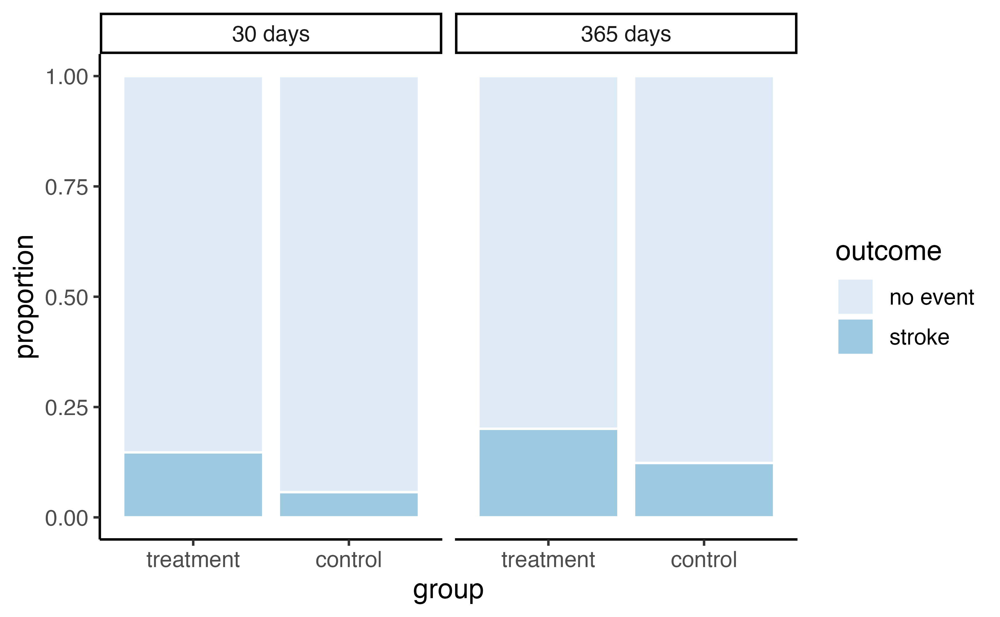
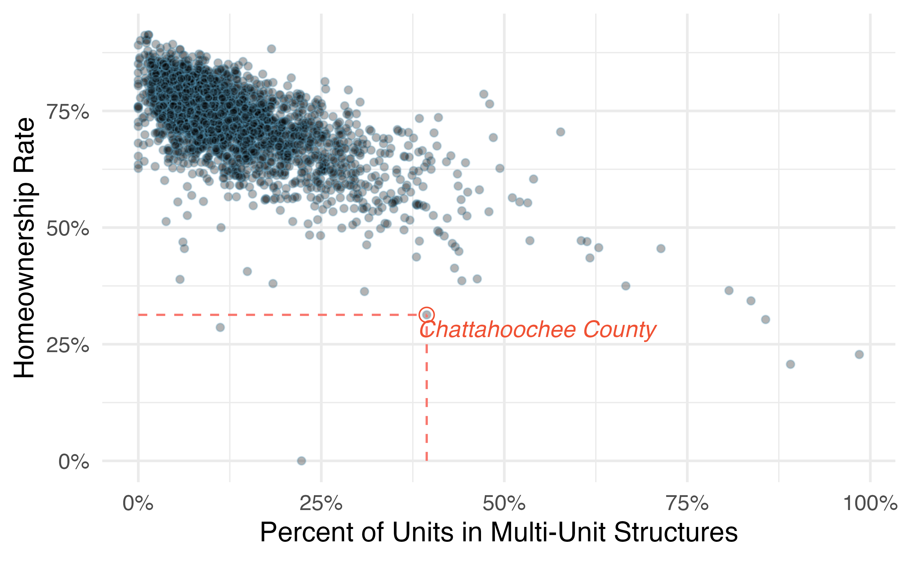

# (PART) Introduction to data {.unnumbered}

# Hello data {#data-hello}
<!-- Old reference: #intro-to-data -->

::: {.chapterintro}
Scientists seek to answer questions using rigorous methods and careful observations. 
These observations---collected from the likes of field notes, surveys, and experiments---form the backbone of a statistical investigation and are called **data**. 
Statistics is the study of how best to collect, analyze, and draw conclusions from data, and in this first chapter, we focus on both the properties of data and on the collection of data.
:::

Though we were calculating probabilities in the 16th century, and the first US Census was directed by Thomas Jefferson in 1790^[https://www.census.gov/history/www/through_the_decades/overview/1790.html], the discipline of statistics as we know it came about in the 1800s. Up until the 21st century, the **statistical investigation process**\index{statistical investigation process} looked something like this (adapted from @ISI2016):

1. Ask a research question.
2. Design a study and collect data.
3. Summarize and visualize the data.
4. Use statistical analysis methods to draw inferences from the data.
5. Communicate the results and answer the research question.
6. Revisit and look forward.

With the rise of data science, however, we might not start with a research question,
and instead start with a data set^[Data used in this context are called "found data."].
In this case, the statistical investigation process looks more like the data exploration cycle found in Figure \@ref(fig:data-science-explore) taken from @R4DS.

(\#fig:data-science-explore)Wickham and Grolemund's data exploration cycle (2017).

In either case, the ideas, concepts, and methods presented in this book will provide you with the tools to work through the statistical investigation process, whether starting with a research question or starting with data.

## Case study: using stents to prevent strokes {#basic-stents-strokes}

\index{data!stroke|(}

In this section, we introduce a classic challenge in statistics: evaluating the efficacy of a medical treatment. 
Terms in this section, and indeed much of this chapter, will all be revisited later in the text. 
The plan for now is simply to get a sense of the role statistics can play in practice.

Here, we will consider an experiment that studies effectiveness of stents in treating patients at risk of stroke [@chimowitz2011stenting].
Stents are small mesh tubes that are placed inside narrow or weak arteries to assist in patient recovery after cardiac events and reduce the risk of an additional heart attack or death. 

Many doctors have hoped that there would be similar benefits for patients at risk of stroke. We start by writing the principal question the researchers hope to answer:

> Does the use of stents reduce the risk of stroke?

The researchers who asked this question conducted an experiment with 451 at-risk patients. Each volunteer patient was randomly assigned to one of two groups:

- **Treatment group**. Patients in the treatment group received a stent and medical management. 
The medical management included medications, management of risk factors, and help in lifestyle modification.
- **Control group**. Patients in the control group received the same medical management as the treatment group, but they did not receive stents.

Researchers randomly assigned 224 patients to the treatment group and 227 to the control group. 
In this study, the control group provides a reference point against which we can measure the medical impact of stents in the treatment group.

Researchers studied the effect of stents at two time points: 30 days after enrollment and 365 days after enrollment. 
The data collected on 5 of these patients are summarized in Table \@ref(tab:stentStudyResultsDF). 
Patient outcomes are recorded as `stroke` or `no event`, representing whether or not the patient had a stroke during that time period.

::: {.data}
The data from this study can be found in the [openintro](http://openintrostat.github.io/openintro) package: [`stent30`](http://openintrostat.github.io/openintro/reference/stent30.html) and [`stent365`](http://openintrostat.github.io/openintro/reference/stent365.html).

Load these data into your RStudio session using the following commands:

`library(openintro)`  
`data(stent30)`  
`data(stent365)`
:::

<table class="table table-striped table-condensed" style="margin-left: auto; margin-right: auto;">
<caption>(\#tab:stentStudyResultsDF)Results for five patients from the stent study.</caption>
 <thead>
  <tr>
   <th style="text-align:right;"> patient </th>
   <th style="text-align:left;"> group </th>
   <th style="text-align:left;"> 30 days </th>
   <th style="text-align:left;"> 365 days </th>
  </tr>
 </thead>
<tbody>
  <tr>
   <td style="text-align:right;"> 1 </td>
   <td style="text-align:left;"> treatment </td>
   <td style="text-align:left;"> no event </td>
   <td style="text-align:left;"> no event </td>
  </tr>
  <tr>
   <td style="text-align:right;"> 2 </td>
   <td style="text-align:left;"> treatment </td>
   <td style="text-align:left;"> stroke </td>
   <td style="text-align:left;"> stroke </td>
  </tr>
  <tr>
   <td style="text-align:right;"> 3 </td>
   <td style="text-align:left;"> treatment </td>
   <td style="text-align:left;"> no event </td>
   <td style="text-align:left;"> no event </td>
  </tr>
  <tr>
   <td style="text-align:right;"> 4 </td>
   <td style="text-align:left;"> treatment </td>
   <td style="text-align:left;"> no event </td>
   <td style="text-align:left;"> no event </td>
  </tr>
  <tr>
   <td style="text-align:right;"> 5 </td>
   <td style="text-align:left;"> control </td>
   <td style="text-align:left;"> no event </td>
   <td style="text-align:left;"> no event </td>
  </tr>
</tbody>
</table>

Considering data from each of the 451 patients individually would be a long, cumbersome path towards answering the original research question. 
Instead, performing a statistical data analysis allows us to consider all of the data at once. 
Table \@ref(tab:stentStudyResultsDFsummary) summarizes the raw data in a more helpful way. 
In this table, we can quickly see what happened over the entire study. 
For instance, to identify the number of patients in the treatment group who had a stroke within 30 days after the treatment, we look in the leftmost column (30 days), at the intersection of treatment and stroke: 33.
To identify the number of control patients who did not have a stroke after 365 days after receiving treatment, we look at the rightmost column (365 days), at the intersection of control and no event: 199.

<table>
<caption>(\#tab:stentStudyResultsDFsummary)Descriptive statistics for the stent study.</caption>
 <thead>
<tr>
<th style="empty-cells: hide;border-bottom:hidden;" colspan="1"></th>
<th style="border-bottom:hidden;padding-bottom:0; padding-left:3px;padding-right:3px;text-align: center; border-bottom: 2px solid" colspan="2">
30 days
</th>
<th style="border-bottom:hidden;padding-bottom:0; padding-left:3px;padding-right:3px;text-align: center; border-bottom: 2px solid" colspan="2">
365 days
</th>
</tr>
  <tr>
   <th style="text-align:left;">  </th>
   <th style="text-align:right;"> stroke </th>
   <th style="text-align:right;"> no event </th>
   <th style="text-align:right;"> stroke </th>
   <th style="text-align:right;"> no event </th>
  </tr>
 </thead>
<tbody>
  <tr>
   <td style="text-align:left;border-top: 2px solid"> treatment </td>
   <td style="text-align:right;border-top: 2px solid"> 33 </td>
   <td style="text-align:right;border-top: 2px solid"> 191 </td>
   <td style="text-align:right;border-top: 2px solid"> 45 </td>
   <td style="text-align:right;border-top: 2px solid"> 179 </td>
  </tr>
  <tr>
   <td style="text-align:left;"> control </td>
   <td style="text-align:right;"> 13 </td>
   <td style="text-align:right;"> 214 </td>
   <td style="text-align:right;"> 28 </td>
   <td style="text-align:right;"> 199 </td>
  </tr>
  <tr>
   <td style="text-align:left;border-top: 2px solid"> Total </td>
   <td style="text-align:right;border-top: 2px solid"> 46 </td>
   <td style="text-align:right;border-top: 2px solid"> 405 </td>
   <td style="text-align:right;border-top: 2px solid"> 73 </td>
   <td style="text-align:right;border-top: 2px solid"> 378 </td>
  </tr>
</tbody>
</table>

The data summarized in this table can also be visualized with a \index{barplot}**barplot**, seen in Figure \@ref(fig:stentStudyResultsDFbarplot):

(\#fig:stentStudyResultsDFbarplot)Segmented barplot of outcomes in stent study by group and time.

::: {.guidedpractice}
Of the 224 patients in the treatment group, 45 had a stroke by the end of the first year. 
Using these two numbers, compute the proportion of patients in the treatment group who had a stroke by the end of their first year.
(Note: answers to all Guided Practice exercises are provided in footnotes!)^[The proportion of the 224 patients who had a stroke within 365 days: $45/224 = 0.20$.]
:::

We can compute summary statistics from the table to give us a better idea of  how the impact of the stent treatment differed between the two groups.
A **summary statistic** is a single number summarizing a large amount of data.
For instance, the primary results of the study after 1 year could be described by two summary statistics: the proportion of people who had a stroke in the treatment and control groups.

- Proportion who had a stroke in the treatment (stent) group: $45/224 = 0.20 = 20$\%.
- Proportion who had a stroke in the control group: $28/227 = 0.12 = 12$\%.

These two summary statistics are useful in looking for differences in the groups, and we are in for a surprise: an additional 8% of patients in the treatment group had a stroke! 
This is important for two reasons. 
First, it is contrary to what doctors expected, which was that stents would *reduce* the rate of strokes. 
Second, it leads to a statistical question: do the data show a "real" difference between the groups?

This second question is subtle, and is the basis of what we call **statistical inference**. 
Suppose you flip a coin 100 times. While the chance a coin lands heads in any given coin flip is 50%, we probably won't observe exactly 50 heads. 
This type of fluctuation is part of almost any type of data generating process. 
It is possible that the 8% difference in the stent study is due to this natural variation. 
However, the larger the difference we observe (for a particular sample size), the less believable it is that the difference is due to chance. 
So what we are really asking is the following: is the difference so large that we should reject the notion that it was due to chance?

While we don't yet have our statistical tools to fully address this question on our own, we can comprehend the conclusions of the published analysis: there was compelling evidence of harm by stents in this study of stroke patients.

::: {.importantbox}
**Be careful.**
Do not generalize the results of this study to all patients and all stents.
This study looked at patients with very specific characteristics who volunteered to be a part of this study and who may not be representative of all stroke patients.
In addition, there are many types of stents and this study only considered the self-expanding Wingspan stent (Boston Scientific).
However, this study does leave us with an important lesson: we should keep our eyes open for surprises.
:::

\index{data!stroke|)}

## Data basics {#data-basics}

Effective presentation and description of data is a first step in most analyses. This section introduces one structure for organizing data as well as some terminology that will be used throughout this book.

### Observations, variables, and data frames

\index{data!loan50|(}

Here, we will consider loans offered through the Lending Club, a peer-to-peer lending company. Such data could be used to explore characteristics of people receiving loans from the platform, such as job titles, annual income, or home ownership. Table \@ref(tab:loan50DF) displays six rows of a data set for 50 randomly sampled loans. These observations will be referred to as the `loan50` data set.

::: {.data}
The data can be found in the [openintro](http://openintrostat.github.io/openintro) package: [`loan50`](http://openintrostat.github.io/openintro/reference/loan50.html).

Load these data into your RStudio session using the following commands:

`library(openintro)`  
`data(loan50)`  
:::

Each row in the table represents a single loan. 
The formal name for a row is a **case** or \index{unit of observation}**observational unit**. Since there are 50 observational units in our data set, the **sample size**, denoted by $n$, is 50 ($n = 50$).
The columns represent characteristics of each loan, where each column is referred to as a **variable**. For example, the first row represents a loan of \$7,500 with an interest rate of 7.34\%, where the borrower is based in Maryland (MD) and has an income of \$70,000.

::: {.protip}
A variable is something that can be measured on an individual observational unit.
Be careful not to confuse summary statistics---calculated from a *group* of observational units---with variables.
:::

::: {.guidedpractice}
What is the grade of the first loan in Table \@ref(tab:loan50DF)?
What is the home ownership status of the borrower for that first loan?
Reminder: for these Guided Practice questions, you can check your answer in the footnote.^[The loan's grade is B, and the borrower rents their residence.]
:::

In practice, it is especially important to ask clarifying questions to ensure important aspects of the data are understood.
For instance, it is always important to be sure we know what each variable means and its units of measurement.
Descriptions of the variables in the `loan50` data set are given in Table \@ref(tab:loan50Variables).

<table>
<caption>(\#tab:loan50DF)Six rows from the `loan50` data set.</caption>
 <thead>
  <tr>
   <th style="text-align:left;">   </th>
   <th style="text-align:right;"> loan_amount </th>
   <th style="text-align:right;"> interest_rate </th>
   <th style="text-align:right;"> term </th>
   <th style="text-align:left;"> grade </th>
   <th style="text-align:left;"> state </th>
   <th style="text-align:right;"> total_income </th>
   <th style="text-align:left;"> homeownership </th>
  </tr>
 </thead>
<tbody>
  <tr>
   <td style="text-align:left;"> 1 </td>
   <td style="text-align:right;"> 22000 </td>
   <td style="text-align:right;"> 10.90 </td>
   <td style="text-align:right;"> 60 </td>
   <td style="text-align:left;"> B </td>
   <td style="text-align:left;"> NJ </td>
   <td style="text-align:right;"> 59000 </td>
   <td style="text-align:left;"> rent </td>
  </tr>
  <tr>
   <td style="text-align:left;"> 2 </td>
   <td style="text-align:right;"> 6000 </td>
   <td style="text-align:right;"> 9.92 </td>
   <td style="text-align:right;"> 36 </td>
   <td style="text-align:left;"> B </td>
   <td style="text-align:left;"> CA </td>
   <td style="text-align:right;"> 60000 </td>
   <td style="text-align:left;"> rent </td>
  </tr>
  <tr>
   <td style="text-align:left;"> 3 </td>
   <td style="text-align:right;"> 25000 </td>
   <td style="text-align:right;"> 26.30 </td>
   <td style="text-align:right;"> 36 </td>
   <td style="text-align:left;"> E </td>
   <td style="text-align:left;"> SC </td>
   <td style="text-align:right;"> 75000 </td>
   <td style="text-align:left;"> mortgage </td>
  </tr>
  <tr>
   <td style="text-align:left;"> 4 </td>
   <td style="text-align:right;"> 6000 </td>
   <td style="text-align:right;"> 9.92 </td>
   <td style="text-align:right;"> 36 </td>
   <td style="text-align:left;"> B </td>
   <td style="text-align:left;"> CA </td>
   <td style="text-align:right;"> 75000 </td>
   <td style="text-align:left;"> rent </td>
  </tr>
  <tr>
   <td style="text-align:left;"> 5 </td>
   <td style="text-align:right;"> 25000 </td>
   <td style="text-align:right;"> 9.43 </td>
   <td style="text-align:right;"> 60 </td>
   <td style="text-align:left;"> B </td>
   <td style="text-align:left;"> OH </td>
   <td style="text-align:right;"> 254000 </td>
   <td style="text-align:left;"> mortgage </td>
  </tr>
  <tr>
   <td style="text-align:left;"> 6 </td>
   <td style="text-align:right;"> 6400 </td>
   <td style="text-align:right;"> 9.92 </td>
   <td style="text-align:right;"> 36 </td>
   <td style="text-align:left;"> B </td>
   <td style="text-align:left;"> IN </td>
   <td style="text-align:right;"> 67000 </td>
   <td style="text-align:left;"> mortgage </td>
  </tr>
</tbody>
</table>

<table>
<caption>(\#tab:loan50Variables)Variables and their descriptions for the `loan50` data set.</caption>
 <thead>
  <tr>
   <th style="text-align:left;"> variable </th>
   <th style="text-align:left;"> description </th>
  </tr>
 </thead>
<tbody>
  <tr>
   <td style="text-align:left;"> loan_amount </td>
   <td style="text-align:left;"> Amount of the loan received, in US dollars. </td>
  </tr>
  <tr>
   <td style="text-align:left;"> interest_rate </td>
   <td style="text-align:left;"> Interest rate on the loan, in an annual percentage. </td>
  </tr>
  <tr>
   <td style="text-align:left;"> term </td>
   <td style="text-align:left;"> The length of the loan, which is always set as a whole number of months. </td>
  </tr>
  <tr>
   <td style="text-align:left;"> grade </td>
   <td style="text-align:left;"> Loan grade, which takes on values A through G and represents the quality of the loan and its likelihood of being repaid. </td>
  </tr>
  <tr>
   <td style="text-align:left;"> state </td>
   <td style="text-align:left;"> US state where the borrower resides. </td>
  </tr>
  <tr>
   <td style="text-align:left;"> total_income </td>
   <td style="text-align:left;"> Borrower's total income, including any second income, in US dollars. </td>
  </tr>
  <tr>
   <td style="text-align:left;"> homeownership </td>
   <td style="text-align:left;"> Indicates whether the person owns, owns but has a mortgage, or rents. </td>
  </tr>
</tbody>
</table>

\index{data!loan50|)}

The data in Table \@ref(tab:loan50DF) represent a **data frame**\index{data frame} (or data matrix), which is a convenient and common way to organize data, especially if collecting data in a spreadsheet.
Each row of a data frame corresponds to a unique case (observational unit), and each column corresponds to a variable.

When recording data, use a data frame unless you have a very good reason to use a different structure.
This structure allows new cases to be added as rows or new variables as new columns.

::: {.guidedpractice}
The grades for assignments, quizzes, and exams in a course are often recorded in a gradebook that takes the form of a data frame. 
How might you organize a course's grade data using a data frame?^[There are multiple strategies that can be followed. One common strategy is to have each student represented by a row, and then add a column for each assignment, quiz, or exam. Under this setup, it is easy to review a single line to understand the grade history of a student. There should also be columns to include student information, such as one column to list student names.]
:::

\index{data!county|(}

::: {.guidedpractice}
We consider data for 3,142 counties in the United States,
which include the name of each county, the state where it resides, its population in 2017, how its population changed from 2010 to 2017, poverty rate, and nine additional characteristics.
How might these data be organized in a data frame?^[Each county may be viewed as a case, and there are eleven pieces of information recorded for each case. A table with 3,142 rows and 14 columns could hold these data, where each row represents a county and each column represents a particular piece of information.]
:::

The data described in the Guided Practice above represent the **county** data set, which is shown as a data frame in Table \@ref(tab:countyDF).
The variables as well as the variables in the data set that did not fit in Table \@ref(tab:countyDF) are described in Table \@ref(tab:countyVariables)

<table>
<caption>(\#tab:countyDF)Six observations and six variables from the `county` data set.</caption>
 <thead>
  <tr>
   <th style="text-align:left;"> name </th>
   <th style="text-align:left;"> state </th>
   <th style="text-align:right;"> pop2017 </th>
   <th style="text-align:right;"> pop_change </th>
   <th style="text-align:right;"> unemployment_rate </th>
   <th style="text-align:left;"> median_edu </th>
  </tr>
 </thead>
<tbody>
  <tr>
   <td style="text-align:left;"> Autauga County </td>
   <td style="text-align:left;"> Alabama </td>
   <td style="text-align:right;"> 55504 </td>
   <td style="text-align:right;"> 1.48 </td>
   <td style="text-align:right;"> 3.86 </td>
   <td style="text-align:left;"> some_college </td>
  </tr>
  <tr>
   <td style="text-align:left;"> Baldwin County </td>
   <td style="text-align:left;"> Alabama </td>
   <td style="text-align:right;"> 212628 </td>
   <td style="text-align:right;"> 9.19 </td>
   <td style="text-align:right;"> 3.99 </td>
   <td style="text-align:left;"> some_college </td>
  </tr>
  <tr>
   <td style="text-align:left;"> Barbour County </td>
   <td style="text-align:left;"> Alabama </td>
   <td style="text-align:right;"> 25270 </td>
   <td style="text-align:right;"> -6.22 </td>
   <td style="text-align:right;"> 5.90 </td>
   <td style="text-align:left;"> hs_diploma </td>
  </tr>
  <tr>
   <td style="text-align:left;"> Bibb County </td>
   <td style="text-align:left;"> Alabama </td>
   <td style="text-align:right;"> 22668 </td>
   <td style="text-align:right;"> 0.73 </td>
   <td style="text-align:right;"> 4.39 </td>
   <td style="text-align:left;"> hs_diploma </td>
  </tr>
  <tr>
   <td style="text-align:left;"> Blount County </td>
   <td style="text-align:left;"> Alabama </td>
   <td style="text-align:right;"> 58013 </td>
   <td style="text-align:right;"> 0.68 </td>
   <td style="text-align:right;"> 4.02 </td>
   <td style="text-align:left;"> hs_diploma </td>
  </tr>
  <tr>
   <td style="text-align:left;"> Bullock County </td>
   <td style="text-align:left;"> Alabama </td>
   <td style="text-align:right;"> 10309 </td>
   <td style="text-align:right;"> -2.28 </td>
   <td style="text-align:right;"> 4.93 </td>
   <td style="text-align:left;"> hs_diploma </td>
  </tr>
</tbody>
</table>

<table>
<caption>(\#tab:countyVariables)Variables and their descriptions for the `county` data set.</caption>
 <thead>
  <tr>
   <th style="text-align:left;"> variable </th>
   <th style="text-align:left;"> description </th>
  </tr>
 </thead>
<tbody>
  <tr>
   <td style="text-align:left;"> name </td>
   <td style="text-align:left;"> Name of county. </td>
  </tr>
  <tr>
   <td style="text-align:left;"> state </td>
   <td style="text-align:left;"> Name of state. </td>
  </tr>
  <tr>
   <td style="text-align:left;"> pop2000 </td>
   <td style="text-align:left;"> Population in 2000. </td>
  </tr>
  <tr>
   <td style="text-align:left;"> pop2010 </td>
   <td style="text-align:left;"> Population in 2010. </td>
  </tr>
  <tr>
   <td style="text-align:left;"> pop2017 </td>
   <td style="text-align:left;"> Population in 2017. </td>
  </tr>
  <tr>
   <td style="text-align:left;"> pop_change </td>
   <td style="text-align:left;"> Population change from 2010 to 2017. </td>
  </tr>
  <tr>
   <td style="text-align:left;"> poverty </td>
   <td style="text-align:left;"> Percent of population in poverty in 2017. </td>
  </tr>
  <tr>
   <td style="text-align:left;"> homeownership </td>
   <td style="text-align:left;"> Homeownership rate, 2006-2010. </td>
  </tr>
  <tr>
   <td style="text-align:left;"> multi_unit </td>
   <td style="text-align:left;"> Percent of housing units in multi-unit structures, 2006-2010. </td>
  </tr>
  <tr>
   <td style="text-align:left;"> unemployment_rate </td>
   <td style="text-align:left;"> Unemployment rate in 2017. </td>
  </tr>
  <tr>
   <td style="text-align:left;"> metro </td>
   <td style="text-align:left;"> Whether the county contains a metropolitan area, taking one of the values `yes` or `no`. </td>
  </tr>
  <tr>
   <td style="text-align:left;"> median_edu </td>
   <td style="text-align:left;"> Median education level (2013-2017), taking one of the values `below_hs`, `hs_diploma`, `some_college`, or `bachelors`. </td>
  </tr>
  <tr>
   <td style="text-align:left;"> per_capita_income </td>
   <td style="text-align:left;"> Per capita (per person) income (2013-2017). </td>
  </tr>
  <tr>
   <td style="text-align:left;"> median_hh_income </td>
   <td style="text-align:left;"> Median household income. </td>
  </tr>
  <tr>
   <td style="text-align:left;"> smoking_ban </td>
   <td style="text-align:left;"> Describes whether the type of county-level smoking ban in place in 2010, taking one of the values `none`, `partial`, or `comprehensive`. </td>
  </tr>
</tbody>
</table>

::: {.data}
These data can be found in the [usdata](http://openintrostat.github.io/usdata) package: [`county`](http://openintrostat.github.io/usdata/reference/county.html).

Load these data into your RStudio session using the following commands:

`library(usdata)`  
`data(county)`  
:::

### Types of variables {#variable-types}

Examine the `unemployment_rate`, `pop2017`, `state`, `metro`, and `median_edu` variables in the `county` data set. 
Each of these variables is inherently different from the others, yet some share certain characteristics.

First consider `unemployment_rate`, which is said to be a **quantitative** or **numerical** variable since it can take a wide range of numerical values, and it is sensible to add, subtract, or take averages with those values.
On the other hand, we would not classify a variable reporting telephone area codes as quantitative since the average, sum, and difference of area codes doesn't have any clear meaning.

The `pop2017` variable is also quantitative, although it seems to be a little different than `unemployment_rate`.
This variable of the population count can only take whole non-negative numbers (0, 1, 2, ...).
For this reason, the population variable is said to be **discrete** since it can only take numerical values with jumps.
On the other hand, the unemployment rate variable is said to be **continuous**.

The variable `state` can take up to 51 values after accounting for Washington, DC: AL, AK, ..., and WY.
Because the responses themselves are categories, `state` is called a **categorical** variable, and the possible values are called the variable's **levels** . The variable `metro` is also categorical, but it only has two levels (yes or no). A categorical variable with only two levels is called a **binary** variable. When working with a generic binary variable, we often call the two possible levels "success" and "failure."

Finally, consider the `median_edu` variable, which describes the median education level of county residents and takes values `below_hs`, `hs_diploma`, `some_college`, or `bachelors` in each county.
This variable seems to be a hybrid: it is a categorical variable but the levels have a natural ordering.
A variable with these properties is called an **ordinal** variable, while a regular categorical variable without this type of special ordering is called a **nominal** variable.
To simplify analyses, any ordinal variable in this book will be treated as a nominal (unordered) categorical variable.

(\#fig:variables)Breakdown of variables into their respective types.

::: {.workedexample}
Data were collected about students in a statistics course.
Three variables were recorded for each student: number of siblings, student height, and whether the student had previously taken a statistics course.
Classify each of the variables as continuous quantitative, discrete quantitative, or categorical. 

---

The number of siblings and student height represent quantitative variables.
Because the number of siblings is a count, it is discrete.
Height varies continuously, so it is a continuous quantitative variable.
The last variable classifies students into two categories---those who have and those who have not taken a statistics course---which makes this variable categorical.
:::

\index{data!stroke}

::: {.guidedpractice}
An experiment is evaluating the effectiveness of a new drug in treating migraines.
A `group` variable is used to indicate the experiment group for each patient: treatment or control.
The `num_migraines` variable represents the number of migraines the patient experienced during a 3-month period. Classify each variable as either quantitative or categorical.^[The `group` variable can take just one of two group names, making it categorical. The `num_migraines` variable describes a count of the number of migraines, which is an outcome where basic arithmetic is sensible, which means this is numerical outcome; more specifically, since it represents a count, `num_migraines` is a discrete quantitative variable.]
:::

### Relationships between variables {#variable-relations}

Many analyses are motivated by a researcher looking for a relationship between two or more variables.
A social scientist may like to answer some of the following questions:

> Does a higher than average increase in county population tend to correspond to counties with higher or lower median household incomes?

> If homeownership is lower than the national average in one county, will the percent of multi-unit structures in that county tend to be above or below the national average?

> How useful a predictor is median education level for the median household income for US counties?

To answer these questions, data must be collected, such as the `county` data set shown in Table \@ref(tab:countyDF).
Examining \index{summary statistic}**summary statistics** could provide insights for each of the three questions about counties.
Additionally, graphs can be used to visually explore the data.

\index{scatterplot}**Scatterplots** are one type of graph used to study the relationship between two quantitative variables.
Figure \@ref(fig:county-multi-unit-homeownership) displays the relationship between the variables `homeownership` and `multi_unit`, which is the percent of units in multi-unit structures (e.g., apartments, condos).
Each point on the plot represents a single county (a single observational unit).
For instance, the highlighted dot corresponds to County 413 in the `county` data set: Chattahoochee County, Georgia, which has 39.4\% of units in multi-unit structures and a homeownership rate of 31.3\%.
The scatterplot suggests a relationship between the two variables: counties with a higher rate of multi-units tend to have lower homeownership rates.
We might brainstorm as to why this relationship exists and investigate each idea to determine which are the most reasonable explanations.

(\#fig:county-multi-unit-homeownership)A scatterplot of homeownership versus the percent of units that are in multi-unit structures for US counties. The highlighted dot represents Chattahoochee County, Georgia, which has a multi-unit rate of 39.4% and a homeownership rate of 31.3%.

The multi-unit and homeownership rates are said to be associated because the plot shows a discernible pattern.
When two variables show some connection with one another, they are called **associated** variables.
Associated variables can also be called **dependent** variables and vice-versa.

::: {.guidedpractice}
Examine the variables in the `loan50` data set, which are described in Table \@ref(tab:loan50Variables).
Create two questions about possible relationships between variables in `loan50` that are of interest to you.^[Two example questions: (1) What is the relationship between loan amount and total income? (2) If someone's income is above the average, will their interest rate tend to be above or below the average?]
:::

::: {.workedexample}
This example examines the relationship between the change in population from 2010 to 2017 and median household income for counties, which is visualized as a scatterplot in Figure \@ref(fig:county-pop-change-med-hh-income).
Are these variables associated?

---

The larger the median household income for a county, the higher the population growth observed for the county.
While this trend isn't true for every county, the trend in the plot is evident. Since there is some relationship between the variables, they are associated.
:::

(\#fig:county-pop-change-med-hh-income)A scatterplot showing `pop_change` against `median_hh_income`. Owsley County of Kentucky, is highlighted, which lost 3.63% of its population from 2010 to 2017 and had median household income of $22,736.

Because there is a downward trend in Figure \@ref(fig:county-multi-unit-homeownership)---counties with more units in multi-unit structures are associated with lower homeownership---these variables are said to be **negatively associated**.
A **positive association** is shown in the relationship between the `median_hh_income` and `pop_change` variables in Figure \@ref(fig:county-pop-change-med-hh-income), where counties with higher median household income tend to have higher rates of population growth.

If two variables are not associated, then they are said to be **independent**.
That is, two variables are independent if there is no evident relationship between the two.

::: {.importantbox}
**Associated or independent, not both.**
A pair of variables are either related in some way (associated) or not (independent).
No pair of variables is both associated and independent.
:::

### Explanatory and response variables

When we ask questions about the relationship between two variables, we sometimes also want to determine if the change in one variable causes a change in the other.
Consider the following rephrasing of an earlier question about the `county` data set:

> If there is an increase in the median household income in a county, does this drive an increase in its population?

In this question, we are asking whether one variable affects another.
If this is our underlying belief, then *median household income* is the **explanatory variable** variable and the *population change* is the **response variable** variable in the hypothesized relationship.^[Sometimes the explanatory variable is called the **independent** variable and the response variable is called the **dependent** variable. However, this becomes confusing since a *pair* of variables might be independent or dependent, so we avoid this language.]

\index{data!county|)}

::: {.onebox}
**Explanatory and response variables.**
  
When we suspect one variable might causally affect another,
we label the first variable the explanatory variable
and the second the response variable. 
The main reason for this is that observational studies do not control for confounding variables.
We will revisit this idea when we discuss experiments in the next chapter.

explanatory variable $\rightarrow$ *might affect* $\rightarrow$ response variable

 
For many pairs of variables, there is no hypothesized relationship, and these labels would not be applied to either variable in such cases.
:::

Bear in mind that the act of labeling the variables in this way does nothing to guarantee that a causal relationship exists.
A formal evaluation to check whether one variable causes a change in another requires an experiment.

### Introducing observational studies and experiments

There are two primary types of data collection: observational studies and experiments. We already encountered an experiment in the case study in Section \@ref(basic-stents-strokes), and an observational study with the Lending Club data in this section.

Researchers perform an **observational study** when they collect data in a way that does not directly interfere with how the data arise.
For instance, researchers may collect information via surveys, review medical or company records, or follow a **cohort** of many similar individuals to form hypotheses about why certain diseases might develop.
In each of these situations, researchers merely observe the data that arise.
In general, observational studies can provide evidence of a naturally occurring association between variables, but they cannot by themselves show a causal connection.

When researchers want to investigate the possibility of a causal connection, they conduct an **experiment**.
Usually there will be both an explanatory and a response variable.
For instance, we may suspect administering a drug will reduce mortality in heart attack patients over the following year.
To check if there really is a causal connection between the explanatory variable and the response, researchers will collect a sample of individuals and split them into groups.
The individuals in each group are *assigned* a treatment.
When individuals are randomly assigned to a group, the experiment is called a **randomized experiment**.
For example, each heart attack patient in the drug trial could be randomly assigned,  perhaps by flipping a coin, into one of two groups: the first group receives a **placebo** (fake treatment) and the second group receives the drug.
Note that the case study in Section \@ref(basic-stents-strokes) did not use a placebo.

::: {.importantbox}
**Association $\neq$ Causation.**
In general, association does not imply causation, and causation can only be inferred from a randomized experiment.
:::

## Chapter review {#chp1-review}

### Summary {-}

This chapter introduced you to the world of data.
Data can be organized in many ways but tidy data, where each row represents an observation and each column represents a variable, lends itself most easily to statistical analysis.
Many of the ideas from this chapter will be seen as we move on to doing full data analyses.
In the next chapter you're going to learn about how we can design studies to collect the data we need to make conclusions with the desired scope of inference.

### Terms {-}

We introduced the following terms in the chapter. 
If you're not sure what some of these terms mean, we recommend you go back in the text and review their definitions.
We are purposefully presenting them in alphabetical order, instead of in order of appearance, so they will be a little more challenging to locate. 
However you should be able to easily spot them as **bolded text**.

<table class="table table-striped table-condensed" style="margin-left: auto; margin-right: auto;">
<tbody>
  <tr>
   <td style="text-align:left;"> associated </td>
   <td style="text-align:left;"> discrete </td>
   <td style="text-align:left;"> placebo </td>
  </tr>
  <tr>
   <td style="text-align:left;"> barplot </td>
   <td style="text-align:left;"> experiment </td>
   <td style="text-align:left;"> positive association </td>
  </tr>
  <tr>
   <td style="text-align:left;"> binary </td>
   <td style="text-align:left;"> explanatory variable </td>
   <td style="text-align:left;"> quantitative </td>
  </tr>
  <tr>
   <td style="text-align:left;"> case </td>
   <td style="text-align:left;"> independent </td>
   <td style="text-align:left;"> randomized experiment </td>
  </tr>
  <tr>
   <td style="text-align:left;"> categorical </td>
   <td style="text-align:left;"> level </td>
   <td style="text-align:left;"> response variable </td>
  </tr>
  <tr>
   <td style="text-align:left;"> cohort </td>
   <td style="text-align:left;"> negative association </td>
   <td style="text-align:left;"> sample size </td>
  </tr>
  <tr>
   <td style="text-align:left;"> continuous </td>
   <td style="text-align:left;"> nominal </td>
   <td style="text-align:left;"> statistical investigation process </td>
  </tr>
  <tr>
   <td style="text-align:left;"> data </td>
   <td style="text-align:left;"> observational study </td>
   <td style="text-align:left;"> summary statistic </td>
  </tr>
  <tr>
   <td style="text-align:left;"> data frame </td>
   <td style="text-align:left;"> observational unit </td>
   <td style="text-align:left;"> variable </td>
  </tr>
  <tr>
   <td style="text-align:left;"> dependent </td>
   <td style="text-align:left;"> ordinal </td>
   <td style="text-align:left;">  </td>
  </tr>
</tbody>
</table>

### Key ideas {-}

* A data set is comprised of measurements of **variables** on **observational units**.
The type of variable can be **quantitative** or **categorical**, and a variable's role can be an **explanatory variable** or **response variable**.

* In an **observational study**, we merely _observe_ the behavior of the individuals in the study; we do not manipulate the variables on the individuals in any way. In a **randomized experiment**, we _randomly assign_ values of an explanatory variable to the observational units, then observe the response variable. Random assignment allows us to investigate causal relationships because it balances out any potential **confounding variables**, on average. These ideas will be discussed in detail in the next chapter.
