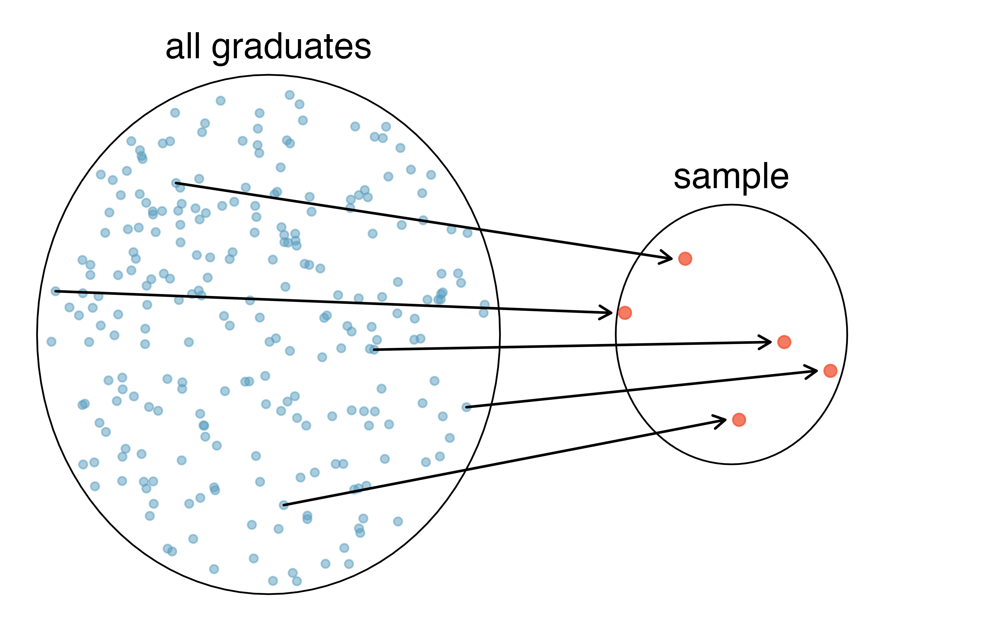
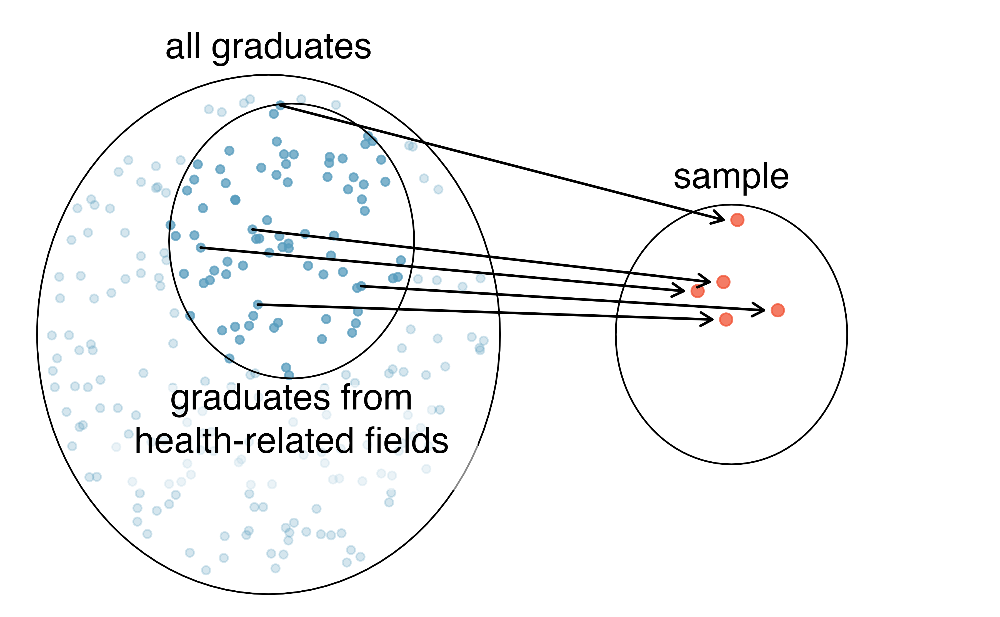
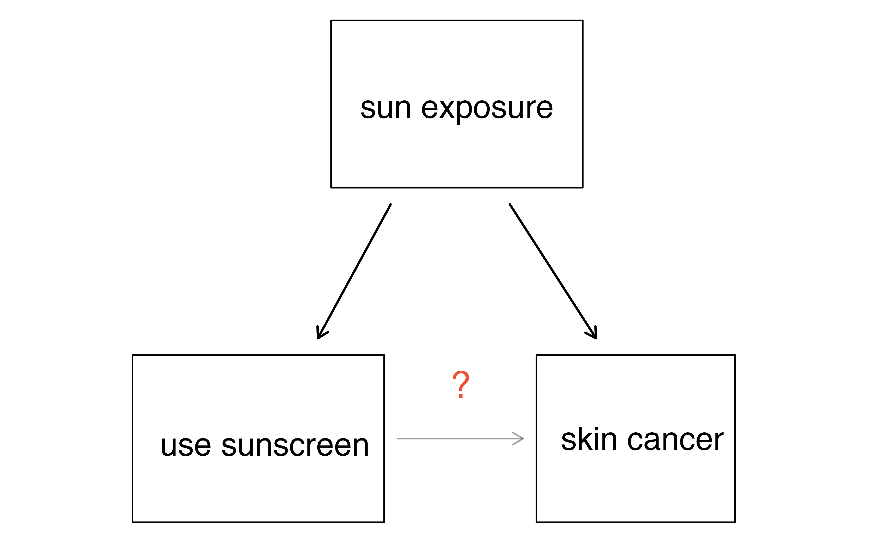

# Study design {#data-design}

::: {.chapterintro}
Before digging into the details of working with data, we stop to think about how data come to be.
That is, if the data are to be used to make broad and complete conclusions, then it is important to understand who or what the data represent.
One important aspect of data provenance is sampling.
Knowing how the observational units were selected from a larger entity will allow for generalizations back to the population from which the data were randomly selected.
Additionally, by understanding the structure of the study, causal relationships can be separated from those relationships which are only associated.
A good question to ask oneself before working with the data at all is, "How were these observations collected?".
You will learn a lot about the data by understanding its source.
:::

## Sampling principles and strategies {#sampling-principles-strategies}

\index{sample|(}
\index{population|(}

The first step in conducting research is to identify topics or questions that are to be investigated.
A clearly laid out research question is helpful in identifying what subjects or cases should be studied and what variables are important.
It is also important to consider *how* data are collected so that they are reliable and help achieve the research goals.

### Populations and samples

Consider the following three research questions:

1. What is the average mercury content in swordfish in the Atlantic Ocean?
1. Over the last 5 years, what is the average time to complete a degree for Duke undergrads?
1. Does a new drug reduce the risk deaths in patients with severe heart disease?

Each research question refers to a target **population**. 
In the first question, the target population is all swordfish in the Atlantic ocean, and each fish represents a case. 
Often times, it is too expensive to collect data for every case in a population. 
Instead, a sample is taken. 
A **sample** represents a subset of the cases and is often a small fraction of the population. 
For instance, 60 swordfish (or some other number) in the population might be selected, and this sample data may be used to provide an estimate of the population average and answer the research question.

::: {.guidedpractice}
For the second and third questions above, identify the target population and what represents an individual case.^[The question *"Over the last 5 years, what is the average time to complete a degree for Duke undergrads?"* is only relevant to students who complete their degree; the average cannot be computed using a student who never finished her degree. Thus, only Duke undergrads who graduated in the last five years represent cases in the population under consideration. Each such student is an individual case. For the question *"Does a new drug reduce the number of deaths in patients with severe heart disease?"*, a person with severe heart disease represents a case. The population includes all people with severe heart disease.]
:::

### Parameters and statistics

In most statistical analysis procedures, the research question at hand boils down to understanding a numerical summary.
The number (or set of numbers) may be a quantity you are already familiar with (like the average) or it may be something you learn through this text (like the slope and intercept from a least squares model, provided in Section \@ref(least-squares-regression)).

A numerical summary can be calculated on either the sample of observations or the entire population.
However, measuring every unit in the population is usually prohibitive (so the parameter is very rarely calculated).
So, a "typical" numerical summary is calculated from a sample.
Yet, we can still conceptualize calculating the average income of all adults in Argentina.

We use specific terms in order to differentiate when a number is being calculated on a sample of data (**statistic**) and when it is being calculated or considered for calculation on the entire population (**parameter**). The value of a parameter remains fixed (yet typically unknown). In contrast, a the value of a statistic will vary from sample to sample. This variability in the value of a statistic across different samples is called **sampling variability**.

The terms statistic and parameter are useful for communicating claims and models and will be used extensively in later chapters which delve into making inference on populations.

### Anecdotal evidence

\index{bias|(}

Consider the following possible responses to the three research questions:

1. A man on the news got mercury poisoning from eating swordfish, so the average mercury concentration in swordfish must be dangerously high.
2. I met two students who took more than 7 years to graduate from Duke, so it must take longer to graduate at Duke than at many other colleges.
3. My friend's dad had a heart attack and died after they gave him a new heart disease drug, so the drug must not work.

Each conclusion is based on data.
However, there are two problems.
First, the data only represent one or two cases.
Second, and more importantly, it is unclear whether these cases are actually representative of the population. Data collected in this haphazard fashion are called **anecdotal evidence**.

::: {.importantbox}
**Anecdotal evidence.**
Be careful of data collected in a haphazard fashion.
Such evidence may be true and verifiable, but it may only represent extraordinary cases.
:::

(\#fig:mn-winter)In February 2010, some media pundits cited one large snow storm as evidence against global warming. As comedian Jon Stewart pointed out, "It is one storm, in one region, of one country."

Anecdotal evidence typically is composed of unusual cases that we recall based on their striking characteristics. 
For instance, we are more likely to remember the two people we met who took 7 years to graduate than the six others who graduated in four years. 
Instead of looking at the most unusual cases, we should examine a sample of many cases that better represent the population.

### Sampling from a population

\index{sample!random sample|(}
\index{sample!bias|(}

We might try to estimate the time to graduation for Duke undergraduates in the last 5 years by collecting a sample of students.
All graduates in the last 5 years represent the *population*\index{population}, and graduates who are selected for review are collectively called the *sample*\index{sample}.
In general, we always seek to *randomly* select a sample from a population.
The most basic type of random selection is equivalent to how raffles are conducted--where each raffle ticket has an equal chance of being selected.
For example, in selecting graduates, we could write each graduate's name on a raffle ticket and draw 100 tickets.
The selected names would represent a random sample of 100 graduates.
We pick samples randomly to reduce the chance we introduce biases.

(\#fig:pop-to-sample)In this graphic, five graduates are randomly selected from the population (all graduates in the last 5 years) to be included in the sample.

::: {.workedexample}
Suppose we ask a student who happens to be majoring in nutrition to select several graduates for the study.
What kind of students do you think they might collect?
Do you think their sample would be representative of all graduates?

---

Perhaps they would pick a disproportionate number of graduates from health-related fields. Or perhaps their selection would be a good representation of the population.
When selecting samples by hand, we run the risk of picking a **biased** sample, even if our bias is unintended.
:::

(\#fig:pop-to-sub-sample-graduates)Asked to pick a sample of graduates, a nutrition major might inadvertently pick a disproportionate number of graduates from health-related majors.

If someone was permitted to pick and choose exactly which graduates were included in the sample, it is entirely possible that the sample could be skewed to that person's interests, which may be entirely unintentional.
This introduces **bias** into a sampling method. 

::: {.onebox}
There are three common types of **sampling bias** we will discuss:

1. **Selection bias**\index{selection bias}: the method in how your sample is selected tends to produce samples that either over-represent or under-represent certain portions of the population.
1. **Non-response bias**\index{non-response bias}: individuals selected for the sample are unwilling to answer some or all questions, cannot respond, or refuse to participate.
1. **Response bias**\index{response bias}: individuals selected for the sample respond in a way that does not accurately represent the truth---due to question wording, lack of anonymity, or other issues.
:::

A common downfall in survey studies is a **convenience sample**\index{convenience sample}, where individuals who are easily accessible are more likely to be included in the sample.
For instance, if a political survey is done by stopping people walking in the Bronx, this will not represent all of New York City.
It is often difficult to discern what sub-population a convenience sample represents.

::: {.guidedpractice}
Is a convenience sample an example of selection bias, non-response bias,
or response bias?^[A convenience sample is an example of selection bias, because the
                   way in which the sample is _selected_ is biased.]
:::

Sampling randomly helps resolve _selection bias_.
The most basic random sample is called a **simple random sample**, and is equivalent to using a raffle to select cases.
This means that each case in the population has an equal chance of being included and there is no implied connection between the cases in the sample.

Even when people are picked at random, however, caution must be exercised if the **sampling frame** does not include the entire population.
The **sampling frame** is the actual list of individuals or objects from which the sample is selected. For instance, if our sampling frame is the list of all the landline phone numbers in a city, individuals without a landline will be excluded from the study, even if we take a simple random sample from the sampling frame. 

::: {.guidedpractice}
When our sampling frame is not the same as our population of interest, selecting a simple random sample from the sampling frame will still result in what type of bias---selection bias, non-response bias,
or response bias?^[Using the wrong sampling frame is an example of selection bias, because groups of individuals that are not included
in the sampling frame have no opportunity to be selected for the study.]
:::

Similarly, a simple random sample may still exhibit sampling bias if the **non-response rate**\index{non-response rate} is high, or if **response bias** is present.
For example, if only 30\% of the people randomly sampled for a survey actually respond, then it is unclear whether the results are **representative** of the entire population.
This *non-response bias* can produce results in the sample that do not accurately reflect the entire population.

(\#fig:survey-sample)Due to the possibility of non-response, survey studies may only reach a certain group within the population. It is difficult, and often times impossible, to completely fix this problem.

::: {.onebox}
**Asking the uninformed.** Popular late night host Jimmy Kimmel has a segment on his show called "Lie Witness News," where Kimmel's staff take to the streets to ask pedestrians about recent stories in the news. However, these recent stories are not really stories at all---they're fake. Without fail, those asked always express an opinion, unflinchingly. Why? People do not like to appear as if they don't know what they're talking about, so we make up answers. For an entertaining display of this fascinating psychological example of response bias, watch the [Coachella 2013 episode of Lie Witness News](https://www.youtube.com/watch?v=W_IzYUJANfk). 
:::

::: {.guidedpractice}
We can easily access ratings for products, sellers, and companies through websites. These ratings are based only on those people who go out of their way to provide a rating. If 50% of online reviews for a product are negative, do you think this means that 50% of buyers are dissatisfied with the product? Why or why not?^[Answers will vary. From our own anecdotal experiences, we believe people tend to rant more about products that fell below expectations than rave about those that perform as expected. For this reason, we suspect there is a negative bias in product ratings on sites like Amazon. Additionally, those with strong opinions (positive or negative) are more inclined to take the time to write a review. However, since our experiences may not be representative, we also keep an open mind.]
:::

\index{sample!bias|)}
\index{sample!random sample|)}
\index{bias|)}
\index{population|)}
\index{sample|)}

### Four sampling methods (special topic) {#samp-methods}

Almost all statistical methods are based on the notion of implied randomness. 
If observational data are not collected in a random framework from a population, these statistical methods---the estimates and errors associated with the estimates---are not reliable. 
Here we consider four random sampling techniques: simple, stratified, cluster, and multistage sampling. Figures \@ref(fig:simple-stratified) and \@ref(fig:cluster-multistage) provide graphical representations of these techniques.

\index{sample!simple random sampling}
\index{sample!stratified sampling}

(\#fig:simple-stratified)Examples of simple random and stratified sampling. In the top panel, simple random sampling was used to randomly select the 18 cases (denoted in red). In the bottom panel, stratified sampling was used: cases were grouped into strata, then simple random sampling was employed to randomly select 3 cases within each stratum.

**Simple random sampling** is probably the most intuitive form of random sampling. 
Consider the salaries of Major League Baseball (MLB) players, where each player is a member of one of the league's 30 teams. 
To take a simple random sample of 120 baseball players and their salaries, we could write the names of that season's several hundreds of players onto slips of paper, drop the slips into a bucket, shake the bucket around until we are sure the names are all mixed up, then draw out slips until we have the sample of 120 players. 
In general, a sample is referred to as "simple random" if each case in the population has an equal chance of being included in the final sample *and* knowing that a case is included in a sample does not provide useful information about which other cases are included.

\index{sample!strata|textbf}

**Stratified sampling** is a divide-and-conquer sampling strategy.
The population is divided into groups called **strata**.
The strata are chosen so that similar cases are grouped together, then a second sampling method, usually simple random sampling, is employed within each stratum.
In the baseball salary example, each of the 30 teams could represent a strata, since some teams have a lot more money (up to 4 times as much!). 
Then we might randomly sample 4 players from each team for our sample of 120 players.

Stratified sampling is especially useful when the cases in each stratum are very similar with respect to the outcome of interest. 
The downside is that analyzing data from a stratified sample is a more complex task than analyzing data from a simple random sample. 
The analysis methods introduced in this book would need to be extended to analyze data collected using stratified sampling.

::: {.workedexample}
Why would it be good for cases within each stratum to be very similar?

---

We might get a more stable estimate for the subpopulation in a stratum if the cases are very similar, leading to more precise estimates within each group. 
When we combine these estimates into a single estimate for the full population, that population estimate will tend to be more precise since each individual group estimate is itself more precise.
:::

In a **cluster sample**, we break up the population into many groups, called **clusters**. 
Then we sample a fixed number of clusters and include all observations from each of those clusters in the sample. 
A **multistage sample** is like a cluster sample, but rather than keeping all observations in each cluster, we would collect a random sample within each selected cluster.

\index{sample!cluster sampling}

(\#fig:cluster-multistage)Examples of cluster and multistage sampling. In the top panel, cluster sampling was used: data were binned into nine clusters, three of these clusters were sampled, and all observations within these three cluster were included in the sample. In the bottom panel, multistage sampling was used, which differs from cluster sampling only in that we randomly select a subset of each cluster to be included in the sample rather than measuring every case in each sampled cluster.

Sometimes cluster or multistage sampling can be more economical than the alternative sampling techniques.
Also, unlike stratified sampling, these approaches are most helpful when there is a lot of case-to-case variability within a cluster but the clusters themselves don't look very different from one another.
For example, if neighborhoods represented clusters, then cluster or multistage sampling work best when the neighborhoods are very diverse.
A downside of these methods is that more advanced techniques are typically required to analyze the data, though the methods in this book can be extended to handle such data.

::: {.workedexample}
Suppose we are interested in estimating the malaria rate in a densely tropical portion of rural Indonesia.
We learn that there are 30 villages in that part of the Indonesian jungle, each more or less similar to the next, but the distances between the villages is substantial. Our goal is to test 150 individuals for malaria.
What sampling method should be employed?

---

A simple random sample would likely draw individuals from all 30 villages, which could make data collection extremely expensive.
Stratified sampling would be a challenge since it is unclear how we would build strata of similar individuals. 
However, cluster sampling or multistage sampling seem like very good ideas. 
If we decided to use multistage sampling, we might randomly select half of the villages, then randomly select 10 people from each. 
This would probably reduce our data collection costs substantially in comparison to a simple random sample, and the cluster sample would still give us reliable information, even if we would need to analyze the data with slightly more advanced methods than we discuss in this book.
:::

## Observational studies

Data where no treatment has been explicitly applied (or explicitly withheld) is called **observational data**.
For instance, the loan data and county data described in Section \@ref(data-basics) are both examples of observational data.

Observational studies are generally only sufficient to show associations or form hypotheses that can be later checked with experiments. Making causal conclusions based on experiments is often reasonable. However, making the same causal conclusions based on observational data can be treacherous and is not recommended. Indeed, making causal conclusions based on observational data is arguably the most common mistake in our news headlines and social media posts!

::: {.guidedpractice}
Suppose an observational study tracked sunscreen use and skin cancer, and it was found that the more sunscreen someone used, the more likely the person was to have skin cancer. Does this mean sunscreen *causes* skin cancer?^[No! See the paragraph following this guided practice for an explanation.]
:::

Some previous research tells us that using sunscreen actually reduces skin cancer risk, so maybe there is another variable that can explain this hypothetical association between sunscreen usage and skin cancer. 
One important piece of information that is absent is sun exposure. If someone is out in the sun all day, they are more likely to use sunscreen *and* more likely to get skin cancer. Exposure to the sun is unaccounted for in the simple investigation.

<!--
Some studies:
http://www.sciencedirect.com/science/article/pii/S0140673698121682
http://archderm.ama-assn.org/cgi/content/abstract/122/5/537
Study with a similar scenario to that described here:
http://onlinelibrary.wiley.com/doi/10.1002/ijc.22745/full
-->

Sun exposure is what is called a **confounding variable**^[Also called a **lurking variable**, **confounding factor**, or a **confounder**.], which is a variable that is associated with both the explanatory and response variables. 
While one method to justify making causal conclusions from observational studies is to exhaust the search for confounding variables, there is no guarantee that all confounding variables can be examined or measured.

::: {.onebox}
A **confounding variable** is a variable that is _both_

1. associated with the explanatory variable, _and_
2. associated with the response variable.

When both these conditions are met, if we observe an association between the explanatory variable and the response variable in the data, we cannot be sure if this association is due to the explanatory variable or the confounding variable---the explanatory and confounding variables are "confounded."
:::

::: {.guidedpractice}
Figure \@ref(fig:county-multi-unit-homeownership) shows a negative association between the homeownership rate and the percentage of multi-unit structures in a county.
However, it is unreasonable to conclude that there is a causal relationship between the two variables.
Suggest a variable that might explain the negative relationship.^[Answers will vary. Population density may be important. If a county is very dense, then this may require a larger fraction of residents to live in multi-unit structures. Additionally, the high density may contribute to increases in property value, making homeownership infeasible for many residents.]
:::

::: {.guidedpractice}
Houndstongue (a noxious weed) is found in abundance on private and public lands that have been grazed by cattle. Houndstongue is rarely found on lands that have been grazed by mountain goats. One investigator concluded that houndstongue infestations could be reduced by importing mountain goats to the infested areas. What is wrong with this conclusion?^[Just because mountain goat grazing is associated with an absence of houndstongue doesn't mean the mountain goats are the cause behind the houndstongue reduction! One obvious confounding variable is elevation---elevation is associated with the presence/absence of houndstongue (houndstongue tends to grow at lower elevation) and is also associated with the presence/absence of mountain goats (mountain goats prefer higher elevations).]
:::

Observational studies come in two forms: prospective and retrospective studies.
A **prospective study** identifies individuals and collects information as events unfold.
For instance, medical researchers may identify and follow a group of patients over many years to assess the possible influences of behavior on cancer risk. 
One example of such a study is the Nurses' Health Study. 
Started in 1976 and expanded in 1989, the Nurses' Health Study has collected data on over 275,000 nurses and is still enrolling participants. 
This prospective study recruits registered nurses and then collects data from them using questionnaires. 
**Retrospective studies** collect data after events have taken place, e.g. researchers may review past events in medical records.
Some data sets may contain both prospectively- and retrospectively-collected variables, such as medical studies which gather information on participants' lives before they enter the study and subsequently collect data on participants throughout the study. 

## Experiments

Studies where the researchers assign treatments to cases are called **experiments**. 
When this assignment includes randomization, e.g., using a coin flip to decide which treatment a patient receives, it is called a **randomized experiment**. 
Randomized experiments are fundamentally important when trying to show a causal connection between two variables.

### Principles of experimental design

Randomized experiments are generally built on four principles:

1. **Controlling.** Researchers assign treatments to cases, and they do their best to **control** any other differences in the groups^[This is a different concept than a *control group*, which we discuss in the second principle and in Section \@ref(reducing-bias-human-experiments).].  
For example, when patients take a drug in pill form, some patients take the pill with only a sip of water while others may have it with an entire glass of water. 
To control for the effect of water consumption, a doctor may instruct every patient to drink a 12 ounce glass of water with the pill.

    
1. **Randomization.** Researchers randomize patients into treatment groups to account for variables that cannot be controlled. 
For example, some patients may be more susceptible to a disease than others due to their dietary habits. 
Randomizing patients into the treatment or control group helps even out such differences, and it also prevents accidental bias from entering the study.

1. **Replication.** The more cases researchers observe, the more accurately they can estimate the effect of the explanatory variable on the response. 
In a single study, we **replicate** by collecting a sufficiently large sample. 
Alternatively, a group of scientists may replicate an entire study to verify an earlier finding.

1. **Blocking.** Researchers sometimes know or suspect that variables, other than the treatment, influence the response. 
Under these circumstances, they may first group individuals based on this variable into **blocks** and then randomize cases within each block to the treatment groups. 
This strategy is often referred to as **blocking**. 
For instance, if we are looking at the effect of a drug on heart attacks, we might first split patients in the study into low-risk and high-risk blocks, then randomly assign half the patients from each block to the control group and the other half to the treatment group, as shown in Figure \@ref(fig:blocking). 
This strategy ensures each treatment group has an equal number of low-risk and high-risk patients.

(\#fig:blocking)Blocking using a variable depicting patient risk. Patients are first divided into low-risk and high-risk blocks, then each block is evenly separated into the treatment groups using randomization. This strategy ensures an equal representation of patients in each treatment group from both the low-risk and high-risk categories.

It is important to incorporate the first three experimental design principles into any study, and this book describes applicable methods for analyzing data from such experiments.
Blocking is a slightly more advanced technique, and statistical methods in this book may be extended to analyze data collected using blocking.

### Reducing bias in human experiments {#reducing-bias-human-experiments}

Randomized experiments have long been considered to be the gold standard for data collection, but they do not ensure an unbiased perspective into the cause and effect relationship in all cases.
Human studies are perfect examples where bias can unintentionally arise.
Here we reconsider a study where a new drug was used to treat heart attack patients.
In particular, researchers wanted to know if the drug reduced deaths in patients.

These researchers designed a randomized experiment because they wanted to draw causal conclusions about the drug's effect. 
Study volunteers^[Human subjects are often called **patients**, **volunteers**, or **study participants**.] were randomly placed into two study groups. 
One group, the **treatment group**, received the drug. 
The other group, called the **control group**, did not receive any drug treatment.

Put yourself in the place of a person in the study. 
If you are in the treatment group, you are given a fancy new drug that you anticipate will help you. 
On the other hand, a person in the other group doesn't receive the drug and sits idly, hoping her participation doesn't increase her risk of death. 
These perspectives suggest there are actually two effects in this study: the one of interest is the effectiveness of the drug, and the second is an emotional effect to (not) taking the drug, which is difficult to quantify.

Researchers aren't usually interested in the emotional effect, which might bias the study.
To circumvent this problem, researchers do not want patients to know which group they are in.
When researchers keep the patients uninformed about their treatment, the study is said to be **blind**.
But there is one problem: if a patient doesn't receive a treatment, they will know they're in the control group.
The solution to this problem is to give fake treatments to patients in the control group.
A fake treatment is called a **placebo**, and an effective placebo is the key to making a study truly blind.
A classic example of a placebo is a sugar pill that is made to look like the actual treatment pill.
Often times, a placebo results in a slight but real improvement in patients.
This effect has been dubbed the **placebo effect**.

The patients are not the only ones who should be blinded: doctors and researchers can accidentally bias a study.
When a doctor knows a patient has been given the real treatment, they might inadvertently give that patient more attention or care than a patient that they know is on the placebo.
To guard against this bias, which again has been found to have a measurable effect in some instances, most modern studies employ a **double-blind** setup where doctors or researchers who interact with patients are, just like the patients, unaware of who is or is not receiving the treatment.^[There are always some researchers involved in the study who do know which patients are receiving which treatment. However, they do not interact with the study's patients and do not tell the blinded health care professionals who is receiving which treatment.]

::: {.guidedpractice}
Look back to the study in Section \@ref(basic-stents-strokes) where researchers were testing whether stents were effective at reducing strokes in at-risk patients. 
Is this an experiment? Was the study blinded? Was it double-blinded?^[The researchers assigned the patients into their treatment groups, so this study was an experiment. However, the patients could distinguish what treatment they received, so this study was not blind. The study could not be double-blind since it was not blind.]
:::

::: {.guidedpractice}
For the study in Section \@ref(basic-stents-strokes), could the researchers have employed a placebo?
If so, what would that placebo have looked like?^[Ultimately, can we make patients think they got treated from a surgery? In fact, we can, and some experiments use a **sham surgery**. In a sham surgery, the patient does undergo surgery, but the patient does not receive the full treatment, though they will still get a placebo effect.]
:::

You may have many questions about the ethics of sham surgeries to create a placebo.
These questions may have even arisen in your mind when in the general experiment context, where a possibly helpful treatment was withheld from individuals in the control group; the main difference is that a sham surgery tends to create additional risk, while withholding a treatment only maintains a person's risk.

There are always multiple viewpoints of experiments and placebos, and rarely is it obvious which is ethically "correct".
For instance, is it ethical to use a sham surgery when it creates a risk to the patient?
However, if we don't use sham surgeries, we may promote the use of a costly treatment that has no real effect; if this happens, money and other resources will be diverted away from other treatments that are known to be helpful.
Ultimately, this is a difficult situation where we cannot perfectly protect both the patients who have volunteered for the study and the patients who may benefit (or not) from the treatment in the future.

## Scope of inference

When statisticians refer to the **scope of inference**\index{scope of inference} of a study,
we are asking two questions:

1. **Generalizability**: To which population can we _generalize_ these results?
1. **Causation**: Do these results provide evidence for a _causal_ relationship?

The answer to the first question is determined by the _sampling method_---if we selected our sample randomly, and there are no other sources of sampling bias, then we can reasonably generalize to the population from which the sample was taken. The answer to the second question is determined by the _type of study_---if the study is a randomized experiment, then it can investigate whether changes in the explanatory variable caused changes in the response variable; in an observational study, one can only investigate associations between the variables. We summarize how to determine a study's scope of inference in Figure \@ref(fig:ScopeOfInference).

(\#fig:ScopeOfInference)Determining scope of inference of a study.

## Chapter review {#chp2-review}

### Summary {-}

A strong analyst will have a good sense of the types of data they are working with and how to visualize the data in order to gain a complete understanding of the variables.
Equally important however, is an understanding of the data source.
In this chapter, we have discussed randomized experiments and taking good, random, representative samples from a population.
When we discuss inferential methods (starting in Chapter \@ref(foundations-randomization)), the conclusions that can be drawn will be dependent on how the data were collected.
Figure \@ref(fig:randsampValloc) summarizes the differences between random assignment of treatments and random samples.[^data-design-11]
Regularly revisiting Figure \@ref(fig:randsampValloc) will be important when making conclusions from a given data analysis.

[^data-design-11]: Derived from similar figures in @ISCAM and @sleuth.

(\#fig:randsampValloc)As we will see, analysis conclusions should be made carefully according to how the data were collected.  Note that very few datasets come from the top left box because usually ethics require that random assignment of treatments can only be given to volunteers. Both representative (ideally random) sampling and experiments (random assignment of treatments) are important for how statistical conclusions can be made on populations.

### Terms {-}

We introduced the following terms in the chapter. 
If you're not sure what some of these terms mean, we recommend you go back in the text and review their definitions.
We are purposefully presenting them in alphabetical order, instead of in order of appearance, so they will be a little more challenging to locate. 
However you should be able to easily spot them as **bolded text**.

<table class="table table-striped table-condensed" style="margin-left: auto; margin-right: auto;">
<tbody>
  <tr>
   <td style="text-align:left;"> anecdotal evidence </td>
   <td style="text-align:left;"> non-response bias </td>
   <td style="text-align:left;"> retrospective study </td>
  </tr>
  <tr>
   <td style="text-align:left;"> blind </td>
   <td style="text-align:left;"> non-response rate </td>
   <td style="text-align:left;"> sample </td>
  </tr>
  <tr>
   <td style="text-align:left;"> blocking </td>
   <td style="text-align:left;"> observational data </td>
   <td style="text-align:left;"> sample bias </td>
  </tr>
  <tr>
   <td style="text-align:left;"> cluster </td>
   <td style="text-align:left;"> parameter </td>
   <td style="text-align:left;"> sampling bias </td>
  </tr>
  <tr>
   <td style="text-align:left;"> cluster sampling </td>
   <td style="text-align:left;"> placebo </td>
   <td style="text-align:left;"> sampling frame </td>
  </tr>
  <tr>
   <td style="text-align:left;"> confounding variable </td>
   <td style="text-align:left;"> placebo effect </td>
   <td style="text-align:left;"> sampling variability </td>
  </tr>
  <tr>
   <td style="text-align:left;"> control </td>
   <td style="text-align:left;"> population </td>
   <td style="text-align:left;"> selection bias </td>
  </tr>
  <tr>
   <td style="text-align:left;"> control group </td>
   <td style="text-align:left;"> prospective study </td>
   <td style="text-align:left;"> simple random sample </td>
  </tr>
  <tr>
   <td style="text-align:left;"> convenience sample </td>
   <td style="text-align:left;"> randomized experiment </td>
   <td style="text-align:left;"> statistic </td>
  </tr>
  <tr>
   <td style="text-align:left;"> double-blind </td>
   <td style="text-align:left;"> replicate </td>
   <td style="text-align:left;"> strata </td>
  </tr>
  <tr>
   <td style="text-align:left;"> experiment </td>
   <td style="text-align:left;"> representative </td>
   <td style="text-align:left;"> stratified sampling </td>
  </tr>
  <tr>
   <td style="text-align:left;"> multistage sample </td>
   <td style="text-align:left;"> response bias </td>
   <td style="text-align:left;"> treatment group </td>
  </tr>
</tbody>
</table>

### Key ideas {-}

* Statistical inference uses data from a **sample** to make inferences about a larger, target **population**.

* A summary measure (e.g., mean, proportion) that is calculated on a sample of data is called a **statistic**; a summary measure calculated on the entire population is called a **parameter**. The value of a parameter remains fixed (yet typically unknown). In contrast, a the value of a statistic will vary from sample to sample. This variability in the value of a statistic across different samples is called **sampling variability**.

* We can only generalize our results from the sample to the target population if the sampling methods were **unbiased**.
One unbiased sampling method is a **simple random sample**, where you _randomly select_ your observational units for the sample from the complete list of observational units in the target population.

* Various types of **bias** can arise in studies, particularly in surveys of individuals.
A study is biased if the way it was conducted would _systematically_ under-represent or over-represent certain groups or responses.
**Selection bias** occurs when the method of selecting the sample is biased (e.g., convenience sample);
**non-response bias** occurs when individuals who were selected for the study do not respond or cannot be reached;
**response bias** occurs when the responses of individuals do not reflect the truth (e.g., due to confidentiality concerns, question wording, or sensitive topics).

* In an **observational study**, we merely _observe_ the behavior of the individuals in the study; we do not manipulate the variables on the individuals in any way. In a **randomized experiment**, we _randomly assign_ values of an explanatory variable to the observational units, then observe the response variable. Random assignment allows us to investigate causal relationships because it balances out any potential **confounding variables**, on average.

* The **scope of inference** of a study answers two questions: (1) To which population can the results can be _generalized_?  (2) Can we assume any of the associations in the data are due to a _cause-and-effect relationship_?
We can only generalize to the target population if the sampling method was unbiased (e.g., simple random sample).
We can only conclude cause-and-effect if the study design was a randomized experiment.
