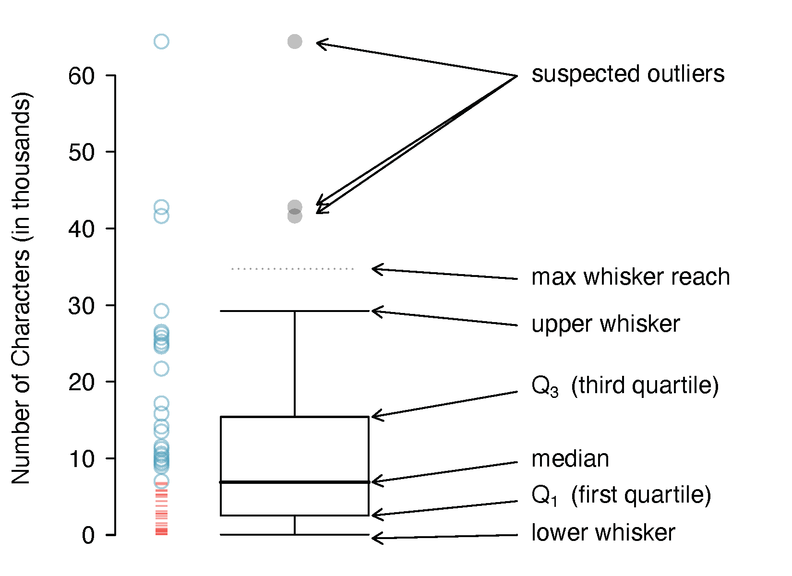

# Exploratory Data Analysis {#eda}

\BeginKnitrBlock{chapterintro}
This chapter focuses on the mechanics and construction of summary statistics and graphs.
We use statistical software for generating the summaries and graphs presented in this chapter and book.
However, since this might be your first exposure to these concepts, we take our time in this chapter to detail how to create them.
Mastery of the content presented in this chapter will be crucial for understanding the methods and techniques introduced in rest of the book.
\EndKnitrBlock{chapterintro}

## Exploring quantitative data {#quantitative-data}

In this section we will explore techniques for summarizing quantitative variables.
For example, consider the `loan_amount` variable from the `loan50` data set, which represents the loan size for all 50 loans in the data set.
This variable is quantitative since we can sensibly discuss the numerical difference of the size of two loans.
On the other hand, area codes and zip codes are not quantitative, but rather they are categorical variables.

Throughout this section and the next, we will apply these methods using the `loan50`, `county`, and `email50` data sets, which were introduced in Section \@ref(data-basics).
If you'd like to review the variables from either data set, see Tables \@ref(tab:loan50Variables) and \@ref(tab:countyVariables).

\BeginKnitrBlock{data}
The `loan50` and `email50` data sets can be found in the [openintro](http://openintrostat.github.io/openintro) package.
The `county` data can be found in the [usdata](https://openintrostat.github.io/usdata/) package.
\EndKnitrBlock{data}

### Scatterplots for paired data {#scatterplots}

\index{data!loan50|(}

A **scatterplot** provides a case-by-case view of data for two quantitative variables.
In Figure \@ref(fig:county-multi-unit-homeownership), a scatterplot was used to examine the homeownership rate against the fraction of housing units that were part of multi-unit properties (e.g. apartments) in the `county` data set.
Another scatterplot is shown in Figure \@ref(fig:loan50-amount-income), comparing the total income of a borrower `total_income` and the amount they borrowed `loan_amount` for the `loan50` data set.
In any scatterplot, each point represents a single case.
Since there are 50 cases in `loan50`, there are 50 points in Figure \@ref(fig:loan50-amount-income).

When examining scatterplots, we describe four features:

1. **Form** - If you were to trace the trend of the points,
   would the trend be _linear_ or _nonlinear_?
2. **Direction** - As values on the _x_-axis increase, do the _y_-values
  tend to  increase (_positive_) or do they decrease (_negative_)?
3. **Strength** - How closely to the points follow a trend?
4. **Unusual observations** or **outliers**- Are there any unusual observations
   that do not seem to match the overall pattern of the scatterplot?

(\#fig:loan50-amount-income)A scatterplot of `loan_amount` versus `total_income` for the `loan50` data set.

Looking at Figure \@ref(fig:loan50-amount-income), we see that there are many 
borrowers with income below \$100,000 on the left side of the graph, while there 
are a handful of borrowers with income above \$250,000. The loan amounts vary from
below \$10,000 to around \$40,000. The data seem to have a _linear_ form, though
the relationship between the two variables is quite _weak_. The direction is
_positive_ -- as total income increases, the loan amount also tends to increase --
and there may be a few unusual observations in the higher income range,
though since the relationship is weak, it is hard to tell.

(\#fig:median-hh-income-poverty)A scatterplot of the median household income against the poverty rate for the `county` dataset. Data are from 2017. A statistical model has also been fit to the data and is shown as a dashed line.

\BeginKnitrBlock{example}
Figure \@ref(fig:median-hh-income-poverty) shows a plot of median household income against the poverty rate for `r nrow(county)` counties.
What can be said about the relationship between these variables?

---

The relationship is evidently **nonlinear**, as highlighted by the dashed line. This is different from previous scatterplots we have seen, which show relationships that do not show much, if any, curvature in the trend.
The relationship is moderate to strong, the direction is negative,
and there does not appear to be any unusual observations.
\EndKnitrBlock{example}

\BeginKnitrBlock{guidedpractice}
What do scatterplots reveal about the data, and how are they useful?^[Answers may vary. Scatterplots are helpful in quickly spotting associations relating variables, whether those associations come in the form of simple trends or whether those relationships are more complex.]
\EndKnitrBlock{guidedpractice}

\BeginKnitrBlock{guidedpractice}
Describe two variables that would have a horseshoe-shaped association in a scatterplot ($\cap$ or $\frown$)^[Consider the case where your vertical axis represents something "good" and your horizontal axis represents something that is only good in moderation. Health and water consumption fit this description: we require some water to survive, but consume too much and it become toxic and can kill a person.]
\EndKnitrBlock{guidedpractice}

### Dot plots and the mean {#dotplots}

Sometimes we are interested in the distribution of a single variable. 
In these cases, a dot plot provides the most basic of displays.
A **dot plot** is a one-variable scatterplot; an example using the interest rate of 50 loans is shown in Figure \@ref(fig:loan-int-rate-dotplot).

(\#fig:loan-int-rate-dotplot)A dot plot of `interest_rate` for the `loan50` dataset. The rates have been rounded to the nearest percent in this plot, and the distribution's mean is shown as a red triangle.

The **mean**, often called the **average** is a common way to measure the center of a **distribution** of data. 
To compute the mean interest rate, we add up all the interest rates and divide by the number of observations.

The sample mean is often labeled $\bar{x}$.
The letter $x$ is being used as a generic placeholder for the variable of interest and the bar over the $x$ communicates we're looking at the average interest rate, which for these 50 loans is 11.57%.
It's useful to think of the mean as the balancing point of the distribution, and it's shown as a triangle in Figure \@ref(fig:loan-int-rate-dotplot).

\BeginKnitrBlock{onebox}
**Mean.**
The sample mean can be calculated as the sum of the observed values divided by the number of observations:

\[ \bar{x} = \frac{x_1 + x_2 + \cdots + x_n}{n} \]
\EndKnitrBlock{onebox}

\BeginKnitrBlock{guidedpractice}
Examine the equation for the mean. What does $x_1$ correspond to? And $x_2$ Can you infer a general meaning to what $n_i$ might represent?^[$x_1$ corresponds to the interest rate for the first loan in the sample, $x_2$ to the second loan's interest rate, and $x_i$ corresponds to the interest rate for the $i^{th}$ loan in the data set. For example, if $i = 4$, then we're examining $x_4$, which refers to the fourth observation in the data set.]
\EndKnitrBlock{guidedpractice}

\BeginKnitrBlock{guidedpractice}
What was $n$ in this sample of loans?^[The sample size was $n = 50$.]
\EndKnitrBlock{guidedpractice}

The `loan50` data set represents a sample from a larger population of loans made through Lending Club.
We could compute a mean for this population in the same way as the sample mean.
However, the population mean has a special label: $\mu$.
The symbol $\mu$ is the Greek letter *mu* and represents the average of all observations in the population.
Sometimes a subscript, such as $_x$, is used to represent which variable the population mean refers to, e.g. $\mu_x$.
Often times it is too expensive to measure the population mean precisely, so we often estimate $\mu$ using the sample mean, $\bar{x}$.

\BeginKnitrBlock{pronunciation}
The Greek letter $\mu$ is pronounced *mu*, listen to the pronunciation [here](https://youtu.be/PStgY5AcEIw?t=47).
\EndKnitrBlock{pronunciation}

\BeginKnitrBlock{example}
The average interest rate across all loans in the population can be estimated using the sample data. Based on the sample of 50 loans, what would be a reasonable estimate of $\mu_x$, the mean interest rate for all loans in the full data set?

---
  
The sample mean, `r {round(loan50_mean_intrest_rate, 2)}`, provides a rough estimate of $\mu_x$. While it is not perfect, this is our single best guess **point estimate**\index{point estimate} of the average interest rate of all the loans in the population under study. In Chapter \@ref(inference-foundations) and beyond, we will develop tools to characterize the accuracy of point estimates, like the sample mean. As you might have guessed, point estimates based on larger samples tend to be more accurate than those based on smaller samples.
\EndKnitrBlock{example}

The mean is useful because it allows us to rescale or standardize a metric into something more easily interpretable and comparable. 
Suppose we would like to understand if a new drug is more effective at treating asthma attacks than the standard drug. 
A trial of 1500 adults is set up, where 500 receive the new drug, and 1000 receive a standard drug in the control group:

<table>
 <thead>
  <tr>
   <th style="text-align:left;">  </th>
   <th style="text-align:center;"> New drug </th>
   <th style="text-align:center;"> Standard drug </th>
  </tr>
 </thead>
<tbody>
  <tr>
   <td style="text-align:left;"> Number of patients </td>
   <td style="text-align:center;"> 500 </td>
   <td style="text-align:center;"> 1000 </td>
  </tr>
  <tr>
   <td style="text-align:left;"> Total asthma attacks </td>
   <td style="text-align:center;"> 200 </td>
   <td style="text-align:center;"> 300 </td>
  </tr>
</tbody>
</table>

Comparing the raw counts of 200 to 300 asthma attacks would make it appear that the new drug is better, but this is an artifact of the imbalanced group sizes.
Instead, we should look at the average number of asthma attacks per patient in each group:

- New drug: $200 / 500 = 0.4$ asthma attacks per patient
- Standard drug: $300 / 1000 = 0.3$ asthma attacks per patient

The standard drug has a lower average number of asthma attacks per patient than the average in the treatment group.

\BeginKnitrBlock{example}
Provide another examples where the mean is useful for making comparisons.

---
  
Emilio opened a food truck last year where he sells burritos, and his business has stabilized over the last 3 months.
Over that 3 month period, he has made $11,000 while working 625 hours.
Emilio's average hourly earnings provides a useful statistic for evaluating whether his venture is, at least from a financial perspective, worth it:

\[ \frac{\$11000}{625\text{ hours}} = \$17.60\text{ per hour} \]
  
By knowing his average hourly wage,
Emilio now has put his earnings into a standard unit that is easier to compare with many other jobs that he might consider.
\EndKnitrBlock{example}

\BeginKnitrBlock{example}
Suppose we want to compute the average income per person in the US. To do so, we might first think to take the mean of the per capita incomes across the 3,142 counties in the \data{county} data set. What would be a better approach?

---
  
The `county` data set is special in that each county actually represents many individual people.
If we were to simply average across the `income` variable, we would be treating counties with 5,000 and 5,000,000 residents equally in the calculations.
Instead, we should compute the total income for each county, add up all the counties' totals, and then divide by the number of people in all the counties.
If we completed these steps with the \data{county} data, we would find that the per capita income for the US is $30,861.
Had we computed the *simple* mean of per capita income across counties, the result would have been just $26,093!

This example used what is called a **weighted mean**.
For more information on this topic, check out the following online supplement regarding [weighted means](https://www.openintro.org/go/?id=stat_extra_weighted_mean).
\EndKnitrBlock{example}

### Histograms and shape {#histograms}

Dot plots show the exact value for each observation. This is useful for small data sets, but they can become hard to read with larger samples. Rather than showing the value of each observation, we prefer to think of the value as belonging to a *bin*. For example, in the `loan50` data set, we created a table of counts for the number of loans with interest rates between 5.0% and 7.5%, then the number of loans with rates between 7.5% and 10.0%, and so on. Observations that fall on the boundary of a bin (e.g. 10.00%) are allocated to the lower bin. This tabulation is shown in Table \@ref(tab:binnedIntRateAmountTable). These binned counts are plotted as bars in Figure \@ref(fig:loan50IntRateHist) into what is called a **histogram**, which resembles a more heavily binned version of the stacked dot plot shown in Figure \@ref(fig:loan-int-rate-dotplot).

<table>
<caption>(\#tab:binnedIntRateAmountTable)Counts for the binned `interest_rate` data.</caption>
 <thead>
  <tr>
   <th style="text-align:left;"> Interest rate </th>
   <th style="text-align:center;"> 5% - 7.5% </th>
   <th style="text-align:center;"> 7.5% - 10% </th>
   <th style="text-align:center;"> 10% - 12.5% </th>
   <th style="text-align:center;"> 12.5% - 15% </th>
   <th style="text-align:center;"> 15% - 17.5% </th>
   <th style="text-align:center;"> 17.5% - 20% </th>
   <th style="text-align:center;"> 20% - 22.5% </th>
   <th style="text-align:center;"> 22.5% - 25% </th>
   <th style="text-align:center;"> 25% - 27.5% </th>
  </tr>
 </thead>
<tbody>
  <tr>
   <td style="text-align:left;"> Count </td>
   <td style="text-align:center;"> 11 </td>
   <td style="text-align:center;"> 15 </td>
   <td style="text-align:center;"> 8 </td>
   <td style="text-align:center;"> 4 </td>
   <td style="text-align:center;"> 5 </td>
   <td style="text-align:center;"> 4 </td>
   <td style="text-align:center;"> 1 </td>
   <td style="text-align:center;"> 1 </td>
   <td style="text-align:center;"> 1 </td>
  </tr>
</tbody>
</table>

(\#fig:loan50IntRateHist)A histogram of `interest_rate`. This distribution is strongly skewed to the right.

Histograms provide a view of the **data density**. Higher bars represent where the data are relatively more common. For instance, there are many more loans with rates between 5% and 10% than loans with rates between 20% and 25% in the data set. The bars make it easy to see how the density of the data changes relative to the interest rate.

Histograms are especially convenient for understanding the shape of the data distribution. Figure \@ref(fig:loan50IntRateHist) suggests that most loans have rates under 15%, while only a handful of loans have rates above 20%. When data trail off to the right in this way and has a longer right **tail**, the shape is said to be **right skewed**[^1]

[^1]: Other ways to describe data that are right skewed: skewed to the right, skewed to the high end, or skewed to the positive end.

Data sets with the reverse characteristic -- a long, thinner tail to the left -- are said to be **left skewed**. We also say that such a distribution has a long left tail. Data sets that show roughly equal trailing off in both directions are called **symmetric**.

\BeginKnitrBlock{onebox}
When data trail off in one direction, the distribution has a **long tail**.
If a distribution has a long left tail, it is left skewed.
If a distribution has a long right tail, it is right skewed.
\EndKnitrBlock{onebox}

\BeginKnitrBlock{guidedpractice}
Besides the mean (since it was labeled), what can you see in the dot plot in Figure \@ref(fig:loan-int-rate-dotplot) that you cannot see in the histogram in Figure \@ref(fig:loan50IntRateHist)?^[The interest rates for individual loans.]
\EndKnitrBlock{guidedpractice}

In addition to looking at whether a distribution is skewed or symmetric, histograms can be used to identify modes. A **mode** is represented by a prominent peak in the distribution. There is only one prominent peak in the histogram of `interest_rate`.

A definition of *mode* sometimes taught in math classes is the value with the most occurrences in the data set. However, for many real-world data sets, it is common to have *no* observations with the same value in a data set, making this definition impractical in data analysis.

Figure \@ref(fig:singleBiMultiModalPlots) shows histograms that have one, two, or three prominent peaks. Such distributions are called **unimodal**, **bimodal**, and **multimodal**, respectively. Any distribution with more than 2\~prominent peaks is called multimodal. Notice that there was one prominent peak in the unimodal distribution with a second less prominent peak that was not counted since it only differs from its neighboring bins by a few observations.

(\#fig:singleBiMultiModalPlots)Counting only prominent peaks, the distributions are (left to right) unimodal, bimodal, and multimodal. Note that the left plot is unimodal because we are counting prominent peaks, not just any peak.

\BeginKnitrBlock{example}
Figure \@ref(fig:loan50IntRateHist) reveals only one prominent mode in the interest rate. Is the distribution unimodal, bimodal, or multimodal?^[Unimodal Remember that *uni* stands for 1 (think *uni*cycles). Similarly, *bi* stands for 2 (think *bi*cycles). We are hoping a *multi*cycle will be invented to complete this analogy.]
\EndKnitrBlock{example}

\BeginKnitrBlock{guidedpractice}
Height measurements of young students and adult teachers at a K-3 elementary school were taken.
How many modes would you expect in this height data set?^[There might be two height groups visible in the data set: one of the students and one of the adults. That is, the data are probably bimodal.].
\EndKnitrBlock{guidedpractice}

Looking for modes isn't about finding a clear and correct answer about the number of modes in a distribution, which is why *prominent*\index{prominent} is not rigorously defined in this book. The most important part of this examination is to better understand your data.

### Boxplots and the median {#boxplots}

A **boxplot**\index{boxplot} (or box-and-whisker plot) summarizes a data set using five statistics while
also plotting unusual observations. The five statistics---minimum, first quartile, 
median, third quartile, maximum---together are called the **five number summary**\index{five number summary}. 
Figure \@ref(fig:boxPlotLayoutNumVar) provides a vertical dot plot alongside a box plot of the \var{num\_\hspace{0.3mm}char} variable from the \data{email50} data set.

(\#fig:boxPlotLayoutNumVar)A vertical dot plot next to a labeled box plot for the number of characters in 50 emails. The median (6.89), splits the data into the bottom 50% and the top 50%, marked in the dot plot by horizontal dashes and open circles, respectively.

The first step in building a box plot is drawing a dark line denoting the 
**median**\index{median}, which splits the data in half. Figure 
\@ref(fig:boxPlotLayoutNumVar) shows 50% of the data falling below
the median (dashes) and other 50% falling above the median (open circles).
There are 50 character counts in the data set (an even number) so the data are 
perfectly split into two groups of 25. We take the median in this case to be the 
average of the two observations closest to the 50^th^ percentile: $(6.768 + 7.012)/2 = 6.890$. When there are an odd number of observations, there will be exactly one observation that splits the data into two halves, and in this case that observation is the median (no average needed). 

\BeginKnitrBlock{onebox}
**Median.**  If the data are ordered from smallest to largest, the sample median is the observation 
right in the middle. If there are an even number of observations, there will be two 
values in the middle, and the median is taken as their average.

If we denote the sample size by $n$, then

* if $n$ is odd, the median is the $[(n+1)/2]^{th}$ smallest value in the data set, and
* if $n$ is even, the median is the average of the $(n/2)^{th}$ and $(n/2+1)^{th}$ smallest values in the data set.
\EndKnitrBlock{onebox}

The second step in building a box plot is drawing a rectangle to represent
the area of the middle 50% of the data. The total length of the box,
shown vertically in Figure \@ref(fig:boxPlotLayoutNumVar), is called the
**interquartile range** (IQR, for short)\index(interquartile range, IQR). It is a 
measure of **variability** in data. The more variable the data, the larger the IQR.
The two boundaries of the box are called the **first quartile**\index{first quartile} 
(the 25^th^ percentile, i.e., 25% of the data fall below this value) and the **third 
quartile**\index{third quartile} (the 75^th^ percentile), and these are often labeled 
$Q_1$  and $Q_3$, respectively. (In case you're wondering, the median is the 2^nd^ quartile! These three quartiles break the data into four groups of equal size.)

\BeginKnitrBlock{onebox}
**Interquartile range (IQR).**  The IQR is the length of the box in a box plot---the
range of the middle 50% of the data.
It is computed as

\[IQR = Q_3 - Q_1,\]
  
where $Q_1$ and $Q_3$ are the 25^th^ and 75^th^ percentiles.
\EndKnitrBlock{onebox}

\BeginKnitrBlock{guidedpractice}
What percent of the data fall between $Q_1$ and the median?
What percent is between the median and $Q_3$?^[Since $Q_1$ and $Q_3$ capture the middle 50% of the data, and the median splits the data in the middle, 25% of the data fall between $Q_1$ and the median, and another 25% falls between the median and $Q_3$.]
\EndKnitrBlock{guidedpractice}

Extending out from the box, the **whiskers** attempt to capture the data
outside of the box; however, their reach is never allowed to be more than $1.5\times IQR$.^[While the choice of exactly 1.5 is arbitrary, it is the most commonly used value for box plots.]
They capture everything within this reach. In Figure \@ref(fig:boxPlotLayoutNumVar), 
the upper whisker does not extend to the last three points, which are beyond
$Q_3 + 1.5\times IQR$, and so it extends only to the last point below this limit.
The lower whisker stops at the lowest value, 33, since there is no additional data
to reach; the lower whisker's limit is not shown in the figure because the plot does not extend down to $Q_1 - 1.5\times IQR$. In a sense, the box is like the body of the box plot and the whiskers are like its arms trying to reach the rest of the data.

\BeginKnitrBlock{tip}
The whiskers extend to actual data points---not the limits for outliers. That is,
the values $Q_1 - 1.5\times IQR$ and $Q_3 + 1.5\times IQR$ should not be shown
on the plot.
\EndKnitrBlock{tip}

Any observation that lies beyond the whiskers is labeled with a dot. The purpose of 
labeling these points---instead of just extending the whiskers to the minimum and 
maximum observed values---is to help identify any observations that appear to be 
unusually distant from the rest of the data. Unusually distant observations are called 
**outliers**\index{outlier}. In this case, it would be reasonable to classify the 
emails with character counts of 41.623, 42.793, and 64.401 as outliers
since they are numerically distant from most of the data.

\BeginKnitrBlock{onebox}
**Outliers are extreme.** An outlier is an observation that is extreme, relative to the rest of the data.
\EndKnitrBlock{onebox}

\BeginKnitrBlock{tip}
Examination of data for possible outliers serves many useful purposes, including:
  
* Identifying strong skewness in the distribution
* Identifying data collection or entry errors. For instance, we re-examined the email purported to have 64.401 characters to ensure this value was accurate.
* Providing insight into interesting properties of the data.
\EndKnitrBlock{tip}

\BeginKnitrBlock{guidedpractice}
The observation 64.401, an outlier, was found to be an accurate observation.
What would such an observation suggest about the nature of character counts in 
emails?^[That occasionally there may be very long emails.]
\EndKnitrBlock{guidedpractice}

\BeginKnitrBlock{guidedpractice}
Using Figure \@ref(fig:boxPlotLayoutNumVar), estimate the following values for `num_char` in the `email50` data set: 
  
a. $Q_1$
b. $Q_3$
c. $IQR$.^[These visual estimates will vary a little from one person to the next: 
           $Q_1\approx$ 3.000, $Q_3\approx$ 15.000, $IQR = Q_3 - Q_1 \approx$ 12.000. (The true values: $Q_1=$ 2.536, $Q_3=$ 15.411, $IQR=$ 12.875.)]
\EndKnitrBlock{guidedpractice}

### Robust statistics

<!-- How are the \indexthis{sample statistics}{sample statistic} of the \data{num\_\hspace{0.3mm}char} data set affected by the observation, 64,401? What would have happened if this email wasn't observed? What would happen to these \indexthis{summary statistics}{summary statistic} if the observation at 64,401 had been even larger, say 150,000? These scenarios are plotted alongside the original data in Figure~\ref{email50NumCharDotPlotRobustEx}, and sample statistics are computed under each scenario in Table~\ref{robustOrNotTable}. -->

<!-- \begin{figure}[ht] -->
<!-- \centering -->
<!-- \includegraphics[width=\textwidth]{01/figures/email50NumCharDotPlotRobustEx/email50NumCharDotPlotRobustEx} -->
<!-- \caption{Dot plots of the original character count data and two modified data sets.} -->
<!-- \label{email50NumCharDotPlotRobustEx} -->
<!-- \end{figure} -->

<!-- \begin{table}[ht] -->
<!-- \centering -->
<!-- \begin{tabular}{l c cc c cc} -->
<!--   \hline -->
<!-- & \hspace{0mm} & \multicolumn{2}{c}{\bf robust} & \hspace{2mm} & \multicolumn{2}{c}{\bf not robust} \\ -->
<!-- scenario && median & IQR && $\bar{x}$ & $s$ \\  -->
<!--   \hline -->
<!-- original \var{num\_\hspace{0.3mm}char} data 	&& 6,890 & 12,875 && 11,600 & 13,130 \\ -->
<!-- % library(openintro); data(email50); d <- email50$num_char; median(d); diff(quantile(d, c(0.25,0.75))); mean(d); sd(d) -->
<!-- drop 66,924 observation		&& 6,768 & 11,702 && 10,521 & 10,798 \\ -->
<!-- % library(openintro); data(email50); d <- email50$num_char; d <- d[-which.max(d)]; median(d); diff(quantile(d, c(0.25,0.75))); mean(d); sd(d) -->
<!-- move 66,924 to 150,000		&& 6,890 & 12,875 && 13,310 & 22,434 \\ -->
<!-- % library(openintro); data(email50); d <- email50$num_char; d[which.max(d)] <- 100000; median(d); diff(quantile(d, c(0.25,0.75))); mean(d); sd(d) -->
<!--    \hline -->
<!-- \end{tabular} -->
<!-- \caption{A comparison of how the median, IQR, mean ($\bar{x}$), and standard deviation ($s$) change when extreme observations are present.} -->
<!-- \label{robustOrNotTable} -->
<!-- \end{table} -->

<!-- \begin{exercise} \label{numCharWhichIsMoreRobust} -->
<!-- (a) Which is more affected by extreme observations, the mean or median? Table~\ref{robustOrNotTable} may be helpful. (b) Is the standard deviation or IQR more affected by extreme observations?\footnote{(a) Mean is affected more. (b) Standard deviation is affected more. Complete explanations are provided in the material following Guided Practice~\ref{numCharWhichIsMoreRobust}.} -->
<!-- \end{exercise} -->

<!-- The median and IQR are called \term{robust estimates} because extreme observations have little effect on their values. The mean and standard deviation are much more affected by changes in extreme observations. -->

<!-- \begin{example}{The median and IQR do not change much under the three scenarios in Table~\ref{robustOrNotTable}. Why might this be the case?} -->
<!-- The median and IQR are only sensitive to numbers near $Q_1$, the median, and $Q_3$. Since values in these regions are relatively stable -- there aren't large jumps between observations -- the median and IQR estimates are also quite stable. -->
<!-- \end{example} -->

<!-- \begin{exercise} -->
<!-- The distribution of vehicle prices tends to be right skewed, with a few luxury and sports cars lingering out into the right tail. If you were searching for a new car and cared about price, should you be more interested in the mean or median price of vehicles sold, assuming you are in the market for a regular car?\footnote{Buyers of a ``regular car'' should be concerned about the median price. High-end car sales can drastically inflate the mean price while the median will be more robust to the influence of those sales.} -->
<!-- \end{exercise} -->

### Comparing distributions {#distributions}

- center, shape (symmetric, skewed, normal), spread, outliers
- side-by-side boxplots, stacked dotplots/histograms

### Mapping data (special topic)

<!-- The \data{county} data set offers many numerical variables that we could plot using dot plots, scatterplots, or box plots, but these miss the true nature of the data. Rather, when we encounter geographic data, we should map it using an \term{intensity map}, where colors are used to show higher and lower values of a variable. Figures~\ref{countyIntensityMaps1} and~\ref{countyIntensityMaps2} shows intensity maps for federal spending per capita (\var{fed\_\hspace{0.3mm}spend}), poverty rate in percent (\var{poverty}), homeownership rate in percent (\var{homeownership}), and median household income (\var{med\_\hspace{0.3mm}income}). The color key indicates which colors correspond to which values. Note that the intensity maps are not generally very helpful for getting precise values in any given county, but they are very helpful for seeing geographic trends and generating interesting research questions. -->

<!-- \begin{figure} -->
<!-- \centering -->
<!-- \subfigure[]{\includegraphics[width=\textwidth]{01/figures/countyIntensityMaps/countyFedSpendMap}\label{countyFedSpendMap}} -->
<!-- \subfigure[]{\includegraphics[width=\textwidth]{01/figures/countyIntensityMaps/countyPovertyMap}\label{countyPovertyMap}} -->
<!-- \caption{\subref{countyFedSpendMap} Map of federal spending (dollars per capita). \subref{countyPovertyMap} Intensity map of poverty rate (percent).} -->
<!-- \label{countyIntensityMaps1} -->
<!-- \end{figure} -->

<!-- \begin{figure} -->
<!-- \centering -->
<!-- \subfigure[]{\includegraphics[width=\textwidth]{01/figures/countyIntensityMaps/countyHomeownershipMap}\label{countyHomeownershipMap}} -->
<!-- \subfigure[]{\includegraphics[width=\textwidth]{01/figures/countyIntensityMaps/countyMedIncomeMap}\label{countyMedIncomeMap}} -->
<!-- \caption{\subref{countyHomeownershipMap} Intensity map of homeownership rate (percent). \subref{countyMedIncomeMap} Intensity map of median household income (\$1000s).} -->
<!-- \label{countyIntensityMaps2} -->
<!-- \end{figure} -->

<!-- \begin{example}{What interesting features are evident in the \var{fed\_\hspace{0.3mm}spend} and \var{poverty} intensity maps?} -->
<!-- The federal spending intensity map shows substantial spending in the Dakotas and along the central-to-western part of the Canadian border, which may be related to the oil boom in this region. There are several other patches of federal spending, such as a vertical strip in eastern Utah and Arizona and the area where Colorado, Nebraska, and Kansas meet. There are also seemingly random counties with very high federal spending relative to their neighbors. If we did not cap the federal spending range at \$18 per capita, we would actually find that some counties have extremely high federal spending while there is almost no federal spending in the neighboring counties. These high-spending counties might contain military bases, companies with large government contracts, or other government facilities with many employees. -->

<!-- Poverty rates are evidently higher in a few locations. Notably, the deep south shows higher poverty rates, as does the southwest border of Texas. The vertical strip of eastern Utah and Arizona, noted above for its higher federal spending, also appears to have higher rates of poverty (though generally little correspondence is seen between the two variables).  High poverty rates are evident in the Mississippi flood plains a little north of New Orleans and also in a large section of Kentucky and West Virginia. -->
<!-- \end{example} -->

<!-- \begin{exercise} -->
<!-- What interesting features are evident in the \var{med\_\hspace{0.3mm}income} intensity map?\footnote{Note: answers will vary. There is a very strong correspondence between high earning and metropolitan areas. You might look for large cities you are familiar with and try to spot them on the map as dark spots.} -->
<!-- \end{exercise} -->

## Exploring categorical data {#categorical-data}

Like numerical data, categorical data can also be organized
and analyzed. This section introduces tables and other basic
tools for categorical data that are used throughout this book.
The `email` data set contains information
on 3,921 emails. In this section, we will examine whether the
presence of numbers, small or large, in an email provides any
useful value in classifying email as spam or not spam.

### Contingency tables and conditional proportions

- One-way and Two-way/contingency tables 
- Define frequencies/counts and relative frequencies/proportions
- association vs no association in conditional proportions
- Bayes theorem with tables and trees - conditional vs unconditional probabilities

Table \@ref(tab:emailTable) summarizes two variables:
`Type` (spam or not spam) and `Number`. `Number` is a
categorical variable that describes whether an email
contains no numbers, only small numbers (values under 1 million),
or at least one big number (a value of 1 million or more).
A table that summarizes data for two categorical variables
in this way is called a **contingency table** or **two-way table**.
Each value in the table represents the number of times, or **frequency**
a particular combination of variable outcomes occurred.
For example, the value 149 corresponds to the number of emails
in the data set that are spam _and_ had no number listed in the email.
Row and column totals are also included.
The **row totals** provide the total counts across each row
(e.g., $149 + 168 + 50 = 367$), and **column totals** are total
counts down each column.

A table for a single variable is called a **frequency table**. Table
\@ref(tab:emailTableNumber) is a frequency table for the `Number` variable.
If we replaced the counts with percentages or proportions,
the table would be called a **relative frequency table**.

<table>
<caption>(\#tab:emailTable)Contingency table of `Type` and `Number` variables.</caption>
 <thead>
  <tr>
   <th style="text-align:left;">   </th>
   <th style="text-align:right;"> none </th>
   <th style="text-align:right;"> small </th>
   <th style="text-align:right;"> big </th>
   <th style="text-align:right;"> Total </th>
  </tr>
 </thead>
<tbody>
  <tr>
   <td style="text-align:left;"> spam </td>
   <td style="text-align:right;"> 149 </td>
   <td style="text-align:right;"> 168 </td>
   <td style="text-align:right;"> 50 </td>
   <td style="text-align:right;"> 367 </td>
  </tr>
  <tr>
   <td style="text-align:left;"> not spam </td>
   <td style="text-align:right;"> 400 </td>
   <td style="text-align:right;"> 2659 </td>
   <td style="text-align:right;"> 495 </td>
   <td style="text-align:right;"> 3554 </td>
  </tr>
  <tr>
   <td style="text-align:left;"> Total </td>
   <td style="text-align:right;"> 549 </td>
   <td style="text-align:right;"> 2827 </td>
   <td style="text-align:right;"> 545 </td>
   <td style="text-align:right;"> 3921 </td>
  </tr>
</tbody>
</table>

<table>
<caption>(\#tab:emailTableNumber)Frequency table of `Number` variable.</caption>
 <thead>
  <tr>
   <th style="text-align:right;"> none </th>
   <th style="text-align:right;"> small </th>
   <th style="text-align:right;"> big </th>
  </tr>
 </thead>
<tbody>
  <tr>
   <td style="text-align:right;"> 549 </td>
   <td style="text-align:right;"> 2827 </td>
   <td style="text-align:right;"> 545 </td>
  </tr>
</tbody>
</table>

### Bar plots and mosaic plots
- one cat bar plot
- two cat bar plot
- two cat mosaic plot
- association vs no association in bar plots

### Why not pie charts?

