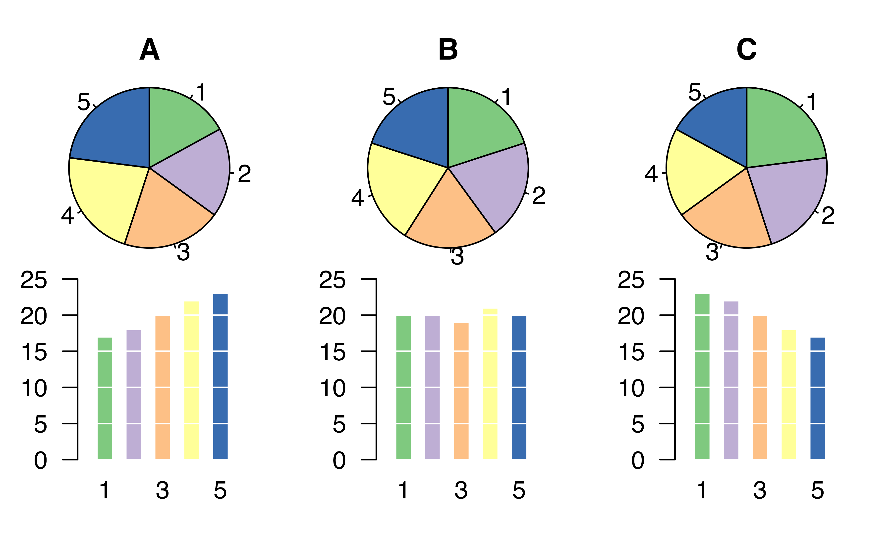
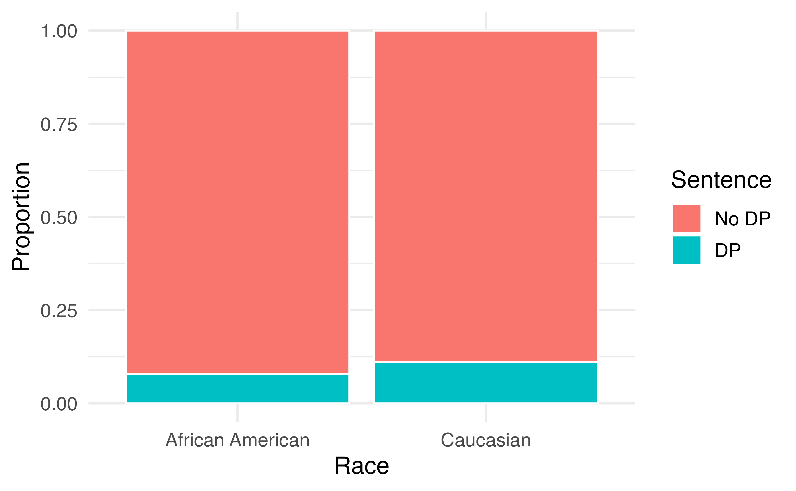
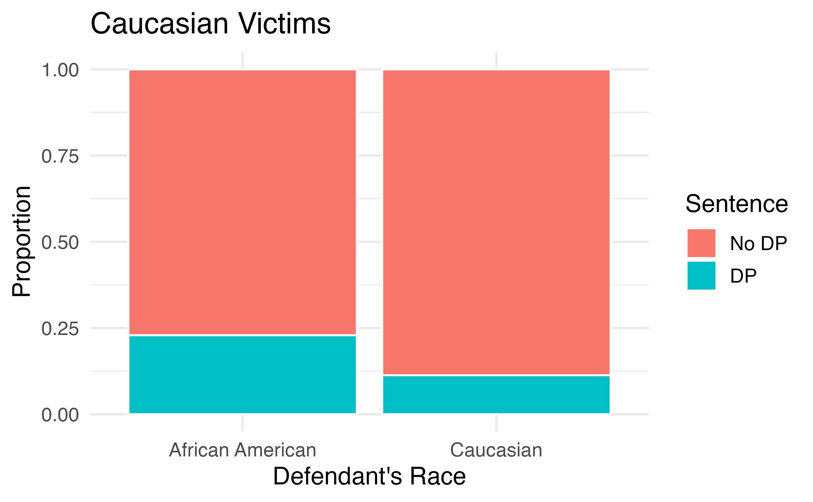
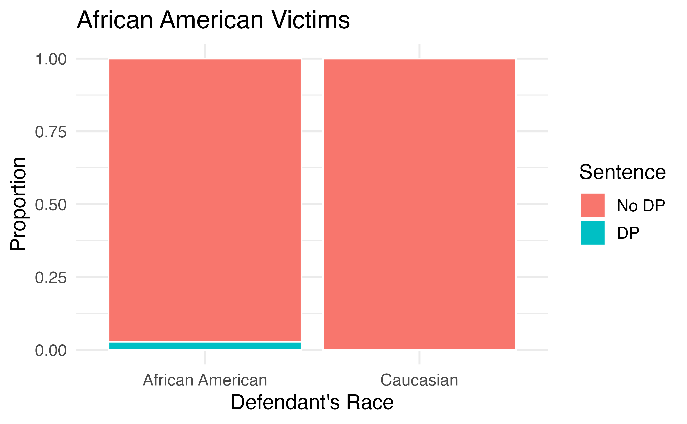
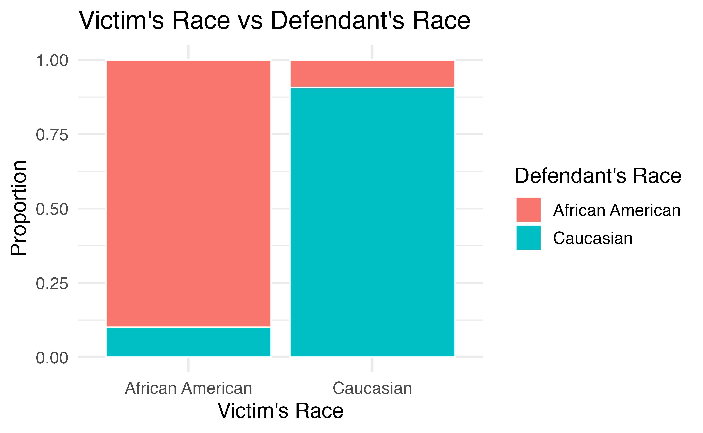
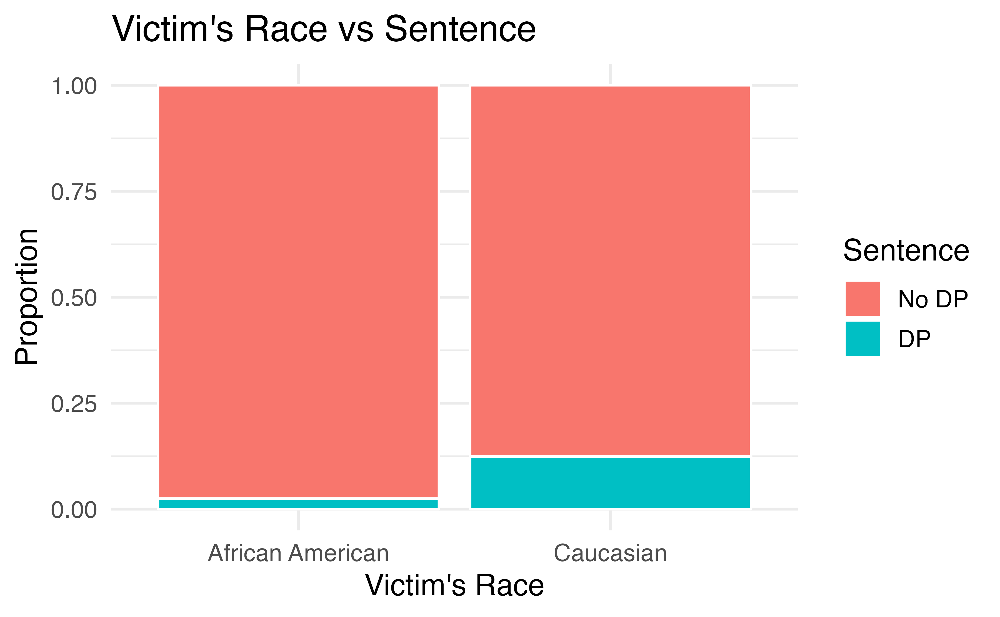

# (PART) Exploratory data analysis {.unnumbered}

# Exploring categorical data {#explore-categorical}
<!-- Old reference: #categorical-data} -->

::: {.chapterintro}
This chapter focuses on exploring **categorical** data using summary statistics and visualizations.
The summaries and graphs presented in this chapter are created using statistical software; however, since this might be your first exposure to the concepts, we take our time in this chapter to detail how to create them.
Where possible, we present multivariate plots; plots that visualize the relationship between multiple variables.
Mastery of the content presented in this chapter will be crucial for understanding the methods and techniques introduced in the rest of the book.
:::

In this chapter, we will introduce tables and other basic tools for organizing and analyzing categorical data that are used throughout this book. Table \@ref(tab:emailDF) displays the first six rows of the `email` data set containing information on 3,921 emails sent to David Diez's Gmail account (one of the authors of the _OpenIntro_ textbooks). In this section we will examine whether the presence of numbers, small or large, in an email provides any useful value in classifying email as spam or not spam.
Descriptions of all five email variables are given in Table \@ref(tab:emailVariables).

::: {.data}
The `email` data can be found in the [openintro](http://openintrostat.github.io/openintro/reference/index.html) package.^[The `email` data set found in the `openintro` package defines the variable `spam` as 0 (not spam) or 1 (spam), and `format` as 0 (not HTML) or 1 (HTML). When variables are defined in this way---coded as the numbers 0 and 1 rather than the category names---they are called **indicator variables*** or **dummy variables**. In this section of the textbook, we have re-coded `spam` to be the variable `type`, which takes on values "not spam" or "spam", and we have re-coded the variable `format` to take on values "not HTML" or "HTML".]
:::

<table>
<caption>(\#tab:emailDF)Six rows from the `email` data set.</caption>
 <thead>
  <tr>
   <th style="text-align:left;">   </th>
   <th style="text-align:left;"> type </th>
   <th style="text-align:right;"> num_char </th>
   <th style="text-align:right;"> line_breaks </th>
   <th style="text-align:left;"> format </th>
   <th style="text-align:left;"> number </th>
  </tr>
 </thead>
<tbody>
  <tr>
   <td style="text-align:left;"> 1 </td>
   <td style="text-align:left;"> not spam </td>
   <td style="text-align:right;"> 11.37 </td>
   <td style="text-align:right;"> 202 </td>
   <td style="text-align:left;"> HTML </td>
   <td style="text-align:left;"> big </td>
  </tr>
  <tr>
   <td style="text-align:left;"> 2 </td>
   <td style="text-align:left;"> not spam </td>
   <td style="text-align:right;"> 10.50 </td>
   <td style="text-align:right;"> 202 </td>
   <td style="text-align:left;"> HTML </td>
   <td style="text-align:left;"> small </td>
  </tr>
  <tr>
   <td style="text-align:left;"> 3 </td>
   <td style="text-align:left;"> not spam </td>
   <td style="text-align:right;"> 7.77 </td>
   <td style="text-align:right;"> 192 </td>
   <td style="text-align:left;"> HTML </td>
   <td style="text-align:left;"> small </td>
  </tr>
  <tr>
   <td style="text-align:left;"> 4 </td>
   <td style="text-align:left;"> not spam </td>
   <td style="text-align:right;"> 13.26 </td>
   <td style="text-align:right;"> 255 </td>
   <td style="text-align:left;"> HTML </td>
   <td style="text-align:left;"> small </td>
  </tr>
  <tr>
   <td style="text-align:left;"> 5 </td>
   <td style="text-align:left;"> not spam </td>
   <td style="text-align:right;"> 1.23 </td>
   <td style="text-align:right;"> 29 </td>
   <td style="text-align:left;"> not HTML </td>
   <td style="text-align:left;"> none </td>
  </tr>
  <tr>
   <td style="text-align:left;"> 6 </td>
   <td style="text-align:left;"> not spam </td>
   <td style="text-align:right;"> 1.09 </td>
   <td style="text-align:right;"> 25 </td>
   <td style="text-align:left;"> not HTML </td>
   <td style="text-align:left;"> none </td>
  </tr>
</tbody>
</table>

<table>
<caption>(\#tab:emailVariables)Variables and their descriptions for the `email` data set.</caption>
 <thead>
  <tr>
   <th style="text-align:left;"> variable </th>
   <th style="text-align:left;"> description </th>
  </tr>
 </thead>
<tbody>
  <tr>
   <td style="text-align:left;"> type </td>
   <td style="text-align:left;"> Whether the email was spam or not spam. </td>
  </tr>
  <tr>
   <td style="text-align:left;"> num_char </td>
   <td style="text-align:left;"> The number of characters in the email, in thousands. </td>
  </tr>
  <tr>
   <td style="text-align:left;"> line_breaks </td>
   <td style="text-align:left;"> The number of line breaks in the email (does not count text wrapping). </td>
  </tr>
  <tr>
   <td style="text-align:left;"> format </td>
   <td style="text-align:left;"> Whether the email was written using HTML (e.g., may have included bolding or active links) or not. </td>
  </tr>
  <tr>
   <td style="text-align:left;"> number </td>
   <td style="text-align:left;"> Categorical variable saying whether there was no number, a small number (under 1 million), or a big number. </td>
  </tr>
</tbody>
</table>

## Contingency tables and conditional proportions

A summary table for a single categorical variable that reports the number of observations (frequency) in each category is called a **frequency table**. Table
\@ref(tab:emailTableNumber) is a frequency table for the `number` variable.
If we replaced the counts with percentages or proportions (relative frequencies),
the table would be called a **relative frequency table**.

<table>
<caption>(\#tab:emailTableNumber)Frequency table of `Number` variable.</caption>
 <thead>
  <tr>
   <th style="text-align:right;"> none </th>
   <th style="text-align:right;"> small </th>
   <th style="text-align:right;"> big </th>
  </tr>
 </thead>
<tbody>
  <tr>
   <td style="text-align:right;"> 549 </td>
   <td style="text-align:right;"> 2827 </td>
   <td style="text-align:right;"> 545 </td>
  </tr>
</tbody>
</table>

Table \@ref(tab:emailTable) summarizes two variables:
`type` (spam or not spam) and `number`. A table that summarizes data for two categorical variables
in this way is called a **contingency table** or **two-way table**.
Each value in the table represents the number of times, or **frequency**
a particular combination of variable outcomes occurred.
For example, the value 149 corresponds to the number of emails
in the data set that are not spam _and_ had no number listed in the email.
Row and column totals are also included.
The **row totals** provide the total counts across each row
(e.g., there are $149 + 168 + 50 = 367$ emails classified as not spam), and **column totals** are total
counts down each column.

In this textbook, we generally take the convention of putting the categories of the explanatory variable as the columns and the categories of the response variable as the rows (if there exists and explanatory-response relationship between the two variables).

<table class="table" style="margin-left: auto; margin-right: auto;">
<caption>(\#tab:emailTable)Contingency table of `number` (cols) and `type` (rows) variables.</caption>
 <thead>
<tr>
<th style="empty-cells: hide;border-bottom:hidden;" colspan="1"></th>
<th style="empty-cells: hide;border-bottom:hidden;" colspan="1"></th>
<th style="border-bottom:hidden;padding-bottom:0; padding-left:3px;padding-right:3px;text-align: center; " colspan="3">
`number`
</th>
<th style="empty-cells: hide;border-bottom:hidden;" colspan="1"></th>
</tr>
  <tr>
   <th style="text-align:left;">  </th>
   <th style="text-align:left;">  </th>
   <th style="text-align:left;"> none </th>
   <th style="text-align:left;"> small </th>
   <th style="text-align:left;"> big </th>
   <th style="text-align:left;"> Total </th>
  </tr>
 </thead>
<tbody>
  <tr>
   <td style="text-align:left;">  </td>
   <td style="text-align:left;"> spam </td>
   <td style="text-align:left;"> 400 </td>
   <td style="text-align:left;"> 2659 </td>
   <td style="text-align:left;"> 495 </td>
   <td style="text-align:left;"> 3554 </td>
  </tr>
  <tr>
   <td style="text-align:left;"> type </td>
   <td style="text-align:left;"> not spam </td>
   <td style="text-align:left;"> 149 </td>
   <td style="text-align:left;"> 168 </td>
   <td style="text-align:left;"> 50 </td>
   <td style="text-align:left;"> 367 </td>
  </tr>
  <tr>
   <td style="text-align:left;">  </td>
   <td style="text-align:left;"> Total </td>
   <td style="text-align:left;"> 549 </td>
   <td style="text-align:left;"> 2827 </td>
   <td style="text-align:left;"> 545 </td>
   <td style="text-align:left;"> 3921 </td>
  </tr>
</tbody>
</table>

We would like to examine whether the presence of numbers---none, small or large---in an email provides any useful value in classifying email as spam or not spam---that is, is there an **association** between the variables `number` and `type`? 

::: {.guidedpractice}
To determine if a relationship exists between whether an email is spam or not, and whether the email has no numbers, a small number, or a big number, why isn't it helpful to compare the _number_ of spam emails across the `number` categories?^[Since the sample sizes in the three `number` categories differ (549 emails with no numbers; 2827 emails with a small number; 545 emails with a big number), we need to compare the _proportion_ of spam emails across categories rather than the count.]
:::

The proportion of emails that were classified as spam in the data set is $3554/3921 = 0.906$, or about 91%. Let's compare this **unconditional proportion** to the **conditional proportions** of spam _within_ each `number` category: $400/549 \approx 73\%$ of emails with no numbers are spam; $2659/2827 \approx 94\%$ of emails with small numbers are spam; and $495/545 \approx 91\%$ of emails with big numbers are spam. Since these three conditional proportions differ, we say the variables `number` and `type` are _associated_ in this data set. Note that some differ from the overall, or unconditional, proportion of spam emails in the data set---91%.

::: {.onebox}
**Association between two categorical variables.**
  
An **unconditional** proportion is a proportion measured out of the total sample size. A **conditional** proportion is a proportion measured out of a subgroup in the sample.

If the conditional proportions of a particular outcome (e.g., spam email) within levels of a categorical variable (e.g., whether no number, a small number, or a big number appears in the email) differ across levels, we say those two variables are **associated**. We can also determine if two categorical variables are associated by checking if any of the conditional proportions of the outcome within categories differ from the overall, or **unconditional** proportion.
:::

### Row and column proportions

Conditional proportions that condition on a row category are called **row proportions**; conditional proportions that condition on a column category
are called **column proportions**. 

Table \@ref(tab:rowPropSpamNumber) shows the row proportions for Table \@ref(tab:emailTable). The row proportions are computed as the counts divided by their row totals. The frequnecy 149 at the intersection of `not spam` and `none` is replaced by $149/367=0.406$, i.e., 149 divided by its row total, 367. So what does 0.406 represent? It corresponds to the conditional proportion of non-spam emails in the sample that do not have any numbers.

<table class="table" style="margin-left: auto; margin-right: auto;">
<caption>(\#tab:rowPropSpamNumber)A contingency table with row proportions for the `type` and `number` variables.</caption>
 <thead>
  <tr>
   <th style="text-align:left;">   </th>
   <th style="text-align:right;"> none </th>
   <th style="text-align:right;"> small </th>
   <th style="text-align:right;"> big </th>
  </tr>
 </thead>
<tbody>
  <tr>
   <td style="text-align:left;"> spam </td>
   <td style="text-align:right;"> 0.113 </td>
   <td style="text-align:right;"> 0.748 </td>
   <td style="text-align:right;"> 0.139 </td>
  </tr>
  <tr>
   <td style="text-align:left;"> not spam </td>
   <td style="text-align:right;"> 0.406 </td>
   <td style="text-align:right;"> 0.458 </td>
   <td style="text-align:right;"> 0.136 </td>
  </tr>
</tbody>
</table>

A contingency table of the column proportions is computed in a similar way, where each column proportion is computed as the count divided by the corresponding column total. Table \@ref(tab:colPropSpamNumber) shows such a table, and here the value 0.729 indicates that 72.9% of emails with no numbers were spam. This rate of spam is much lower than emails with only small numbers (94.1%) or big numbers (90.8%). Because these spam rates vary between the three levels of `number` (`none`, `small`, `big`), this provides evidence that the `spam` and `number` variables are associated in this data set.

<table class="table" style="margin-left: auto; margin-right: auto;">
<caption>(\#tab:colPropSpamNumber)A contingency table with column proportions for the `type` and `number` variables.</caption>
 <thead>
  <tr>
   <th style="text-align:left;">   </th>
   <th style="text-align:right;"> none </th>
   <th style="text-align:right;"> small </th>
   <th style="text-align:right;"> big </th>
  </tr>
 </thead>
<tbody>
  <tr>
   <td style="text-align:left;"> spam </td>
   <td style="text-align:right;"> 0.729 </td>
   <td style="text-align:right;"> 0.941 </td>
   <td style="text-align:right;"> 0.908 </td>
  </tr>
  <tr>
   <td style="text-align:left;"> not spam </td>
   <td style="text-align:right;"> 0.271 </td>
   <td style="text-align:right;"> 0.059 </td>
   <td style="text-align:right;"> 0.092 </td>
  </tr>
</tbody>
</table>

::: {.guidedpractice}
What does 0.458 represent in Table \@ref(tab:rowPropSpamNumber)? What does 0.059 represent in Table \@ref(tab:colPropSpamNumber)?^[0.458 represents the proportion of spam emails that had a small number. 0.058 represents the fraction of emails with small numbers that are spam.]
:::

::: {.guidedpractice}
What does 0.139 at the intersection of `not~spam` and `big` represent in Table \@ref(tab:rowPropSpamNumber)? What does 0.908 represent in the Table \@ref(tab:colPropSpamNumber)?^[0.139 represents the fraction of non-spam email that had a big number. 0.908 represents the fraction of emails with big numbers that are non-spam emails.]
:::

::: {.workedexample}
Data scientists use statistics to filter spam from incoming email messages. By noting specific characteristics of an email, a data scientist may be able to classify some emails as spam or not spam with high accuracy.
One of those characteristics is whether the email contains no numbers, small numbers, or big numbers. Another characteristic is whether or not an email has any HTML content. A contingency table `type` and `format` variables from the `email` data set are shown in Table \@ref(tab:emailSpamHTMLTableTotals). Recall that an HTML email is an email with the capacity for special formatting, e.g., bold text. In Table~ \@ref(tab:emailSpamHTMLTableTotals), which would be more helpful to someone hoping to classify email as spam or regular email: row or column proportions?
  
---
  
Such a person would be interested in how the proportion of spam changes within each email format. This corresponds to column proportions: the proportion of spam in plain text emails and the proportion of spam in HTML emails.

If we generate the column proportions, we can see that a higher fraction of plain text emails are spam ($209/1195 = 17.5\%$) than compared to HTML emails ($158/2726 = 5.8\%$). This information on its own is insufficient to classify an email as spam or not spam, as over 80\% of plain text emails are not spam. Yet, when we carefully combine this information with many other characteristics, such as \var{number} and other variables, we stand a reasonable chance of being able to classify some email as spam or not spam. \GLMSection{This is a topic we will return to in Chapter~\ref{multipleRegressionAndANOVA}.}{}
:::

<table class="table" style="margin-left: auto; margin-right: auto;">
<caption>(\#tab:emailSpamHTMLTableTotals)A contingency table for `type` and `format`.</caption>
 <thead>
  <tr>
   <th style="text-align:left;">   </th>
   <th style="text-align:right;"> not HTML </th>
   <th style="text-align:right;"> HTML </th>
   <th style="text-align:right;"> Total </th>
  </tr>
 </thead>
<tbody>
  <tr>
   <td style="text-align:left;"> spam </td>
   <td style="text-align:right;"> 209 </td>
   <td style="text-align:right;"> 158 </td>
   <td style="text-align:right;"> 367 </td>
  </tr>
  <tr>
   <td style="text-align:left;"> not spam </td>
   <td style="text-align:right;"> 986 </td>
   <td style="text-align:right;"> 2568 </td>
   <td style="text-align:right;"> 3554 </td>
  </tr>
  <tr>
   <td style="text-align:left;"> Total </td>
   <td style="text-align:right;"> 1195 </td>
   <td style="text-align:right;"> 2726 </td>
   <td style="text-align:right;"> 3921 </td>
  </tr>
</tbody>
</table>

The previous Example points out that row and column proportions are not equivalent. Before settling on one form for a table, it is important to consider each to ensure that the most useful table is constructed.

::: {.guidedpractice}
Look back to Tables \@ref(tab:rowPropSpamNumber) and \@ref(tab:colPropSpamNumber). Which would be more useful to someone hoping to identify spam emails using the `number` variable?^[The column proportions in Table \@ref(tab:colPropSpamNumber) will probably be most useful, which makes it easier to see that emails with small numbers are spam about 5.9% of the time (relatively rare). We would also see that about 27.1% of emails with no numbers are spam, and 9.2% of emails with big numbers are spam.]
:::

### Sample proportions and population proportions

In the field of statistics, summary measures that summarize a sample of data are called **statistics**\index{statistic}. Numbers that summarize an entire population are called **parameters**\index{parameter}. You can remember
this distinction by looking at the first letter of each term: 

> **_S_**tatistics summarize **_S_**amples.  
> **_P_**arameters summarize **_P_**opulations.

Proportions calculated from a sample of data are denoted by $\hat{p}$.
In our example, we were interested in the proportion of spam emails in our data set, so we could denote this by $\hat{p} = 0.91$. If there are different groups we want to summarize with a proportion, we can add subscripts: $\hat{p}_{none} = 0.73$, $\hat{p}_{small} = 0.94$, and $\hat{p}_{big} = 0.91$. Each of these values is a statistic since it is computed from a sample of data.

These 3921 emails were a sample from a larger group of emails---all emails that are sent to David Diez, either in the past or in the future. This larger group of emails is the population. There is some unknown value for the proportion of _all_ emails in the population that would be classified as spam, which we denote by $\pi$. Similarly, there are unknown values for the proportion of all emails with no numbers in the population that would be classified as spam, denoted by $\pi_{none}$. Each of these unknown values are called parameters. 

We typically use Roman letters to symbolize statistics (e.g., $\bar{x}$, $\hat{p}$), and Greek letters to symbolize parameters (e.g., $\mu$, $\pi$).
Since we rarely can measure the entire population, and thus rarely know
the actual parameter values, we like to say, "We don't know Greek,
and we don't know parameters!"

## Bar plots and mosaic plots

A bar plot is a common way to display a single categorical variable. The left panel of Figure \@ref(fig:emailNumberBarPlot) shows a **bar plot** for the `number` variable. 
In the right panel, the counts are converted into proportions (e.g., $549/3921=0.140$ for `none`).

(\#fig:emailNumberBarPlot)Two bar plots of `number`. The left panel shows the counts on the $y$-axis, and the right panel shows the proportions in each group on the $y$-axis.

Bar plots are also used to display the relationship between two categorical variables.
When the bars are stacked such that each bar totals 100% and is segmented by
another categorical variable, it is called a **segmented bar plot**.

A segmented bar plot is a graphical display of contingency table information. For example, segmented bar plots representing Table \@ref(tab:colPropSpamNumber) is shown in Figure \@ref(fig:emailSpamNumberSegBar), where we have first created a non-standardized segmented bar plot using the `number` variable and then separated each group by the levels of `type`. The standardized segmented bar plot using the column proportions of Table \@ref(tab:colPropSpamNumber) is a helpful visualization of the fraction of spam emails in each level of `number`.

::: {.importantbox}
In a segmented bar plot, the explanatory variable is plotted on the $x$-axis, while the response variable is displayed by different colors within each bar, defined by the legend.
:::

(\#fig:emailSpamNumberSegBar)(a) Segmented bar plot for numbers found in emails, where the counts have been further broken down by `type`. (b) Segmented bar plot using column proportions of each type within each `number` category.

::: {.guidedpractice}
In the segmented bar plots in Figure \@ref(fig:emailSpamNumberSegBar), which variable is the explanatory variable? the response variable?^[The numbers found in emails (`number`) is the explanatory variable; whether the email is spam or not spam is the response variable.]
:::

::: {.workedexample}
Examine both of the segmented bar plots in Figure \@ref(fig:emailSpamNumberSegBar). Which is more useful?
  
---

Plot (a) contains more information, but plot (b) presents the information more clearly. Plot (b) makes it clear that emails with no number have a relatively high rate of spam email---about 27%! On the other hand, less than 10% of email with small or big numbers are spam.
:::

Since the proportion of spam changes across the groups in Figure \@ref(fig:emailSpamNumberSegBar) (seen in plot (b)), we can conclude the variables are dependent, which is something we were also able to discern using the column proportions in Table \@ref(tab:colPropSpamNumber). Because both the `none` and `big` groups have relatively few observations compared to the `small` group, the association is more difficult to see in plot (a) of Figure \@ref(fig:emailSpamNumberSegBar).

In some other cases, a segmented bar plot that is not standardized will be more useful in communicating important information. Before settling on a particular segmented bar plot, create standardized and non-standardized forms and decide which is more effective at communicating features of the data.

### Mosaic plots

A **mosaic plot** is a graphical display of contingency table information that is similar to a bar plot for one variable or a segmented bar plot when using two variables. Figure \@ref(fig:emailNumberMosaic) plot (a) shows a mosaic plot for the `number` variable. Each column represents a level of `number`, and the column widths correspond to the proportion of emails of each number type. For instance, there are fewer emails with no numbers than emails with only small numbers, so the no number email column is slimmer. In general, mosaic plots use box *areas* to represent the number of observations.

(\#fig:emailNumberMosaic)(a) Mosaic plot for numbers found in emails. (b) Mosaic plot where the `number` counts have been further broken down by `type`.

This one-variable mosaic plot is further divided into pieces in Figure \@ref(fig:emailNumberMosaic) plot (b) using the `type` variable. Each column is split proportionally according to the fraction of emails that were spam in each number category. For example, the second column, representing emails with only small numbers, was divided into emails that were spam (lower) and not spam (upper). 
As another example, the bottom of the third column represents spam emails that had big numbers, and the upper part of the third column represents regular emails that had big numbers. We can again use this plot to see that the `type` and `number` variables are associated since some columns are divided in different vertical locations than others, which was the same technique used for checking an association in the standardized version of the segmented bar plot.

::: {.importantbox}
As in a segmented bar plot, the explanatory variable is plotted on the $x$-axis of a mosaic plot, i.e., the explanatory variable is represented by columns, while the response variable is displayed by different colors within each column, defined by the legend.
:::

## Why not pie charts?

While pie charts are well known, they are not typically as useful as other charts in a data analysis. A **pie chart** is shown in Figure \@ref(fig:emailNumberPieChart) alongside a bar plot. It is generally more difficult to compare group sizes in a pie chart (comparing angles) than in a bar plot (comparing heights), especially when categories have nearly identical counts or proportions. In the case of the `none` and `big` categories, the difference is so slight you may be unable to distinguish any difference in group sizes for either plot!

(\#fig:emailNumberPieChart)A pie chart and bar plot of `number` for the `email` data set. This is the only pie chart you will see in this book!

Pie charts are nearly useless when trying to compare two categorical variables, as is shown in Figure \@ref(fig:worst-pie-chart).

(\#fig:worst-pie-chart)Try comparing the distributions of colors across pie charts A, B, and C---it's impossible!^[R code from User:Schutz for Wikipedia on 28 August 2007]

If you're still not convinced that you shouldn't use pie charts, read ["The Issue with Pie Chart"](https://www.data-to-viz.com/caveat/pie.html) on the "from Data to Viz" blog, and ["The Worst Chart in the World"](https://www.businessinsider.com/pie-charts-are-the-worst-2013-6) article on Business Insider.

## Simpson's paradox {#simpson}

A 1991 study by Radelet and Pierce examined whether race was associated with whether the death penalty was invoked in homicide cases^[This example is adapted from @Agresti2007 (p. 49-52).]. Table \@ref(tab:DP) and Figure \@ref(fig:DPbarplot) summarize data on 674 defendants in indictments involving cases with multiple murders in Florida from 1976 through 1987.

<table class="table" style="margin-left: auto; margin-right: auto;">
<caption>(\#tab:DP)Contingency table of homicide cases in Florida from 1976 through 1987.</caption>
 <thead>
<tr>
<th style="empty-cells: hide;border-bottom:hidden;" colspan="1"></th>
<th style="empty-cells: hide;border-bottom:hidden;" colspan="1"></th>
<th style="border-bottom:hidden;padding-bottom:0; padding-left:3px;padding-right:3px;text-align: center; " colspan="2">
Defendant's race
</th>
<th style="empty-cells: hide;border-bottom:hidden;" colspan="1"></th>
</tr>
  <tr>
   <th style="text-align:left;">  </th>
   <th style="text-align:left;">  </th>
   <th style="text-align:left;"> Caucasian </th>
   <th style="text-align:left;"> African American </th>
   <th style="text-align:left;"> Total </th>
  </tr>
 </thead>
<tbody>
  <tr>
   <td style="text-align:left;">  </td>
   <td style="text-align:left;"> Death penalty </td>
   <td style="text-align:left;"> 53 </td>
   <td style="text-align:left;"> 15 </td>
   <td style="text-align:left;"> 68 </td>
  </tr>
  <tr>
   <td style="text-align:left;"> Sentence </td>
   <td style="text-align:left;"> No death penalty </td>
   <td style="text-align:left;"> 430 </td>
   <td style="text-align:left;"> 176 </td>
   <td style="text-align:left;"> 606 </td>
  </tr>
  <tr>
   <td style="text-align:left;">  </td>
   <td style="text-align:left;"> Total </td>
   <td style="text-align:left;"> 483 </td>
   <td style="text-align:left;"> 191 </td>
   <td style="text-align:left;"> 674 </td>
  </tr>
</tbody>
</table>

(\#fig:DPbarplot)Segmented bar plot comparing the proportion of defendants who received the death penalty between Caucasians and African Americans.

::: {.guidedpractice}
Is the race of the defendant associated with the sentence of the trial?^[Yes. The conditional proportions of receiving the death penalty given race differ: 11% of Caucasian defendants received the death penalty, versus 8% of African American defendants received the death penalty.]
:::

Overall, a lower percentage of African American defendants received the death penalty than Caucasian defendants (8% compared to 11%). Given studies have shown racial bias in sentencing, this may be surprising. Let's look at the data more closely.

::: {.guidedpractice}
Since these are _observational data_, confounding variables are most likely present. Recall, a confounding variable is one that is associated with both the response variable (sentence) and the explanatory variable (race of the defendant). What confounding variables could be present?^[The confounding variable we will consider here is race of the victim. Other confounding variables may include socioeconomic status (since SES is related to race, and a higher SES may allow you to hire a better lawyer---though this explanation is opposite of the association we see in the data) or district (the racial makeup would differ across districts, and maybe districts with a larger proportion of Caucasians also tend to invoke the death penalty more often).]
:::

If we subset the data by the race of the victim, we see a different picture. Table \@ref(tab:DP2) and Figure \@ref(fig:DPbarplot2) summarize the same data, but separately for Caucasian and African American homicide victims.

<table class="table" style="margin-left: auto; margin-right: auto;">
<caption>(\#tab:DP2)Contingency table of homicide cases in Florida from 1976 through 1987; sentences classified by defendant's race and victim's race.</caption>
 <thead>
<tr>
<th style="empty-cells: hide;border-bottom:hidden;" colspan="1"></th>
<th style="empty-cells: hide;border-bottom:hidden;" colspan="1"></th>
<th style="border-bottom:hidden;padding-bottom:0; padding-left:3px;padding-right:3px;text-align: center; " colspan="2">
Death Penalty?
</th>
<th style="empty-cells: hide;border-bottom:hidden;" colspan="1"></th>
</tr>
  <tr>
   <th style="text-align:left;"> Victim's race </th>
   <th style="text-align:left;"> Defendant's race </th>
   <th style="text-align:left;"> Yes </th>
   <th style="text-align:left;"> No </th>
   <th style="text-align:left;"> Percent Yes </th>
  </tr>
 </thead>
<tbody>
  <tr>
   <td style="text-align:left;"> Caucasian </td>
   <td style="text-align:left;"> Caucasian </td>
   <td style="text-align:left;"> 53 </td>
   <td style="text-align:left;"> 414 </td>
   <td style="text-align:left;"> 11.3% </td>
  </tr>
  <tr>
   <td style="text-align:left;">  </td>
   <td style="text-align:left;"> African American </td>
   <td style="text-align:left;"> 11 </td>
   <td style="text-align:left;"> 37 </td>
   <td style="text-align:left;"> 22.9% </td>
  </tr>
  <tr>
   <td style="text-align:left;"> African American </td>
   <td style="text-align:left;"> Caucasian </td>
   <td style="text-align:left;"> 0 </td>
   <td style="text-align:left;"> 16 </td>
   <td style="text-align:left;"> 0.0% </td>
  </tr>
  <tr>
   <td style="text-align:left;">  </td>
   <td style="text-align:left;"> African American </td>
   <td style="text-align:left;"> 4 </td>
   <td style="text-align:left;"> 139 </td>
   <td style="text-align:left;"> 2.8% </td>
  </tr>
  <tr>
   <td style="text-align:left;">  </td>
   <td style="text-align:left;">  </td>
   <td style="text-align:left;">  </td>
   <td style="text-align:left;">  </td>
   <td style="text-align:left;">  </td>
  </tr>
  <tr>
   <td style="text-align:left;"> Total </td>
   <td style="text-align:left;"> Caucasian </td>
   <td style="text-align:left;"> 53 </td>
   <td style="text-align:left;"> 430 </td>
   <td style="text-align:left;"> 11.0% </td>
  </tr>
  <tr>
   <td style="text-align:left;">  </td>
   <td style="text-align:left;"> African American </td>
   <td style="text-align:left;"> 15 </td>
   <td style="text-align:left;"> 176 </td>
   <td style="text-align:left;"> 7.9% </td>
  </tr>
</tbody>
</table>

(\#fig:DPbarplot2)Segmented bar plots comparing the proportion of Caucasian and African American defendants who received the death penalty; separate plots for Caucasian victims and African American victims.

If we compare Figures \@ref(fig:DPbarplot) and \@ref(fig:DPbarplot2), we see that the direction of the association between the race of the defendant and the sentence is _reversed_ if we subgroup by the race of the victim. Overall, a larger proportion of Caucasians were sentenced to the death penalty than African Americans. However, when we only compare cases with the same victim's race, a larger proportion of African Americans were sentenced to the death penalty than Caucasians!

How did this happen? The answer has to do with the race of the victim being a confounding variable. Figure \@ref(fig:DPconfound) shows two segmented barplots examining the relationship between the race of the victim and the sentence (the response variable), and the relationship between the race of the victim and the race of the defendant (the explanatory variable). We see that the race of the victim is associated with both the response and the explanatory variables: defendants are more likely to involve a victim of the same race, and cases with African American victims are less likely to result in the death penalty.

(\#fig:DPconfound)The race of the victim is associated both with the sentence (death penalty or no death penalty) and with the race of the defendant. Defendants are more likely to involve a victim of the same race, and cases with African American victims are less likely to result in the death penalty.

Thus, the extremely low chance of a homicide case resulting in the death penalty for African Americans combined with the fact that most cases with African American defendants also had an African American victim results in an overall lower rate of death penalty sentences for African American defendants than for Caucasian defendants. The overall results in Figure \@ref(fig:DPbarplot) and the results in each subgroup of Figure \@ref(fig:DPbarplot2) are both valid---they are not the result of any "bad statistics"---but they suggest opposite conclusions. Data such as these, where an observed effect _reverses_ itself when you examine the variables within subgroups, exhibit **Simpson's Paradox**.

::: {.onebox}
**Simpson's Paradox.**

When the association between an explanatory variable and a response variable reverses itself when we examine the association within different levels of a confounding variable, we say that these data exhibit **Simpson's Paradox**.
:::

## Chapter review {#chp4-review}

### Summary {-}

Fluently working with categorical variables is an important skill for data analysts.
In this chapter we have introduced different visualizations and numerical summaries applied to categorical variables.
The graphical visualizations are even more descriptive when two variables are presented simultaneously.
We presented bar plots, mosaic plots, pie charts (and their downfalls), and estimations of conditional proportions.

### Terms {-}

We introduced the following terms in the chapter. 
If you're not sure what some of these terms mean, we recommend you go back in the text and review their definitions.
We are purposefully presenting them in alphabetical order, instead of in order of appearance, so they will be a little more challenging to locate. 
However you should be able to easily spot them as **bolded text**.

<table class="table table-striped table-condensed" style="margin-left: auto; margin-right: auto;">
<tbody>
  <tr>
   <td style="text-align:left;"> association </td>
   <td style="text-align:left;"> frequency </td>
   <td style="text-align:left;"> row proportions </td>
  </tr>
  <tr>
   <td style="text-align:left;"> bar plot </td>
   <td style="text-align:left;"> indicator variable </td>
   <td style="text-align:left;"> row total </td>
  </tr>
  <tr>
   <td style="text-align:left;"> column proportions </td>
   <td style="text-align:left;"> mosaic plot </td>
   <td style="text-align:left;"> segmented bar plot </td>
  </tr>
  <tr>
   <td style="text-align:left;"> column total </td>
   <td style="text-align:left;"> parameter </td>
   <td style="text-align:left;"> Simpson's Paradox </td>
  </tr>
  <tr>
   <td style="text-align:left;"> conditional proportion </td>
   <td style="text-align:left;"> pie chart </td>
   <td style="text-align:left;"> statistic </td>
  </tr>
  <tr>
   <td style="text-align:left;"> contingency table </td>
   <td style="text-align:left;"> point estimate </td>
   <td style="text-align:left;"> two-way table </td>
  </tr>
  <tr>
   <td style="text-align:left;"> dummy variable </td>
   <td style="text-align:left;"> relative frequency </td>
   <td style="text-align:left;"> unconditional proportion </td>
  </tr>
</tbody>
</table>

### Key ideas {-}

* Proportions can be either **unconditional** or **conditional**. An unconditional proportion is a proportion of the entire sample that shares some characteristic; whereas a conditional proportion is a proportion of a subgroup of the sample that shares that characteristic. When computing proportions using a contingency table, unconditional proportions are computed by dividing a cell total by the overall total sample size; conditional proportions are computed by dividing a cell total by a row or column total.

* The **distribution** of a single categorical variable can be described by examining the proportions of observations in each category.

* Two variables are **associated** when the behavior of one variable changes with the value of the other variable. For two categorical variables, this occurs when some or all of the proportions in each category of one variable change across categories of the other variable. Recall from Chapter \@ref(data-hello), *association does not imply causation*!
