# Inference for regression {#inference-reg}

<!-- TODO: Add vocab words to this chapter. -->

::: {.chapterintro}
We now bring together ideas of inferential analyses from Chapters \@ref(inference-cat) and \@ref(inference-num) with the descriptive models seen in Chapter \@ref(cor-reg).  The setting is now focused on predicting a quantitative response variable, $y$, from a quantitative explanatory variable, $x$. We continue to ask questions about the variability of the model from sample to sample.  The sampling variability will inform the conclusions about the population that can be drawn.

Many of the inferential ideas are remarkably similar to those covered in previous chapters.  The technical conditions for simple linear regression are typically assessed graphically, although independence of observations continues to be of utmost importance.  
:::


## Inference for linear regression {#inferenceForLinearRegression}


In this chapter, we bring together the inferential ideas (see Chapters \@ref(inference-cat) and \@ref(inference-num)) used to make claims about a population from information in a sample and the modeling ideas seen in Chapter \@ref(cor-reg). 
In particular, we will conduct inference on the slope of a least squares regression line to test whether or not there is a relationship between two quantitative variables. 
Additionally, we will build confidence intervals which quantify the slope of the linear regression line.


#### Observed data {-}

We start the chapter with a hypothetical example describing the linear relationship between dollars spent advertising for a chain sandwich restaurant and monthly revenue.  The hypothetical example serves the purpose of illustrating how a linear model varies from sample to sample.  Because we have made up the example and the data (and the entire population), we can take many many samples from the population to visualize the variability.  Note that in real life, we always have exactly one sample (that is, one dataset), and through the inference process, we imagine what might have happened had we taken a different sample.  The change from sample to sample leads to an understanding of how the single observed dataset is different from the population of values, which is typically the fundamental goal of inference. 

Consider the following hypothetical population of all of the sandwich stores of a particular chain seen in Figure \@ref(fig:sandpop).
In this made-up world, the CEO actually has all the relevant data, which is why they can plot it here.
The CEO is omniscient and can write down the population model which describes the true population relationship between the advertising dollars and revenue.
There appears to be linear relationship between advertising dollars and revenue (both in $1000).

<div class="figure" style="text-align: center">
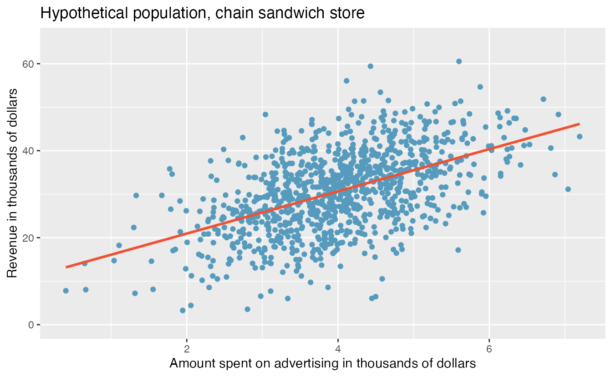
<p class="caption">(\#fig:sandpop)Revenue as a linear model of advertising dollars for a population of sandwich stores, in $1000.</p>
</div>

You may remember from Chapter \@ref(cor-reg) that the population model is: $$y = \beta_0 + \beta_1 x + \varepsilon.$$

Again, the omniscient CEO (with the full population information) can write down the true population model as: $$\mbox{expected revenue} = 11.23 + 4.8 \cdot \mbox{advertising}.$$


#### Variability of the statistic {-}

Unfortunately, in our scenario, the CEO is not willing to part with the full set of data, but they will allow potential franchise buyers to see a small sample of the data in order to help the potential buyer decide whether or not set up a new franchise.
The CEO is willing to give each potential franchise buyer a random sample of data from 20 stores.

As with any numerical characteristic which describes a subset of the population, the estimated slope of a sample will vary from sample to sample.
Consider the linear model which describes revenue (in \$1000) based on advertising dollars (in \$1000).  

The least squares regression model uses the data to find a sample linear fit:  $$\hat{y} = b_0 + b_1 x,$$

where $y$ represents the actual revenue, $\hat{y}$ represents the _predicted_ revenue from the model, and $x$ represents the advertising dollars. A random sample of 20 stores shows a different least square regression line depending on which observations are selected.
A subset of size 20 stores shows a similar positive trend between advertising and revenue (to what we saw in Figure \@ref(fig:sandpop), which described the population) despite having fewer observations on the plot.


<div class="figure" style="text-align: center">
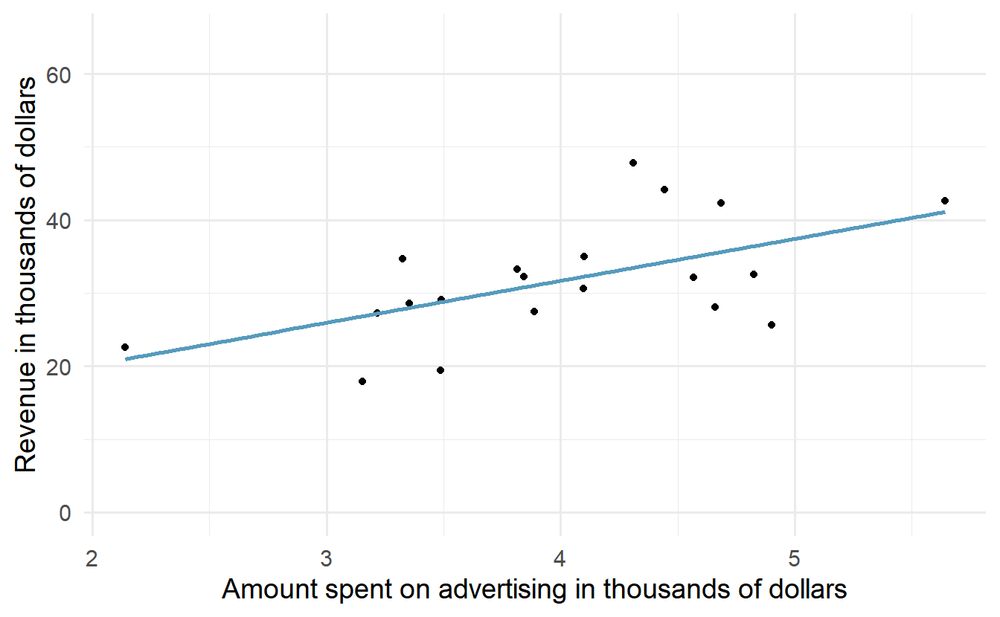
<p class="caption">(\#fig:unnamed-chunk-2)A random sample of 20 stores from the entire population. A positive linear trend between advertising and revenue continues to be observed.</p>
</div>


A second sample of size 20 also shows a positive trend!

<div class="figure" style="text-align: center">
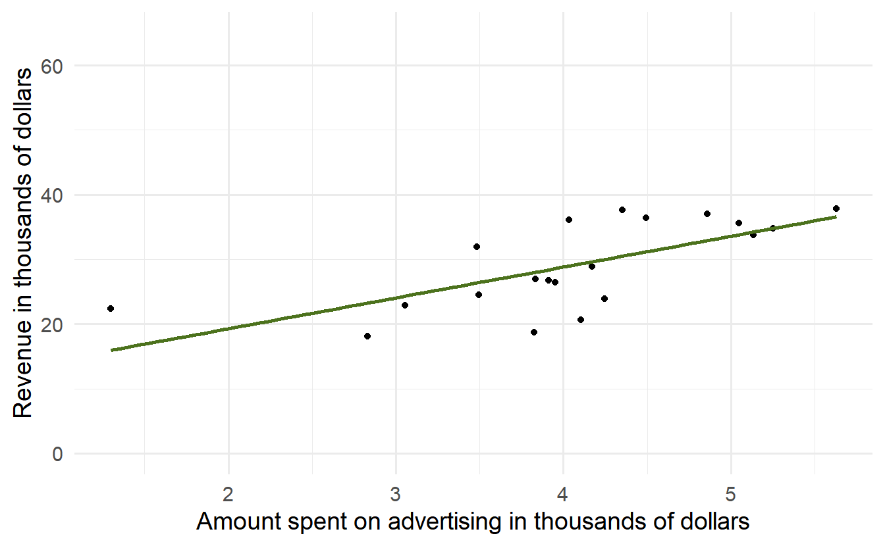
<p class="caption">(\#fig:unnamed-chunk-3)A different random sample of 20 stores from the entire population. Again, a positive linear trend between advertising and revenue is observed.</p>
</div>


But the line is slightly different!

<div class="figure" style="text-align: center">
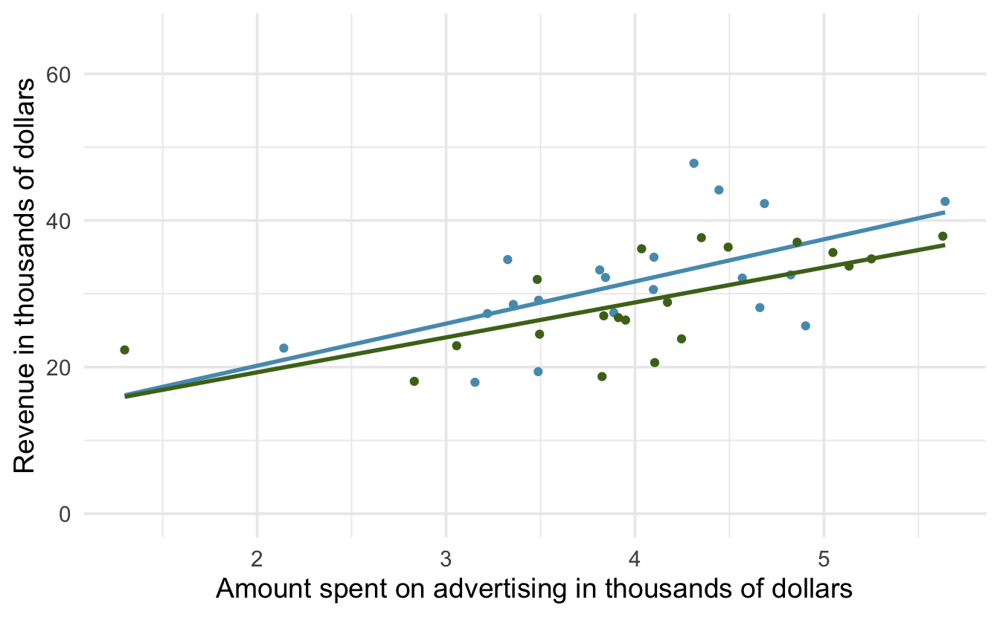
<p class="caption">(\#fig:unnamed-chunk-4)The linear models from the two different random samples are quite similar, but they are not the same line.</p>
</div>


That is, there is **variability** in the regression line from sample to sample.  The concept of the sampling variability is something you've seen before, but in this lesson, you will focus on the variability of the line often measured through the variability of a single statistic:  **the slope of the line**.

<div class="figure" style="text-align: center">
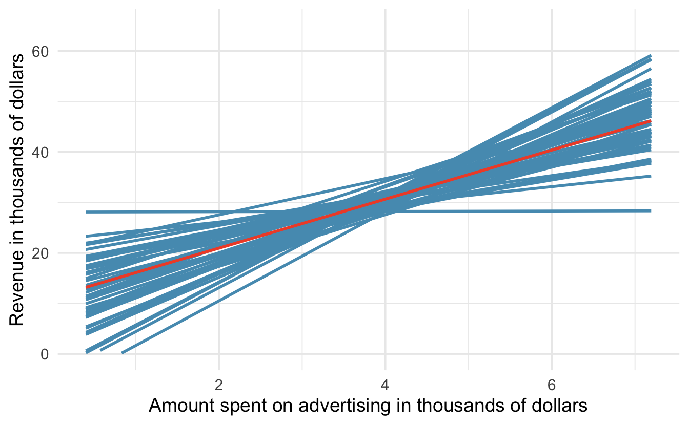
<p class="caption">(\#fig:slopes)(ref:slopes-cap)</p>
</div>

(ref:slopes-cap) If repeated samples of size 20 are taken from the entire population, each linear model will be slightly different. The red line provides the linear fit to the entire population, shown in Figure \@ref(sandpop).


You might notice in Figure \@ref(fig:slopes) that the $\hat{y}$ values given by the lines are much more consistent in the middle of the dataset than at the ends.  The reason is that the data itself anchors the lines in such a way that the line must pass through the center of the data cloud.  The effect of the fan-shaped lines is that predicted revenue for advertising close to \$4,000 will be much more precise than the revenue predictions made for \$1,000 or \$7,000 of advertising.

The distribution of slopes (for samples of size $n=20$) can be seen in a histogram, as in Figure \@ref(fig:sand20lm).

<div class="figure" style="text-align: center">
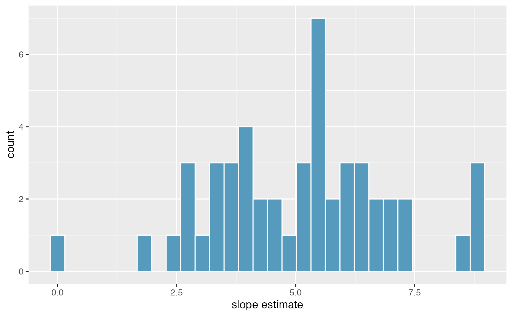
<p class="caption">(\#fig:sand20lm)Variability of slope estimates taken from many different samples of stores, each of size 20.</p>
</div>

Recall, the example described in this introduction is hypothetical.
That is, we created an entire population in order demonstrate how the slope of a line would vary from sample to sample.
The tools in this textbook are designed to evaluate only one single sample of data.  
With actual studies, we do not have repeated samples, so we are not able to use repeated samples to visualize the variability in slopes.
We have seen variability in samples throughout this text, so it should not come as a surprise that different samples will produce different linear models.
However, it is nice to visually consider the linear models produced by different slopes.
Additionally, as with measuring the variability of previous statistics (e.g., $\bar{x}_1 - \bar{x}_2$ or $\hat{p}_1 - \hat{p}_2$), the histogram of the sample statistics can provide information related to inferential considerations.

In the following sections, the distribution (i.e., histogram) of $b_1$ (the estimated slope coefficient) will be constructed in the same three ways that, by now, may be familiar to you.
First (in Section \@ref(randslope)), the distribution of $b_1$ when $\beta_1 = 0$ is constructed by randomizing (permuting) the response variable.
Next (in Section \@ref(bootbeta1)), we can bootstrap the data by taking random samples of size $n$ from the original dataset.
And last (in Section \@ref(mathslope)), we use mathematical tools to describe the variability using the $t$-distribution that was first encountered in Section \@ref(one-mean-math).  

### Randomization test for $H_0: \beta_1= 0$ {#randslope}

Consider the data on Global Crop Yields compiled by [Our World in Data](https://ourworldindata.org/crop-yields) and presented as part of the [TidyTuesday](https://github.com/rfordatascience/tidytuesday/trunk/data/2020/2020-09-01) series seen in Figure \@ref(fig:allcrops).  The scientific research interest at hand will be in determining the linear relationship between wheat yield (for a country-year) and other crop yields.  The dataset is quite rich and deserves exploring, but for this example, we will focus only on the annual crop yield in the United States.  

<div class="figure" style="text-align: center">
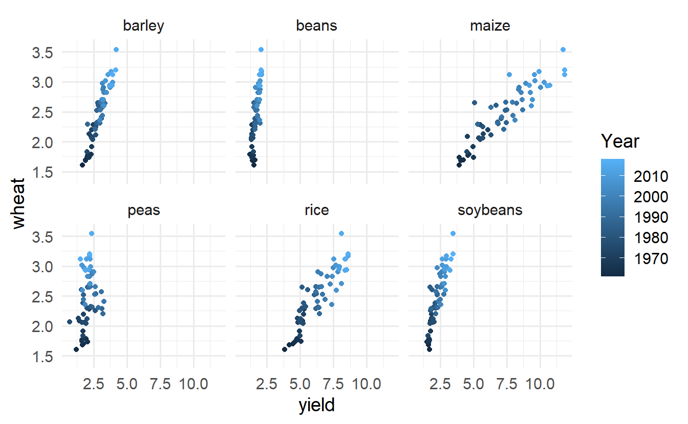
<p class="caption">(\#fig:allcrops)Yield (in tonnes per hectare) for six different crops in the US.  The color of the dot indicates the year.</p>
</div>


As you have seen previously, statistical inference typically relies on setting a null hypothesis which is hoped to be subsequently rejected.  In the linear model setting, we might hope to have a linear relationship between `maize` and `wheat` in settings where `maize` production is known and `wheat` production needs to be predicted.  

The relevant hypotheses for the linear model setting can be written in terms of the population slope parameter.  Here the population refers to a larger set of years where `maize` and `wheat` are both grown in the US.

* $H_0: \beta_1= 0$, there is no linear relationship between `wheat` and `maize`.  
* $H_A: \beta_1 \ne 0$, there is some linear relationship between `wheat` and `maize`.

Recall that for the randomization test, we shuffle one variable to eliminate any existing relationship between the variables.  That is, we set the null hypothesis to be true, and we measure the natural variability in the data due to sampling but **not** due to variables being correlated.  Figure \@ref(fig:permwheatScatter) shows the observed data and a scatterplot of one permutation of the `wheat` variable.  The careful observer can see that each of the observed the values for `wheat` (and for `maize`) exist in both the original data plot as well as the permuted `wheat` plot, but the given `wheat` and `maize` yields are no longer matched for a given year.  That is, each `wheat` yield is randomly assigned to a new `maize` yield.

<div class="figure" style="text-align: center">

<p class="caption">(\#fig:permwheatScatter)Original (left) and permuted (right) data.  The permutation removes the linear relationship between `wheat` and `maize`.  Repeated permutations allow for quantifying the variability in the slope under the condition that there is no linear relationship (i.e., that the null hypothesis is true).</p>
</div>


By repeatedly permuting the response variable, any pattern in the linear model that is observed is due only to random chance (and not an underlying relationship).  The randomization test compares the slopes calculated from the permuted response variable with the observed slope.  If the observed slope is inconsistent with the slopes from permuting, we can conclude that there is some underlying relationship (and that the slope is not merely due to random chance).

#### Observed data {-}

We will continue to use the crop data to investigate the linear relationship between `wheat` and `maize`.  Note that the fitted least squares model (see Chapter \@ref(cor-reg)) describing the relationship is given in Table \@ref(tab:lsCrops).  

<table class="table" style="margin-left: auto; margin-right: auto;">
<caption>(\#tab:lsCrops)The least squares estimates of the intercept and slope are given in the `estimate` column.  The observed slope is 0.195.</caption>
 <thead>
  <tr>
   <th style="text-align:left;"> term </th>
   <th style="text-align:right;"> estimate </th>
   <th style="text-align:right;"> std.error </th>
   <th style="text-align:right;"> statistic </th>
   <th style="text-align:right;"> p.value </th>
  </tr>
 </thead>
<tbody>
  <tr>
   <td style="text-align:left;"> (Intercept) </td>
   <td style="text-align:right;"> 1.033 </td>
   <td style="text-align:right;"> 0.091 </td>
   <td style="text-align:right;"> 11.3 </td>
   <td style="text-align:right;"> 0 </td>
  </tr>
  <tr>
   <td style="text-align:left;"> maize </td>
   <td style="text-align:right;"> 0.195 </td>
   <td style="text-align:right;"> 0.012 </td>
   <td style="text-align:right;"> 16.4 </td>
   <td style="text-align:right;"> 0 </td>
  </tr>
</tbody>
</table>

From the "estimate" column, we can write our least squares regression line as
\[
\hat{y} = 1.033 + 0.195x,
\]
where $\hat{y}$ is the predicted wheat yield, and $x$ is the maize yield (both in tonnes per hectare).


The other columns in Table \@ref(tab:lsCrops) are further described in Section \@ref(mathslope) when we introduce theory-based methods for inference on a regression slope.


#### Variability of the statistic {-}

After permuting the data, the least squares estimate of the line can be computed.  Repeated permutations and slope calculations describe the variability in the line (i.e., in the slope) due only to the natural variability and not due to a relationship between `wheat` and `maize`.  Figure \@ref(fig:permwheatlm) shows two different permutations of `wheat` and the resulting linear models.

<div class="figure" style="text-align: center">
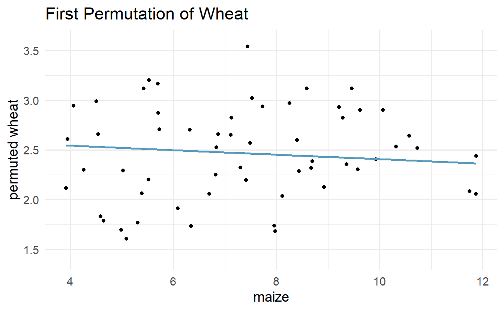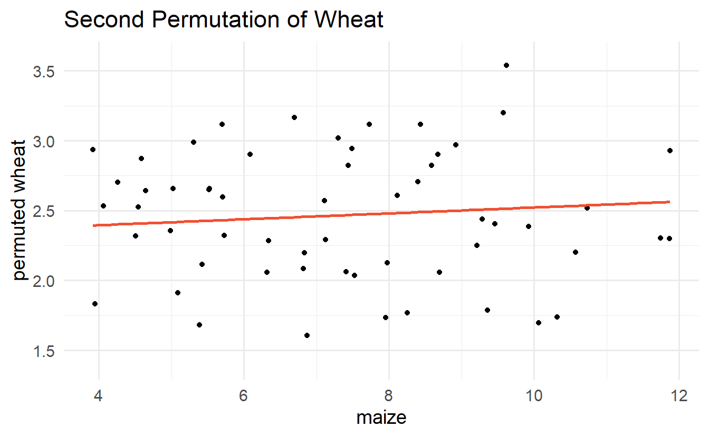
<p class="caption">(\#fig:permwheatlm)Two different permutations of the wheat variable with slightly different least squares regression lines.</p>
</div>


As you can see, sometimes the slope of the permuted data is positive, sometimes it is negative.  Because the randomization happens under the condition of no underlying relationship (because the response variable is completely mixed with the explanatory variable), we expect to see the center of the randomized slope distribution to be zero.

#### Observed statistic vs. null value {-}

<div class="figure" style="text-align: center">
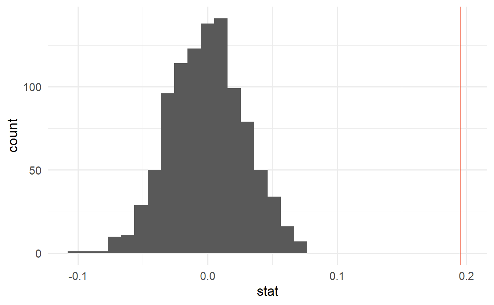
<p class="caption">(\#fig:nulldistCrop)Histogram of slopes given different permutations of the wheat variable.  The vertical red line is at the observed value of the slope, $b_1$ = 0.195.</p>
</div>

As we can see from Figure \@ref(fig:nulldistCrop), a slope estimate as extreme as the observed slope estimate (the red line) never happened in many repeated permutations of the `wheat` variable.
That is, if indeed there were no linear relationship between `wheat` and `maize`, the natural variability of the slopes would produce estimates between approximately -0.1 and +0.1.
Therefore, we believe that the slope observed on the original data is not just due to natural variability and indeed, there is a linear relationship between wheat and maize crop yield (in tonnes per hectare) in the US.


### Bootstrap confidence interval for $\beta_1$ {#bootbeta1}


As we have seen in previous chapters, we can use bootstrapping to estimate the sampling distribution of the statistic of interest (here, the slope) without the null assumption of no relationship (which was the condition in the randomization test).  Because interest is now in creating a CI, there is no null hypothesis, so there won't be any reason to permute either of the variables.


#### Observed data {-}

Returning to the crop data, we may want to consider the relationship between yields in `peas` and `wheat`.  Are `peas` a good predictor of `wheat`?  And if so, what is their relationship?  That is, what is the slope that models the average wheat yield as a function of peas yield (both in tonnes per hectare)?


<div class="figure" style="text-align: center">

<p class="caption">(\#fig:peasPlot)Original data: wheat yield as a linear model of peas yield, in tonnes per hectare.  Notice that the relationship between `peas` and `wheat` is not as strong as the relationship we saw previously between `maize` and `wheat`.</p>
</div>


#### Variability of the statistic {-}

Because we are not focused on a null distribution, we sample with replacement $n=58$ $(x,y)$-pairs from the original dataset.  Recall that with bootstrapping, we always resample the same number of observations as we start with in order to mimic the process of taking a sample from the population.  When sampling in the linear model case, consider each observation to be a single dot on the scatterplot.  If the dot is resampled, both the `wheat` and the `peas` measurement are observed.  The measurements are linked to the dot (i.e., to the year in which the measurements were taken).

<div class="figure" style="text-align: center">

<p class="caption">(\#fig:crop2BS)Original and one bootstrap sample of the crop data.  Note that it is difficult to differentiate the two plots, as (within a single bootstrap sample) the observations which have been resampled twice are plotted as points on top of one another.  The orange circle represent points in the original data which were not included in the bootstrap sample.  The blue circle represents a point that was repeatedly resampled (and is therefore darker) in the bootstrap sample.  The green circle represents a particular structure to the data which is observed in both the original and bootstrap samples.</p>
</div>

Figure \@ref(fig:crop2BS) shows the original data as compared with a single bootstrap sample, resulting in (slightly) different linear models.
The orange circle represent points in the original data which were not included in the bootstrap sample.
The blue circle represents a point that was repeatedly resampled (and is therefore darker) in the bootstrap sample.
The green circle represents a particular structure to the data which is observed in both the original and bootstrap samples.
By repeatedly resampling, we can see dozens of bootstrapped slopes on the same plot in Figure \@ref(fig:cropBS).


<div class="figure" style="text-align: center">
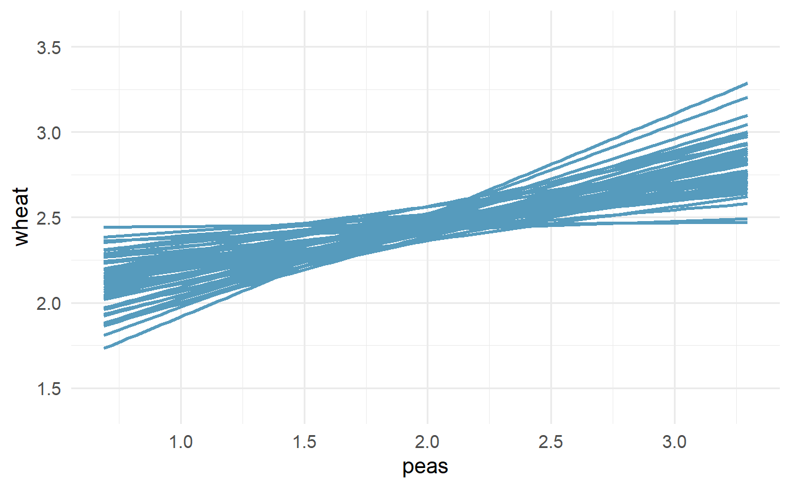
<p class="caption">(\#fig:cropBS)Repeated bootstrap resamples of size 58 are taken from the original data.  Each of the bootstrapped linear model is slightly different.</p>
</div>


Recall that in order to create a confidence interval for the slope, we need to find the range of values that the statistic (here the slope) takes on from different bootstrap samples.
Figure \@ref(fig:peasBSslopes) is a histogram of the relevant bootstrapped slopes.
We can see that a 95% bootstrap percentile interval for the true population slope is given by (0.061, 0.52).
We are 95% confident that for the model describing the population of crops of `peas` and `wheat`, a one ton per hectare increase in `peas` yield will be associated with an increase in predicted average `wheat` yield of between 0.061 and 0.52 tonnes per hectare.


<div class="figure" style="text-align: center">
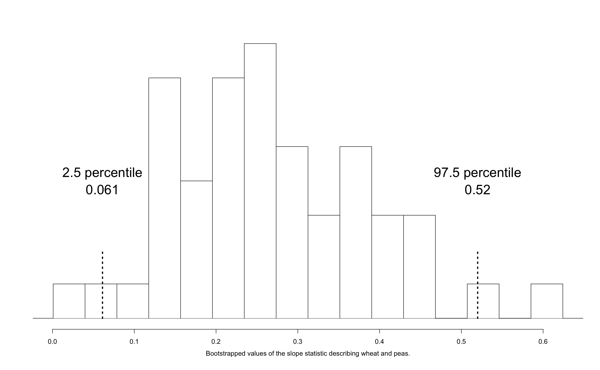
<p class="caption">(\#fig:peasBSslopes)The original crop data on wheat and peas is bootstrapped 1,000 times. The histogram provides a sense for the variability of the standard deviation of the linear model slope from sample to sample.</p>
</div>


### Theory-based inferential methods for $\beta_1$ {#mathslope}

When certain technical conditions apply, it is convenient to use mathematical approximations to test and estimate the slope parameter. 
The approximations will build on the $t$-distribution which was described in Chapter \@ref(inference-num). 
This mathematical model is often correct and is usually easy to implement computationally.
The validity of the technical conditions will be considered in detail in Section \@ref(tech-cond-linmod). 


In this section, we discuss uncertainty in the estimates of the slope
and $y$-intercept for a regression line. Just as we identified standard
errors for point estimates in previous chapters, we first discuss
standard errors for these new estimates.

#### Midterm elections and unemployment {-}

\index{data!midterm elections|(}

Elections for members of the United States House of Representatives
occur every two years, coinciding every four years with the U.S.
Presidential election. The set of House elections occurring during the
middle of a Presidential term are called midterm elections. In America's two-party
system (the vast majority of House members through history have been either Republicans or Democrats), one political theory suggests the higher the unemployment rate,
the worse the President's party will do in the midterm elections.  In 2020, there were 232 Democrats, 198 Republicans, and 1 Libertarian in the House.

\indexthis{midterm elections}{midterm election}

To assess the validity of this claim, we can compile historical data and
look for a connection. We consider every midterm election from 1898 to
2018, with the exception of those elections during the Great Depression.
The House of Representatives is made up of 435 voting members. Figure \@ref(fig:unemploymentAndChangeInHouse) shows these data and the
least-squares regression line:
$$\begin{aligned}
&\text{predicted % change in House seats for President's party}  \\
&\qquad\qquad= -7.36 - 0.89 \times \text{(unemployment rate)}\end{aligned}$$
We consider the percent change in the number of seats of the President's
party (e.g., percent change in the number of seats for Republicans in
2018) against the unemployment rate.

::: {.guidedpractice}
What are the observational units in this data set?^[We measured the unemployment rate and percent change in House seats for the President's party for each midterm election from 1898 to 2018, except those elections during the Great Depression. Thus, the observational unit is a single midterm election.]
:::

Examining the data, there are no clear deviations from linearity or substantial outliers (see Section \@ref(tech-cond-linmod) for a discussion on using residuals to visualize how well a linear model fits the data).
While the data are collected sequentially, a separate analysis was used to check for any apparent correlation between successive observations in time; no such correlation was found.

<div class="figure" style="text-align: center">
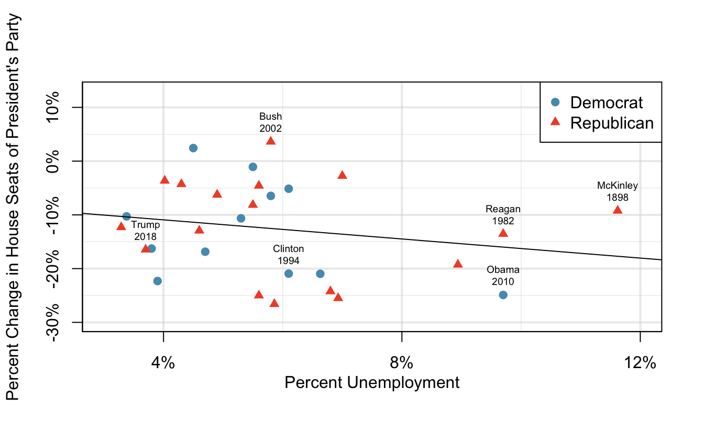
<p class="caption">(\#fig:unemploymentAndChangeInHouse)The percent change in House seats for the President's party in each midterm election from 1898 to 2010 plotted against the unemployment rate. The two points for the Great Depression have been removed, and a least squares regression line has been fit to the data.</p>
</div>


::: {.guidedpractice}
The data for the Great Depression (1934 and 1938) were removed because
the unemployment rate was 21% and 18%, respectively. Do you agree that
they should be removed for this investigation? Why or why not?^[The answer to this question relies on the idea that statistical data analysis is somewhat of an art. That is, in many situations, there is no "right" answer. As you do more and more analyses on your own, you will come to recognize the nuanced understanding which is needed for a particular dataset.  In terms of the Great Depression, we will provide two contrasting considerations.
  Each of these points would have very high leverage on any
  least-squares regression line, and years with such high
  unemployment may not help us understand what would happen
  in other years where the unemployment is only modestly high.
  On the other hand, these are exceptional cases, and we would
  be discarding important information if we exclude them from
  a final analysis.]
:::
  
There is a negative slope in the line shown in Figure \@ref(fig:unemploymentAndChangeInHouse). However, this slope (and the
y-intercept) are only estimates of the parameter values. We might
wonder, is this convincing evidence that the "true" linear model has a
negative slope? That is, do the data provide strong evidence that the
political theory is accurate, where the unemployment rate is a useful
predictor of the midterm election? We can frame this investigation into
a statistical hypothesis test:

* $H_0$: $\beta_1 = 0$. The true linear model has a zero slope.  
* $H_A$: $\beta_1 < 0$. The true linear model has a negative slope. The percent change in House seats for the President's party is negatively correlated with percent unemployment.

To assess the hypotheses, we identify a standard error for the estimate, compute an appropriate test statistic, and identify the p-value.

#### Understanding regression output from software {-}

Just like other point estimates we have seen before, we can compute a
standard error and test statistic for $b_1$. We will generally label the
test statistic using a $T$, since it follows the $t$-distribution.

We will rely on statistical software to compute the standard error and
leave the explanation of how this standard error is determined to a
second or third statistics course.
Table \@ref(tab:midtermUnempRegTable) shows software output for the least
squares regression line in Figure \@ref(fig:unemploymentAndChangeInHouse). The row labeled `unemp` includes all relevant information about the slope estimate (i.e., the coefficient of the unemployment variable).


<table class="table" style="margin-left: auto; margin-right: auto;">
<caption>(\#tab:midtermUnempRegTable)Output from statistical software for the regression
    line modeling the midterm election losses for the
    President's party as a response to unemployment.</caption>
 <thead>
  <tr>
   <th style="text-align:left;"> term </th>
   <th style="text-align:right;"> estimate </th>
   <th style="text-align:right;"> std.error </th>
   <th style="text-align:right;"> statistic </th>
   <th style="text-align:right;"> p.value </th>
  </tr>
 </thead>
<tbody>
  <tr>
   <td style="text-align:left;"> (Intercept) </td>
   <td style="text-align:right;"> -7.36 </td>
   <td style="text-align:right;"> 5.155 </td>
   <td style="text-align:right;"> -1.43 </td>
   <td style="text-align:right;"> 0.165 </td>
  </tr>
  <tr>
   <td style="text-align:left;"> unemp </td>
   <td style="text-align:right;"> -0.89 </td>
   <td style="text-align:right;"> 0.835 </td>
   <td style="text-align:right;"> -1.07 </td>
   <td style="text-align:right;"> 0.296 </td>
  </tr>
</tbody>
</table>

::: {.workedexample}
What do the first and second columns of Table \@ref(tab:midtermUnempRegTable)  represent?

---

The entries in the first column represent the least squares estimates, $b_0$ and $b_1$. Using the estimates, we could write the equation for the least
square regression line as $$\begin{aligned}
  \hat{y} = -7.36 - 0.89 x
  \end{aligned}$$ where $\hat{y}$ in this case represents the predicted
change in the number of seats for the president's party, and $x$
represents the unemployment rate.

The values in the second column correspond to the standard errors of each
estimate, $SE(b_0)$ and $SE(b_1)$. We will use these values when computing a test statistic or confidence interval for $\beta_0$ or $\beta_1$.
:::

We previously used a $t$-test statistic for hypothesis testing in the
context of numerical data. Regression is very similar. In the hypotheses
we consider, the null value for the slope is 0, so we can compute the
test statistic using the T-score formula: 
$$\begin{aligned}
T
  = \frac{\text{estimate} - \text{null value}}{\text{SE(estimate)}}
  = \frac{-0.89 - 0}{0.835}
  = -1.07\end{aligned}$$ This corresponds to the third column of
Table \@ref(tab:midtermUnempRegTable) .


::: {.workedexample}
Use Table \@ref(tab:midtermUnempRegTable) to determine the p-value for the
hypothesis test. 

---

The last column of the table gives the p-value for a
_two-sided_ hypothesis test for the coefficient of the unemployment rate:
0.296. However, our test is _one-sided_ --- we are only interested in detecting if the true slope coefficient is negative. Since our estimated slope coefficient is negative, our one-sided p-value is just half of the two-sided p-value: 0.148.^[Note that if our slope coefficient had been positive --- the _opposite_ sign as $H_A$ --- then the one-sided p-value would be the probability of observing that value or lower, or $1 - 0.296/2 = 1 - 0.148 = 0.852$.] With this p-value, the data do not provide convincing evidence that a
higher unemployment rate has a negative correlation with percent of seats lost in the house. In other words, we do not have significant evidence for the political theory that the higher the unemployment rate, the worse the President's party will do in the midterm elections.
:::


#### Intuition vs. formal inference {-}

As the final step in a mathematical hypothesis test for the slope, we use the information provided to make a conclusion about whether or not the data could have come from a population where the true slope was zero (i.e., $\beta_1 = 0$). Before evaluating the formal hypothesis claim, sometimes it is important to check your intuition.  Based on everything we've seen in the examples above describing the variability of a line from sample to sample, as yourself if the linear relationship given by the data could have come from a population in which the slope was truly zero.


::: {.workedexample}
Elmhurst College in Illinois released anonymized data for family income and financial support provided by the school for Elmhurst's first-year students in 2011. Figure \@ref(fig:elmhurstScatterWLSROnly-CLTsection) shows the least-squares regression line fit to a scatterplot of a sample of the data. How sure are you that the slope is
statistically significantly different from zero? That is, do you think a
formal hypothesis test would reject the claim that the true slope of the
line should be zero?

---

While the relationship between the variables is not perfect, there is an evident decreasing trend in the data.
This suggests the hypothesis test will reject the null claim that the slope is zero.
:::

<div class="figure" style="text-align: center">
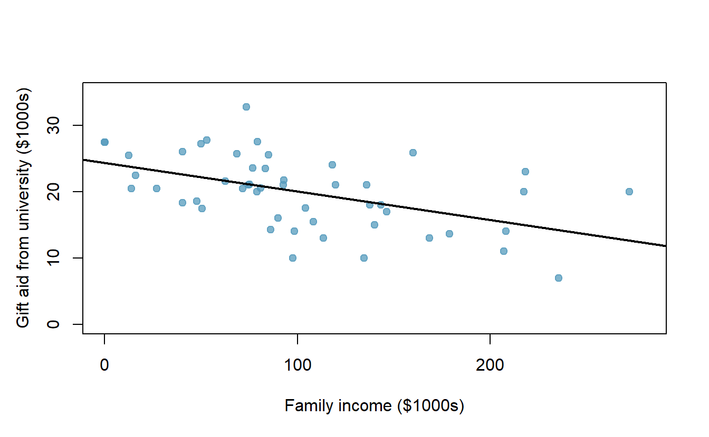
<p class="caption">(\#fig:elmhurstScatterWLSROnly-CLTsection)Gift aid and family income for a random sample of 50 first-year students from Elmhurst College, shown with a regression line.</p>
</div>

The point of the tools in this section are to go beyond a visual interpretation of the linear relationship toward a formal mathematical claim about the statistical significance of the slope estimate.

<table class="table" style="margin-left: auto; margin-right: auto;">
<caption>(\#tab:rOutputForIncomeAidLSRLineInInferenceSection)Summary of least squares fit for the Elmhurst College data, where we are predicting the gift aid by the university based on the family income of students.</caption>
 <thead>
  <tr>
   <th style="text-align:left;"> term </th>
   <th style="text-align:right;"> estimate </th>
   <th style="text-align:right;"> std.error </th>
   <th style="text-align:right;"> statistic </th>
   <th style="text-align:right;"> p.value </th>
  </tr>
 </thead>
<tbody>
  <tr>
   <td style="text-align:left;"> (Intercept) </td>
   <td style="text-align:right;"> 24319.329 </td>
   <td style="text-align:right;"> 1291.450 </td>
   <td style="text-align:right;"> 18.83 </td>
   <td style="text-align:right;"> 0 </td>
  </tr>
  <tr>
   <td style="text-align:left;"> family_income </td>
   <td style="text-align:right;"> -0.043 </td>
   <td style="text-align:right;"> 0.011 </td>
   <td style="text-align:right;"> -3.98 </td>
   <td style="text-align:right;"> 0 </td>
  </tr>
</tbody>
</table>


::: {.guidedpractice}
Table \@ref(tab:rOutputForIncomeAidLSRLineInInferenceSection) shows
statistical software output from fitting the least squares regression
line shown in Figure \@ref(fig:elmhurstScatterWLSROnly-CLTsection). Use the output to formally
evaluate the following hypotheses.

* $H_0$: The true coefficient for family income is zero.  
* $H_A$: The true coefficient for family income is not zero.^[We look in the second row corresponding
  to the family income variable.
  We see the point estimate of the slope of the line is -0.0431,
  the standard error of this estimate is 0.0108, and the $t$-test
  statistic is $T = -3.98$.
  The p-value corresponds exactly to the two-sided test we are
  interested in: 0.0002.
  The p-value is so small that we have very strong evidence that family income and financial aid at Elmhurst
  College for freshman entering in the year 2011 are
  correlated and the true slope parameter differs from 0,
  just as we believed in our analysis of Figure \@ref(fig:elmhurstScatterWLSROnly-CLTsection).]
:::  


::: {.importantbox}
**Inference for regression.**

We usually rely on statistical software to
identify point estimates, standard errors, test statistics, and p-values
in practice. However, be aware that software will not generally check
whether the method is appropriate, meaning we must still verify
conditions are met.  See Section \@ref(tech-cond-linmod).
:::

<!-- TODO: Add section on how slope test is equivalent to testing correlation -->

#### Theory-based confidence interval for a regression coefficient {-}

Similar to how we can conduct a hypothesis test for a model coefficient
using regression output, we can also construct a confidence interval for
that coefficient.

::: {.onebox}
**Confidence intervals for coefficients** 

Confidence intervals for model
coefficients (e.g., the $y$-intercept or the slope) can be computed using the $t$-distribution:
$$\begin{aligned}
  b_i \ \pm\ t_{df}^{\star} \times SE(b_{i})
  \end{aligned}$$ where $t_{df}^{\star}$ is the appropriate $t$-value
corresponding to the confidence level with the model's degrees of
freedom. For simple linear regression, the model's degrees of freedom are $n-1$.
:::

::: {.workedexample}
Compute a 95% confidence interval for the slope coefficient using the
regression output from Table \@ref(tab:rOutputForIncomeAidLSRLineInInferenceSection). 

---

The point estimate is $b_1 = -0.0431$ and the standard error is $SE(b_1) = 0.0108$. The degrees of freedom for the distribution are $df = n - 2 = 48$, and are typically noted in the regression output, allowing us to identify $t_{48}^{\star} = 2.01$ for use in the confidence interval.

We can now construct the confidence interval in the usual way:
$$\begin{aligned}
  \text{point estimate} &\pm t_{48}^{\star} \times SE(\text{point estimate}) \\
  &\qquad\to\qquad \\
    -0.0431  &\pm 2.01 \times 0.0108 \\
    &\qquad\to\qquad\\
    (-0.&0648, -0.0214)
  \end{aligned}$$ 
We are 95% confident that, with each \$1000 increase in
family income, the university's gift aid is predicted to decrease on average by between \$21.40 to \$64.80.
:::


On the topic of intervals in this book, we've focused exclusively on
confidence intervals for model parameters. However, there are other
types of intervals that may be of interest, including prediction
intervals for a response value and also confidence intervals for a mean
response value in the context of regression. These intervals are typically covered in a second course in statistics.

<!-- TODO: Edit from here to the end -->

## Checking model conditions {#tech-cond-linmod}

In the previous sections, we used randomization and bootstrapping to perform inference when the mathematical model was not valid due to violations of the technical conditions.  In this section, we'll provide details for when the mathematical model is appropriate and a discussion of technical conditions needed for the randomization and bootstrapping procedures.

#### What are the technical conditions? {-}


When fitting a least squares line, we generally require

* **Linearity.**  The data should show a linear trend. If there is a nonlinear trend
    (e.g., first panel of Figure \@ref(fig:whatCanGoWrongWithLinearModel), an advanced regression
    method from another book or later course should be applied.

* **Independent observations.**  Be cautious about applying regression to data, which are sequential
    observations in time such as a stock price each day. Such data may
    have an underlying structure that should be considered in a model
    and analysis. An example of a data set where successive observations
    are not independent is shown in the fourth panel of
    Figure \@ref(fig:whatCanGoWrongWithLinearModel). There are also other
    instances where correlations within the data are important, such as the paired data described in Section \@ref(paired-data).
    
* **Nearly normal residuals.**  Generally, the residuals must be nearly normal. When this condition
    is found to be unreasonable, it is usually because of outliers or
    concerns about influential points, which were discussed in
    Section \@ref(outliers-in-regression). An example of a
    residual that would be a potentially concern is shown in
    Figure \@ref(fig:whatCanGoWrongWithLinearModel), where one observation is
    clearly much further from the regression line than the others.

* **Constant or equal variability.**  The variability of points around the least squares line remains
    roughly constant. An example of non-constant variability is shown in
    the third panel of
    Figure \@ref(fig:whatCanGoWrongWithLinearModel), which represents the
    most common pattern observed when this condition fails: the
    variability of $y$ is larger when $x$ is larger.


<div class="figure" style="text-align: center">

<p class="caption">(\#fig:whatCanGoWrongWithLinearModel)Four examples showing when the methods in this chapter are insufficient to apply to the data. The top set of graphs represents the $x$ and $y$ relationship.  The bottom set of graphs is a residual plot.  First panel: linearity fails. Second panel: there are outliers, most especially one point that is very far away from the line. Third panel: the variability of the errors is related to the value of $x$. Fourth panel: a time series data set is shown, where successive observations are highly correlated.</p>
</div>

::: {.guidedpractice}
Should we have concerns about applying least squares regression to the
Elmhurst data in Figure \@ref(fig:elmhurstScatterW2Lines)?^[The trend appears to be linear, the data fall around the line with no obvious outliers, the variance is roughly constant. These are also not time series observations. Least squares regression can be applied to these data.]
:::


The technical conditions are often remembered using the **LINE** mnemonic.
The linearity, normality, and equality of variance conditions usually can be assessed through residual plots, as seen in  Figure \@ref(fig:whatCanGoWrongWithLinearModel).
A careful consideration of the experimental design should be undertaken to confirm that the observed values are indeed independent.

* L: __linear__ model 
* I: __independent__ observations 
* N: points are __normally__ distributed around the line 
* E: __equal__ variability around the line for all values of the explanatory variable 


#### Why do we need technical conditions? {-}

As with other inferential techniques we have covered in this text, if the technical conditions above don't hold, then it is not possible to make concluding claims about the population.
That is, without the technical conditions, the T-score (or Z-score) will not have the assumed t-distribution (or standard normal Z distribution).
That said, it is almost always impossible to check the conditions precisely, so we look for large deviations from the conditions.
If there are large deviations, we will be unable to trust the calculated p-value or the endpoints of the resulting confidence interval.

##### What about **L**inearity? {-}

The linearity condition is among the most important if your goal is to understand a linear model between $x$ and $y$.
For example, the value of the slope will not be at all meaningful if the true relationship between $x$ and $y$ is quadratic.
Not only should we be cautious about the inference, but the model *itself* is also not an accurate portrayal of the relationship between the variables. An extended discussion on the different methods for modeling functional forms other than linear is outside the scope of this text.

##### What about **I**ndependence? {-}

The technical condition describing the independence of the observations is often the most crucial but also the most difficult to diagnose.  It is also extremely difficult to gather a dataset which is a true random sample from the population of interest.  (Note: a true randomized experiment from a fixed set of individuals is much easier to implement, and indeed, randomized experiments are done in most medical studies these days.)  

Dependent observations can bias results in ways that produce fundamentally flawed analyses.  That is, if you hang out at the gym measuring height and weight, your linear model is surely not a representation of all students at your university.  At best it is a model describing students who use the gym (but also who are willing to talk to you, that use the gym at the times you were there measuring, etc.).  

In lieu of trying to answer whether or not your observations are a true random sample, you might instead focus on whether or not you believe your observations are representative of the populations.
Humans are notoriously bad at implementing random procedures, so you should be wary of any process that used human intuition to balance the data with respect to, for example, the demographics of the individuals in the sample.

##### What about **N**ormality?  {-}

The normality condition requires that points vary symmetrically around the line, spreading out in a bell-shaped fashion.  You should consider the "bell" of the normal distribution as sitting on top of the line (coming off the paper in a 3-D sense) so as to indicate that the points are dense close to the line and disperse gradually as they get farther from the line.

The normality condition is less important than linearity or independence for a few reasons.
First, the linear model fit with least squares will still be an unbiased estimate of the true population model.
However, the standard errors associated with variability of the line will not be well estimated.
Fortunately the Central Limit Theorem tells us that most of the inferential analyses (e.g., standard errors, p-values, confidence intervals) done using the mathematical model will still hold (even if the data are not normally distributed around the line) as long as the sample size is large enough.

One analysis method that *does* require normality, regardless of sample size, is creating intervals which predict the response of individual outcomes at a given $x$ value, using the linear model, a topic covered in later courses.
On additional reason to worry slightly less about normality is that neither the randomization test nor the bootstrapping procedures require the data to be normal around the line.

##### What about **E**qual variability? {-}

As with normality, the equal variability condition (that points are spread out in similar ways around the line for all values of $x$) will not cause problems for the estimate of the linear model, for a randomization test, or for a bootstrap confidence interval.
However, data that exhibit non-equal variance across the range of $x$-values will have the potential to seriously mis-estimate the variability of the slope which will have consequences for the inference results (i.e., hypothesis tests and confidence intervals).

When the equal variability condition is violated and a theory-based analysis (e.g., p-value from T-score) is needed, there are existing methods which can easily handle the unequal variance (e.g., weighted least squares analysis), but these are covered in a later course.

## `R`: Inference for regression

### Inference using `R` and `catstats`

#### Simulation-based inference for the regression slope {-} 

As a demonstration, we will apply the simulation-based inference functions for regression in the `catstats` package to our data on the change in House seats in the President's party at midterm elections as a function of national unemployment rate.  We need to drop the Great Depression years before we perform our simulations:

```r
#load data
data(midterms_house)
#Drop Great Depression years
d <- midterms_house %>% 
  filter(!(year %in% c(1935, 1939)))
```

Now that we have the correct data, we can perform a randomization test of the slope in the simple linear regression.

```r
library(catstats)
set.seed(621311)
regression_test(
  formula = house_change ~ unemp,  #Always use response ~ explanatory
  data = d,  #name of data set
  statistic = "slope", #Can also test correlation
  direction = "less", #Direction of alternative hypothesis
  as_extreme_as = -0.89, #Observed slope
  number_repetitions = 1000  #Number of simulations
)
```

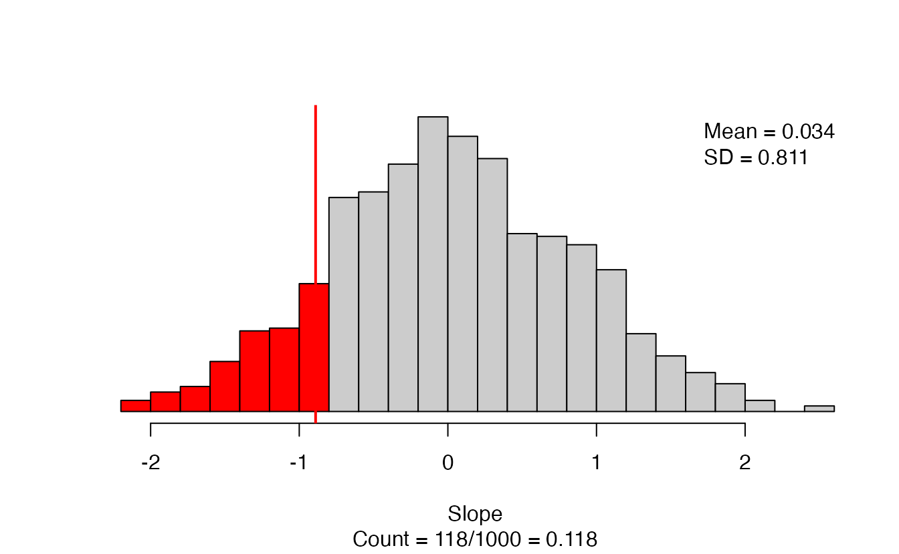

The results give a scatterplot of the observed data with the regression line superimposed, and gives the observed slope (this should match what you put in for `as_extreme_as`).  Next to the scatterplot, we have the null distribution of the slope coefficient, with the observed slope indicated by a vertical line and all values more extreme highlighted in red.  The caption gives the number of simulations resulting in a slope more extreme than the observed: in this simulation we have 118/1000, for an approximate p-value of 0.118.

To obtain a confidence interval for the slope, we use `regression_bootstrap_CI()`, with the same core arguments as `regression_test()`.

```r
set.seed(31143518)
regression_bootstrap_CI(
  formula = house_change ~ unemp,  #Always use response ~ explanatory
  data = d,  #name of data set
  statistic = "slope", #Can also test correlation
  confidence_level = 0.95, #confidence level as a proportion
  number_repetitions = 1000  #Number of simulations
)
```

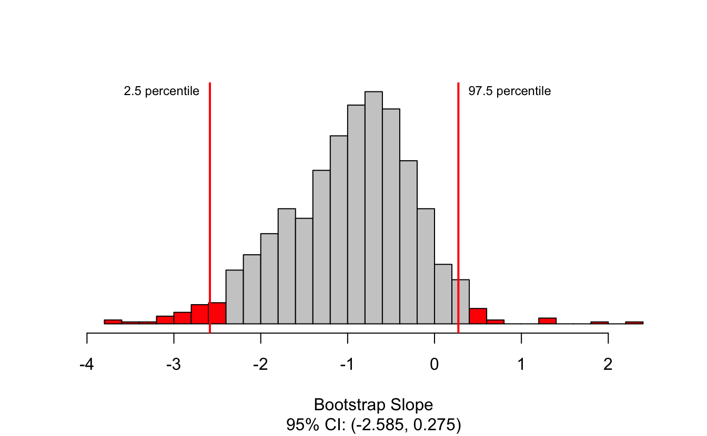

Here we have the bootstrap distribution of the slope based on the observed data, with the upper and lower bounds of the confidence interval highlighted in red.  The confidence interval is also given in the caption of the figure.  Here, we are 95% confident that the true change in the number of seats in the House of Representatives for each additional percentage point in unemployment is between a decrease of 2.6 percent of seats and an increase of 0.3 percent of seats.

Notice that the bootstrap distribution is not symmetric for this example! Because of this, the bootstrap confidence interval is different from what we would obtain from theory-based methods: (-2.6, 0.8).  This is because the LINE technical conditions are not all satisfactorily met, though this is hard to see from the scatterplot for these data.

#### Theory-based inference for the regression slope {-} 

To demonstrate theory-based inference in `R`, we will revisit the gift aid and income data.  We want to know whether there is evidence to suggest that the slope of gift aid as a function of family income is non-zero.  The function for linear regression in `R` is `lm()`. Unlike `prob.test()` and `t.test()`, just running `lm()` doesn't print all the information we need.  This will produce only the coefficient estimates.

```
#> 
#> Call:
#> lm(formula = gift_aid ~ family_income, data = elmhurst)
#> 
#> Coefficients:
#>   (Intercept)  family_income  
#>       24.3193        -0.0431
```

Instead, when doing linear regression, we want to save the regression results so we can get complete output using `summary()`:

```r
gift_reg <- lm(gift_aid~family_income, #Always use reponse ~ explanatory
               data = elmhurst)  #Name of data set
summary(gift_reg)  #Obtain full results for regression
#> 
#> Call:
#> lm(formula = gift_aid ~ family_income, data = elmhurst)
#> 
#> Residuals:
#>     Min      1Q  Median      3Q     Max 
#> -10.113  -3.623  -0.216   3.159  11.571 
#> 
#> Coefficients:
#>               Estimate Std. Error t value Pr(>|t|)    
#> (Intercept)    24.3193     1.2915   18.83  < 2e-16 ***
#> family_income  -0.0431     0.0108   -3.98  0.00023 ***
#> ---
#> Signif. codes:  0 '***' 0.001 '**' 0.01 '*' 0.05 '.' 0.1 ' ' 1
#> 
#> Residual standard error: 4.78 on 48 degrees of freedom
#> Multiple R-squared:  0.249,	Adjusted R-squared:  0.233 
#> F-statistic: 15.9 on 1 and 48 DF,  p-value: 0.000229
```

This produces a lot of output; we will focus on the *Coefficients* section.  This gives us the estimated value for the slope, the standard error of the estimate, the t-statistic, and the p-value.  We want the row labeled with the name of our explanatory variable, `family_income`.  We estimate the slope to be -0.043 thousand dollars per additional thousand dollars in family income, and we have strong evidence against the null hypothesis that the slope is 0.

We can compute confidence intervals by hand using the reported estimate, standard error, and df.  We will need to compute a t-value as in Chapter \@ref(inference-num):

```r
#Get t-star for 90% confidence interval
qt(.95, df = 48)
#> [1] 1.68
```


```r
#Lower confidence bound
-0.04307 - 1.677224*0.01081
#> [1] -0.0612

#Upper confidence bound
-0.04307 + 1.677224*0.01081
#> [1] -0.0249
```

We can also use the `confint()` function in `R` to compute confidence intervals for regression coefficients.

```r
confint(gift_reg,   #name of regression results
        level = 0.9)  #confidence level as a proportion
#>                   5 %    95 %
#> (Intercept)   22.1533 26.4854
#> family_income -0.0612 -0.0249
```

In either case, we are 90% confident that gift aid will be \$24.90 to \$61.20 less per $1000 increase in family income.

### `catstats` function summary

In the previous section, you were introduced to two new `R` 
functions in the `catstats` library. Here we provide a summary of 
these functions. You can also access 
the help files for these functions using the `?` command. For 
example, type `?regression_test` into your `R` console to bring up the 
help file for the `regression_test` function.
<br>
    
1. `regression_test`: Simulation-based hypothesis test for a regression slope or correlation between two quantitative variables.  

    * `formula` = `y ~ x` where `y` is the name of the quantitative response variable in the data set and `x` is the name of the quantitative explanatory variable
    * `data` = data frame, with columns of each variable
    * `statistic` = one of `"slope"` or `"correlation"` (quotations are important here!) 
    * `direction` = one of `"greater"`, `"less"`, or `"two-sided"` (quotations are important here!) to match the sign in $H_A$
    * `as_extreme_as` = value of observed slope or correlation
    * `number_repetitions` = number of simulated samples to generate (should be at least 1000!)
<br>
    
2. `regression_bootstrap_CI`: Bootstrap confidence interval for a regression slope or correlation.  

    * `formula` = `y ~ x` where `y` is the name of the quantitative response variable in the data set and `x` is the name of the quantitative explanatory variable
    * `data` = data frame, with columns of each variable
    * `statistic` = one of `"slope"` or `"correlation"` (quotations are important here!) 
    * `confidence_level` = confidence level as a decimal (e.g., 0.90, 0.95, etc)
    * `number_repetitions` = number of simulated samples to generate (should be at least 1000!)
<br>


### Interactive `R` tutorials

Navigate the concepts you've learned in this chapter in `R` using the following self-paced tutorials. 
All you need is your browser to get started!

::: {.alltutorials}
[Tutorial 8: Inference for regression](https://openintrostat.github.io/ims-tutorials/08-inference-for-regression/)
:::

::: {.singletutorial}
[Tutorial 8 - Lesson 1: Inference in regression](https://openintro.shinyapps.io/ims-08-inference-for-regression-01/)
:::

::: {.singletutorial}
[Tutorial 8 - Lesson 2: Randomization test for slope](https://openintro.shinyapps.io/ims-08-inference-for-regression-02/)
:::

::: {.singletutorial}
[Tutorial 8 - Lesson 3: t-test for slope](https://openintro.shinyapps.io/ims-08-inference-for-regression-03/)
:::

::: {.singletutorial}
[Tutorial 8 - Lesson 4: Checking technical conditions for slope inference](https://openintro.shinyapps.io/ims-08-inference-for-regression-04/)
:::

::: {.singletutorial}
[Tutorial 8 - Lesson 5: Inference beyond the simple linear regression model](https://openintro.shinyapps.io/ims-08-inference-for-regression-05/)
:::

You can also access the full list of tutorials supporting this book [here](https://openintrostat.github.io/ims-tutorials/).

### `R` labs

Further apply the concepts you've learned in this chapter in `R` with computational labs that walk you through a data analysis case study.

::: {.singlelab}
[Multiple linear regression - Grading the professor](http://openintrostat.github.io/oilabs-tidy/09_multiple_regression/multiple_regression.html)
:::

::: {.alllabs}
[Full list of labs supporting OpenIntro::Introduction to Modern Statistics](http://openintrostat.github.io/oilabs-tidy/)
:::

## Chapter 7 review {#chp7-review}

### Terms

We introduced the following terms in the chapter. 
If you're not sure what some of these terms mean, we recommend you go back in the text and review their definitions.
We are purposefully presenting them in alphabetical order, instead of in order of appearance, so they will be a little more challenging to locate. 
However you should be able to easily spot them as **bolded text**.


