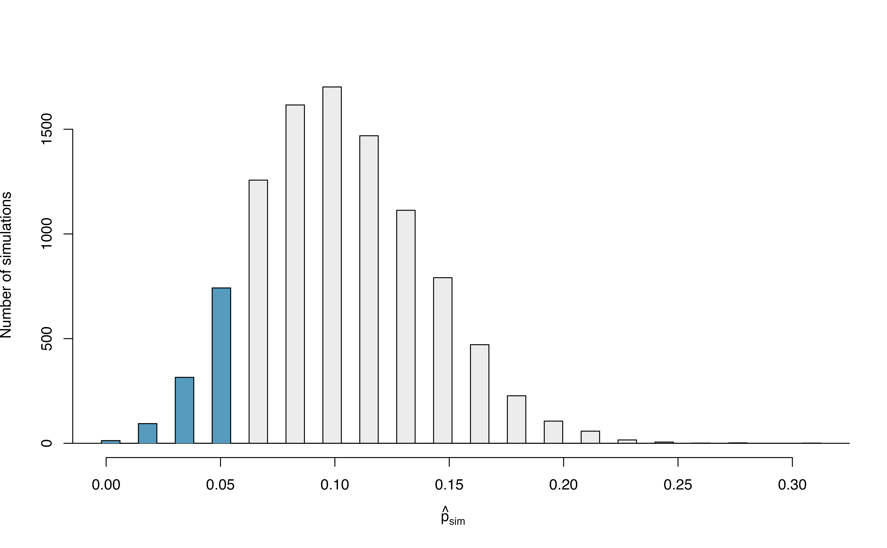
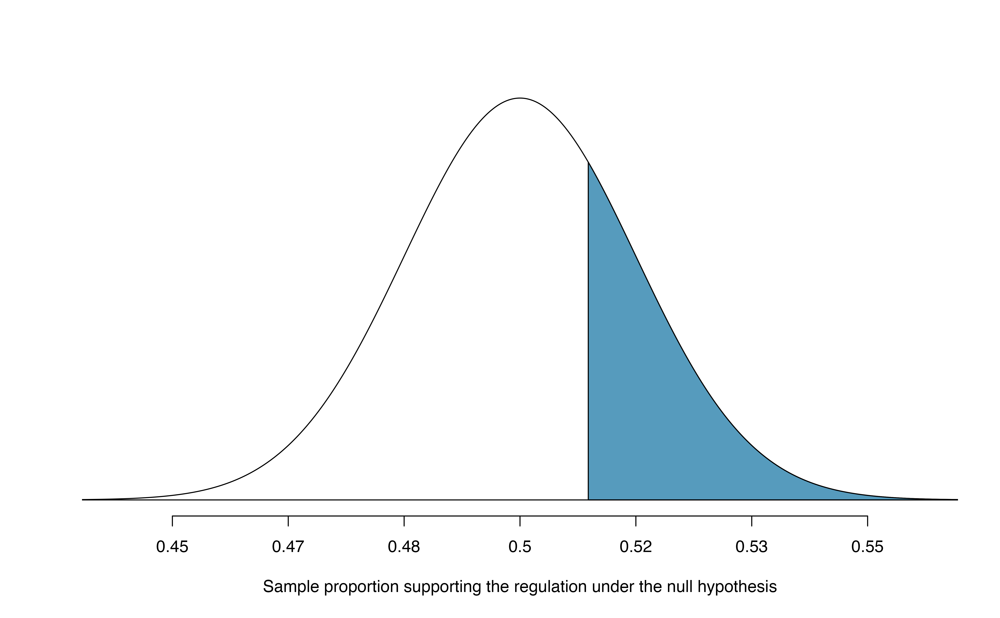
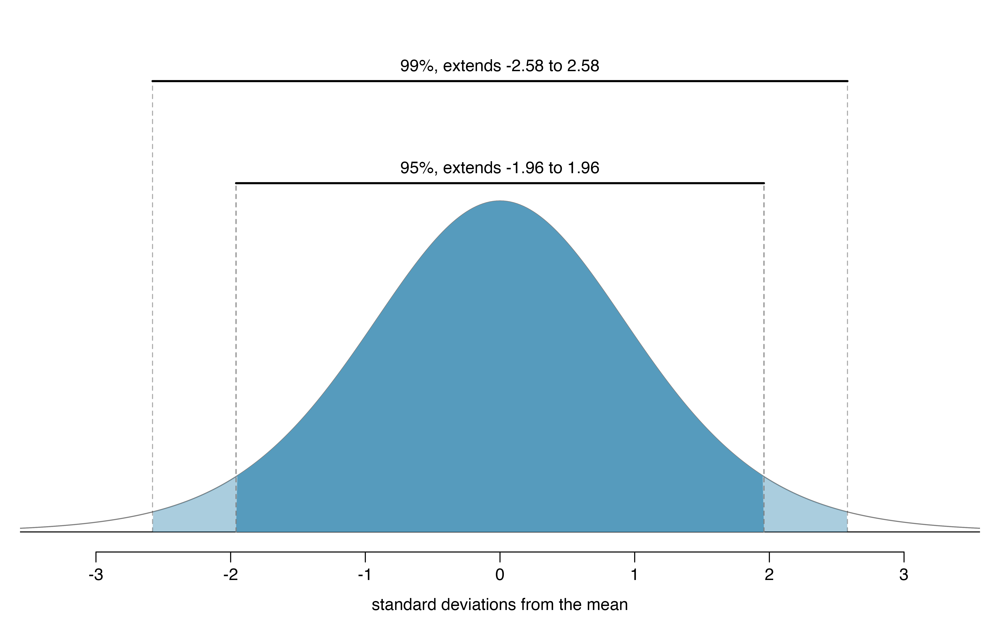

# (PART) Inference for categorical data {.unnumbered}


# Inference for a single proportion {#inference-one-prop}

::: {.chapterintro}
Focusing now on statistical inference for categorical data, we will revisit many of the foundational aspects of hypothesis testing from Chapter \@ref(foundations-randomization).

The three data structures we detail are one binary variable, summarized using a single proportion, and two binary variables, summarized using a difference of two proportions.
When appropriate, each of the data structures will be analyzed using the simulation-based inferential methods described in Chapters \@ref(foundations-randomization) and \@ref(foundations-bootstrapping), and the theory-based methods covered in Chapter \@ref(foundations-mathematical). 

As we build on the inferential ideas, we will visit new foundational concepts in statistical inference.
For example, we will cover the conditions for when a normal model is appropriate; the two different error rates in hypothesis testing; and choosing the confidence level for a confidence interval.
:::

We encountered statistical inference methods for a single proportion in the Martian alphabet example of Section \@ref(Martian) and the Medical consultant case study of Section \@ref(case-study-med-consult), exploring point estimates, confidence intervals, and hypothesis tests.
In this section, we'll do a review of these topics when collecting data for single proportion contexts.

Note that there is only one variable being measured in a study which focuses on one proportion.
For each observational unit, the single variable is measured as either a "success" or "failure" (e.g., "surgical complication" vs. "no surgical complication")[^05-inference-cat-34].
Because the nature of the research question at hand focuses on only a single variable, there is not a way to randomize the variable across a different (explanatory) variable.
For this reason, we will not use randomization as an analysis tool when focusing on a single proportion.
Instead, we will apply bootstrapping techniques to test a given hypothesis, and we will also revisit the associated mathematical models.

Below we summarize the notation used throughout this chapter.

::: onebox
**Notation for a single categorical variable**.

-   $n$ = sample size (number of observational units in the data set)
-   $\hat{p}$ = sample proportion (number of "successes" divided by the sample size)
-   $\pi$ = population proportion[^05-inference-cat-33]
:::

[^05-inference-cat-33]: When you see $\pi$ in this textbook, it will always symbolize a (typically unknown) population proportion, not the value 3.14....

[^05-inference-cat-34]: The terms "success" and "failure" may not actually represent outcomes we view as successful or not, but it is the typical generic way to referring to the possible outcomes of a binary variable. The "success" is whatever we count when calculating our sample proportion.

## Simulation-based test for $H_0: \pi = \pi_0$ {#one-prop-null-boot}

At the end of Chapter \@ref(foundations-randomization), we introduced the general steps of a hypothesis test:

::: onebox
**General steps of a hypothesis test.** Every hypothesis test follows these same general steps:

1.  Frame the research question in terms of hypotheses.
2.  Collect and summarize data using a test statistic.
3.  Assume the null hypothesis is true, and simulate or mathematically model a null distribution for the test statistic.
4.  Compare the observed test statistic to the null distribution to calculate a p-value.
5.  Make a conclusion based on the p-value, and write a conclusion in context, in plain language, and in terms of the alternative hypothesis.
:::

In this section, we will demonstrate the steps of a hypothesis test for the medical consultant case study from Section \@ref(case-study-med-consult).
Recall that in this case study, a medical consultant tried
to attract patients by noting the average complication rate for liver donor surgeries in the US is about 10%, but her clients have had only 3 complications in the 62 liver donor surgeries she has facilitated.
Do these data provide evidence that her rate of complications is _less_ than the average complication rate in the US of 10%?


### Steps 1 and 2: Hypotheses and test statistic {.unnumbered}

Regardless of if we use simulation-based methods or theory-based methods, the first two steps of a hypothesis test start out the same: setting up hypotheses and summarizing data with a test statistic.

Let $\pi$ represent the true complication rate for liver donors working with this consultant. This "true" complication probability is called the **parameter** of interest.

The sample proportion for the complication rate is 3 complications divided by the 62 surgeries the consultant has worked on: $\hat{p} = 3/62 = 0.048$. Since this value is estimated from sample data, it is called a **statistic**. The statistic $\hat{p}$ is also our **point estimate**, or "best guess," for $\pi$, and we will use it as our **test statistic**.


::: protip
Summary measures that summarize a sample of data, such as $\hat{p}$, are called **statistics**\index{statistic}. Numbers that summarize an entire population, such as $\pi$, are called **parameters**\index{parameter}. You can remember this distinction by looking at the first letter of each term:

> ***S***tatistics summarize ***S***amples.\
> ***P***arameters summarize ***P***opulations.

We typically use Roman letters to symbolize statistics (e.g., $\bar{x}$, $\hat{p}$), and Greek letters to symbolize parameters (e.g., $\mu$, $\pi$). Since we rarely can measure the entire population, and thus rarely know the actual parameter values, we like to say, "We don't know Greek, and we don't know parameters!"
:::

::: workedexample
Write out hypotheses in both plain and statistical language to test whether the medical consultant's true rate of complications, $\pi$, is _less_ than the average complication rate in the US of 10%. 

------------------------------------------------------------------------

In words:

> $H_0$: There is no association between the consultant's contributions and the clients' complication rate.\
> $H_A$: Patients who work with the consultant tend to have a complication rate lower than 10%.

In statistical language:

> $H_0: \pi=0.10$\
> $H_A: \pi<0.10$
:::

### Steps 3 and 4: Null distribution and p-value {.unnumbered}

To assess these hypotheses, we need to evaluate the possibility of getting a sample proportion as far below the **null value**, $0.10$, as what was observed ($\hat{p} = 0.048$), *if the null hypothesis were true*.

::: onebox
**Null value of a hypothesis test.**

The **null value** is the reference value for the parameter in $H_0$, and it is sometimes represented with the parameter's label with a subscript 0 (or "null"), e.g., $\pi_0$ (just like $H_0$).
:::


The deviation of the sample statistic from the null hypothesized parameter is usually quantified with a p-value[^05-inference-cat-36]. The p-value is computed based on the null distribution, which is the distribution of the test statistic if the null hypothesis is true. Supposing the null hypothesis is true, we can compute the p-value by identifying the chance of observing a test statistic that favors the alternative hypothesis at least as strongly as the observed test statistic.

[^05-inference-cat-36]: Now would be a good time to review the definition of a p-value in Section \@ref(p-value-stat-signif)!

::: onebox
**Null distribution.**

The **null distribution** of a test statistic is the sampling distribution of that statistic *under the assumption of the null hypothesis*. It describes how that statistic would vary from sample to sample, if the null hypothesis were true.

The null distribution can be estimated through simulation (simulation-based methods), as in this section, or can be modeled by a mathematical function (theory-based methods), as in Section \@ref(theory-prop).
:::


We want to identify the sampling distribution of the test statistic ($\hat{p}$) if the null hypothesis was true. In other words, we want to see how the sample proportion changes due to chance alone. Then we plan to use this information to decide whether there is enough evidence to reject the null hypothesis.

Under the null hypothesis, 10% of liver donors have complications during or after surgery. Suppose this rate was really no different for the consultant's clients (for *all* the consultant's clients, not just the 62 previously measured). If this was the case, we could *simulate* 62 clients to get a sample proportion for the complication rate from the null distribution.

This is a similar scenario to the one we encountered in Section \@ref(Martian), with one important difference---the null value is 0.10, not 0.50. Thus, flipping a coin to simulate whether a client had complications would not be simulating under the correct null hypothesis.

::: guidedpractice
What physical object could you use to simulate a random sample of 62 clients who had a 10% chance of complications? How would you use this object?[^05-inference-cat-37]
:::

[^05-inference-cat-37]: One option would be to use a spinner with 10% shaded red, and the rest shaded green. Each spin of the spinner would represent one client. Spin the spinner 62 times and count the number of times the spinner lands on red. The proportion of times the spinner lands on red represents a simulated $\hat{p}$ under the assumption that $\pi = 0.10$. Other objects include: a bag of marbles with 10% red marbles and 90% white marbles, or 10 cards where 1 is red and 9 are white. Sampling 62 times with replacement from these collections would simulate one sample of clients.

Assuming the true complication rate for the consultant's clients is 10%, each client can be simulated using a bag of marbles with 10% red marbles and 90% white marbles. Sampling a marble from the bag (with 10% red marbles) is one way of simulating whether a patient has a complication *if the true complication rate is 10%* for the data. If we select 62 marbles (with replacement) and then compute the proportion of patients with complications in the simulation, $\hat{p}_{sim}$, then the resulting sample proportion is calculated exactly from a sample from the null distribution.

Many simulations are needed to get a sense of the variability of sample proportions in the null distribution. Figure \@ref(fig:nullDistForPHatIfLiverTransplantConsultantIsNotHelpful) shows the results of 10,000 simulated studies. The proportions that are equal to or less than $\hat{p}=0.048$ are shaded. The shaded areas represent sample proportions under the null distribution that provide at least as much evidence as $\hat{p}$ favoring the alternative hypothesis. There were 1222 simulated sample proportions with $\hat{p}_{sim} \leq 0.048$. We use these to construct the null distribution's left-tail area and find the p-value: \begin{align}
\text{left tail area }\label{estOfPValueBasedOnSimulatedNullForSingleProportion}
    &= \frac{\text{Number of observed simulations with }\hat{p}_{sim}\leq\text{ 0.048}}{10000}
\end{align} Of the 10,000 simulated $\hat{p}_{sim}$, 1222 were equal to or smaller than $\hat{p}$. Since the hypothesis test is one-sided, the estimated p-value is equal to this tail area: 0.1222.

<div class="figure" style="text-align: center">

<p class="caption">(\#fig:nullDistForPHatIfLiverTransplantConsultantIsNotHelpful)The null distribution for $\hat{p}$, created from 10,000 simulated studies. The left tail, representing the p-value for the hypothesis test, contains 12.22% of the simulations.</p>
</div>

### Step 5: Conclusion and scope of inference {.unnumbered}

::: workedexample
Because the estimated p-value is 0.1222, which is not small, we have little to no evidence against the null hypothesis. That is, our *decision* of the test is to fail to reject the null hypothesis.

Based on this decision, what is the *conclusion* of the hypothesis test?

------------------------------------------------------------------------

There isn't sufficiently strong evidence to support the claim that fewer than 10% of the consultant's clients experience complications. That is, there isn't sufficiently strong evidence to support an association between the consultant's work and fewer surgery complications.
:::


Let's consider the *scope of inference* for this study---to which population can we generalize? Since these data come from a sample of the medical consultant's past clients, we can only generalize our results to clients similar to those the medical consultant has had in the past.

Note that since this study only involves a single variable (whether a liver donor surgery patient experienced a complication), we do not consider the other component of scope of inference: whether we can conclude cause and effect, or only an association. This is because cause and effect or an association requires two variables. 


::: workedexample
This consultant tried to attract patients by noting the average complication rate for liver donor surgeries in the US is about 10%, but her clients have had only 3 complications in the 62 liver donor surgeries she has facilitated. These data, however, did not provide sufficient evidence that the consultant's complication rate was less than 10%, since the p-value was approximately 0.122. Does this mean we can conclude that the consultant's complication rate was equal to 10%?

------------------------------------------------------------------------

No! Though we did not find strong evidence against the null hypothesis, this does not mean we have evidence *for* the null hypothesis---we cannot "accept" the null. The sample proportion was $\hat{p} = 3/62 = 0.048$, which is our point estimate---or "best guess"---of $\pi$. It wouldn't make sense that a sample complication rate of 4.8% gives us evidence that the true complication rate was exactly 10%. It's plausible that the true complication rate is 10%, but there are a range of plausible values for $\pi$. In the next section, we will review the how to use **bootstrapping** to generate this range of plausible values for $\pi$ using the observed data.
:::
```{=html}
<!--
Add this to an Appendix someday!

#### Generating the exact null distribution and p-value  {-} {#exactNullDistributionUsingBinomialModel}

The number of successes in $n$ independent cases can be described using the binomial model, which was introduced in Section \ref{binomialModel}. Recall that the probability of observing exactly $k$ successes is given by
\begin{align} \label{binomialEquationShownForFindingNullDistributionInSmallSamplePropTest}
P(k\text{ successes}) = {n\choose k} p^{k}(1-p)^{n-k} = \frac{n!}{k!(n-k)!} p^{k}(1-p)^{n-k}
\end{align}
where $p$ is the true probability of success. The expression ${n\choose k}$ is read as \emph{$n$ choose $k$}, and the exclamation points represent factorials. For instance, $3!$ is equal to $3\times 2\times 1=6$, $4!$ is equal to $4\times 3\times 2\times 1 = 24$, and so on (see Section \ref{binomialModel}).

The tail area of the null distribution is computed by adding up the probability in Equation \eqref{binomialEquationShownForFindingNullDistributionInSmallSamplePropTest} for each $k$ that provides at least as strong of evidence favoring the alternative hypothesis as the data. If the hypothesis test is one-sided, then the p-value is represented by a single tail area. If the test is two-sided, compute the single tail area and double it to get the p-value, just as we have done in the past.

\begin{example}{Compute the exact p-value to check the consultant's claim that her clients' complication rate is below 105.}
Exactly $k=3$ complications were observed in the $n=62$ cases cited by the consultant. Since we are testing against the 10% national average, our null hypothesis is $p=0.10$. We can compute the p-value by adding up the cases where there are 3 or fewer complications:
\begin{align*}
\text{p-value}
    &= \sum_{j=0}^{3} {n\choose j} p^{j}(1-p)^{n-j} \\
    &= \sum_{j=0}^{3} {62\choose j} 0.1^{j}(1-0.1)^{62-j} \\
    &= {62\choose 0} 0.1^{0}(1-0.1)^{62-0} +
        {62\choose 1} 0.1^{1}(1-0.1)^{62-1} \\
    & \qquad + {62\choose 2} 0.1^{2}(1-0.1)^{62-2} +
        {62\choose 3} 0.1^{3}(1-0.1)^{62-3} \\
    &= 0.0015 + 0.0100 + 0.0340 + 0.0755 \\
    &= 0.1210
\end{align*}
This exact p-value is very close to the p-value based on the simulations (0.1222), and we come to the same conclusion. We do not reject the null hypothesis, and there is not statistically significant evidence to support the association.

If it were plotted, the exact null distribution would look almost identical to the simulated null distribution shown in Figure \ref{nullDistForPHatIfLiverTransplantConsultantIsNotHelpful} on page \pageref{nullDistForPHatIfLiverTransplantConsultantIsNotHelpful}.
\end{example}

-->
```

## Bootstrap confidence interval for $\pi$ {#boot-ci-prop}

A confidence interval provides a range of plausible values for the parameter $\pi$. If the goal is to produce a range of possible values for a population value, then in an ideal world, we would sample data from the population again and recompute the sample proportion. Then we could do it again. And again. And so on until we have a good sense of the variability of our original estimate. The ideal world where sampling data is free or extremely cheap is almost never the case, and taking repeated samples from a population is usually impossible. So, instead of using a "resample from the population" approach, bootstrapping uses a "resample from the sample" approach.

::: onebox
**Bootstrapping from one sample**.

1.  Take a random sample of size $n$ from the original sample, *with replacement*. This is called a **bootstrapped resample**.
2.  Record the sample proportion (or statistic of interest) from the bootstrapped resample. This is called a **bootstrapped statistic**.
3.  Repeat steps (1) and (2) 1000s of times to create a distribution of bootstrapped statistics.
:::


::: workedexample
In Section \@ref(case-study-med-consult), we found a 95% bootstrapped confidence interval for the true complication rate of the consultant of (0%, 11.3%). How would we interpret this interval in context of the problem?

-----------------

Since this interval is a range of plausible values for $\pi$, the unknown true complication rate for this consultant, our interpretation of the interval is in terms of this parameter:

> We are 95% confident that the true complication rate of this medical consultant is between 0% and 11.3%.

:::

As in the Example above, any _interpretation of a confidence interval_ should include the following three components:

* How confident are you? e.g., "We are 95% confident..."
* What parameter are you estimating? e.g., "...the true complication rate of this medical consultant..."
* What is the interval? e.g., "...between 0% and 11.3%"


You can find confidence intervals of difference confidence levels by changing the percent of the distribution you take, e.g., locate the middle 90% of the bootstrapped statistics for a 90% confidence interval.

::: guidedpractice
To find the middle 90% of a distribution, which two percentiles would form its boundaries?[^05-inference-cat-43]
:::

[^05-inference-cat-43]: The the middle 95% of a distribution would range from the 5^th^ percentile (the value with 5% of the distribution below) to the 95^th^ percentile (the value with 5% of the distribution above).

## Theory-based inferential methods for $\pi$ {#theory-prop}

In Chapter \@ref(foundations-mathematical), we introduced the normal distribution and showed how it can be used as a mathematical model to describe the variability of a sample mean or sample proportion as a result of the Central Limit Theorem. Theory-based hypothesis tests and confidence intervals for proportions use the normal distribution to calculate the p-value and to determine the width of the confidence interval.

::: onebox
**Central Limit Theorem for the sample proportion.**

When we collect a sufficiently large sample of $n$ independent observations of a categorical variable from a population with $\pi$ proportion of successes, the sampling distribution of $\hat{p}$ will be nearly normal with \begin{align*}
  &\text{Mean}=\pi
  &&\text{Standard Deviation }(SD) = \sqrt{\frac{\pi(1-\pi)}{n}}
  \end{align*}
:::

### Evaluating the two conditions required for modeling $\hat{p}$ using theory-based methods

There are two conditions required to apply the Central Limit Theorem\index{Central Limit Theorem} for a sample proportion $\hat{p}$. When the sample observations are independent and the sample size is sufficiently large, the normal model will describe the variability in sample proportions quite well; when the observations violate the conditions, the normal model can be inaccurate.

::: onebox
**Conditions for the sampling distribution of** $\hat{p}$ to be approximately normal.

The sampling distribution for $\hat{p}$ based on a sample of size $n$ from a population with a true proportion $\pi$ can be modeled using a normal distribution when:

1.  **Independence condition.** The sample observations are independent, i.e., the outcome of one observation does not influence the outcome of another. This condition is met if data come from a simple random sample of the target population.

2.  **Success-failure condition.** We expected to see at least 10 successes and 10 failures in the sample, i.e., $n\pi\geq10$ and $n(1-\pi)\geq10$.

    * Since $\pi$ is typically unknown, we consider this condition met if we have at least 10 successes and 10 failures in the observed data. That is, if $n\hat{p} \geq 10$ and $n(1-\hat{p}) \geq 10$.

:::

::: protip
The success-failure condition listed above is only necessary for the sampling distribution of $\hat{p}$ to be approximately normal. The mean of the sampling distribution of $\hat{p}$ is $\pi$, and the standard deviation is $\sqrt{\frac{\ \pi(1-\pi)\ }{n}}$, regardless of the sample size.
:::


Typically we don't know the true proportion $\pi$, so we substitute some value to check the success-failure condition and to estimate the standard deviation of the sampling distribution of $\hat{p}$. When we plug in $\hat{p}$ for $\pi$ in the standard deviation of the sampling distribution, we call this the **standard error of the sample proportion**:
$$
SE(\hat{p}) = \sqrt{\frac{\hat{p}(1-\hat{p})}{n}}.
$$ 


The independence condition is a more nuanced requirement. When it isn't met, it is important to understand how and why it isn't met. For example, *there exist no statistical methods available to truly correct the inherent biases of data from a convenience sample.* On the other hand, if we took a cluster random sample (see Section \@ref(samp-methods)), the observations wouldn't be independent, but suitable statistical methods are available for analyzing the data (but they are beyond the scope of even most second or third courses in statistics)[^05-inference-cat-44].

[^05-inference-cat-44]: While this book is scoped to well-constrained statistical problems, do remember that this is just the first book in what is a large library of statistical methods that are suitable for a very wide range of data and contexts.

::: workedexample
In the examples based on large sample theory, we modeled $\hat{p}$ using the normal distribution. Why is this not appropriate for the study on the medical consultant?

------------------------------------------------------------------------

The independence assumption may be reasonable if each of the surgeries is from a different surgical team. However, the success-failure condition is not satisfied. We only observed 3 complications in 62 patients. We would need to have observed at least 10 complications (and at least 10 without complications) in order to meet the success-failure condition required for the normal approximation.
:::

Since theory-based methods cannot be used on the medical consultant example, we'll turn to another example to demonstrate these methods, where conditions for approximating the distribution of $\hat{p}$ by a normal distribution are met.

### Theory-based test for $H_0: \pi = \pi_0$ {#payday-lenders}

One possible regulation for payday lenders is that they would be required to do a credit check and evaluate debt payments against the borrower's finances. We would like to know: would borrowers support this form of regulation?

::: workedexample
Set up hypotheses to evaluate whether borrowers have a majority support for this type of regulation. We take "majority" to mean greater than 50% of the population.

------------------------------------------------------------------------

In words,

-   $H_0$: there is not majority support for the regulation
-   $H_A$: the majority of borrowers support the regulation

In statistical notation,

-   $H_0$: $\pi = 0.50$
-   $H_A$: $\pi > 0.50$,

where $\pi$ represents the proportion of *all* payday loan borrowers that would support the regulation.
:::

::: protip
Note that the null hypothesis above was stated as $H_0: \pi = 0.50$, even though saying there is "not majority support" would imply $\pi \leq 0.50$. Indeed, some textbooks would write $H_0: \pi \leq 0.50$ in this case, and it is not an incorrect statement. However, when calculating the p-value, we need to assume a particular value for $\pi$ under the null hypothesis, so in this textbook, our null hypothesis will always be of the form:

$$
H_0: \mbox{ parameter } = \mbox{ null value}
$$
:::

To apply the normal distribution to model the null distribution, the independence and success-failure conditions must be satisfied. 

::: workedexample
Do payday loan borrowers support a regulation that would require lenders to pull their credit report and evaluate their debt payments? From a random sample of 826 borrowers, 51% said they would support such a regulation. Is it reasonable use a normal distribution to model $\hat{p}$ for a hypothesis test here?

------------

Independence holds since the poll is based on a random sample. Thus, we can assume that the response of one borrower does not influence the response of another.

The success-failure condition also holds, since $n\hat{p} = 826(0.51) = 421.26 > 10$ and $n(1-\hat{p}) = 826(1-0.51) = 404.74 > 10$.
:::

::: workedexample
Continuing the previous Example, evaluate whether the poll on lending regulations provides convincing evidence that a majority of payday loan borrowers support a new regulation that would require lenders to pull credit reports and evaluate debt payments.

------------------------------------------------------------------------

With hypotheses already set up and conditions checked, we can move onto calculations. The **null standard error** in the context of a one proportion hypothesis test is computed using the null value, $\pi_0$: \begin{align*}
  SE_0(\hat{p}) = \sqrt{\frac{\pi_0 (1 - \pi_0)}{n}}
      = \sqrt{\frac{0.5 (1 - 0.5)}{826}}
      = 0.017
  \end{align*} A picture of the normal model for the null distribution of sample proportions in this scenario is shown below in Figure \@ref(fig:paydayCC-norm-pvalue), with the p-value represented by the shaded region. Note that this null distribution is centered at 0.50, the null value, and has standard deviation 0.017.

Under $H_0$, the probability of observing $\hat{p} = 0.51$ or higher is 0.278, the area above 0.51 on the null distribution.

With a p-value of 0.278, the poll does not provide convincing evidence that a majority of payday loan borrowers support regulations around credit checks and evaluation of debt payments.

You'll note that this conclusion is somewhat unsatisfactory because there is no conclusion, as is the case with larger p-values. That is, there is no resolution one way or the other about public opinion. We cannot claim that exactly 50% of people support the regulation, but we cannot claim a majority support it either.
:::

<div class="figure" style="text-align: center">

<p class="caption">(\#fig:paydayCC-norm-pvalue)Approximate sampling distribution of $\hat{p}$ across all possible samples assuming $\pi = 0.50$. The shaded area represents the p-value corresponding to an observed sample proportion of 0.51.</p>
</div>

Often, with theory-based methods, we use a **standardized statistic** rather than the original statistic as our test statistic. A standardized statistic is computed by subtracting the mean of the null distribution from the original statistic, then dividing by the standard error: $$
\mbox{standardized statistic} = \frac{\mbox{observed statistic} - \mbox{null value}}{\mbox{null standard error}}
$$ The **null standard error** ($SE_0(\text{statistic})$) of the observed statistic is its estimated standard deviation assuming the null hypothesis is true. We can interpret the standardized statistic as *the number of standard errors our observed statistic is above (if positive) or below (if negative) the null value*. When we are modeling the null distribution with a normal distribution, this standardized statistic is called $Z$, since it is the Z-score of the sample proportion.

::: onebox
**Standardized sample proportion.**

The **standardized statistic** for theory-based methods for one proportion is $$
Z = \frac{\hat{p} - \pi_0}{\sqrt{\frac{\pi_0(1-\pi_0)}{n}}} = \frac{\hat{p} - \pi_0}{SE_0(\hat{p})}
$$ where $\pi_0$ is the null value. The denominator, $SE_0(\hat{p}) = \sqrt{\frac{\pi_0(1-\pi_0)}{n}}$, is called the **null standard error** of the sample proportion.
:::

With the standardized statistic as our test statistic, we can find the p-value as the area under a standard normal distribution at or more extreme than our observed $Z$ value.

::: workedexample
Do payday loan borrowers support a regulation that would require lenders to pull their credit report and evaluate their debt payments? From a random sample of 826 borrowers, 51% said they would support such a regulation. We set up hypotheses and checked conditions previously. Now calculate and interpret the standardized statistic, then use the standard normal distribution to calculate the approximate p-value.

------------------------------------------------------------------------

Our sample proportion is $\hat{p} = 0.51$. Since our null value is $\pi_0 = 0.50$,\
the null standard error is \begin{align*}
  SE_0(\hat{p}) = \sqrt{\frac{\pi_0 (1 - \pi_0)}{n}}
      = \sqrt{\frac{0.5 (1 - 0.5)}{826}}
      = 0.017
  \end{align*}

The standardized statistic is \begin{align*}
Z = \frac{0.51 - 0.50}{0.017} = 0.59
\end{align*}

Interpreting this value, we can say that our sample proportion of 0.51 was only 0.59 standard errors above the null value of 0.50.

Shown in Figure \@ref(fig:paydayCC-stdnorm-pvalue), the p-value is the area above $Z = 0.59$ on a standard normal distribution---0.278---the same p-value we would obtain by finding the area above $\hat{p} = 0.51$ on a normal distribution with mean 0.50 and standard deviation 0.017, as in Figure \@ref(fig:paydayCC-norm-pvalue).
:::

<div class="figure" style="text-align: center">

<p class="caption">(\#fig:paydayCC-stdnorm-pvalue)(ref:figname-cap)</p>
</div>

(ref:figname-cap) Approximate sampling distribution of $Z$ across all possible samples assuming $\pi = 0.50$. The shaded area represents the p-value corresponding to an observed standardized statistic of 0.59. Compare to Figure \@ref(fig:paydayCC-norm-pvalue).

::: onebox
**Theory-based hypothesis test for a proportion: one-sample** $Z$-test.

1.  Frame the research question in terms of hypotheses.
2.  Using the null value, $\pi_0$, verify the conditions for using the normal distribution to approximate the null distribution.
3.  Calculate the test statistic: $$
     Z = \frac{\hat{p} - \pi_0}{\sqrt{\frac{\pi_0(1-\pi_0)}{n}}} = \frac{\hat{p} - \pi_0}{SE_0(\hat{p})}
     $$
4.  Use the test statistic and the standard normal distribution to calculate the p-value.
5.  Make a conclusion based on the p-value, and write a conclusion in context, in plain language, and in terms of the alternative hypothesis.
:::


### Theory-based confidence interval for $\pi$

A confidence interval provides a range of plausible values for the parameter $\pi$. A point estimate is our best guess for the value of the parameter, so it makes sense to build the confidence interval around that value. The standard error, which is a measure of the uncertainty associated with the point estimate, provides a guide for how large we should make the confidence interval. When $\hat{p}$ can be modeled using a normal distribution, the 68-95-99.7 rule tells us that, in general, 95% of observations are within 2 standard errors of the mean. Here, we use the value 1.96 to be slightly more precise. The confidence interval for $\pi$ then takes the form \begin{align*}
\hat{p} \pm z^{\star} \times SE(\hat{p}).
\end{align*}

We have seen $\hat{p}$ to be the sample proportion. The value $z^{\star}$ comes from a standard normal distribution and is determined by the chosen confidence level. The value of the standard error of $\hat{p}$, $SE(\hat{p})$, approximates how far we would expect the sample proportion to fall from $\pi$, and depends heavily on the sample size.

::: onebox
**Standard error of one proportion,** $\hat{p}$.

When the conditions are met so that the distribution for $\hat{p}$ is nearly normal, the **variability** of a single proportion, $\hat{p}$ is well described by its standard deviation:

$$SD(\hat{p}) = \sqrt{\frac{\pi(1-\pi)}{n}}$$

Note that we almost never know the true value of $\pi$, but we can substitute our best guess of $\pi$ to obtain an approximate standard deviation, called the **standard error** of $\hat{p}$:

$$SD(\hat{p}) \approx \hspace{3mm} SE(\hat{p}) = \sqrt{\frac{(\mbox{best guess of }\pi)(1 - \mbox{best guess of }\pi)}{n}}$$

For hypothesis testing, we often use $\pi_0$ as the best guess of $\pi$. For confidence intervals, we typically use $\hat{p}$ as the best guess of $\pi$.
:::

\index{data!Payday regulation poll|(}

```{=html}
<!--
\newcommand{\paydayN}{826}
\newcommand{\paydayNHalf}{413}
\newcommand{\paydayRegPerc}{70\%}
\newcommand{\paydayRegProp}{0.70}
\newcommand{\paydayRegSE}{0.016}
\newcommand{\paydayRegSEPerc}{1.6\%}
\newcommand{\paydayRegLower}{0.669}
\newcommand{\paydayRegUpper}{0.731}
\newcommand{\paydayRegLowerPerc}{66.9\%}
\newcommand{\paydayRegUpperPerc}{73.1\%}
% https://www.pewtrusts.org/-/media/assets/2017/04/payday-loan-customers-want-more-protections-methodology.pdf

did search and replace for each term above.  for example 826 for 826

-->
```
::: guidedpractice
Consider taking many polls of registered voters (i.e., random samples) of size 300 and asking them if they support legalized marijuana. It is suspected that about 2/3 of all voters support legalized marijuana. To understand how the sample proportion ($\hat{p}$) would vary across the samples, calculate the standard error of $\hat{p}$.[^05-inference-cat-46]
:::

[^05-inference-cat-46]: Because the $\pi$ is unknown but expected to be around 2/3, we will use 2/3 in place of $\pi$ in the formula for the standard deviation of $\hat{p}$ and calculate\
    $SE(\hat{p}) = \sqrt{\frac{2/3 (1 - 2/3)} {300}} = 0.027$.

::: workedexample
A simple random sample of 826 payday loan borrowers was surveyed to better understand their interests around regulation and costs. 51% of the responses supported new regulations on payday lenders.

1.  Is it reasonable to model the variability of $\hat{p}$ from sample to sample using a normal distribution?

2.  Calculate the standard error of $\hat{p}$.

3.  Construct a 95% confidence interval for $\pi$, the proportion of *all* payday borrowers who support increased regulation for payday lenders.

------------------------------------------------------------------------

1.  The data are a random sample, so the observations are independent and representative of the population of interest.

    We also must check the success-failure condition, which we do using $\hat{p}$ in place of $\pi$ when computing a confidence interval:

    Support: $n \hat{p} = 826 \times 0.51 \approx 421 > 10$

    Not: $n (1 - \hat{p}) = 826 \times (1 - 0.51) \approx 405 > 10$

    Since both values are at least 10, we can use the normal distribution to model the sampling distribution of $\hat{p}$.

2.  Because $\pi$ is unknown and the standard error is for a confidence interval, use $\hat{p}$ as our best guess of $\pi$ in the formula.

    $SE(\hat{p}) = \sqrt{\frac{0.51 (1 - 0.51)} {826}} = 0.017$.

3.  Using the point estimate $0.51$, $z^{\star} = 1.96$ for a 95% confidence interval, and the standard error $SE = 0.017$ from the previous Guided Practice, the confidence interval is \begin{align*}
      \text{point estimate} &\pm\ z^{\star} \times SE \\
       \quad\to\quad
       0.51 \ &\pm\ 1.96 \times 0.017 \\
       \quad\to\quad
       (0.477, &0.543)
      \end{align*} We are 95% confident that the true proportion of payday borrowers who supported regulation at the time of the poll was between 0.477 and 0.543.
:::

::: onebox
**Constructing a confidence interval for a single proportion.**

There are four steps to constructing a confidence interval for $p$.

1.  Check independence and the success-failure condition using $\hat{p}$. If the conditions are met, the sampling distribution of $\hat{p}$ may be well-approximated by the normal model.
2.  Construct the standard error: $$
     SE(\hat{p}) = \sqrt{\frac{\hat{p}(1-\hat{p})}{n}}
      $$
3.  Use statistical software to find the multiplier $z^{\star}$ corresponding to the confidence level.
4.  Apply the general confidence interval formula $\mbox{statistic} \pm (\mbox{multiplier}) \times SE$: $$
     \hat{p} \pm z^{\star}\times \sqrt{\frac{\hat{p}(1-\hat{p})}{n}}
      $$
:::

#### $z^{\star}$ and the confidence level {.unnumbered}

\index{confidence interval!confidence level|(}

Suppose we want to consider confidence intervals where the confidence level is somewhat higher than 95%: perhaps we would like a confidence level of 99%. Think back to the analogy about trying to catch a fish: if we want to be more sure that we will catch the fish, we should use a wider net. To create a 99% confidence level, we must also widen our 95% interval. On the other hand, if we want an interval with lower confidence, such as 90%, we could make our original 95% interval slightly slimmer.

The 95% confidence interval structure provides guidance in how to make intervals with new confidence levels. Below is a general 95% confidence interval for a parameter whose point estimate has a nearly normal distribution: \begin{eqnarray}
\text{point estimate}\ \pm\ 1.96\times SE
\end{eqnarray} There are three components to this interval: the point estimate, "1.96", and the standard error. The choice of $1.96\times SE$ was based on capturing 95% of the sampling distribution of statistics since the point estimate is within 1.96 standard errors of the true parameter about 95% of the time. The choice of 1.96 corresponds to a 95% **confidence level**.


::: guidedpractice
If $X$ is a normally distributed random variable, how often will $X$ be within 2.58 standard deviations of the mean?[^05-inference-cat-47]
:::

[^05-inference-cat-47]: This is equivalent to asking how often the $Z$ score will be larger than -2.58 but less than 2.58. (For a picture, see Figure \@ref(fig:choosingZForCI).) To determine this probability, look up -2.58 and 2.58 in the normal probability table (0.0049 and 0.9951). Thus, there is a $0.9951-0.0049 \approx 0.99$ probability that the unobserved random variable $X$ will be within 2.58 standard deviations of the mean.

<div class="figure" style="text-align: center">

<p class="caption">(\#fig:choosingZForCI)The area between -$z^{\star}$ and $z^{\star}$ increases as $|z^{\star}|$ becomes larger. If the confidence level is 99%, we choose $z^{\star}$ such that 99% of the normal curve is between -$z^{\star}$ and $z^{\star}$, which corresponds to 0.5% in the lower tail and 0.5% in the upper tail: $z^{\star}=2.58$.</p>
</div>

\index{confidence interval!confidence level|)}

To create a 99% confidence interval, change 1.96 in the 95% confidence interval formula to be 2.58. The previous Guided Practice highlights that 99% of the time a normal random variable will be within 2.58 standard deviations of its mean. This approach---using the Z-scores in the normal model to compute confidence levels---is appropriate when the point estimate is associated with a normal distribution and we can properly compute the standard error. Thus, the formula for a 99% confidence interval is:

```{=tex}
\begin{eqnarray*}
\text{point estimate}\ \pm\ 2.58\times SE
\end{eqnarray*}
```
```{=html}
<!--
label for previous equation?
\label{99PercCIForMean}
\label{99PercCIForNormalPointEstimate}

%\Comment{I don't know where the equation number above gets referenced. Might drop the equation number.}
-->
```
The normal approximation is crucial to the precision of the $z^\star$ confidence intervals. When the normal model is not a good fit, we will use alternative distributions that better characterize the sampling distribution or we will use bootstrapping procedures.

::: guidedpractice
Create a 99% confidence interval for the impact of the stent on the risk of stroke using the data from Section \@ref(basic-stents-strokes). The point estimate is 0.090, and the standard error is $SE = 0.028$. It has been verified for you that the point estimate can reasonably be modeled by a normal distribution.[^05-inference-cat-48]
:::

[^05-inference-cat-48]: Since the necessary conditions for applying the normal model have already been checked for us, we can go straight to the construction of the confidence interval: $\text{point estimate}\ \pm\ 2.58 \times SE \rightarrow (0.018, 0.162)$. We are 99% confident that implanting a stent in the brain of a patient who is at risk of stroke increases the risk of stroke within 30 days by a rate of 0.018 to 0.162 (assuming the patients are representative of the population).

::: onebox
**Theory-based** $(1-\alpha)\times 100$% confidence interval.

If the statistic follows the normal model with standard error $SE$, then a confidence interval for the population parameter is \begin{eqnarray*}
\text{statistic}\ \pm\ z^{\star} \times SE
\end{eqnarray*} where $z^{\star}$ corresponds to the confidence level selected: the middle $(1-\alpha)\times 100$% of a standard normal distribution lies between $-z^{\star}$ and $z^{\star}$.
:::

#### Using R to find $z^{\star}$ {.unnumbered}

Figure \@ref(fig:choosingZForCI) provides a picture of how to identify $z^{\star}$ based on a confidence level. We select $z^{\star}$ so that the area between -$z^{\star}$ and $z^{\star}$ in the normal model corresponds to the confidence level. In R, you can find $z^{\star}$ using the `qnorm()` function:


```r
# z* for 90% --> alpha = 0.15 --> need 5% on each side:
qnorm(.90 + .05)
#> [1] 1.645

# z* for 95% --> alpha = 0.05 --> need 2.5% on each side:
qnorm(.95 + .025)
#> [1] 1.96

# z* for 99% --> alpha = 0.01 --> need .5% on each side:
qnorm(.99 + .005)
#> [1] 2.576
```


::: guidedpractice
Previously, we found that implanting a stent in the brain of a patient at risk for a stroke *increased* the risk of a stroke. The study estimated a 9% increase in the number of patients who had a stroke, and the standard error of this estimate was about $SE = 2.8%$. Compute a 90% confidence interval for the effect.[^05-inference-cat-49]
:::

[^05-inference-cat-49]: We must find $z^{\star}$ such that 90% of the distribution falls between -$z^{\star}$ and $z^{\star}$ in the standard normal model, $N(\mu=0, \sigma=1)$. We can find -$z^{\star}$ from a standard normal distribution by looking for a lower tail of 5% (the other 5% is in the upper tail), thus $z^{\star}=1.645$. The 90% confidence interval can then be computed as $\text{point estimate}\ \pm\ 1.65\times SE \to (4.4\%, 13.6\%)$. (Note: The conditions for normality had earlier been confirmed for us.) That is, we are 90% confident that implanting a stent in a stroke patient's brain increased the risk of stroke within 30 days by 4.4% to 13.6%.

### Violating conditions

We've spent a lot of time discussing conditions for when $\hat{p}$ can be reasonably modeled by a normal distribution. What happens when the success-failure condition fails? What about when the independence condition fails? In either case, the general ideas of confidence intervals and hypothesis tests remain the same, but the strategy or technique used to generate the interval or p-value change.

Regardless of the statistical method chosen, the p-value is always derived by analyzing the null distribution of the test statistic. The normal model poorly approximates the null distribution for $\hat{p}$ when the success-failure condition is not satisfied. When the success-failure condition isn't met, we can simulate the null distribution of $\hat{p}$ using the null value, $\pi_0$, as seen in Section \@ref(one-prop-null-boot), and use this distribution to compute the tail area, i.e., the p-value. Neither the p-value approximated by the normal distribution nor the simulated p-value are exact, because the normal distribution and simulated null distribution themselves are not exact, only a close approximation^[An exact p-value for hypothesis tests involving a single proportion can be generated using the binomial distribution, but that method will not be covered in this text.].

Unfortunately, **the independence condition must also hold for simulation-based methods**. Methods for dealing with observations which are not independent are outside the scope of this book.


## Chapter review {#chp14-review}

<!-- ### Summary {-} -->

<!-- ::: {.underconstruction} -->
<!-- TODO -->
<!-- ::: -->

### Terms {-}

We introduced the following terms in the chapter. If you're not sure what some of these terms mean, we recommend you go back in the text and review their definitions. We are purposefully presenting them in alphabetical order, instead of in order of appearance, so they will be a little more challenging to locate. However you should be able to easily spot them as **bolded text**.

<table class="table table-striped table-condensed" style="margin-left: auto; margin-right: auto;">
<tbody>
  <tr>
   <td style="text-align:left;"> confidence level </td>
   <td style="text-align:left;"> parameter </td>
   <td style="text-align:left;"> success-failure condition </td>
  </tr>
  <tr>
   <td style="text-align:left;"> independence condition </td>
   <td style="text-align:left;"> point estimate </td>
   <td style="text-align:left;"> test statistic </td>
  </tr>
  <tr>
   <td style="text-align:left;"> null distribution </td>
   <td style="text-align:left;"> standard error of the sample proportion </td>
   <td style="text-align:left;">  </td>
  </tr>
  <tr>
   <td style="text-align:left;"> null value </td>
   <td style="text-align:left;"> statistic </td>
   <td style="text-align:left;">  </td>
  </tr>
</tbody>
</table>

<!-- ### Key ideas {-} -->

<!-- ::: {.underconstruction} -->
<!-- TODO -->
<!-- ::: -->

